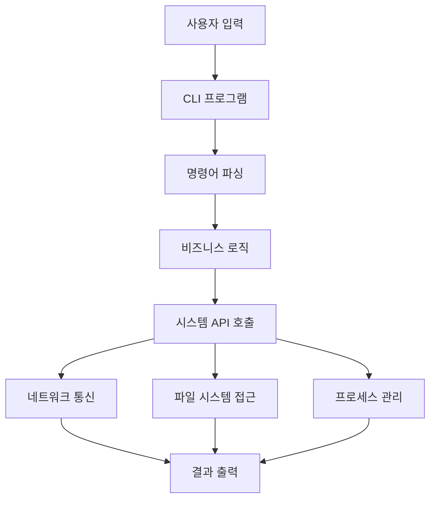
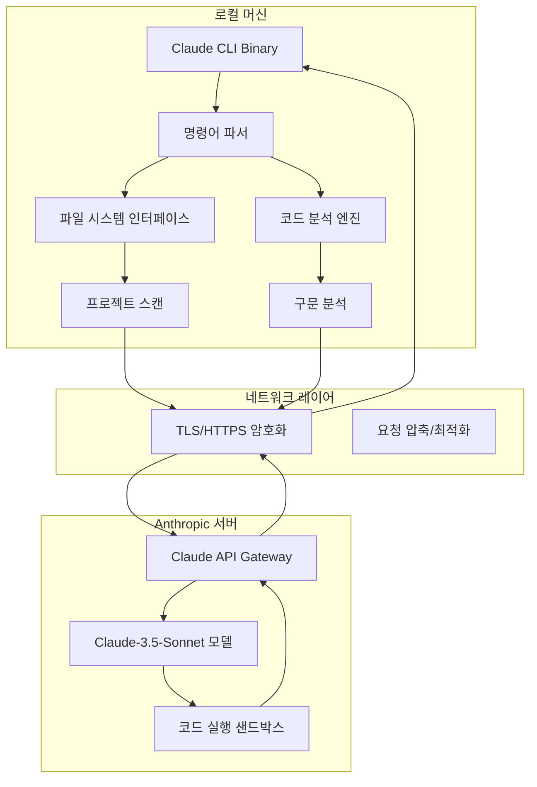
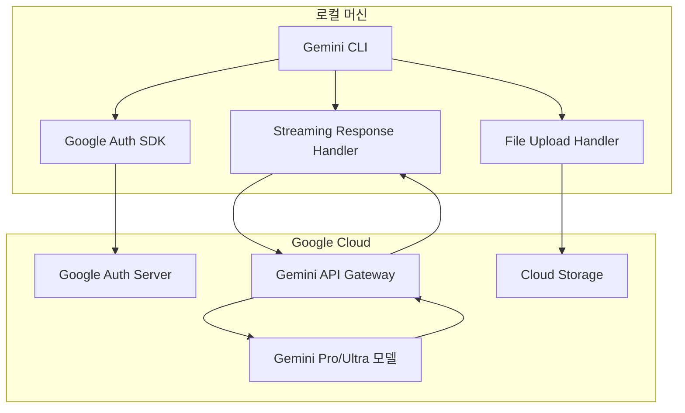
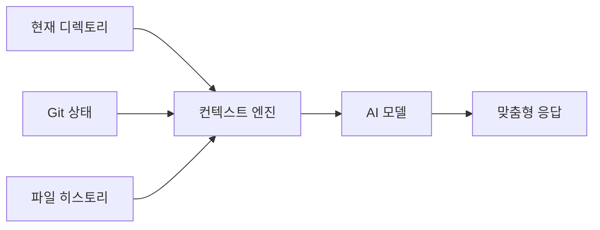

# 🔍 CLI 도구 기술 원리 완벽 해부

## 📑 목차
- [[#🤯 CLI 도구들은 어떻게 마법을 부리는가?|CLI 마법의 비밀]]
- [[#🏗️ 운영체제별 차이를 극복하는 추상화 계층|크로스플랫폼 아키텍처]]
- [[#⚙️ Claude Code vs Gemini CLI 기술 스택 분석|실제 사례 분석]]
- [[#🔧 직접 만들어보는 간단한 CLI 도구|실습: CLI 제작]]
- [[#🚀 최신 CLI 도구 트렌드와 미래|미래 전망]]

---

## 🤯 CLI 도구들은 어떻게 마법을 부리는가?

### 💡 근본적인 질문들
```
😮 "어떻게 똑같은 명령어가 Windows, macOS, Linux에서 다 돌아가지?"
🤔 "터미널에서 파일을 읽고 쓰고, 심지어 AI와 대화까지?"
🧐 "Claude Code는 어떻게 내 코드를 이해하고 수정하지?"
🚀 "Gemini CLI는 어떻게 구글 서버와 실시간으로 통신하지?"
```

### 🎭 CLI 도구의 정체

> [!note] CLI의 본질
> CLI(Command Line Interface) 도구는 실제로는 **"터미널 옷을 입은 일반 프로그램"**입니다. 
> 
> 겉보기에는 단순해 보이지만, 내부에는 복잡한 시스템 프로그래밍 기술들이 숨어있습니다.

#### 🏗️ CLI 도구의 기본 구조


---

## 🏗️ 운영체제별 차이를 극복하는 추상화 계층

### 🎯 문제: "Write Once, Run Everywhere"

각 운영체제는 완전히 다른 "언어"를 사용합니다:

| 기능 | Windows | macOS/Linux | 차이점 |
|------|---------|-------------|--------|
| **파일 경로** | `C:\Users\name\` | `/home/name/` | 경로 구분자, 드라이브 개념 |
| **실행 파일** | `.exe`, `.msi` | 확장자 없음 | 실행 방식 완전 다름 |
| **시스템 호출** | Win32 API | POSIX API | 저수준 인터페이스 다름 |
| **네트워킹** | Winsock | BSD Socket | 소켓 구현 방식 차이 |

### 🛠️ 해결책: 다층 추상화 아키텍처

#### 1단계: 프로그래밍 언어 레벨 추상화

**Go 언어 예시 (Claude Code)**:
```go
package main

import (
    "os"           // 운영체제 추상화
    "path/filepath" // 경로 처리 추상화
    "net/http"     // 네트워킹 추상화
)

func readFile(filename string) {
    // Windows: C:\Users\file.txt
    // macOS: /Users/file.txt
    // 둘 다 같은 코드로 처리!
    content, err := os.ReadFile(filename)
    
    // 운영체제 상관없이 동일한 코드
    if err != nil {
        log.Fatal(err)
    }
}
```

**Python 예시 (많은 AI CLI 도구들)**:
```python
import os
import platform
import subprocess

# 운영체제 감지
if platform.system() == "Windows":
    clear_cmd = "cls"
elif platform.system() in ["Darwin", "Linux"]:
    clear_cmd = "clear"

# 크로스플랫폼 명령어 실행
subprocess.run([clear_cmd], shell=True)
```

#### 2단계: 런타임/가상머신 레벨 추상화

**Node.js 예시 (많은 CLI 도구들)**:
```javascript
const os = require('os');
const path = require('path');

// 운영체제별 설정 파일 경로
const getConfigPath = () => {
    switch (os.platform()) {
        case 'win32':
            return path.join(os.homedir(), 'AppData', 'Roaming');
        case 'darwin':
            return path.join(os.homedir(), 'Library', 'Application Support');
        default: // Linux
            return path.join(os.homedir(), '.config');
    }
};
```

#### 3단계: 컨테이너 레벨 추상화

**Docker 기반 CLI (극강의 일관성)**:
```dockerfile
FROM alpine:latest
COPY my-cli /usr/local/bin/
ENTRYPOINT ["/usr/local/bin/my-cli"]

# 이제 어떤 OS든 동일하게 실행:
# docker run my-cli command args
```

---

## ⚙️ Claude Code vs Gemini CLI 기술 스택 분석

### 🤖 Claude Code 아키텍처 추정

> [!info] Claude Code의 기술적 구성
> Anthropic의 Claude Code는 **Go 언어** 기반으로 추정됩니다.

#### 🏗️ 추정 아키텍처


#### 🔧 핵심 기술 스택 추정
```go
// 파일 감시 (실시간 변경 감지)
import "github.com/fsnotify/fsnotify"

// HTTP 클라이언트 (Claude API 통신)
import "net/http"

// JSON 처리 (API 요청/응답)
import "encoding/json"

// 크로스플랫폼 터미널 처리
import "github.com/fatih/color"

// 설정 파일 관리
import "github.com/spf13/viper"
```

### 🧠 Gemini CLI 아키텍처 추정

> [!info] Gemini CLI의 기술적 구성
> Google의 Gemini CLI는 **Python** 또는 **Go** 기반으로 추정됩니다.

#### 🏗️ 추정 아키텍처


#### 🔧 핵심 기술 스택 추정
```python
# Google 인증 (OAuth 2.0)
from google.auth.transport.requests import Request
from google.oauth2.credentials import Credentials

# API 클라이언트
import google.generativeai as genai

# 파일 업로드 (멀티미디어 지원)
import mimetypes
import base64

# 스트리밍 응답 처리
import asyncio
import websockets
```

---

## 🔧 직접 만들어보는 간단한 CLI 도구

### 🎯 미니 프로젝트: "AI Chat CLI" 만들기

실제로 Claude Code나 Gemini CLI와 비슷한 구조의 간단한 CLI를 만들어봅시다!

#### 1단계: 기본 구조 (Python)

```python
#!/usr/bin/env python3
"""
AI Chat CLI - Claude Code/Gemini CLI 스타일의 미니 구현
"""
import os
import sys
import json
import argparse
import platform
from pathlib import Path

class CrossPlatformCLI:
    def __init__(self):
        self.config_dir = self._get_config_dir()
        self.config_file = self.config_dir / "config.json"
        self.ensure_config_dir()
    
    def _get_config_dir(self) -> Path:
        """운영체제별 설정 디렉토리 결정"""
        if platform.system() == "Windows":
            base = Path.home() / "AppData" / "Roaming"
        elif platform.system() == "Darwin":  # macOS
            base = Path.home() / "Library" / "Application Support"
        else:  # Linux
            base = Path.home() / ".config"
        
        return base / "ai-chat-cli"
    
    def ensure_config_dir(self):
        """설정 디렉토리 생성 (없으면)"""
        self.config_dir.mkdir(parents=True, exist_ok=True)
```

#### 2단계: 파일 시스템 인터페이스

```python
class FileManager:
    def __init__(self, base_path: Path):
        self.base_path = Path(base_path)
    
    def scan_project(self, extensions=None) -> list:
        """프로젝트 파일 스캔 (Claude Code 스타일)"""
        if extensions is None:
            extensions = ['.py', '.js', '.md', '.yaml', '.json']
        
        files = []
        for ext in extensions:
            # 재귀적 파일 검색
            pattern = f"**/*{ext}"
            files.extend(self.base_path.glob(pattern))
        
        return [str(f.relative_to(self.base_path)) for f in files]
    
    def read_file_safely(self, filepath: str) -> str:
        """안전한 파일 읽기 (인코딩 처리)"""
        try:
            full_path = self.base_path / filepath
            
            # 바이너리 파일 필터링
            if not self._is_text_file(full_path):
                return f"[Binary file: {filepath}]"
            
            # 다양한 인코딩 시도
            encodings = ['utf-8', 'latin-1', 'cp1252']
            for encoding in encodings:
                try:
                    with open(full_path, 'r', encoding=encoding) as f:
                        return f.read()
                except UnicodeDecodeError:
                    continue
            
            return f"[Could not decode: {filepath}]"
        
        except Exception as e:
            return f"[Error reading {filepath}: {str(e)}]"
    
    def _is_text_file(self, filepath: Path) -> bool:
        """텍스트 파일 여부 판단"""
        try:
            with open(filepath, 'rb') as f:
                chunk = f.read(1024)
                return b'\0' not in chunk
        except:
            return False
```

#### 3단계: API 통신 레이어

```python
import requests
import json
from typing import Generator

class APIClient:
    def __init__(self, api_key: str, base_url: str):
        self.api_key = api_key
        self.base_url = base_url
        self.session = requests.Session()
        self.session.headers.update({
            'Authorization': f'Bearer {api_key}',
            'Content-Type': 'application/json',
            'User-Agent': 'AI-Chat-CLI/1.0'
        })
    
    def chat_completion(self, messages: list) -> Generator[str, None, None]:
        """스트리밍 채팅 (Claude/Gemini 스타일)"""
        payload = {
            "model": "gpt-3.5-turbo",  # 예시
            "messages": messages,
            "stream": True,
            "max_tokens": 2000
        }
        
        try:
            response = self.session.post(
                f"{self.base_url}/chat/completions",
                json=payload,
                stream=True
            )
            response.raise_for_status()
            
            for line in response.iter_lines():
                if line:
                    line = line.decode('utf-8')
                    if line.startswith('data: '):
                        data = line[6:]  # 'data: ' 제거
                        if data.strip() == '[DONE]':
                            break
                        
                        try:
                            chunk = json.loads(data)
                            if 'choices' in chunk:
                                content = chunk['choices'][0].get('delta', {}).get('content', '')
                                if content:
                                    yield content
                        except json.JSONDecodeError:
                            continue
                            
        except Exception as e:
            yield f"\n[Error: {str(e)}]"
```

#### 4단계: 메인 CLI 인터페이스

```python
class AIChatCLI:
    def __init__(self):
        self.cli = CrossPlatformCLI()
        self.file_manager = FileManager(Path.cwd())
        self.api_client = None
        self.load_config()
    
    def load_config(self):
        """설정 파일 로드"""
        if self.cli.config_file.exists():
            with open(self.cli.config_file, 'r') as f:
                config = json.load(f)
                api_key = config.get('api_key')
                if api_key:
                    self.api_client = APIClient(api_key, config.get('api_url'))
    
    def run(self):
        """메인 실행 로직"""
        parser = argparse.ArgumentParser(description='AI Chat CLI')
        parser.add_argument('--scan', action='store_true', help='Scan current project')
        parser.add_argument('--ask', type=str, help='Ask AI a question')
        parser.add_argument('--setup', action='store_true', help='Setup API key')
        
        args = parser.parse_args()
        
        if args.setup:
            self.setup_api_key()
        elif args.scan:
            self.scan_and_show_project()
        elif args.ask:
            self.ask_ai(args.ask)
        else:
            self.interactive_mode()
    
    def scan_and_show_project(self):
        """프로젝트 스캔 및 표시"""
        files = self.file_manager.scan_project()
        print(f"📁 Found {len(files)} files:")
        for file in files[:10]:  # 처음 10개만 표시
            print(f"  • {file}")
        if len(files) > 10:
            print(f"  ... and {len(files) - 10} more")
    
    def ask_ai(self, question: str):
        """AI에게 질문"""
        if not self.api_client:
            print("❌ API key not configured. Run --setup first.")
            return
        
        # 프로젝트 컨텍스트 추가
        context = self._build_context()
        messages = [
            {"role": "system", "content": f"Project context:\n{context}"},
            {"role": "user", "content": question}
        ]
        
        print("🤖 AI Response:")
        for chunk in self.api_client.chat_completion(messages):
            print(chunk, end='', flush=True)
        print("\n")
    
    def _build_context(self) -> str:
        """프로젝트 컨텍스트 구성"""
        files = self.file_manager.scan_project()
        context_parts = []
        
        for file in files[:5]:  # 처음 5개 파일만
            content = self.file_manager.read_file_safely(file)
            if len(content) < 2000:  # 너무 긴 파일 제외
                context_parts.append(f"=== {file} ===\n{content}\n")
        
        return "\n".join(context_parts)

if __name__ == "__main__":
    cli = AIChatCLI()
    cli.run()
```

### 🚀 실행 및 테스트

```bash
# CLI 도구 설치 (크로스플랫폼)
chmod +x ai-chat-cli.py  # Linux/macOS
# 또는 Windows에서는 python ai-chat-cli.py

# 사용법
./ai-chat-cli.py --setup        # API 키 설정
./ai-chat-cli.py --scan         # 프로젝트 파일 스캔
./ai-chat-cli.py --ask "코드 리뷰해줘"  # AI에게 질문
```

---

## 🚀 최신 CLI 도구 트렌드와 미래

### 🔮 현재 트렌드

#### 1. **AI-First CLI** (Claude Code, Gemini CLI)
```
전통적 CLI: 사용자가 정확한 명령어 암기 필요
AI CLI: 자연어로 의도 표현, AI가 적절한 작업 수행
```

#### 2. **실시간 스트리밍 응답**
```python
# 전통적 방식 (한 번에 모든 결과)
result = process_request(input)
print(result)

# 현대적 방식 (실시간 스트리밍)
for chunk in stream_response(input):
    print(chunk, end='', flush=True)
```

#### 3. **멀티모달 지원** (텍스트 + 이미지 + 코드)
```bash
# Gemini CLI 스타일
gemini ask "이 스크린샷의 에러가 뭘까?" --image screenshot.png
claude ask "이 코드를 최적화해줘" --file *.py
```

### 🧠 기술적 혁신 포인트

#### 1. **컨텍스트 인식 시스템**


#### 2. **보안 샌드박싱**
```go
// 안전한 코드 실행 환경
type SafeExecutor struct {
    chroot   string     // 파일 시스템 격리
    timeout  time.Duration // 실행 시간 제한
    memLimit int64      // 메모리 사용량 제한
}

func (s *SafeExecutor) Run(code string) (output string, err error) {
    // Docker 컨테이너 또는 VM에서 실행
    // 호스트 시스템과 완전 격리
}
```

#### 3. **지능형 캐싱**
```python
class IntelligentCache:
    def __init__(self):
        self.file_hash_cache = {}    # 파일 변경 감지
        self.response_cache = {}     # AI 응답 캐시
        self.context_cache = {}      # 프로젝트 컨텍스트 캐시
    
    def should_invalidate(self, file_path: str) -> bool:
        """파일이 변경되었는지 지능적 판단"""
        current_hash = self._compute_hash(file_path)
        old_hash = self.file_hash_cache.get(file_path)
        
        if current_hash != old_hash:
            self.file_hash_cache[file_path] = current_hash
            return True
        return False
```

### 🎯 미래 예측

#### 2025-2026: **에이전트 CLI**
```bash
# 단순한 질의응답을 넘어서 자율적 작업 수행
claude agent "새로운 React 컴포넌트를 만들고 테스트까지 완료해줘"
# → 파일 생성, 코드 작성, 테스트 실행, 문제 발견 시 자동 수정
```

#### 2026-2027: **멀티 에이전트 협업**
```bash
# 여러 AI가 협업하여 복잡한 프로젝트 수행
claude team "마이크로서비스 아키텍처로 전환해줘" \
  --backend-agent gemini \
  --frontend-agent claude \
  --devops-agent copilot
```

#### 2027-2030: **예측적 CLI**
```bash
# AI가 사용자의 의도를 예측하여 선제적 제안
$ cd my-project/
🤖 "새로운 커밋이 있네요. 코드 리뷰할까요? (y/n)"
🤖 "테스트가 실패한 것 같은데, 디버깅을 도와드릴까요?"
```

---

## 🎯 핵심 인사이트 정리

### ✨ CLI 도구 마법의 핵심 3요소

1. **추상화의 힘**: 운영체제별 차이를 프로그래밍 언어와 라이브러리가 숨겨줌
2. **네트워크의 힘**: 로컬 프로그램이지만 실제 "두뇌"는 클라우드에 있음  
3. **컨텍스트의 힘**: 단순 명령어 실행을 넘어 프로젝트 전체를 이해

### 🚀 왜 이것들이 혁신적인가?

> [!tip] 패러다임 전환
> **Before**: 사용자가 컴퓨터 언어 학습 → 정확한 명령어 입력
> 
> **After**: 컴퓨터가 인간 언어 이해 → 의도 파악 후 적절한 작업 수행

### 💡 개발자 관점에서의 교훈

1. **크로스플랫폼 설계**: 처음부터 여러 OS를 고려한 아키텍처
2. **사용자 경험**: 복잡한 기술을 단순한 인터페이스로 포장
3. **점진적 복잡성**: 기본 기능은 쉽게, 고급 기능은 선택적으로
4. **보안 우선**: 강력한 기능일수록 더 엄격한 보안 설계

이제 터미널에서 Claude Code나 Gemini CLI를 사용할 때, 그 뒤에 숨어있는 엄청난 기술적 복잡성과 아름다움을 느낄 수 있을 겁니다! 🤖✨