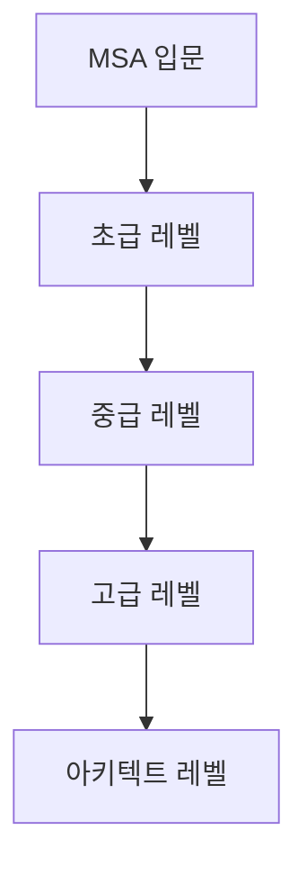

# 🏗️ MSA 디자인 패턴 MOC

> [!tip] 시작 가이드
> 이 문서는 MSA 디자인 패턴 학습의 **중심 허브**입니다. 모든 패턴 문서로 연결되는 네비게이션 역할을 하며, 학습 로드맵과 패턴 간 관계를 한눈에 파악할 수 있습니다.

> [!info] AI 에이전트 안내
> - **디렉토리 전체 가이드**: [[_INDEX|디렉토리 인덱스 보기]]
> - **실전 적용 가이드**: [[99-실전-적용/_README|실습 및 케이스 스터디]]

---

## 📑 목차

- [[#🎯 빠른 네비게이션|빠른 네비게이션]]
- [[#📊 패턴 카테고리별 개요|패턴 카테고리별 개요]]
- [[#🗺️ 학습 로드맵|학습 로드맵]]
- [[#🔗 패턴 관계 맵|패턴 관계 맵]]
- [[#📈 학습 진행 상황|학습 진행 상황]]

---

## 🎯 빠른 네비게이션

### 📁 카테고리별 패턴

| 카테고리 | 폴더 | 패턴 수 | 난이도 |
|---------|------|---------|--------|
| **통신 패턴** | [[01-통신-패턴/_README\|01-통신-패턴]] | 5개 | 초급~중급 |
| **데이터 관리 패턴** | [[02-데이터-관리-패턴/_README\|02-데이터-관리-패턴]] | 4개 | 중급~고급 |
| **복원력 패턴** | [[03-복원력-패턴/_README\|03-복원력-패턴]] | 5개 | 초급~중급 |
| **배포 & 인프라 패턴** | [[04-배포-인프라-패턴/_README\|04-배포-인프라-패턴]] | 4개 | 중급 |
| **보안 & 거버넌스** | [[05-보안-거버넌스-패턴/_README\|05-보안-거버넌스-패턴]] | 3개 | 중급~고급 |

---

## 📊 패턴 카테고리별 개요

### 1. 통신 패턴 (Communication Patterns)

> [!note] 핵심 질문
> "마이크로서비스들이 어떻게 통신할 것인가?"

| 패턴 | 중요도 | 난이도 | 설명 | 상태 |
|------|--------|--------|------|------|
| [[01-통신-패턴/API-Gateway-패턴\|API Gateway]] | ⭐⭐⭐ | 초급 | 모든 요청의 단일 진입점 | ✅ 완성 |
| [[01-통신-패턴/서비스-디스커버리-패턴\|Service Discovery]] | ⭐⭐⭐ | 중급 | 동적 서비스 위치 파악 | ✅ 완성 |
| [[01-통신-패턴/Service-Mesh-패턴\|Service Mesh]] | ⭐⭐⭐ | 중급 | 서비스 간 통신 인프라 레이어 | ✅ 완성 |
| [[01-통신-패턴/Event-Driven-Architecture\|Event-Driven]] | ⭐⭐⭐ | 중급 | 이벤트 기반 비동기 통신 | ✅ 완성 |

**폴더 바로가기**: [[01-통신-패턴/_README|통신 패턴 상세보기]]

---

### 2. 데이터 관리 패턴 (Data Management Patterns)

> [!note] 핵심 질문
> "분산된 데이터를 어떻게 관리하고 일관성을 보장할 것인가?"

| 패턴 | 중요도 | 난이도 | 설명 | 상태 |
|------|--------|--------|------|------|
| [[02-데이터-관리-패턴/Database-per-Service\|Database per Service]] | ⭐⭐⭐ | 초급 | 서비스별 독립 데이터베이스 | ✅ 완성 |
| [[02-데이터-관리-패턴/Saga-패턴\|Saga]] | ⭐⭐⭐⭐ | 고급 | 분산 트랜잭션 관리 | ✅ 완성 |
| [[02-데이터-관리-패턴/CQRS-패턴\|CQRS]] | ⭐⭐⭐⭐ | 고급 | 읽기/쓰기 모델 분리 | ✅ 완성 |
| [[02-데이터-관리-패턴/Event-Sourcing-패턴\|Event Sourcing]] | ⭐⭐⭐⭐ | 고급 | 이벤트 기반 상태 저장 | ✅ 완성 |

**폴더 바로가기**: [[02-데이터-관리-패턴/_README|데이터 관리 패턴 상세보기]]

---

### 3. 복원력 패턴 (Resilience Patterns)

> [!note] 핵심 질문
> "서비스 장애 시 시스템 전체의 안정성을 어떻게 보장할 것인가?"

| 패턴 | 중요도 | 난이도 | 설명 | 상태 |
|------|--------|--------|------|------|
| [[03-복원력-패턴/서킷브레이커-패턴\|Circuit Breaker]] | ⭐⭐⭐ | 중급 | 장애 전파 차단 | ✅ 완성 |
| [[03-복원력-패턴/Retry-패턴\|Retry]] | ⭐⭐ | 초급 | 재시도 전략 | ✅ 완성 |
| [[03-복원력-패턴/Timeout-패턴\|Timeout]] | ⭐⭐⭐ | 초급 | 타임아웃 설정 | ✅ 완성 |
| [[03-복원력-패턴/Bulkhead-패턴\|Bulkhead]] | ⭐⭐⭐ | 중급 | 리소스 격리 | ✅ 완성 |
| [[03-복원력-패턴/Rate-Limiter-패턴\|Rate Limiter]] | ⭐⭐⭐ | 중급 | 속도 제한 | ✅ 완성 |

**폴더 바로가기**: [[03-복원력-패턴/_README|복원력 패턴 상세보기]]

---

### 4. 배포 & 인프라 패턴 (Deployment Patterns)

> [!note] 핵심 질문
> "마이크로서비스를 어떻게 안전하게 배포하고 운영할 것인가?"

| 패턴 | 중요도 | 난이도 | 설명 | 상태 |
|------|--------|--------|------|------|
| [[04-배포-인프라-패턴/Blue-Green-Deployment\|Blue-Green Deployment]] | ⭐⭐⭐ | 중급 | 무중단 배포 | ✅ 완성 |
| [[04-배포-인프라-패턴/Canary-Deployment-패턴\|Canary Deployment]] | ⭐⭐⭐ | 중급 | 점진적 배포 | ✅ 완성 |
| [[04-배포-인프라-패턴/Sidecar-패턴\|Sidecar]] | ⭐⭐⭐ | 중급 | 보조 컨테이너 패턴 | ✅ 완성 |
| [[04-배포-인프라-패턴/Ambassador-패턴\|Ambassador]] | ⭐⭐ | 중급 | 프록시 컨테이너 | ✅ 완성 |

**폴더 바로가기**: [[04-배포-인프라-패턴/_README|배포 패턴 상세보기]]

---

### 5. 보안 & 거버넌스 패턴 (Security & Governance)

> [!note] 핵심 질문
> "분산 시스템의 보안을 어떻게 강화할 것인가?"

| 패턴 | 중요도 | 난이도 | 설명 | 상태 |
|------|--------|--------|------|------|
| [[05-보안-거버넌스-패턴/API-Gateway-Security\|API Gateway Security]] | ⭐⭐⭐ | 중급 | API 게이트웨이 보안 | ✅ 완성 |
| [[05-보안-거버넌스-패턴/Zero-Trust-Architecture\|Zero Trust]] | ⭐⭐⭐⭐ | 고급 | 제로 트러스트 아키텍처 | ✅ 완성 |
| [[05-보안-거버넌스-패턴/Service-to-Service-Auth\|Service-to-Service Auth]] | ⭐⭐⭐ | 중급 | 서비스 간 인증 | ✅ 완성 |

**폴더 바로가기**: [[05-보안-거버넌스-패턴/_README|보안 패턴 상세보기]]

---

## 🗺️ 학습 로드맵

### 🎓 레벨별 학습 경로



### 📚 초급 레벨 (MSA 기초)

> [!tip] 학습 목표
> MSA의 기본 개념과 핵심 패턴 이해

1. **[[01-통신-패턴/API-Gateway-패턴|API Gateway]]** - 모든 것의 시작점
2. **[[02-데이터-관리-패턴/Database-per-Service|Database per Service]]** - MSA의 기본 원칙
3. **[[03-복원력-패턴/Retry-패턴|Retry]]** - 기본적인 재시도
4. **[[03-복원력-패턴/Timeout-패턴|Timeout]]** - 타임아웃 설정
5. **[[03-복원력-패턴/서킷브레이커-패턴|Circuit Breaker]]** - 장애 전파 방지

**예상 학습 시간**: 1-2주

---

### 🚀 중급 레벨 (실무 적용)

> [!tip] 학습 목표
> 실제 프로젝트에 적용 가능한 패턴 습득

6. **[[01-통신-패턴/서비스-디스커버리-패턴|Service Discovery]]** - 동적 서비스 탐색
7. **[[01-통신-패턴/Event-Driven-Architecture|Event-Driven Architecture]]** - 비동기 통신의 핵심
8. **[[02-데이터-관리-패턴/Saga-패턴|Saga]]** - 분산 트랜잭션 관리
9. **[[01-통신-패턴/Service-Mesh-패턴|Service Mesh]]** - 현대적 통신 인프라
10. **[[04-배포-인프라-패턴/Sidecar-패턴|Sidecar]]** - Service Mesh의 기반
11. **[[04-배포-인프라-패턴/Blue-Green-Deployment|Blue-Green Deployment]]** - 무중단 배포
12. **[[04-배포-인프라-패턴/Canary-Deployment-패턴|Canary Deployment]]** - 점진적 배포
13. **[[03-복원력-패턴/Bulkhead-패턴|Bulkhead]]** - 리소스 격리
14. **[[03-복원력-패턴/Rate-Limiter-패턴|Rate Limiter]]** - 속도 제한

**예상 학습 시간**: 2-4주

---

### 🎯 고급 레벨 (아키텍처 설계)

> [!tip] 학습 목표
> 엔터프라이즈급 MSA 설계 능력

15. **[[02-데이터-관리-패턴/CQRS-패턴|CQRS]]** - 읽기/쓰기 최적화
16. **[[02-데이터-관리-패턴/Event-Sourcing-패턴|Event Sourcing]]** - 이벤트 기반 상태 관리
17. **[[05-보안-거버넌스-패턴/API-Gateway-Security|API Gateway Security]]** - API 보안
18. **[[05-보안-거버넌스-패턴/Zero-Trust-Architecture|Zero Trust]]** - 제로 트러스트 보안
19. **[[05-보안-거버넌스-패턴/Service-to-Service-Auth|Service-to-Service Auth]]** - 서비스 간 인증
20. **[[04-배포-인프라-패턴/Ambassador-패턴|Ambassador]]** - 프록시 패턴

**예상 학습 시간**: 3-6주

---

## 🔗 패턴 관계 맵

### 함께 사용되는 패턴 조합

#### 🎪 Event-Driven 스택

```
Event-Driven Architecture (중심)
    ├─→ Event Sourcing (이벤트 저장)
    ├─→ CQRS (읽기/쓰기 분리)
    └─→ Saga (분산 트랜잭션)
```

**관련 문서**:
- [[01-통신-패턴/Event-Driven-Architecture]]
- [[02-데이터-관리-패턴/Event-Sourcing-패턴]]
- [[02-데이터-관리-패턴/CQRS-패턴]]
- [[02-데이터-관리-패턴/Saga-패턴]]

---

#### 🛡️ 복원력 스택

```
Service Mesh (인프라)
    ├─→ Circuit Breaker (장애 차단)
    ├─→ Retry & Timeout (재시도/타임아웃)
    ├─→ Bulkhead (리소스 격리)
    └─→ Rate Limiter (속도 제한)
```

**관련 문서**:
- [[01-통신-패턴/Service-Mesh-패턴]]
- [[03-복원력-패턴/서킷브레이커-패턴]]
- [[03-복원력-패턴/Retry-패턴]]
- [[03-복원력-패턴/Timeout-패턴]]
- [[03-복원력-패턴/Bulkhead-패턴]]
- [[03-복원력-패턴/Rate-Limiter-패턴]]

---

#### 🚀 배포 스택

```
Sidecar Pattern (기반)
    ├─→ Service Mesh (통신 관리)
    ├─→ Blue-Green (전환 배포)
    ├─→ Canary (점진적 배포)
    └─→ Ambassador (프록시)
```

**관련 문서**:
- [[04-배포-인프라-패턴/Sidecar-패턴]]
- [[01-통신-패턴/Service-Mesh-패턴]]
- [[04-배포-인프라-패턴/Blue-Green-Deployment]]
- [[04-배포-인프라-패턴/Canary-Deployment-패턴]]
- [[04-배포-인프라-패턴/Ambassador-패턴]]

---

#### 🔒 보안 스택

```
Zero Trust Architecture (전략)
    ├─→ API Gateway Security (외부 보안)
    ├─→ Service-to-Service Auth (내부 인증)
    └─→ Service Mesh (mTLS 암호화)
```

**관련 문서**:
- [[05-보안-거버넌스-패턴/Zero-Trust-Architecture]]
- [[05-보안-거버넌스-패턴/API-Gateway-Security]]
- [[05-보안-거버넌스-패턴/Service-to-Service-Auth]]
- [[01-통신-패턴/Service-Mesh-패턴]]

---

## 📈 학습 진행 상황

### ✅ 완성된 패턴 (21개)

#### 통신 패턴 (4개)
- [x] API Gateway
- [x] Service Discovery
- [x] Service Mesh
- [x] Event-Driven Architecture

#### 데이터 관리 패턴 (4개)
- [x] Database per Service
- [x] Saga
- [x] CQRS
- [x] Event Sourcing

#### 복원력 패턴 (5개)
- [x] Circuit Breaker
- [x] Retry
- [x] Timeout
- [x] Bulkhead
- [x] Rate Limiter

#### 배포 인프라 패턴 (4개)
- [x] Blue-Green Deployment
- [x] Canary Deployment
- [x] Sidecar
- [x] Ambassador

#### 보안 거버넌스 패턴 (3개)
- [x] API Gateway Security
- [x] Zero Trust Architecture
- [x] Service-to-Service Auth

### 📝 향후 계획 (실습 자료)

- [ ] Kafka Event-Driven 실습
- [ ] Istio Service Mesh 실습
- [ ] Axon Framework (Event Sourcing + CQRS) 실습
- [ ] Saga 패턴 구현 (Choreography vs Orchestration)
- [ ] Resilience4j 종합 실습

---

## 🎯 빠른 참조

### 상황별 패턴 찾기

| 상황 | 추천 패턴 | 문서 링크 |
|------|----------|----------|
| 서비스 위치를 동적으로 찾고 싶다 | Service Discovery | [[01-통신-패턴/서비스-디스커버리-패턴]] |
| 높은 확장성 필요 | Event-Driven | [[01-통신-패턴/Event-Driven-Architecture]] |
| 읽기/쓰기 부하 차이 큼 | CQRS | [[02-데이터-관리-패턴/CQRS-패턴]] |
| 완전한 감사 추적 필요 | Event Sourcing | [[02-데이터-관리-패턴/Event-Sourcing-패턴]] |
| 분산 트랜잭션 관리 | Saga | [[02-데이터-관리-패턴/Saga-패턴]] |
| 서비스 장애 격리 필요 | Circuit Breaker | [[03-복원력-패턴/서킷브레이커-패턴]] |
| 리소스 독점 방지 | Bulkhead | [[03-복원력-패턴/Bulkhead-패턴]] |
| DDoS 방어 필요 | Rate Limiter | [[03-복원력-패턴/Rate-Limiter-패턴]] |
| 안전한 배포 필요 | Blue-Green/Canary | [[04-배포-인프라-패턴/Blue-Green-Deployment]] |
| 보안 강화 필요 | Zero Trust | [[05-보안-거버넌스-패턴/Zero-Trust-Architecture]] |

---

## 🔍 다음 단계

### 처음 방문하신다면

1. [[01-통신-패턴/API-Gateway-패턴|API Gateway 패턴]]부터 시작
2. 각 패턴의 `prerequisites` 필드를 확인하여 선행 학습
3. 위의 **학습 로드맵** 순서대로 진행

### 특정 패턴을 찾는다면

1. 위의 **패턴 카테고리별 개요** 테이블 참조
2. **상황별 패턴 찾기** 테이블로 빠른 검색
3. 옵시디언 검색 기능 활용

---

## 📚 추가 리소스

### 관련 MOC

- [[K8s_Deep_Dive/moc-k8s|Kubernetes MOC]] - 컨테이너 오케스트레이션
- [[GCP/README|GCP MOC]] - 클라우드 인프라

### 외부 참고 자료

- CNCF (Cloud Native Computing Foundation)
- Martin Fowler's Microservices Articles
- Building Microservices - Sam Newman
- Domain-Driven Design - Eric Evans

---

**마지막 업데이트**: 2026-01-05
**문서 상태**: 완성
**총 패턴 수**: 21개

<br>
<div align="right" style="font-size: 0.8em; color: gray; opacity: 0.6;">
  Supported by Claude Sonnet 4.5
</div>
