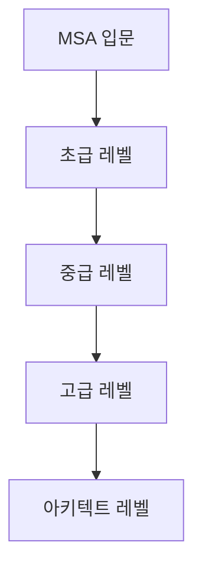

# 🏗️ MSA 디자인 패턴 MOC

> [!tip] 시작 가이드
> 이 문서는 MSA 디자인 패턴 학습의 **중심 허브**입니다. 모든 패턴 문서로 연결되는 네비게이션 역할을 하며, 학습 로드맵과 패턴 간 관계를 한눈에 파악할 수 있습니다.

> [!info] AI 에이전트 안내
> - **디렉토리 전체 가이드**: [[_INDEX|디렉토리 인덱스 보기]]
> - **학습 로드맵**: [[99-실전-적용/학습-로드맵|학습 순서 확인]]
> - **패턴 선택**: [[99-실전-적용/패턴-선택-가이드|어떤 패턴을 사용할지 결정]]

---

## 📑 목차

- [[#🎯 빠른 네비게이션|빠른 네비게이션]]
- [[#📊 패턴 카테고리별 개요|패턴 카테고리별 개요]]
- [[#🗺️ 학습 로드맵|학습 로드맵]]
- [[#🔗 패턴 관계 맵|패턴 관계 맵]]
- [[#📈 학습 진행 상황|학습 진행 상황]]

---

## 🎯 빠른 네비게이션

### 📁 카테고리별 패턴

| 카테고리 | 폴더 | 패턴 수 | 난이도 |
|---------|------|---------|--------|
| **통신 패턴** | [[01-통신-패턴/_README\|01-통신-패턴]] | 3개 | 초급~중급 |
| **데이터 관리 패턴** | [[02-데이터-관리-패턴/_README\|02-데이터-관리-패턴]] | 4개 | 중급~고급 |
| **복원력 패턴** | [[03-복원력-패턴/_README\|03-복원력-패턴]] | 3개 | 중급 |
| **배포 & 인프라 패턴** | [[04-배포-인프라-패턴/_README\|04-배포-인프라-패턴]] | 3개 | 중급 |
| **보안 & 거버넌스** | [[05-보안-거버넌스-패턴/_README\|05-보안-거버넌스-패턴]] | 2개 | 중급~고급 |
| **실전 적용** | [[99-실전-적용/_README\|99-실전-적용]] | 4개 | 전체 |

---

## 📊 패턴 카테고리별 개요

### 1. 통신 패턴 (Communication Patterns)

> [!note] 핵심 질문
> "마이크로서비스들이 어떻게 통신할 것인가?"

| 패턴 | 중요도 | 난이도 | 설명 | 상태 |
|------|--------|--------|------|------|
| [[01-통신-패턴/API-Gateway-패턴\|API Gateway]] | ⭐⭐⭐ | 초급 | 모든 요청의 단일 진입점 | ✅ 완성 |
| [[01-통신-패턴/Service-Mesh-패턴\|Service Mesh]] | ⭐⭐⭐ | 중급 | 서비스 간 통신 인프라 레이어 | ✅ 완성 |
| [[01-통신-패턴/Event-Driven-Architecture\|Event-Driven]] | ⭐⭐⭐ | 중급 | 이벤트 기반 비동기 통신 | ✅ 완성 |

**폴더 바로가기**: [[01-통신-패턴/_README|통신 패턴 상세보기]]

---

### 2. 데이터 관리 패턴 (Data Management Patterns)

> [!note] 핵심 질문
> "분산된 데이터를 어떻게 관리하고 일관성을 보장할 것인가?"

| 패턴 | 중요도 | 난이도 | 설명 | 상태 |
|------|--------|--------|------|------|
| [[02-데이터-관리-패턴/Database-per-Service\|Database per Service]] | ⭐⭐⭐ | 초급 | 서비스별 독립 데이터베이스 | ✅ 완성 |
| [[02-데이터-관리-패턴/CQRS-패턴\|CQRS]] | ⭐⭐ | 중급 | 읽기/쓰기 모델 분리 | ✅ 완성 |
| [[02-데이터-관리-패턴/Event-Sourcing\|Event Sourcing]] | ⭐⭐⭐ | 고급 | 이벤트 기반 상태 저장 | ✅ 완성 |
| [[02-데이터-관리-패턴/Saga-패턴\|Saga]] | ⭐⭐ | 중급 | 분산 트랜잭션 관리 | ✅ 완성 |

**폴더 바로가기**: [[02-데이터-관리-패턴/_README|데이터 관리 패턴 상세보기]]

---

### 3. 복원력 패턴 (Resilience Patterns)

> [!note] 핵심 질문
> "서비스 장애 시 시스템 전체의 안정성을 어떻게 보장할 것인가?"

| 패턴 | 중요도 | 난이도 | 설명 | 상태 |
|------|--------|--------|------|------|
| [[03-복원력-패턴/Circuit-Breaker-패턴\|Circuit Breaker]] | ⭐⭐⭐ | 중급 | 장애 전파 차단 | ✅ 완성 |
| [[03-복원력-패턴/Retry-Timeout-패턴\|Retry & Timeout]] | ⭐⭐ | 초급 | 재시도 및 타임아웃 전략 | ✅ 완성 |
| [[03-복원력-패턴/Bulkhead-패턴\|Bulkhead]] | ⭐⭐ | 중급 | 리소스 격리 | ✅ 완성 |

**폴더 바로가기**: [[03-복원력-패턴/_README|복원력 패턴 상세보기]]

---

### 4. 배포 & 인프라 패턴 (Deployment Patterns)

> [!note] 핵심 질문
> "마이크로서비스를 어떻게 안전하게 배포하고 운영할 것인가?"

| 패턴 | 중요도 | 난이도 | 설명 | 상태 |
|------|--------|--------|------|------|
| [[04-배포-인프라-패턴/Sidecar-패턴\|Sidecar]] | ⭐⭐⭐ | 중급 | 보조 컨테이너 패턴 | ✅ 완성 |
| [[04-배포-인프라-패턴/Strangler-Fig-패턴\|Strangler Fig]] | ⭐⭐ | 중급 | 점진적 마이그레이션 | ✅ 완성 |
| [[04-배포-인프라-패턴/Blue-Green-Canary-배포\|Blue-Green & Canary]] | ⭐⭐ | 중급 | 안전한 배포 전략 | ✅ 완성 |

**폴더 바로가기**: [[04-배포-인프라-패턴/_README|배포 패턴 상세보기]]

---

### 5. 보안 & 거버넌스 패턴 (Security & Governance)

> [!note] 핵심 질문
> "분산 시스템의 보안을 어떻게 강화할 것인가?"

| 패턴 | 중요도 | 난이도 | 설명 | 상태 |
|------|--------|--------|------|------|
| [[05-보안-거버넌스-패턴/Zero-Trust-Architecture\|Zero Trust]] | ⭐⭐⭐ | 고급 | 절대 신뢰하지 않는 보안 | ✅ 완성 |
| [[05-보안-거버넌스-패턴/API-Gateway-Security\|API Gateway Security]] | ⭐⭐ | 중급 | API 게이트웨이 보안 | ✅ 완성 |

**폴더 바로가기**: [[05-보안-거버넌스-패턴/_README|보안 패턴 상세보기]]

---

### 6. 실전 적용 (Practical Application)

> [!note] 핵심 질문
> "실제 프로젝트에 어떻게 적용할 것인가?"

| 문서 | 목적 | 상태 |
|------|------|------|
| [[99-실전-적용/학습-로드맵\|학습 로드맵]] | 체계적인 학습 순서 | ✅ 완성 |
| [[99-실전-적용/패턴-선택-가이드\|패턴 선택 가이드]] | 상황별 적합한 패턴 선택 | ✅ 완성 |
| [[99-실전-적용/2026-추천-아키텍처-스택\|2026 추천 스택]] | 현대적인 기술 스택 | ✅ 완성 |
| [[99-실전-적용/실전-체크리스트\|실전 체크리스트]] | 배포 전 확인 사항 | ✅ 완성 |

**폴더 바로가기**: [[99-실전-적용/_README|실전 적용 가이드]]

---

## 🗺️ 학습 로드맵

### 🎓 레벨별 학습 경로



### 📚 초급 레벨 (MSA 기초)

> [!tip] 학습 목표
> MSA의 기본 개념과 핵심 패턴 이해

1. **[[01-통신-패턴/API-Gateway-패턴|API Gateway]]** - 모든 것의 시작점
2. **[[02-데이터-관리-패턴/Database-per-Service|Database per Service]]** - MSA의 기본 원칙
3. **[[03-복원력-패턴/Retry-Timeout-패턴|Retry & Timeout]]** - 기본적인 장애 처리
4. **[[03-복원력-패턴/Circuit-Breaker-패턴|Circuit Breaker]]** - 장애 전파 방지

**예상 학습 시간**: 1-2주

---

### 🚀 중급 레벨 (실무 적용)

> [!tip] 학습 목표
> 실제 프로젝트에 적용 가능한 패턴 습득

5. **[[01-통신-패턴/Event-Driven-Architecture|Event-Driven Architecture]]** - 비동기 통신의 핵심
6. **[[02-데이터-관리-패턴/CQRS-패턴|CQRS]]** - 읽기/쓰기 최적화
7. **[[02-데이터-관리-패턴/Saga-패턴|Saga]]** - 분산 트랜잭션 관리
8. **[[01-통신-패턴/Service-Mesh-패턴|Service Mesh]]** - 현대적 통신 인프라
9. **[[04-배포-인프라-패턴/Sidecar-패턴|Sidecar]]** - Service Mesh의 기반
10. **[[04-배포-인프라-패턴/Blue-Green-Canary-배포|Blue-Green & Canary]]** - 안전한 배포

**예상 학습 시간**: 2-4주

---

### 🎯 고급 레벨 (아키텍처 설계)

> [!tip] 학습 목표
> 엔터프라이즈급 MSA 설계 능력

11. **[[02-데이터-관리-패턴/Event-Sourcing|Event Sourcing]]** - 이벤트 기반 상태 관리
12. **[[04-배포-인프라-패턴/Strangler-Fig-패턴|Strangler Fig]]** - 레거시 마이그레이션
13. **[[05-보안-거버넌스-패턴/Zero-Trust-Architecture|Zero Trust]]** - 보안 강화
14. **[[03-복원력-패턴/Bulkhead-패턴|Bulkhead]]** - 고급 복원력 패턴

**예상 학습 시간**: 3-6주

---

### 🏆 실전 적용

15. **[[99-실전-적용/패턴-선택-가이드|패턴 선택 가이드]]** - 상황별 패턴 선택
16. **[[99-실전-적용/2026-추천-아키텍처-스택|2026 추천 스택]]** - 기술 스택 구성
17. **[[99-실전-적용/실전-체크리스트|실전 체크리스트]]** - 배포 전 점검

---

## 🔗 패턴 관계 맵

### 함께 사용되는 패턴 조합

#### 🎪 Event-Driven 스택

```
Event-Driven Architecture (중심)
    ├─→ Event Sourcing (이벤트 저장)
    ├─→ CQRS (읽기/쓰기 분리)
    └─→ Saga (분산 트랜잭션)
```

**관련 문서**:
- [[01-통신-패턴/Event-Driven-Architecture]]
- [[02-데이터-관리-패턴/Event-Sourcing]]
- [[02-데이터-관리-패턴/CQRS-패턴]]
- [[02-데이터-관리-패턴/Saga-패턴]]

---

#### 🛡️ 복원력 스택

```
Service Mesh (인프라)
    ├─→ Circuit Breaker (장애 차단)
    ├─→ Retry & Timeout (재시도)
    └─→ Bulkhead (리소스 격리)
```

**관련 문서**:
- [[01-통신-패턴/Service-Mesh-패턴]]
- [[03-복원력-패턴/Circuit-Breaker-패턴]]
- [[03-복원력-패턴/Retry-Timeout-패턴]]
- [[03-복원력-패턴/Bulkhead-패턴]]

---

#### 🚀 배포 스택

```
Sidecar Pattern (기반)
    ├─→ Service Mesh (통신 관리)
    ├─→ Blue-Green (전환 배포)
    └─→ Canary (점진적 배포)
```

**관련 문서**:
- [[04-배포-인프라-패턴/Sidecar-패턴]]
- [[01-통신-패턴/Service-Mesh-패턴]]
- [[04-배포-인프라-패턴/Blue-Green-Canary-배포]]

---

#### 🔄 마이그레이션 스택

```
Strangler Fig (전략)
    ├─→ API Gateway (라우팅 제어)
    └─→ Database per Service (데이터 분리)
```

**관련 문서**:
- [[04-배포-인프라-패턴/Strangler-Fig-패턴]]
- [[01-통신-패턴/API-Gateway-패턴]]
- [[02-데이터-관리-패턴/Database-per-Service]]

---

## 📈 학습 진행 상황

### ✅ 완성된 패턴 (15개)

- [x] API Gateway (통신)
- [x] Service Mesh (통신)
- [x] Event-Driven Architecture (통신)
- [x] Database per Service (데이터)
- [x] CQRS (데이터)
- [x] Event Sourcing (데이터)
- [x] Saga (데이터)
- [x] Circuit Breaker (복원력)
- [x] Retry & Timeout (복원력)
- [x] Bulkhead (복원력)
- [x] Sidecar (배포)
- [x] Strangler Fig (배포)
- [x] Blue-Green & Canary (배포)
- [x] Zero Trust (보안)
- [x] API Gateway Security (보안)

### 🔄 진행 중 (0개)

현재 진행 중인 패턴이 없습니다.

### 📝 계획 중 - 실습 자료

향후 추가 예정:
- [ ] Kafka Event-Driven 실습
- [ ] Istio Service Mesh 실습
- [ ] Axon Framework (Event Sourcing + CQRS) 실습
- [ ] Saga 패턴 구현 (Choreography vs Orchestration)

---

## 🎯 빠른 참조

### 상황별 패턴 찾기

| 상황 | 추천 패턴 | 문서 링크 |
|------|----------|----------|
| 높은 확장성 필요 | Event-Driven | [[01-통신-패턴/Event-Driven-Architecture]] |
| 읽기/쓰기 부하 차이 큼 | CQRS | [[02-데이터-관리-패턴/CQRS-패턴]] |
| 완전한 감사 추적 필요 | Event Sourcing | [[02-데이터-관리-패턴/Event-Sourcing]] |
| 서비스 장애 격리 필요 | Circuit Breaker | [[03-복원력-패턴/Circuit-Breaker-패턴]] |
| 모놀리스 → MSA 전환 | Strangler Fig | [[04-배포-인프라-패턴/Strangler-Fig-패턴]] |
| 안전한 배포 필요 | Blue-Green/Canary | [[04-배포-인프라-패턴/Blue-Green-Canary-배포]] |

자세한 선택 가이드: [[99-실전-적용/패턴-선택-가이드]]

---

## 🔍 다음 단계

### 처음 방문하신다면

1. [[99-실전-적용/학습-로드맵|학습 로드맵]] 확인
2. [[01-통신-패턴/API-Gateway-패턴|API Gateway 패턴]]부터 시작
3. 각 패턴의 `prerequisites` 필드를 확인하여 선행 학습

### 특정 패턴을 찾는다면

1. 위의 **패턴 카테고리별 개요** 테이블 참조
2. **상황별 패턴 찾기** 테이블로 빠른 검색
3. 옵시디언 검색 기능 활용

### 실전 적용을 준비한다면

1. [[99-실전-적용/패턴-선택-가이드|패턴 선택 가이드]] 먼저 읽기
2. [[99-실전-적용/2026-추천-아키텍처-스택|2026 추천 스택]]으로 기술 스택 구성
3. [[99-실전-적용/실전-체크리스트|실전 체크리스트]]로 최종 점검

---

## 📚 추가 리소스

### 관련 MOC

- [[K8s_Deep_Dive/moc-k8s|Kubernetes MOC]] - 컨테이너 오케스트레이션
- [[GCP/README|GCP MOC]] - 클라우드 인프라

### 외부 참고 자료

- CNCF (Cloud Native Computing Foundation)
- Martin Fowler's Microservices Articles
- Building Microservices - Sam Newman
- Domain-Driven Design - Eric Evans

---

**마지막 업데이트**: 2026-01-02
**문서 상태**: 완성
**총 패턴 수**: 15개
