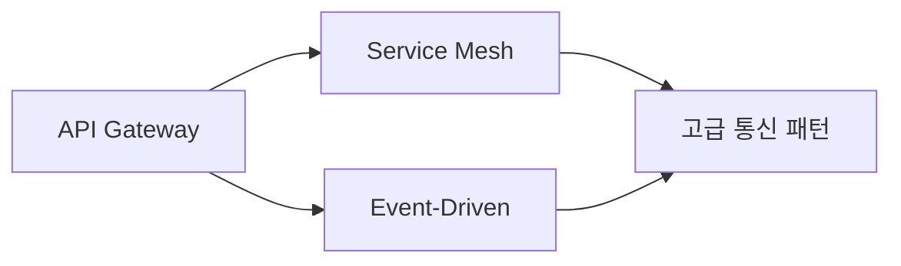

# 🌐 통신 패턴 (Communication Patterns)

> [!note] 폴더 개요
> 이 폴더는 마이크로서비스 간 통신을 관리하는 핵심 패턴들을 다룹니다. 동기/비동기 통신, API 게이트웨이, 서비스 메시 등 현대적인 MSA 통신 아키텍처의 모든 것을 학습할 수 있습니다.

---

## 🎯 핵심 질문

**"마이크로서비스들이 어떻게 효율적으로 통신할 것인가?"**

MSA에서 통신은 가장 중요한 아키텍처 결정 중 하나입니다. 잘못된 통신 패턴 선택은:
- 높은 지연 시간 (Latency)
- 서비스 간 강한 결합 (Tight Coupling)
- 장애 전파 (Cascading Failures)
- 확장성 문제

를 야기할 수 있습니다.

---

## 📚 이 폴더의 패턴들

### 1. API Gateway 패턴 ⭐⭐⭐

**문서**: [[API-Gateway-패턴]]

**핵심 개념**: 모든 클라이언트 요청의 단일 진입점

**언제 사용**:
- 여러 마이크로서비스를 하나의 API로 통합
- 인증/인가 중앙화
- Rate Limiting, 로깅, 모니터링 적용

**난이도**: 초급
**중요도**: ⭐⭐⭐ 필수

**주요 기술**:
- Kong
- AWS API Gateway
- Azure API Management
- Spring Cloud Gateway

---

### 2. Service Mesh 패턴 ⭐⭐⭐

**문서**: [[Service-Mesh-패턴]]

**핵심 개념**: 서비스 간 통신을 관리하는 전용 인프라 레이어

**언제 사용**:
- 10개 이상의 마이크로서비스
- mTLS 자동 암호화 필요
- 분산 트레이싱, 메트릭 수집 필요
- Circuit Breaking, Retry 등 복원력 패턴 자동화

**난이도**: 중급
**중요도**: ⭐⭐⭐ 2026년 표준

**주요 기술**:
- Istio
- Linkerd
- Consul Connect
- AWS App Mesh

**2026년 트렌드**:
- Istio Ambient Mesh (Sidecar-less)
- eBPF 기반 Service Mesh

---

### 3. Event-Driven Architecture (EDA) ⭐⭐⭐

**문서**: [[Event-Driven-Architecture]]

**핵심 개념**: 이벤트를 통한 비동기 통신으로 서비스 분리

**언제 사용**:
- 높은 확장성 필요
- 느슨한 결합 (Loose Coupling) 추구
- 실시간 이벤트 처리
- 서비스 간 의존성 최소화

**난이도**: 중급
**중요도**: ⭐⭐⭐ 2026년 대세

**주요 기술**:
- Apache Kafka
- RabbitMQ
- AWS EventBridge
- Azure Event Grid

**연관 패턴**:
- [[../02-데이터-관리-패턴/Event-Sourcing|Event Sourcing]]
- [[../02-데이터-관리-패턴/CQRS-패턴|CQRS]]
- [[../02-데이터-관리-패턴/Saga-패턴|Saga]]

---

## 🗺️ 학습 순서 추천



### 1단계: API Gateway (필수)

**먼저 학습해야 하는 이유**:
- 가장 기본적이고 직관적인 패턴
- 대부분의 MSA에서 사용
- 다른 패턴의 기초가 됨

**학습 시간**: 2-3일

---

### 2단계: Event-Driven Architecture 또는 Service Mesh

**병렬 학습 가능**:
- Event-Driven: 비동기 통신에 관심이 있다면
- Service Mesh: 동기 통신 개선에 관심이 있다면

**학습 시간**: 각 1주

---

### 3단계: 통합 적용

두 패턴을 함께 사용하는 하이브리드 아키텍처 설계

---

## 📊 패턴 비교

| 항목 | API Gateway | Service Mesh | Event-Driven |
|------|-------------|--------------|--------------|
| **통신 방식** | 동기 (Sync) | 동기 (Sync) | 비동기 (Async) |
| **결합도** | 중간 | 낮음 | 매우 낮음 |
| **복잡도** | 낮음 | 높음 | 중간 |
| **확장성** | 중간 | 높음 | 매우 높음 |
| **즉시 응답** | ✅ | ✅ | ❌ |
| **장애 격리** | ❌ | ✅ | ✅ |
| **학습 곡선** | 완만 | 가파름 | 중간 |
| **운영 복잡도** | 낮음 | 높음 | 중간 |

---

## 🔗 다른 패턴과의 관계

### API Gateway + Service Mesh 조합

```
Client
  ↓
API Gateway (External Traffic)
  ↓
Service Mesh (Internal Traffic)
  ↓
Microservices
```

**장점**:
- External/Internal 트래픽 분리
- API Gateway: 인증, Rate Limiting
- Service Mesh: mTLS, Circuit Breaking

---

### Event-Driven + Service Mesh 조합

```
Service A --[REST]→ Service Mesh --[REST]→ Service B
    ↓
 [Event] → Kafka → Service C (비동기)
```

**장점**:
- 동기/비동기 통신의 장점을 모두 활용
- 실시간 요청은 REST, 이벤트 처리는 비동기

---

## 💡 실전 적용 가이드

### 소규모 MSA (3-5개 서비스)

**추천**: API Gateway만 사용

```
API Gateway
  ├─→ Service A
  ├─→ Service B
  └─→ Service C
```

**이유**:
- Service Mesh는 오버킬
- 관리 복잡도 최소화

---

### 중규모 MSA (5-20개 서비스)

**추천**: API Gateway + Event-Driven

```
API Gateway (동기)
  ├─→ Service A
  └─→ Service B
        ↓
    [Event] → Kafka
        ↓
    Service C, D, E (비동기)
```

**이유**:
- 느슨한 결합 확보
- 확장성 향상
- Service Mesh는 선택 사항

---

### 대규모 MSA (20개 이상 서비스)

**추천**: API Gateway + Service Mesh + Event-Driven

```
API Gateway
  ↓
Service Mesh
  ├─→ Services (동기)
  └─→ Kafka (비동기)
```

**이유**:
- 복잡한 통신 관리 자동화
- mTLS, 분산 트레이싱 필수
- 높은 확장성과 복원력

---

## ⚠️ 안티패턴 주의

### 1. Chatty Communication (수다스러운 통신)

**문제**:
```
Client → Gateway → Service A → Service B → Service C → Service D
```

너무 많은 동기 호출로 지연 시간 증가

**해결**:
- API Gateway에서 응답 조합 (Response Aggregation)
- Event-Driven으로 전환

---

### 2. Distributed Monolith (분산 모놀리스)

**문제**:
서비스는 분리했지만 강한 결합으로 배포 의존성 발생

**해결**:
- Event-Driven으로 느슨한 결합
- API 버저닝으로 호환성 관리

---

### 3. Service Mesh Overhead

**문제**:
소규모 서비스에 Service Mesh 적용 → 리소스 낭비

**해결**:
- 서비스 수가 적으면 API Gateway만 사용
- 복잡도가 증가할 때 점진적으로 도입

---

## 🚀 다음 단계

### 이 폴더의 패턴을 학습한 후

1. **[[../02-데이터-관리-패턴/_README|데이터 관리 패턴]]** 으로 이동
   - Event-Driven과 연계된 Event Sourcing, CQRS 학습

2. **[[../03-복원력-패턴/_README|복원력 패턴]]** 으로 이동
   - Service Mesh와 연계된 Circuit Breaker, Retry 학습

3. **[[../99-실전-적용/패턴-선택-가이드|패턴 선택 가이드]]** 확인
   - 실제 프로젝트에 적합한 통신 패턴 선택

---

## 📋 체크리스트

학습 완료 후 확인:

- [ ] API Gateway의 역할과 책임을 설명할 수 있다
- [ ] Service Mesh가 해결하는 문제를 이해한다
- [ ] Sidecar 패턴의 동작 원리를 안다
- [ ] 동기 vs 비동기 통신의 trade-off를 설명할 수 있다
- [ ] Event-Driven의 4가지 구성 요소를 안다
- [ ] Kafka와 RabbitMQ의 차이를 이해한다
- [ ] 프로젝트에 적합한 통신 패턴을 선택할 수 있다

---

**상위 문서**: [[../00-MSA-디자인-패턴-MOC|MSA 디자인 패턴 MOC]]
**마지막 업데이트**: 2026-01-02
