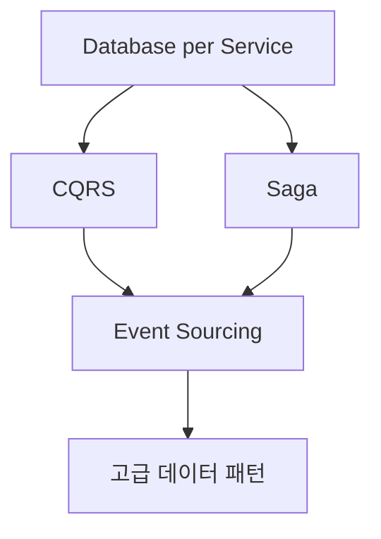

# 💾 데이터 관리 패턴 (Data Management Patterns)

> [!note] 폴더 개요
> 이 폴더는 분산 시스템에서 데이터를 관리하는 핵심 패턴들을 다룹니다. Database per Service부터 Event Sourcing까지, MSA 환경에서 데이터 일관성과 확장성을 동시에 확보하는 방법을 학습할 수 있습니다.

---

## 🎯 핵심 질문

**"분산된 데이터를 어떻게 관리하고 일관성을 보장할 것인가?"**

MSA에서 데이터 관리는 가장 도전적인 영역입니다. 전통적인 모놀리스의 ACID 트랜잭션 대신:
- 각 서비스가 독립적인 데이터베이스 소유
- 분산 트랜잭션 관리 필요
- 데이터 일관성 vs 가용성의 트레이드오프 (CAP 이론)

---

## 📚 이 폴더의 패턴들

### 1. Database per Service ⭐⭐⭐

**문서**: [[Database-per-Service]]

**핵심 개념**: 각 서비스가 자체 데이터베이스를 소유하며, 다른 서비스의 DB에 직접 접근 금지

**언제 사용**:
- 서비스 독립성 확보
- 각 서비스가 최적의 DB 기술 선택 (폴리글랏 퍼시스턴스)
- 장애 격리 필요

**난이도**: 초급
**중요도**: ⭐⭐⭐ 필수 (MSA의 기본 원칙)

**Trade-offs**:
- ✅ 독립적인 스케일링
- ✅ 기술 스택 자유도
- ❌ 분산 트랜잭션 관리 필요
- ❌ 조인 쿼리 불가능

---

### 2. CQRS (Command Query Responsibility Segregation) ⭐⭐

**문서**: [[CQRS-패턴]]

**핵심 개념**: 읽기(Query)와 쓰기(Command) 모델을 분리하여 각각 최적화

**언제 사용**:
- 읽기와 쓰기 부하 차이가 큼
- 복잡한 쿼리 요구사항
- 읽기 DB를 NoSQL로 수평 확장

**난이도**: 중급
**중요도**: ⭐⭐

**아키텍처**:
```
Client
  ├─→ Command API → Write DB (PostgreSQL)
  └─→ Query API → Read DB (MongoDB/Redis)
```

**연관 패턴**:
- [[Event-Sourcing|Event Sourcing]] (자주 함께 사용)
- [[../01-통신-패턴/Event-Driven-Architecture|Event-Driven]] (동기화용)

---

### 3. Event Sourcing ⭐⭐⭐

**문서**: [[Event-Sourcing]]

**핵심 개념**: 상태를 직접 저장하지 않고, 발생한 모든 이벤트를 불변 로그로 저장

**언제 사용**:
- 완전한 감사 추적(Audit Trail) 필수 (금융, 의료)
- 시간에 따른 상태 변화 추적
- 복잡한 비즈니스 규칙 소급 적용
- 이벤트 리플레이로 상태 재구축

**난이도**: 고급
**중요도**: ⭐⭐⭐ 강력하지만 복잡

**주요 프레임워크**:
- Axon Framework (Java/Spring Boot)
- EventStore DB
- Kafka as Event Store

**연관 패턴**:
- [[CQRS-패턴|CQRS]] (거의 필수로 함께 사용)
- [[../01-통신-패턴/Event-Driven-Architecture|Event-Driven]]

---

### 4. Saga 패턴 ⭐⭐

**문서**: [[Saga-패턴]]

**핵심 개념**: 분산 트랜잭션을 일련의 로컬 트랜잭션과 보상 트랜잭션으로 관리

**언제 사용**:
- 여러 서비스에 걸친 트랜잭션 필요
- 2PC (Two-Phase Commit) 불가능한 환경
- 장기 실행 트랜잭션

**난이도**: 중급
**중요도**: ⭐⭐ 분산 트랜잭션 필수

**두 가지 구현 방식**:

1. **Choreography (안무식)**
   - 이벤트 기반, 중앙 조정자 없음
   - 느슨한 결합
   - 복잡한 플로우 추적 어려움

2. **Orchestration (지휘식)**
   - 중앙 Orchestrator가 플로우 제어
   - 명확한 플로우, 에러 처리 용이
   - Orchestrator가 SPOF 가능성

---

## 🗺️ 학습 순서 추천



### 1단계: Database per Service (필수)

**먼저 학습해야 하는 이유**:
- MSA의 가장 기본 원칙
- 다른 모든 데이터 패턴의 전제 조건

**학습 시간**: 1-2일

**선행 학습**: 없음

---

### 2단계: CQRS 또는 Saga (병렬 학습 가능)

**CQRS 우선 학습 추천**:
- 읽기/쓰기 분리는 상대적으로 직관적
- Event Sourcing의 기초가 됨

**Saga는 실무 필요 시 학습**:
- 분산 트랜잭션이 필요한 경우만

**학습 시간**: 각 3-5일

---

### 3단계: Event Sourcing (고급)

**마지막에 학습하는 이유**:
- 가장 복잡한 패턴
- CQRS 이해가 선행되어야 함
- 실무에서 필요성이 명확할 때 도입

**학습 시간**: 1-2주

**선행 학습**:
- [[Database-per-Service]]
- [[CQRS-패턴]]
- [[../01-통신-패턴/Event-Driven-Architecture]]

---

## 📊 패턴 비교

| 항목 | Database per Service | CQRS | Event Sourcing | Saga |
|------|---------------------|------|----------------|------|
| **목적** | 서비스 독립성 | 읽기/쓰기 최적화 | 상태 이벤트화 | 분산 트랜잭션 |
| **복잡도** | 낮음 | 중간 | 높음 | 중간 |
| **일관성** | Eventual | Eventual | Eventual | Eventual |
| **감사 추적** | 제한적 | 중간 | 완벽 | 중간 |
| **확장성** | 높음 | 매우 높음 | 높음 | 중간 |
| **학습 곡선** | 완만 | 중간 | 가파름 | 중간 |
| **사용 빈도** | 필수 | 자주 | 드물게 | 자주 |

---

## 🔗 패턴 조합 전략

### 조합 1: CQRS + Event Sourcing ⭐⭐⭐

**가장 강력한 조합**

```
Command → Event Store (이벤트 저장)
             ↓
         [Events] → Read Model 구축 (Projection)
             ↓
          Query API
```

**장점**:
- Event Sourcing의 복잡한 쿼리 문제를 CQRS가 해결
- 읽기 모델을 여러 개 구축 (다양한 뷰)

**실제 사례**:
- 금융 시스템: 거래 이력은 Event Store, 잔액 조회는 Read Model
- 전자상거래: 주문 이벤트는 저장, 주문 목록은 NoSQL

**관련 문서**:
- [[CQRS-패턴]]
- [[Event-Sourcing]]

---

### 조합 2: Event-Driven + Saga

**분산 트랜잭션 처리**

```
Order Service → [OrderCreated] → Kafka
                                    ↓
                    Saga Orchestrator (조율)
                                    ↓
                Payment Service → Inventory Service
```

**장점**:
- 이벤트 기반으로 느슨한 결합
- Saga로 트랜잭션 일관성 보장

**관련 문서**:
- [[Saga-패턴]]
- [[../01-통신-패턴/Event-Driven-Architecture]]

---

### 조합 3: Database per Service + CQRS

**확장성 극대화**

```
각 서비스
  ├─→ Write DB (자체 소유)
  └─→ Read DB (공유 가능, NoSQL)
```

**장점**:
- 서비스 독립성 유지
- 읽기 부하를 NoSQL로 분산

---

## 💡 실전 적용 가이드

### 시나리오 1: 전자상거래 (E-Commerce)

**요구사항**:
- 주문, 결제, 재고 관리
- 높은 읽기 부하 (상품 조회)
- 트랜잭션 일관성 (주문 시 재고 차감)

**추천 패턴**:
1. **Database per Service**: Order DB, Payment DB, Inventory DB 분리
2. **CQRS**: 상품 조회는 Redis, 주문 쓰기는 PostgreSQL
3. **Saga (Orchestration)**: 주문 → 결제 → 재고 차감 플로우 관리

**아키텍처**:
```
Order Service (Write DB: PostgreSQL, Read DB: Redis)
  ↓
Saga Orchestrator
  ├─→ Payment Service
  └─→ Inventory Service
```

---

### 시나리오 2: 금융 시스템 (Banking)

**요구사항**:
- 완전한 감사 추적 (규제 준수)
- 모든 거래 이력 보존
- 과거 특정 시점의 잔액 재구축

**추천 패턴**:
1. **Event Sourcing**: 모든 거래를 이벤트로 저장
2. **CQRS**: 잔액 조회는 Read Model (빠른 응답)
3. **Database per Service**: Account, Transaction 서비스 분리

**아키텍처**:
```
Transaction Command → Event Store (이벤트 저장)
                         ↓
                    [Events] → Account Read Model (현재 잔액)
                         ↓
                    Query API (잔액 조회)
```

---

### 시나리오 3: 소규모 스타트업

**요구사항**:
- 빠른 개발
- 낮은 복잡도
- 향후 확장 가능

**추천 패턴**:
1. **Database per Service**: 기본 원칙만 적용
2. **CQRS/Event Sourcing/Saga**: 필요할 때까지 미루기

**아키텍처**:
```
Service A → PostgreSQL A
Service B → PostgreSQL B
(필요시 REST API로 간단한 동기 호출)
```

---

## ⚠️ 안티패턴 주의

### 1. Shared Database (공유 데이터베이스)

**문제**:
```
Service A ──┐
            ├─→ Shared DB ← 안티패턴!
Service B ──┘
```

- 서비스 간 강한 결합
- 독립적인 배포 불가능
- 스키마 변경 시 모든 서비스 영향

**해결**:
- Database per Service 적용
- API를 통해서만 데이터 접근

---

### 2. 과도한 Event Sourcing

**문제**:
모든 도메인에 Event Sourcing 적용 → 불필요한 복잡도

**해결**:
- 감사 추적이 정말 필요한 도메인만 적용
- 간단한 CRUD는 전통적 방식 유지

---

### 3. CQRS 없이 Event Sourcing

**문제**:
Event Store에서 직접 쿼리 → 성능 문제

**해결**:
- CQRS와 함께 사용
- Read Model로 쿼리 최적화

---

## 🚀 다음 단계

### 이 폴더의 패턴을 학습한 후

1. **[[../03-복원력-패턴/_README|복원력 패턴]]** 으로 이동
   - 데이터 일관성 문제 시 Circuit Breaker로 장애 격리

2. **[[../01-통신-패턴/_README|통신 패턴]]** 복습
   - Event-Driven과 데이터 패턴의 통합 이해

3. **[[../99-실전-적용/패턴-선택-가이드|패턴 선택 가이드]]** 확인
   - 실제 프로젝트에 적합한 데이터 패턴 선택

---

## 📋 체크리스트

학습 완료 후 확인:

- [ ] Database per Service의 장단점을 설명할 수 있다
- [ ] CAP 이론을 이해하고 MSA에서의 의미를 안다
- [ ] CQRS의 Read/Write 모델 분리를 설명할 수 있다
- [ ] Event Sourcing과 전통적 CRUD의 차이를 안다
- [ ] Event Store에서 상태를 재구축하는 원리를 이해한다
- [ ] Saga의 Choreography와 Orchestration을 비교할 수 있다
- [ ] 보상 트랜잭션(Compensating Transaction)을 설명할 수 있다
- [ ] CQRS + Event Sourcing 조합의 이점을 안다

---

**상위 문서**: [[../00-MSA-디자인-패턴-MOC|MSA 디자인 패턴 MOC]]
**마지막 업데이트**: 2026-01-02
