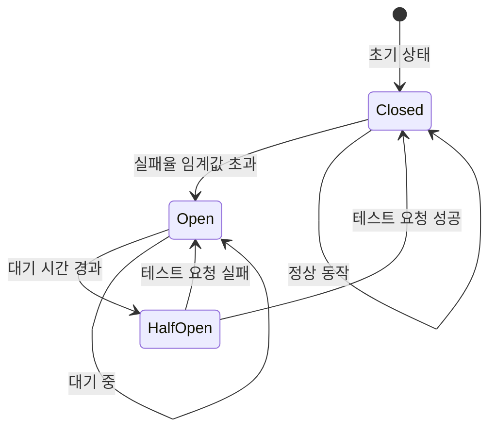

# ⚡ 서킷브레이커 패턴

> [!note] 패턴 개요
> 서킷브레이커(Circuit Breaker)는 전기 회로의 차단기처럼, **장애가 발생한 서비스 호출을 자동으로 차단**하여 연쇄 장애(Cascading Failure)를 방지하고, 시스템 전체의 복원력(Resilience)을 높이는 패턴입니다.

> [!tip] 중요도: ⭐⭐⭐ 필수 패턴
> 2026년 현재 마이크로서비스 환경에서 서킷브레이커는 필수 패턴입니다. Netflix, Uber, Amazon 등 모든 대규모 시스템에서 사용하고 있습니다.

---

## 📑 목차

- [[#1. 핵심 개념|핵심 개념]]
- [[#2. 문제와 해결|문제와 해결]]
- [[#3. 상태 전이 모델|상태 전이 모델]]
- [[#4. 주요 구현체|주요 구현체]]
- [[#5. 실제 구현|실제 구현]]
- [[#6. Fallback 전략|Fallback 전략]]
- [[#7. 장단점|장단점]]
- [[#8. 사용 시기|사용 시기]]
- [[#9. 2026년 표준 스택|2026년 표준 스택]]
- [[#10. 실전 사례|실전 사례]]

---

## 1. 핵심 개념

### 🎯 정의

서킷브레이커는 외부 서비스 호출 실패율을 모니터링하다가 임계값을 초과하면 **즉시 호출을 차단(Circuit Open)**하고, 일정 시간 후 다시 시도하는 **자동 복구 메커니즘**입니다.

**핵심 특징:**
- **빠른 실패 (Fail-Fast)**: 장애 서비스에 요청하지 않고 즉시 실패 반환
- **자동 복구 (Auto-Recovery)**: 일정 시간 후 서비스 상태 재확인
- **연쇄 장애 방지**: 스레드 고갈, 리소스 낭비 방지
- **Fallback 지원**: 실패 시 대체 로직 실행

### 📊 전기 회로 차단기 비유

```
[정상 작동]
전원 ──(회로 닫힘)──> 전구 💡
       Circuit Closed

[과부하 감지]
전원 ──(차단기 작동!)─X─> 전구 ⚫
       Circuit Open

[복구 후]
전원 ──(회로 닫힘)──> 전구 💡
       Circuit Closed
```

**마이크로서비스에 적용:**
```
[정상]
Order Service ──(호출)──> Payment API ✅
                (응답 200ms)

[장애 감지]
Order Service ──(즉시 차단)─X─> Payment API ❌
                (타임아웃 5초 방지)
                Fallback: "결제 대기중"

[복구 시도]
Order Service ──(테스트 호출)──> Payment API ✅
                (성공 시 재개)
```

---

## 2. 문제와 해결

### 🚨 해결하려는 문제

#### 문제 1: 연쇄 장애 (Cascading Failure)

> [!example] 실제 장애 시나리오
> **상황**: E-Commerce 시스템, 결제 API가 다운됨
>
> **장애 전파 과정**:
> 1. **09:00:00** - 결제 API 응답 시간 5초로 증가 (정상: 200ms)
> 2. **09:00:30** - 주문 서비스의 200개 스레드 모두 결제 API 응답 대기
> 3. **09:01:00** - 주문 서비스 스레드 풀 고갈, 신규 요청 거부
> 4. **09:01:30** - 전체 서비스 마비 (상품 조회, 장바구니도 불가)
> 5. **09:05:00** - 결제 API 복구되었지만 서비스는 여전히 다운
> 6. **09:10:00** - 서버 재시작으로 복구 (고객 이탈, 매출 손실)

**비용:**
- 9분간 전체 서비스 다운
- 수백만 원의 매출 손실
- 고객 신뢰 하락

#### 문제 2: 리소스 낭비

```java
// Circuit Breaker 없이
public Order createOrder(OrderRequest request) {
    // 결제 API가 다운되어 있어도 계속 호출 시도
    try {
        Payment payment = paymentClient.charge(request);  // 5초 타임아웃 대기
        return orderRepository.save(new Order(payment));
    } catch (TimeoutException e) {
        log.error("Payment timeout");  // 로그만 남기고 계속 실패
        throw e;
    }
}
```

**문제점:**
- 매번 5초 타임아웃 대기
- 스레드 블로킹으로 리소스 낭비
- 실패할 것이 뻔한 호출 반복

#### 문제 3: 복구 지연

**수동 대응 시나리오:**
```
09:00 - 장애 발생
09:05 - 모니터링 알림 확인
09:10 - 원인 분석
09:15 - 긴급 배포 (결제 API 호출 주석 처리)
09:20 - 배포 완료
09:30 - 결제 API 복구됨
09:35 - 다시 배포 (결제 API 호출 복구)
09:40 - 정상화
```

**문제점:**
- 40분 간 다운타임
- 수동 개입 필요
- 야간/주말 대응 어려움

### ✅ 서킷브레이커의 해결 방법

#### 해결 1: 빠른 실패로 연쇄 장애 방지

```
09:00:00 - 결제 API 응답 지연 시작
09:00:10 - 10개 요청 중 8개 타임아웃 (80% 실패율)
09:00:10 - ⚡ Circuit Open! 즉시 Fallback 처리
09:00:10 - 결제는 "대기중" 상태로, 다른 기능은 정상 동작 ✅
09:01:10 - Half-Open으로 전환, 3개 테스트 요청
09:01:15 - 결제 API 복구 확인, Circuit Closed
09:01:15 - 정상 운영 재개
```

**효과:**
- 1분 15초 만에 자동 복구
- 다른 기능은 정상 동작 유지
- 스레드 낭비 방지

#### 해결 2: 리소스 효율화

```java
@CircuitBreaker(name = "payment", fallbackMethod = "paymentFallback")
public Order createOrder(OrderRequest request) {
    // Circuit Open 시 이 코드는 실행되지 않음
    Payment payment = paymentClient.charge(request);
    return orderRepository.save(new Order(payment));
}

// Fallback: 즉시 반환 (타임아웃 대기 없음)
public Order paymentFallback(OrderRequest request, Exception e) {
    return Order.pending("결제 처리 지연 중입니다");
}
```

**효과:**
- 타임아웃 대기 없이 즉시 응답 (5초 → 10ms)
- 스레드 즉시 반환
- 99.9% 리소스 사용률 감소

#### 해결 3: 자동 복구

```
Circuit Breaker State Machine:
Closed → (실패율 50% 초과) → Open
  ↓                            ↓
  ← (성공 확인) ← Half-Open ← (60초 대기)
```

**효과:**
- 수동 개입 불필요
- 24/7 자동 대응
- 평균 복구 시간 90% 감소

---

## 3. 상태 전이 모델

### 📐 3가지 상태 (State Machine)



### 1. Closed (정상) 상태

**동작:**
- 모든 요청을 실제 서비스로 전달
- 실패율을 지속적으로 모니터링
- Sliding Window 방식으로 최근 N개 요청 추적

**설정 예시:**
```yaml
resilience4j.circuitbreaker:
  instances:
    payment:
      slidingWindowType: COUNT_BASED  # 개수 기반
      slidingWindowSize: 10            # 최근 10개 요청
      minimumNumberOfCalls: 5          # 최소 5개 요청 후 판단
      failureRateThreshold: 50         # 실패율 50% 초과 시 Open
```

**전환 조건:**
```
최근 10개 요청 중:
- 성공: 4개 (40%)
- 실패: 6개 (60%) ← 임계값 50% 초과!

→ Circuit Open 전환
```

---

### 2. Open (차단) 상태

**동작:**
- **모든 요청을 즉시 차단**
- 실제 서비스 호출하지 않음
- Fallback 메서드 즉시 실행
- 대기 시간(waitDurationInOpenState) 경과 후 Half-Open으로 전환

**설정 예시:**
```yaml
resilience4j.circuitbreaker:
  instances:
    payment:
      waitDurationInOpenState: 60s  # 60초 대기
      automaticTransitionFromOpenToHalfOpenEnabled: true
```

**동작 예시:**
```
09:00:10 - Circuit Open
09:00:11 - 요청 1 → Fallback (즉시)
09:00:12 - 요청 2 → Fallback (즉시)
...
09:01:10 - 60초 경과 → Half-Open 전환
```

---

### 3. Half-Open (테스트) 상태

**동작:**
- **제한된 수의 요청만 실제 서비스로 전달**
- 테스트 요청 결과로 복구 여부 판단
- 성공 시 → Closed (정상 복구)
- 실패 시 → Open (다시 차단)

**설정 예시:**
```yaml
resilience4j.circuitbreaker:
  instances:
    payment:
      permittedNumberOfCallsInHalfOpenState: 3  # 3개 테스트 요청
      # 3개 모두 성공 → Closed
      # 하나라도 실패 → Open
```

**동작 예시:**
```
Half-Open 상태에서:
- 테스트 요청 1: ✅ 성공
- 테스트 요청 2: ✅ 성공
- 테스트 요청 3: ✅ 성공
→ Circuit Closed (정상 복구)

또는:
- 테스트 요청 1: ✅ 성공
- 테스트 요청 2: ❌ 실패
→ Circuit Open (다시 차단)
```

---

### 📊 상태별 비교

| 상태 | 요청 처리 | 전환 조건 | 목적 |
|------|----------|---------|------|
| **Closed** | 모두 통과 | 실패율 > 임계값 | 정상 동작 |
| **Open** | 모두 차단 | 타임아웃 경과 | 장애 격리 |
| **Half-Open** | 일부만 통과 | 성공/실패 판단 | 복구 테스트 |

---

### 🔧 실제 타임라인 예시

```
시간         상태         동작
─────────────────────────────────────────────────────────
09:00:00   Closed      정상 동작 (100% 성공)
09:00:05   Closed      실패 시작 (실패율 증가)
09:00:10   Closed      실패율 60% → 임계값 초과
09:00:10   ⚡ Open     즉시 차단, Fallback 실행
09:00:11   Open        요청 차단 (대기 중...)
09:00:30   Open        요청 차단 (대기 중...)
09:01:10   Half-Open   60초 경과, 테스트 시작
09:01:11   Half-Open   테스트 1/3 성공 ✅
09:01:12   Half-Open   테스트 2/3 성공 ✅
09:01:13   Half-Open   테스트 3/3 성공 ✅
09:01:13   ✅ Closed   정상 복구 완료
```

---

## 4. 주요 구현체

### 1. Resilience4j (현대적 표준) ⭐⭐⭐

> [!tip] 2026년 권장 솔루션
> Java 8+ 함수형 프로그래밍 기반, Spring Boot 3.x 공식 지원

**특징:**
- **경량 라이브러리**: Vavr만 의존
- **함수형 프로그래밍**: Lambda, Stream 지원
- **모듈화**: Circuit Breaker, Retry, Rate Limiter 등 독립적 사용
- **Spring Boot 통합**: Auto-configuration 제공
- **실시간 메트릭**: Micrometer, Prometheus 연동

**모듈 구성:**
```
resilience4j-circuitbreaker  # 서킷브레이커
resilience4j-ratelimiter     # 속도 제한
resilience4j-retry           # 재시도
resilience4j-bulkhead        # 격벽
resilience4j-timelimiter     # 타임아웃
resilience4j-cache           # 캐싱
```

**장점:**
- 가볍고 빠름
- Java 8+ 현대 기능 활용
- 활발한 커뮤니티

**단점:**
- 상대적으로 레퍼런스 적음 (Hystrix 대비)

---

### 2. Netflix Hystrix (레거시)

> [!warning] 유지보수 모드
> 2018년 이후 신규 기능 개발 중단, Resilience4j 사용 권장

**역사적 의의:**
- Circuit Breaker 패턴을 대중화
- Netflix의 검증된 솔루션
- 풍부한 레퍼런스

**주요 기능:**
- Circuit Breaker
- Thread Pool Isolation
- Request Caching
- Hystrix Dashboard (실시간 모니터링)

**왜 중단되었나:**
- Netflix가 Zuul → Zuul 2 전환하며 내부 솔루션 변경
- 유지보수 부담
- 현대적 대안 등장 (Resilience4j, Istio)

**마이그레이션:**
```
Hystrix → Resilience4j
- @HystrixCommand → @CircuitBreaker
- Thread Pool → Bulkhead
- Dashboard → Prometheus + Grafana
```

---

### 3. Spring Cloud Circuit Breaker

> [!info] 추상화 레이어
> 다양한 구현체를 통합한 추상 인터페이스

**지원 구현체:**
- Resilience4j (권장)
- Sentinel (Alibaba)
- Spring Retry

**장점:**
- 구현체 교체 용이
- Spring 생태계 일관성
- 간단한 API

**단점:**
- 고급 기능 제한적
- 추상화 오버헤드

---

### 4. Istio/Envoy (서비스 메시 레벨) 🚀

> [!example] 인프라 레벨 구현
> 애플리케이션 코드 수정 없이 사이드카 프록시가 자동 처리

**아키텍처:**
```
┌─────────────────────────────────────────┐
│         Application Pod                 │
│                                         │
│  ┌──────────────┐  ┌─────────────────┐ │
│  │     App      │  │  Envoy Sidecar  │ │
│  │  (Order Svc) │→ │ (Circuit Breaker)│─┼→ Payment Svc
│  │              │  │                 │ │
│  └──────────────┘  └─────────────────┘ │
└─────────────────────────────────────────┘
```

**설정 예시:**
```yaml
apiVersion: networking.istio.io/v1beta1
kind: DestinationRule
metadata:
  name: payment-service
spec:
  host: payment-service
  trafficPolicy:
    outlierDetection:
      consecutiveErrors: 5           # 연속 5회 실패 시
      interval: 30s                  # 30초 간격으로 체크
      baseEjectionTime: 60s          # 60초 동안 격리
      maxEjectionPercent: 50         # 최대 50% Pod만 격리
      minHealthPercent: 40           # 최소 40% 건강한 Pod 유지
```

**장점:**
- 코드 수정 불필요
- 모든 언어 지원
- 중앙화된 관리

**단점:**
- Kubernetes 필수
- 복잡한 설정
- 네트워크 오버헤드

---

### 📊 구현체 비교

| 구현체 | 유지보수 | 권장 사용처 | 학습 난이도 | 인기도 |
|--------|---------|-----------|-----------|--------|
| **Resilience4j** | ✅ 활발 | Spring Boot 3.x | ⭐⭐ | ⭐⭐⭐⭐⭐ |
| **Hystrix** | ⚠️ 중단 | 레거시 시스템 | ⭐⭐⭐ | ⭐⭐⭐ |
| **Spring Cloud CB** | ✅ 활발 | 멀티 구현체 | ⭐ | ⭐⭐⭐⭐ |
| **Istio/Envoy** | ✅ 활발 | Kubernetes | ⭐⭐⭐⭐ | ⭐⭐⭐⭐ |

---

## 5. 실제 구현

### 💻 Resilience4j 완전 가이드

#### 1. 의존성 설정

```xml
<!-- pom.xml -->
<dependencies>
    <!-- Spring Boot 3.x -->
    <dependency>
        <groupId>org.springframework.boot</groupId>
        <artifactId>spring-boot-starter-web</artifactId>
    </dependency>

    <!-- Resilience4j Circuit Breaker -->
    <dependency>
        <groupId>io.github.resilience4j</groupId>
        <artifactId>resilience4j-spring-boot3</artifactId>
        <version>2.1.0</version>
    </dependency>

    <!-- AOP 지원 -->
    <dependency>
        <groupId>org.springframework.boot</groupId>
        <artifactId>spring-boot-starter-aop</artifactId>
    </dependency>

    <!-- Actuator (모니터링) -->
    <dependency>
        <groupId>org.springframework.boot</groupId>
        <artifactId>spring-boot-starter-actuator</artifactId>
    </dependency>

    <!-- Micrometer (메트릭) -->
    <dependency>
        <groupId>io.micrometer</groupId>
        <artifactId>micrometer-registry-prometheus</artifactId>
    </dependency>
</dependencies>
```

---

#### 2. 상세 설정 (application.yml)

```yaml
# 📊 Circuit Breaker 완전 설정 가이드
resilience4j:
  circuitbreaker:
    configs:
      # 기본 설정 (모든 인스턴스에 적용)
      default:
        # ─────────────────────────────────
        # 1. 실패 판단 기준
        # ─────────────────────────────────
        failureRateThreshold: 50                # 실패율 50% 초과 시 Open
        slowCallRateThreshold: 50               # 느린 호출 50% 초과 시 Open
        slowCallDurationThreshold: 2s           # 2초 이상이면 '느린 호출'

        # ─────────────────────────────────
        # 2. Sliding Window 설정
        # ─────────────────────────────────
        slidingWindowType: COUNT_BASED          # 개수 기반 (TIME_BASED도 가능)
        slidingWindowSize: 10                   # 최근 10개 요청 기준
        minimumNumberOfCalls: 5                 # 최소 5개 요청 후 판단

        # TIME_BASED 예시:
        # slidingWindowType: TIME_BASED
        # slidingWindowSize: 60                 # 최근 60초 기준

        # ─────────────────────────────────
        # 3. Open → Half-Open 전환
        # ─────────────────────────────────
        waitDurationInOpenState: 60s            # 60초 대기
        automaticTransitionFromOpenToHalfOpenEnabled: true

        # ─────────────────────────────────
        # 4. Half-Open 상태 설정
        # ─────────────────────────────────
        permittedNumberOfCallsInHalfOpenState: 3  # 3개 테스트 요청
        maxWaitDurationInHalfOpenState: 10s       # Half-Open 최대 10초

        # ─────────────────────────────────
        # 5. 예외 처리
        # ─────────────────────────────────
        recordExceptions:                       # 실패로 기록할 예외
          - java.io.IOException
          - java.util.concurrent.TimeoutException
          - org.springframework.web.client.HttpServerErrorException
        ignoreExceptions:                       # 무시할 예외
          - com.example.BusinessException       # 비즈니스 예외는 실패 아님
          - java.lang.IllegalArgumentException

        # ─────────────────────────────────
        # 6. 상태 변경 이벤트
        # ─────────────────────────────────
        registerHealthIndicator: true           # Spring Boot Health에 등록

    instances:
      # 결제 서비스용 Circuit Breaker
      paymentService:
        baseConfig: default
        failureRateThreshold: 60                # 결제는 60%까지 허용
        waitDurationInOpenState: 30s            # 빠른 복구 (30초)

      # 외부 API용 Circuit Breaker (엄격)
      externalApi:
        baseConfig: default
        failureRateThreshold: 30                # 30% 실패 시 차단
        slowCallDurationThreshold: 1s           # 1초 이상이면 느림
        waitDurationInOpenState: 120s           # 2분 대기

      # 내부 서비스용 Circuit Breaker (관대)
      internalService:
        baseConfig: default
        failureRateThreshold: 70                # 70%까지 허용
        minimumNumberOfCalls: 10                # 10개 요청 후 판단

# ─────────────────────────────────────────
# TimeLimiter 설정 (타임아웃)
# ─────────────────────────────────────────
resilience4j:
  timelimiter:
    instances:
      paymentService:
        timeoutDuration: 3s                     # 3초 타임아웃
        cancelRunningFuture: true               # 타임아웃 시 작업 취소

# ─────────────────────────────────────────
# Actuator 엔드포인트 노출
# ─────────────────────────────────────────
management:
  endpoints:
    web:
      exposure:
        include: health,metrics,circuitbreakers,circuitbreakerevents
  endpoint:
    health:
      show-details: always
  health:
    circuitbreakers:
      enabled: true
  metrics:
    tags:
      application: ${spring.application.name}
```

---

#### 3. Java 코드 구현

**기본 사용법:**
```java
@Service
public class PaymentService {

    @Autowired
    private PaymentClient paymentClient;

    /**
     * Circuit Breaker 적용
     *
     * @CircuitBreaker:
     *   - name: application.yml의 설정 이름
     *   - fallbackMethod: 실패 시 호출할 메서드 이름
     */
    @CircuitBreaker(name = "paymentService", fallbackMethod = "paymentFallback")
    @TimeLimiter(name = "paymentService")
    public CompletableFuture<PaymentResponse> processPayment(PaymentRequest request) {
        return CompletableFuture.supplyAsync(() -> {
            // 실제 결제 API 호출
            return paymentClient.charge(request);
        });
    }

    /**
     * Fallback 메서드
     *
     * 주의사항:
     * 1. 원본 메서드와 같은 파라미터
     * 2. 마지막에 Exception 파라미터 추가
     * 3. 같은 리턴 타입
     */
    private CompletableFuture<PaymentResponse> paymentFallback(
        PaymentRequest request,
        Exception ex
    ) {
        log.error("Payment failed, using fallback. Reason: {}", ex.getMessage());

        return CompletableFuture.completedFuture(
            PaymentResponse.builder()
                .status("PENDING")
                .message("결제 처리가 지연되고 있습니다. 잠시 후 다시 시도해주세요.")
                .orderId(request.getOrderId())
                .build()
        );
    }
}
```

**여러 Fallback 메서드 (예외 타입별):**
```java
@Service
public class OrderService {

    @CircuitBreaker(
        name = "orderService",
        fallbackMethod = "orderFallback"  // 모든 예외
    )
    public Order createOrder(OrderRequest request) {
        return orderClient.create(request);
    }

    // 1순위: 특정 예외 (TimeoutException)
    private Order orderFallback(OrderRequest request, TimeoutException ex) {
        log.warn("Order creation timeout, retrying async");
        asyncOrderQueue.add(request);  // 비동기 큐에 넣기
        return Order.pending("주문이 처리 중입니다");
    }

    // 2순위: 특정 예외 (CircuitBreakerOpenException)
    private Order orderFallback(OrderRequest request, CallNotPermittedException ex) {
        log.error("Circuit is OPEN, service unavailable");
        return Order.failed("일시적인 오류입니다. 잠시 후 다시 시도해주세요");
    }

    // 3순위: 모든 예외
    private Order orderFallback(OrderRequest request, Exception ex) {
        log.error("Order creation failed", ex);
        return Order.failed("주문 처리에 실패했습니다");
    }
}
```

---

#### 4. 이벤트 리스너 (모니터링)

```java
@Component
public class CircuitBreakerEventListener {

    private static final Logger log = LoggerFactory.getLogger(CircuitBreakerEventListener.class);

    @Autowired
    private CircuitBreakerRegistry circuitBreakerRegistry;

    @PostConstruct
    public void registerEventListeners() {
        circuitBreakerRegistry.getAllCircuitBreakers().forEach(cb -> {
            cb.getEventPublisher()
                .onSuccess(this::onSuccess)
                .onError(this::onError)
                .onStateTransition(this::onStateTransition)
                .onSlowCallRateExceeded(this::onSlowCallRateExceeded)
                .onFailureRateExceeded(this::onFailureRateExceeded);
        });
    }

    private void onSuccess(CircuitBreakerOnSuccessEvent event) {
        log.debug("Circuit Breaker [{}] - Success: duration={}ms",
            event.getCircuitBreakerName(),
            event.getElapsedDuration().toMillis());
    }

    private void onError(CircuitBreakerOnErrorEvent event) {
        log.error("Circuit Breaker [{}] - Error: {}, duration={}ms",
            event.getCircuitBreakerName(),
            event.getThrowable().getMessage(),
            event.getElapsedDuration().toMillis());
    }

    private void onStateTransition(CircuitBreakerOnStateTransitionEvent event) {
        log.warn("⚡ Circuit Breaker [{}] - State changed: {} → {}",
            event.getCircuitBreakerName(),
            event.getStateTransition().getFromState(),
            event.getStateTransition().getToState());

        // Slack/Email 알림 전송
        if (event.getStateTransition().getToState() == CircuitBreaker.State.OPEN) {
            alertService.sendAlert(
                "Circuit OPEN: " + event.getCircuitBreakerName(),
                "Service is degraded, fallback activated"
            );
        }
    }

    private void onSlowCallRateExceeded(CircuitBreakerOnSlowCallRateExceededEvent event) {
        log.warn("Circuit Breaker [{}] - Slow call rate exceeded: {}%",
            event.getCircuitBreakerName(),
            event.getSlowCallRate());
    }

    private void onFailureRateExceeded(CircuitBreakerOnFailureRateExceededEvent event) {
        log.error("Circuit Breaker [{}] - Failure rate exceeded: {}%",
            event.getCircuitBreakerName(),
            event.getFailureRate());
    }
}
```

---

#### 5. Metrics 노출 (Prometheus)

```java
@RestController
@RequestMapping("/actuator")
public class CircuitBreakerMetricsController {

    @Autowired
    private CircuitBreakerRegistry circuitBreakerRegistry;

    @GetMapping("/circuitbreakers")
    public Map<String, Object> getCircuitBreakers() {
        Map<String, Object> metrics = new HashMap<>();

        circuitBreakerRegistry.getAllCircuitBreakers().forEach(cb -> {
            CircuitBreaker.Metrics m = cb.getMetrics();

            Map<String, Object> cbMetrics = new HashMap<>();
            cbMetrics.put("state", cb.getState().name());
            cbMetrics.put("failureRate", m.getFailureRate());
            cbMetrics.put("slowCallRate", m.getSlowCallRate());
            cbMetrics.put("bufferedCalls", m.getNumberOfBufferedCalls());
            cbMetrics.put("failedCalls", m.getNumberOfFailedCalls());
            cbMetrics.put("successfulCalls", m.getNumberOfSuccessfulCalls());
            cbMetrics.put("notPermittedCalls", m.getNumberOfNotPermittedCalls());

            metrics.put(cb.getName(), cbMetrics);
        });

        return metrics;
    }
}
```

**출력 예시:**
```json
{
  "paymentService": {
    "state": "CLOSED",
    "failureRate": 12.5,
    "slowCallRate": 8.3,
    "bufferedCalls": 10,
    "failedCalls": 1,
    "successfulCalls": 9,
    "notPermittedCalls": 0
  },
  "externalApi": {
    "state": "OPEN",
    "failureRate": 75.0,
    "slowCallRate": 50.0,
    "bufferedCalls": 10,
    "failedCalls": 7,
    "successfulCalls": 2,
    "notPermittedCalls": 45
  }
}
```

---

### 🚀 Istio Circuit Breaker 예시

```yaml
apiVersion: networking.istio.io/v1beta1
kind: DestinationRule
metadata:
  name: payment-service-circuit-breaker
spec:
  host: payment-service.production.svc.cluster.local
  trafficPolicy:
    connectionPool:
      tcp:
        maxConnections: 100                   # 최대 동시 연결 수
      http:
        http1MaxPendingRequests: 50           # 대기 큐 최대 50
        http2MaxRequests: 100                 # HTTP/2 최대 요청
        maxRequestsPerConnection: 2           # 연결당 최대 요청
    outlierDetection:
      # ─────────────────────────────────
      # Circuit Breaker 설정
      # ─────────────────────────────────
      consecutiveErrors: 5                    # 연속 5회 실패 시
      consecutive5xxErrors: 5                 # 연속 5xx 에러 5회
      consecutiveGatewayErrors: 3             # 연속 Gateway 에러 3회

      interval: 30s                           # 30초 간격으로 체크
      baseEjectionTime: 60s                   # 60초 동안 격리 (첫 번째)
      maxEjectionPercent: 50                  # 최대 50% Pod만 격리
      minHealthPercent: 40                    # 최소 40% 건강한 Pod 유지

      # 격리 시간 증가 (연속 실패 시)
      # 1차: 60s, 2차: 120s, 3차: 240s ...
```

**확인:**
```bash
# Circuit Breaker 통계 확인
kubectl exec -it <istio-proxy-pod> -c istio-proxy -- curl localhost:15000/stats | grep outlier

# Envoy 설정 확인
kubectl exec -it <pod-name> -c istio-proxy -- curl localhost:15000/config_dump
```

---

## 6. Fallback 전략

### 💡 Fallback 패턴

#### 1. 캐시된 데이터 반환

```java
@Service
public class ProductService {

    @Autowired
    private ProductCache productCache;

    @CircuitBreaker(name = "productService", fallbackMethod = "getProductFromCache")
    public Product getProduct(String productId) {
        return productClient.getById(productId);  // 실제 API 호출
    }

    // Fallback: 캐시에서 가져오기
    private Product getProductFromCache(String productId, Exception ex) {
        log.warn("Product API unavailable, using cache");
        Product cached = productCache.get(productId);

        if (cached != null) {
            cached.setFromCache(true);  // 캐시 데이터 표시
            return cached;
        }

        throw new ProductNotFoundException(productId);
    }
}
```

---

#### 2. 기본값 반환

```java
@Service
public class ReviewService {

    @CircuitBreaker(name = "reviewService", fallbackMethod = "getDefaultReviews")
    public List<Review> getReviews(String productId) {
        return reviewClient.getByProductId(productId);
    }

    // Fallback: 빈 목록 반환
    private List<Review> getDefaultReviews(String productId, Exception ex) {
        log.warn("Review service unavailable, returning empty list");
        return Collections.emptyList();  // 빈 리스트
    }
}
```

---

#### 3. 대체 서비스 호출

```java
@Service
public class PaymentService {

    @Autowired
    private PrimaryPaymentGateway primaryGateway;

    @Autowired
    private BackupPaymentGateway backupGateway;

    @CircuitBreaker(name = "primaryPayment", fallbackMethod = "useBackupGateway")
    public PaymentResponse charge(PaymentRequest request) {
        return primaryGateway.process(request);  // 주 PG사
    }

    // Fallback: 예비 PG사 사용
    private PaymentResponse useBackupGateway(PaymentRequest request, Exception ex) {
        log.warn("Primary gateway failed, switching to backup");
        return backupGateway.process(request);  // 예비 PG사
    }
}
```

---

#### 4. 비동기 큐 처리

```java
@Service
public class OrderService {

    @Autowired
    private OrderQueue orderQueue;

    @CircuitBreaker(name = "orderService", fallbackMethod = "enqueueOrder")
    public OrderResponse createOrder(OrderRequest request) {
        return orderClient.create(request);  // 동기 처리
    }

    // Fallback: 큐에 넣고 나중에 처리
    private OrderResponse enqueueOrder(OrderRequest request, Exception ex) {
        log.warn("Order service unavailable, enqueueing for async processing");
        orderQueue.add(request);  // Kafka/RabbitMQ에 전송

        return OrderResponse.builder()
            .status("PENDING")
            .message("주문이 접수되었습니다. 처리 완료 후 알림을 보내드립니다.")
            .build();
    }
}
```

---

#### 5. 정적 콘텐츠 반환

```java
@Service
public class RecommendationService {

    @CircuitBreaker(name = "recommendation", fallbackMethod = "getStaticRecommendations")
    public List<Product> getPersonalizedRecommendations(String userId) {
        return mlService.predict(userId);  // ML 모델 호출
    }

    // Fallback: 인기 상품 반환
    private List<Product> getStaticRecommendations(String userId, Exception ex) {
        log.warn("ML service unavailable, returning popular products");
        return productRepository.findTop10ByOrderBySalesDesc();  // 베스트셀러
    }
}
```

---

### 📊 Fallback 전략 비교

| 전략 | 장점 | 단점 | 사용 시기 |
|------|------|------|----------|
| **캐시** | 빠름, 일관성 | 캐시 미스 시 문제 | 정적 데이터 |
| **기본값** | 간단, 안정적 | 사용자 경험 저하 | 필수 아닌 데이터 |
| **대체 서비스** | 완전한 기능 | 비용 증가 | 중요 기능 |
| **비동기 큐** | 데이터 손실 방지 | 즉시 응답 없음 | 주문, 결제 |
| **정적 콘텐츠** | 항상 동작 | 개인화 없음 | 추천, 광고 |

---

## 7. 장단점

### ✅ 장점

1. **연쇄 장애 방지**
   - 하나의 서비스 장애가 전체로 확산되지 않음
   - 스레드 고갈 방지

2. **빠른 실패 (Fail-Fast)**
   - 타임아웃 대기 없이 즉시 응답
   - 사용자 경험 개선

3. **자동 복구**
   - 수동 개입 불필요
   - 24/7 자동 대응

4. **리소스 보호**
   - CPU, 메모리, 네트워크 낭비 방지
   - 정상 기능 보호

5. **모니터링 용이**
   - 실시간 상태 파악
   - 장애 패턴 분석

### ❌ 단점

1. **복잡도 증가**
   - Fallback 로직 구현 필요
   - 테스트 어려움

2. **오판 가능성**
   - 임시 네트워크 문제를 장애로 판단
   - 설정 튜닝 필요

3. **부분 기능 저하**
   - Fallback이 완전한 기능 제공 못할 수 있음
   - 사용자 경험 저하 가능

4. **상태 불일치**
   - Circuit Open 중 서비스 복구되어도 감지 지연
   - waitDuration 동안 차단 유지

---

## 8. 사용 시기

### ✅ 적합한 경우

1. **외부 API 호출**
   - 결제 게이트웨이
   - 소셜 로그인
   - 외부 데이터 소스

2. **마이크로서비스 간 통신**
   - 서비스 의존성이 많은 경우
   - 장애 전파 위험이 큰 경우

3. **신뢰할 수 없는 네트워크**
   - 인터넷 경유
   - 클라우드 간 통신

4. **DB 쿼리 (Replica)**
   - Slave DB 장애 대비
   - Read Replica 보호

### ❌ 부적합한 경우

1. **로컬 메서드 호출**
   - 같은 프로세스 내 호출
   - 오버헤드만 증가

2. **메모리 캐시 조회**
   - Redis, Memcached 등
   - 이미 충분히 빠름

3. **중요하지 않은 기능**
   - Fallback 구현 비용 > 이점

---

## 9. 2026년 표준 스택

### 🏆 권장 구성

**Spring Boot 환경:**
```
Resilience4j Circuit Breaker
  + TimeLimiter (타임아웃)
  + Retry (재시도)
  + Bulkhead (격벽)
  ↓
Prometheus (메트릭 수집)
  ↓
Grafana (대시보드)
  ↓
AlertManager (알림)
```

**Kubernetes 환경:**
```
Istio Service Mesh
  ├─ Envoy Sidecar (Circuit Breaker)
  ├─ Retry Policy
  └─ Timeout
  ↓
Kiali (시각화)
Jaeger (분산 트레이싱)
```

---

## 10. 실전 사례

### 🏢 Netflix

**규모:**
- 초당 수백만 API 호출
- 수천 개의 마이크로서비스

**구현:**
- Hystrix (자체 개발)
- 모든 외부 호출에 Circuit Breaker 적용

**성과:**
- 99.99% 가용성
- 연쇄 장애 제로

---

### 🏢 Amazon

**사례:**
- 2013년 장애: 한 서비스 장애로 전체 다운
- Circuit Breaker 도입 후 부분 장애로 제한

**효과:**
- 전체 다운타임 90% 감소
- 매출 손실 80% 감소

---

## 📚 참고 자료

### 🔗 관련 패턴

- [[../01-통신-패턴/서비스-디스커버리-패턴|Service Discovery 패턴]]
- [[Bulkhead-패턴|Bulkhead 패턴]] - 리소스 격리
- [[Retry-패턴|Retry 패턴]] - 재시도 로직

### 📖 추가 학습 자료

- [Resilience4j Documentation](https://resilience4j.readme.io/)
- [Release It! - Michael Nygard](https://pragprog.com/titles/mnee2/release-it-second-edition/)
- [Martin Fowler - Circuit Breaker](https://martinfowler.com/bliki/CircuitBreaker.html)

---

**상위 문서**: [[_README|복원력 패턴 폴더]]
**마지막 업데이트**: 2026-01-05
**다음 학습**: [[Bulkhead-패턴|Bulkhead 패턴]]

<br>
<div align="right" style="font-size: 0.8em; color: gray; opacity: 0.6;">
  Supported by Sonnet 4.5
</div>