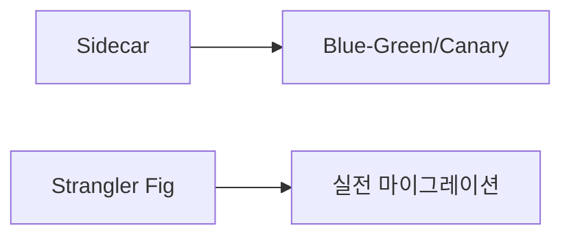

# 🚀 배포 & 인프라 패턴 (Deployment Patterns)

> [!note] 폴더 개요
> 이 폴더는 마이크로서비스를 안전하게 배포하고 운영하기 위한 패턴들을 다룹니다. Sidecar, Strangler Fig, Blue-Green/Canary 배포 등 프로덕션 환경에서 필수적인 배포 전략을 학습할 수 있습니다.

---

## 🎯 핵심 질문

**"마이크로서비스를 어떻게 안전하게 배포하고 운영할 것인가?"**

MSA 환경에서 배포는 단순히 코드를 올리는 것 이상입니다:
- 여러 서비스의 독립적인 배포
- 무중단 배포 (Zero-Downtime Deployment)
- 빠른 롤백 전략
- 점진적 트래픽 전환
- 레거시 시스템 마이그레이션

---

## 📚 이 폴더의 패턴들

### 1. Sidecar 패턴 ⭐⭐⭐

**문서**: [[Sidecar-패턴]]

**핵심 개념**: 주요 애플리케이션과 함께 실행되는 보조 컨테이너로 로깅, 모니터링, 보안, 통신 같은 부가 작업 처리

**Kubernetes Pod 구조**:
```yaml
Pod
  ├── Main Container (애플리케이션)
  └── Sidecar Container (Envoy Proxy, Log Collector, etc.)
```

**언제 사용**:
- Service Mesh 구현 (Envoy, Linkerd)
- 애플리케이션 코드 수정 없이 기능 추가
- 로깅, 모니터링 중앙화
- mTLS 자동 암호화

**난이도**: 중급
**중요도**: ⭐⭐⭐ Service Mesh의 핵심

**장점**:
- ✅ 애플리케이션 코드 수정 불필요
- ✅ 언어 독립적
- ✅ 관심사 분리

**단점**:
- ❌ 리소스 오버헤드 ("Side Truck" 현상)
- ❌ Pod 불변성 (Sidecar 변경 시 전체 재시작)

**2026년 트렌드**:
- Istio Ambient Mesh (Sidecar-less)

**연관 패턴**:
- [[../01-통신-패턴/Service-Mesh-패턴|Service Mesh]]

---

### 2. Strangler Fig 패턴 ⭐⭐

**문서**: [[Strangler-Fig-패턴]]

**핵심 개념**: 기존 모놀리스를 점진적으로 마이크로서비스로 교체하는 마이그레이션 패턴

**단계별 접근**:
```
Phase 1: Monolith (100%)
         ↓
Phase 2: Monolith (80%) + Service A (20%)
         ↓
Phase 3: Monolith (50%) + Services A,B,C (50%)
         ↓
Phase 4: Microservices (100%)
```

**언제 사용**:
- 레거시 모놀리스 → MSA 전환
- Big Bang 방식의 리스크 회피
- 비즈니스 연속성 유지하며 현대화

**난이도**: 중급
**중요도**: ⭐⭐ 모놀리스 마이그레이션 필수

**핵심 요소**:
1. **API Gateway/Proxy**: 요청을 모놀리스 또는 신규 서비스로 라우팅
2. **점진적 전환**: 한 번에 하나의 기능씩 이전
3. **데이터 동기화**: 이전 중 데이터 일관성 유지

**실제 사례**:
- Netflix, Amazon 등 대규모 MSA 전환

**연관 패턴**:
- [[../01-통신-패턴/API-Gateway-패턴|API Gateway]]
- [[../02-데이터-관리-패턴/Database-per-Service|Database per Service]]

---

### 3. Blue-Green & Canary 배포 ⭐⭐

**문서**: [[Blue-Green-Canary-배포]]

**핵심 개념**: 안전한 배포를 위한 트래픽 전환 전략

**Blue-Green 배포**:
```
Production (Blue v1.0)
    ↓ 배포
Staging (Green v2.0)
    ↓ 테스트 완료
전체 트래픽을 Green으로 전환
    ↓ 문제 발생 시
즉시 Blue로 롤백
```

**Canary 배포**:
```
v1.0 (100% 트래픽)
    ↓
v2.0 (5% 트래픽) + v1.0 (95%)
    ↓ 메트릭 모니터링
v2.0 (10% → 25% → 50% → 100%)
```

**언제 사용**:

**Blue-Green**:
- 빠른 롤백 필요
- 인프라 리소스 충분
- 데이터베이스 스키마 변경 없음

**Canary**:
- 점진적 검증 필요
- 리소스 제약 (트래픽 일부만 전환)
- A/B 테스팅

**난이도**: 중급
**중요도**: ⭐⭐ 프로덕션 배포 필수

**구현 도구**:
- Kubernetes: Deployment + Service
- Istio: VirtualService (가중 라우팅)
- Argo Rollouts
- Flagger

**연관 패턴**:
- [[../01-통신-패턴/Service-Mesh-패턴|Service Mesh]] (트래픽 제어)

---

## 🗺️ 학습 순서 추천



### 1단계: Sidecar (Service Mesh 기초)

**먼저 학습해야 하는 이유**:
- Service Mesh의 핵심 메커니즘
- 배포 패턴의 기반 기술

**학습 시간**: 3-5일

**선행 학습**:
- Kubernetes 기본 (Pod, Deployment, Service)

---

### 2단계: Blue-Green & Canary

**핵심 배포 전략**:
- 프로덕션 환경 필수
- 무중단 배포 구현

**학습 시간**: 3-5일

---

### 3단계: Strangler Fig (선택적)

**레거시 마이그레이션 시 학습**:
- 모놀리스 전환 프로젝트가 있을 때

**학습 시간**: 1주

---

## 📊 패턴 비교

| 항목 | Sidecar | Strangler Fig | Blue-Green | Canary |
|------|---------|---------------|------------|--------|
| **목적** | 기능 분리 | 점진적 마이그레이션 | 빠른 전환 | 점진적 검증 |
| **리소스 필요** | 중간 | 높음 (동시 운영) | 높음 (2배) | 낮음 |
| **복잡도** | 중간 | 높음 | 낮음 | 중간 |
| **롤백 속도** | N/A | 중간 | 즉시 | 즉시 |
| **리스크** | 낮음 | 중간 | 낮음 | 매우 낮음 |
| **사용 빈도** | 높음 (Service Mesh) | 낮음 (마이그레이션) | 중간 | 높음 |

---

## 💡 실전 적용 가이드

### 시나리오 1: 신규 서비스 배포

**요구사항**:
- 새로운 마이크로서비스 배포
- 무중단 배포
- 안전한 검증

**추천 전략**: **Canary 배포**

**단계**:
1. v1.0을 100% 트래픽으로 운영
2. v2.0을 5% 트래픽으로 배포
3. 메트릭 모니터링 (에러율, 지연시간)
4. 이상 없으면 10% → 25% → 50% → 100% 점진 확대
5. 문제 발생 시 즉시 100% v1.0으로 롤백

**Kubernetes + Istio 예시**:
```yaml
apiVersion: networking.istio.io/v1
kind: VirtualService
metadata:
  name: my-service
spec:
  hosts:
  - my-service
  http:
  - match:
    - headers:
        canary:
          exact: "true"
    route:
    - destination:
        host: my-service
        subset: v2
  - route:
    - destination:
        host: my-service
        subset: v1
      weight: 95
    - destination:
        host: my-service
        subset: v2
      weight: 5
```

---

### 시나리오 2: 데이터베이스 스키마 변경

**요구사항**:
- DB 스키마 변경 포함
- 무중단 배포
- 롤백 가능

**추천 전략**: **Blue-Green 배포** (주의 필요)

**단계**:
1. **Expand Phase**: 기존 스키마에 새 컬럼 추가 (호환성 유지)
2. Blue (v1.0)와 Green (v2.0) 모두 신규 스키마 사용 가능하도록
3. Green 배포 및 테스트
4. 트래픽 전환
5. **Contract Phase**: 구 컬럼 제거 (v2.0 안정화 후)

**주의사항**:
- 스키마 변경은 Backward Compatible하게
- 즉시 롤백이 어려우므로 신중하게

---

### 시나리오 3: 레거시 모놀리스 전환

**요구사항**:
- 10년 된 모놀리스 애플리케이션
- 비즈니스 중단 불가
- 점진적 현대화

**추천 전략**: **Strangler Fig**

**마이그레이션 로드맵**:

**Phase 1: 준비 (1-2개월)**
1. 도메인 분석 (DDD)
2. 서비스 경계 설정
3. API Gateway 구축

**Phase 2: 첫 서비스 전환 (2-3개월)**
1. 가장 독립적인 기능 선택 (예: 알림 서비스)
2. 신규 마이크로서비스 개발
3. API Gateway에서 라우팅 규칙 추가
4. 트래픽 5% → 100% 점진 전환

**Phase 3: 핵심 기능 전환 (6-12개월)**
1. 주문, 결제 등 핵심 도메인 이전
2. 데이터베이스 분리 (Database per Service)
3. Event-Driven으로 통신 전환

**Phase 4: 모놀리스 폐기 (12-18개월)**
1. 모든 기능 이전 완료
2. 모놀리스 서비스 종료

**아키텍처**:
```
Client
  ↓
API Gateway (Routing Layer)
  ├─→ /api/orders → Order Service (New)
  ├─→ /api/users → User Service (New)
  └─→ /api/* → Monolith (Legacy)
```

**관련 문서**:
- [[Strangler-Fig-패턴]]

---

## 🔗 Service Mesh와의 통합

### Istio로 배포 자동화

**Canary 배포 자동화 (Flagger)**:
```yaml
apiVersion: flagger.app/v1beta1
kind: Canary
metadata:
  name: my-service
spec:
  targetRef:
    apiVersion: apps/v1
    kind: Deployment
    name: my-service
  service:
    port: 8080
  analysis:
    interval: 1m
    threshold: 5
    maxWeight: 50
    stepWeight: 10
    metrics:
    - name: request-success-rate
      thresholdRange:
        min: 99
    - name: request-duration
      thresholdRange:
        max: 500
```

**자동 롤백**:
- 에러율 1% 초과 시 자동 롤백
- 지연시간 500ms 초과 시 자동 롤백

---

## ⚠️ 안티패턴 주의

### 1. Big Bang Deployment

**문제**:
모든 서비스를 한 번에 배포 → 높은 리스크

**해결**:
- Canary 또는 Blue-Green으로 점진적 배포
- 서비스별 독립 배포

---

### 2. Sidecar Overload ("Side Truck")

**문제**:
경량 서비스에 무거운 Envoy 프록시 → 리소스 낭비

**해결**:
- Istio Ambient Mesh (Sidecar-less)
- 소규모 서비스는 Sidecar 미적용

---

### 3. 롤백 계획 없는 배포

**문제**:
배포 후 문제 발생 시 수동 복구 → 긴 다운타임

**해결**:
- Blue-Green으로 즉시 롤백 가능
- Canary로 문제 조기 감지

---

## 🚀 다음 단계

### 이 폴더의 패턴을 학습한 후

1. **[[../01-통신-패턴/Service-Mesh-패턴|Service Mesh]]** 복습
   - Sidecar와 Service Mesh의 관계 이해

2. **[[../03-복원력-패턴/_README|복원력 패턴]]** 복습
   - 배포 시 Circuit Breaker로 장애 격리

3. **[[../99-실전-적용/실전-체크리스트|실전 체크리스트]]** 확인
   - 배포 전 패턴 적용 여부 점검

---

## 📋 체크리스트

학습 완료 후 확인:

- [ ] Sidecar 패턴의 동작 원리를 이해한다
- [ ] Kubernetes Pod에서 Sidecar를 구성할 수 있다
- [ ] Strangler Fig 패턴의 단계별 접근을 설명할 수 있다
- [ ] Blue-Green과 Canary 배포의 차이를 안다
- [ ] Istio로 Canary 배포를 구현할 수 있다
- [ ] 배포 시 롤백 전략을 수립할 수 있다
- [ ] 레거시 마이그레이션 로드맵을 작성할 수 있다

---

**상위 문서**: [[../00-MSA-디자인-패턴-MOC|MSA 디자인 패턴 MOC]]
**마지막 업데이트**: 2026-01-02
