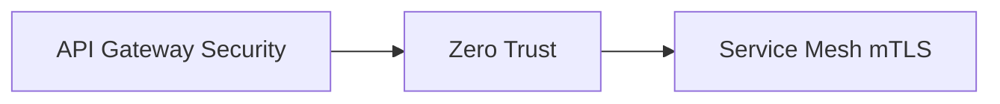

# 🔒 보안 & 거버넌스 패턴 (Security & Governance)

> [!note] 폴더 개요
> 이 폴더는 분산 시스템에서 보안을 강화하고 거버넌스를 확립하는 패턴들을 다룹니다. Zero Trust Architecture부터 API Gateway 보안까지, MSA 환경에서 필수적인 보안 전략을 학습할 수 있습니다.

---

## 🎯 핵심 질문

**"분산 시스템의 보안을 어떻게 강화할 것인가?"**

모놀리스와 달리 MSA는 보안 도전 과제가 많습니다:
- 서비스 간 통신 암호화 (East-West Traffic)
- 분산된 인증/인가 관리
- API 보안 (Rate Limiting, DDoS 방어)
- 민감 정보 관리 (Secrets Management)
- 규제 준수 (GDPR, HIPAA, PCI-DSS)

전통적인 "성곽 방어" (Perimeter Security)는 더 이상 유효하지 않습니다.

---

## 📚 이 폴더의 패턴들

### 1. Zero Trust Architecture ⭐⭐⭐

**문서**: [[Zero-Trust-Architecture]]

**핵심 원칙**: "절대 신뢰하지 말고, 항상 검증하라 (Never Trust, Always Verify)"

**핵심 개념**:

전통적인 보안 (성곽 방어):
```
외부 (위험) ───┤ Firewall ├─── 내부 (신뢰)
                                 ↑
                          모든 서비스가 서로 신뢰
```

Zero Trust:
```
모든 요청을 검증
  ├─→ Service A ─[mTLS]→ Service B (신원 확인)
  ├─→ Service B ─[mTLS]→ Service C (신원 확인)
  └─→ Service C ─[Policy]→ Service D (권한 확인)
```

**핵심 구성 요소**:

1. **mTLS (Mutual TLS)**
   - 서비스 간 양방향 인증
   - 통신 암호화
   - Service Mesh (Istio, Linkerd)가 자동 제공

2. **Identity-based Access**
   - JWT, OAuth2, OIDC
   - 서비스 계정 (Service Account)
   - SPIFFE/SPIRE

3. **Policy Enforcement**
   - OPA (Open Policy Agent)
   - 중앙화된 정책 관리
   - 세밀한 권한 제어 (RBAC, ABAC)

4. **Least Privilege**
   - 필요한 최소 권한만 부여
   - 시간 제한 (Temporary Credentials)

**언제 사용**:
- 모든 MSA 환경 (필수)
- 규제 준수 필요 (금융, 의료)
- 멀티 클라우드 환경

**난이도**: 고급
**중요도**: ⭐⭐⭐ 2026년 표준

**구현 스택**:
- **Service Mesh**: Istio (mTLS 자동)
- **Identity**: SPIFFE/SPIRE, Keycloak
- **Policy**: OPA
- **Secrets**: HashiCorp Vault

**연관 패턴**:
- [[../01-통신-패턴/Service-Mesh-패턴|Service Mesh]]

---

### 2. API Gateway Security ⭐⭐

**문서**: [[API-Gateway-Security]]

**핵심 개념**: API Gateway에서 중앙화된 보안 정책 적용

**주요 보안 기능**:

1. **인증 (Authentication)**
   - JWT 검증
   - API Key 관리
   - OAuth2/OIDC 통합

2. **인가 (Authorization)**
   - RBAC (Role-Based Access Control)
   - Scope 기반 권한 제어

3. **Rate Limiting**
   - IP별, 사용자별 제한
   - DDoS 방어
   - API 할당량 관리

4. **IP 화이트리스트/블랙리스트**
   - 특정 IP 차단
   - 지역 기반 접근 제어 (Geo-blocking)

5. **요청 검증**
   - Schema Validation
   - Input Sanitization (SQL Injection, XSS 방지)

6. **WAF (Web Application Firewall)**
   - OWASP Top 10 공격 방어
   - Bot 탐지

**언제 사용**:
- 외부 클라이언트 접근 제어 (North-South Traffic)
- API 남용 방지
- 중앙화된 보안 정책 필요

**난이도**: 중급
**중요도**: ⭐⭐ 외부 API 필수

**구현 도구**:
- Kong (Rate Limiting, JWT)
- AWS API Gateway
- Azure API Management
- Google Apigee

**연관 패턴**:
- [[../01-통신-패턴/API-Gateway-패턴|API Gateway]]

---

## 🗺️ 학습 순서 추천



### 1단계: API Gateway Security (기초)

**먼저 학습해야 하는 이유**:
- 외부 트래픽 보안의 첫 관문
- 상대적으로 직관적

**학습 시간**: 3-5일

---

### 2단계: Zero Trust Architecture (핵심)

**반드시 학습**:
- 현대 MSA 보안의 표준
- Service Mesh와 밀접한 연관

**학습 시간**: 1-2주

**선행 학습**:
- [[../01-통신-패턴/Service-Mesh-패턴|Service Mesh]]

---

## 📊 패턴 비교

| 항목 | API Gateway Security | Zero Trust |
|------|---------------------|------------|
| **적용 영역** | North-South (외부→내부) | East-West (서비스 간) |
| **인증 방식** | JWT, API Key | mTLS, SPIFFE |
| **구현 위치** | API Gateway | Service Mesh |
| **복잡도** | 중간 | 높음 |
| **사용 빈도** | 필수 (외부 API) | 필수 (전체 서비스) |

---

## 💡 실전 적용 가이드

### 시나리오 1: 공개 API 보안

**요구사항**:
- REST API를 외부 파트너에게 제공
- API 남용 방지
- 인증/인가

**보안 전략**:

1. **API Gateway 보안**
   ```
   Client
     ↓ HTTPS (TLS 1.3)
   API Gateway
     ├─→ JWT 검증
     ├─→ Rate Limiting (1000 req/min)
     ├─→ IP 화이트리스트
     └─→ Schema Validation
         ↓
   Backend Services (mTLS)
   ```

2. **인증 플로우**
   ```
   Client → POST /oauth/token (client_id, client_secret)
          ← Access Token (JWT)

   Client → GET /api/users (Authorization: Bearer <token>)
          ← 200 OK
   ```

3. **Kong 설정 예시**:
   ```yaml
   plugins:
   - name: jwt
     config:
       key_claim_name: iss
   - name: rate-limiting
     config:
       minute: 1000
       policy: local
   - name: ip-restriction
     config:
       allow: ["203.0.113.0/24"]
   ```

---

### 시나리오 2: 내부 서비스 보안 (Zero Trust)

**요구사항**:
- 서비스 간 통신 암호화
- 상호 인증
- 세밀한 권한 제어

**보안 전략**:

1. **mTLS 자동 적용 (Istio)**
   ```yaml
   apiVersion: security.istio.io/v1
   kind: PeerAuthentication
   metadata:
     name: default
     namespace: production
   spec:
     mtls:
       mode: STRICT  # 모든 통신 mTLS 강제
   ```

2. **서비스별 권한 제어 (OPA)**
   ```rego
   # Order Service는 Payment Service 호출 가능
   allow {
     input.source.principal == "cluster.local/ns/default/sa/order-service"
     input.destination.principal == "cluster.local/ns/default/sa/payment-service"
     input.request.method == "POST"
   }
   ```

3. **시크릿 관리 (Vault)**
   ```
   Service A
     ↓ 요청 시크릿 (Vault Agent Sidecar)
   Vault
     ↓ 시간 제한 토큰 (1시간)
   Service A → Database (토큰으로 연결)
   ```

---

### 시나리오 3: 금융 시스템 (규제 준수)

**요구사항**:
- PCI-DSS 준수
- 모든 통신 암호화
- 감사 로그

**보안 전략**:

1. **End-to-End 암호화**
   - Client → API Gateway: TLS 1.3
   - API Gateway → Services: mTLS
   - Services → Database: TLS

2. **Secrets Rotation**
   - Vault로 DB 비밀번호 자동 교체 (24시간마다)
   - 서비스 재시작 없이 동적 갱신

3. **감사 로그**
   ```
   모든 API 호출 로그
     ├─→ 누가 (User ID)
     ├─→ 언제 (Timestamp)
     ├─→ 무엇을 (API Endpoint)
     ├─→ 어떻게 (Request/Response)
     └─→ 결과 (성공/실패)

   → ELK Stack 또는 Splunk로 중앙화
   → 규제 감사 시 제출
   ```

---

## 🔗 보안 스택 통합

### 전체 보안 아키텍처

```
┌─────────────────────────────────────────────┐
│          Client (HTTPS)                     │
└─────────────────┬───────────────────────────┘
                  │
         ┌────────▼─────────┐
         │   WAF + DDoS     │ (Cloudflare, AWS WAF)
         └────────┬─────────┘
                  │
         ┌────────▼─────────┐
         │   API Gateway    │
         │   - JWT 검증      │
         │   - Rate Limiting│
         │   - IP 필터링     │
         └────────┬─────────┘
                  │
    ┌─────────────┼─────────────┐
    │   Service Mesh (Istio)     │
    │   - mTLS (자동)             │
    │   - RBAC (OPA)             │
    └─────────────┬─────────────┘
                  │
    ┌─────────────┴─────────────┐
    │                           │
┌───▼────┐  ┌────▼────┐  ┌────▼────┐
│Service │  │Service  │  │Service  │
│   A    │  │   B     │  │   C     │
└───┬────┘  └────┬────┘  └────┬────┘
    │            │            │
    └────────────┼────────────┘
                 │
         ┌───────▼────────┐
         │  Vault         │ (Secrets Management)
         └────────────────┘
```

---

## ⚠️ 안티패턴 주의

### 1. 평문 통신

**문제**:
서비스 간 HTTP 통신 (암호화 없음)

**해결**:
- Service Mesh로 mTLS 자동 적용
- 모든 통신 HTTPS 강제

---

### 2. 하드코딩된 시크릿

**문제**:
```java
// 안티패턴!
String dbPassword = "admin123";
```

**해결**:
- Vault, AWS Secrets Manager 사용
- 환경 변수 또는 Kubernetes Secrets

---

### 3. 과도한 권한

**문제**:
모든 서비스가 admin 권한

**해결**:
- Least Privilege 원칙
- 서비스별 최소 권한만 부여

---

## 🚀 다음 단계

### 이 폴더의 패턴을 학습한 후

1. **[[../01-통신-패턴/Service-Mesh-패턴|Service Mesh]]** 복습
   - mTLS 자동 적용 방법

2. **[[../99-실전-적용/실전-체크리스트|실전 체크리스트]]** 확인
   - 배포 전 보안 점검

---

## 📋 체크리스트

학습 완료 후 확인:

- [ ] Zero Trust의 핵심 원칙을 설명할 수 있다
- [ ] mTLS의 동작 원리를 이해한다
- [ ] Istio로 mTLS를 자동 적용할 수 있다
- [ ] OPA로 정책을 작성할 수 있다
- [ ] Vault로 시크릿을 관리할 수 있다
- [ ] API Gateway에서 JWT를 검증할 수 있다
- [ ] Rate Limiting을 설정할 수 있다
- [ ] 규제 준수를 위한 감사 로그를 구성할 수 있다

---

**상위 문서**: [[../00-MSA-디자인-패턴-MOC|MSA 디자인 패턴 MOC]]
**마지막 업데이트**: 2026-01-02
