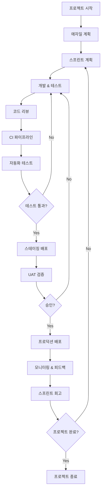

# 🎯 애자일 & DevOps 현대 개발 프로세스 완벽 가이드

**작성 시점**: 2024년 12월 26일 오후

## 📑 목차
- [[#1. 핵심 개념 정리|핵심 개념 정리]]
- [[#2. 장단점 비교 분석|장단점 비교 분석]]
- [[#3. 이상적인 개발 흐름 설계|이상적인 개발 흐름 설계]]
- [[#🎯 실전 적용 전략|실전 적용 전략]]

---

## 1. 핵심 개념 정리

> [!note] 핵심 철학
> 현대 소프트웨어 개발은 **빠른 피드백**, **지속적인 개선**, **자동화를 통한 효율성**을 추구합니다.

### 💡 애자일 (Agile) 방법론

**🤔 핵심 질문**: "변화하는 요구사항에 어떻게 빠르게 대응할 것인가?"

#### 📋 애자일 핵심 원칙

> [!example] 애자일 4대 가치
> 1. **개인과 상호작용** > 프로세스와 도구
> 2. **작동하는 소프트웨어** > 포괄적인 문서
> 3. **고객과의 협력** > 계약 협상
> 4. **변화에 대응** > 계획을 따르기

#### 💻 주요 프레임워크

```markdown
# 📊 스크럼 (Scrum) 프레임워크

## 역할 (Roles)
- **Product Owner**: 제품 비전 및 백로그 관리
- **Scrum Master**: 프로세스 촉진 및 장애물 제거
- **Development Team**: 제품 개발 및 테스트

## 이벤트 (Events)
- **Sprint**: 1-4주 개발 주기
- **Sprint Planning**: 스프린트 목표 설정
- **Daily Standup**: 일일 진행상황 공유
- **Sprint Review**: 완성된 기능 시연
- **Sprint Retrospective**: 프로세스 개선점 도출

## 산출물 (Artifacts)
- **Product Backlog**: 기능 요구사항 목록
- **Sprint Backlog**: 스프린트별 작업 목록
- **Increment**: 잠재적 출시 가능한 제품
```

### 🔧 CI/CD (Continuous Integration/Continuous Deployment)

**🤔 핵심 질문**: "코드 변경사항을 어떻게 신속하고 안전하게 배포할 것인가?"

#### 📊 CI/CD 파이프라인 구성

| 단계 | 목적 | 주요 도구 |
|------|------|----------|
| **Code** | 코드 작성 및 버전 관리 | Git, GitHub, GitLab |
| **Build** | 코드 컴파일 및 패키징 | Jenkins, GitHub Actions |
| **Test** | 자동화된 테스트 실행 | Jest, JUnit, Cypress |
| **Deploy** | 운영 환경 배포 | Docker, Kubernetes, AWS |

#### 💻 CI/CD 워크플로우 예시

```yaml
# 📊 GitHub Actions CI/CD 설정 예시
name: CI/CD Pipeline

on:
  push:
    branches: [main, develop]
  pull_request:
    branches: [main]

jobs:
  test:
    runs-on: ubuntu-latest
    steps:
      - uses: actions/checkout@v3
      - name: Setup Node.js
        uses: actions/setup-node@v3
        with:
          node-version: '18'
      - name: Install dependencies
        run: npm ci
      - name: Run tests
        run: npm test
      - name: Run linting
        run: npm run lint

  deploy:
    needs: test
    runs-on: ubuntu-latest
    if: github.ref == 'refs/heads/main'
    steps:
      - name: Deploy to production
        run: |
          docker build -t app .
          docker push registry/app:latest
          kubectl apply -f k8s/
```

### ⚙️ DevOps 문화와 실천

**🤔 핵심 질문**: "개발팀과 운영팀이 어떻게 효과적으로 협업할 것인가?"

#### 📋 DevOps 핵심 실천사항

> [!example] DevOps CALMS 모델
> - **Culture**: 협업 문화 구축
> - **Automation**: 프로세스 자동화
> - **Lean**: 낭비 제거 및 효율성 추구
> - **Measurement**: 지표 기반 개선
> - **Sharing**: 지식 및 책임 공유

#### 💻 DevOps 도구 체인

```markdown
# 🔧 DevOps 도구 생태계

## 인프라 관리
- **IaC**: Terraform, CloudFormation
- **컨테이너**: Docker, Podman
- **오케스트레이션**: Kubernetes, Docker Swarm

## 모니터링 및 로깅
- **메트릭**: Prometheus, Grafana
- **로깅**: ELK Stack, Fluentd
- **APM**: New Relic, Datadog

## 보안 (DevSecOps)
- **보안 스캐닝**: SonarQube, OWASP ZAP
- **컨테이너 보안**: Trivy, Clair
- **시크릿 관리**: HashiCorp Vault, AWS Secrets Manager
```

---

## 2. 장단점 비교 분석

### 📊 애자일 방법론 분석

#### ✅ 장점
- **빠른 변화 대응**: 요구사항 변경에 유연하게 대응
- **고객 중심**: 지속적인 고객 피드백 수렴
- **팀 자율성**: 팀원의 창의성과 책임감 증대
- **위험 감소**: 짧은 주기로 문제점 조기 발견

#### ⚠️ 단점
- **문서화 부족**: 지식 전수 및 유지보수 어려움
- **예측 곤란**: 일정 및 예산 추정의 불확실성
- **고객 의존성**: 지속적인 고객 참여 필요
- **팀 역량 의존**: 숙련된 팀 없이는 효과 제한적

### 📊 CI/CD 분석

#### ✅ 장점
- **빠른 배포**: 자동화된 배포로 출시 주기 단축
- **품질 향상**: 자동화된 테스트로 버그 조기 발견
- **위험 감소**: 작은 단위의 점진적 배포
- **개발자 생산성**: 수동 작업 최소화

#### ⚠️ 단점
- **초기 구축 비용**: 파이프라인 설정 시간과 비용
- **복잡성 증가**: 도구 체인 관리의 복잡성
- **문화 변화 필요**: 조직의 마인드셋 전환 필요
- **장애 파급효과**: 파이프라인 장애 시 전체 프로세스 중단

### 📊 DevOps 분석

#### ✅ 장점
- **협업 강화**: 개발-운영 간 사일로 해소
- **안정성 향상**: 인프라와 애플리케이션 통합 관리
- **확장성**: 클라우드 네이티브 아키텍처 활용
- **비용 최적화**: 리소스 효율적 활용

#### ⚠️ 단점
- **학습 곡선**: 다양한 도구와 기술 습득 필요
- **조직 변화**: 기존 조직 구조 및 프로세스 변경
- **보안 복잡성**: 다양한 환경에서의 보안 관리
- **표준화 어려움**: 팀별 도구와 프로세스 표준화

---

## 3. 이상적인 개발 흐름 설계

### 💡 통합 개발 프로세스 워크플로우

> [!note] 설계 원칙
> **애자일의 유연성** + **CI/CD의 자동화** + **DevOps의 협업 문화**

#### 📋 단계별 워크플로우



### 🔧 상세 프로세스 단계

#### 1단계: 애자일 기획 & 설계
```markdown
### 📋 계획 단계 체크리스트

- [ ] **Product Vision 수립**
  - 제품 목표 및 성공 지표 정의
  - 타겟 사용자 및 페르소나 설정
  
- [ ] **초기 백로그 작성**
  - Epic → User Story → Task 분해
  - 우선순위 및 추정치 설정
  
- [ ] **기술 아키텍처 설계**
  - 마이크로서비스 vs 모놀리식 결정
  - 기술 스택 선정
  - 인프라 요구사항 정의
```

#### 2단계: 개발 환경 구축
```yaml
# 📊 개발 환경 설정 예시
development:
  environment: local
  database: postgresql-dev
  cache: redis-dev
  monitoring: disabled
  
staging:
  environment: staging
  database: postgresql-staging
  cache: redis-staging
  monitoring: basic
  
production:
  environment: production
  database: postgresql-prod
  cache: redis-prod
  monitoring: full
  security: enhanced
```

#### 3단계: 스프린트 실행
```markdown
### 🎯 일일 워크플로우

#### 오전 (09:00-12:00)
- **Daily Standup** (15분)
- **코딩 시간** (몰입 시간 확보)

#### 오후 (13:00-18:00)
- **코드 리뷰** (30분)
- **페어 프로그래밍** (선택적)
- **통합 테스트** (자동화)

#### 저녁 (18:00-19:00)
- **CI/CD 파이프라인 모니터링**
- **다음 일 계획 수립**
```

#### 4단계: 품질 보증 & 배포
```markdown
### 🔍 품질 게이트 체크포인트

1. **정적 분석**
   - 코드 품질 (SonarQube)
   - 보안 취약성 (SAST)
   - 라이센스 준수성

2. **동적 테스트**
   - 단위 테스트 (90% 이상 커버리지)
   - 통합 테스트
   - E2E 테스트

3. **성능 검증**
   - 로드 테스트
   - 응답시간 SLA 확인
   - 리소스 사용량 모니터링
```

### ⚙️ 인프라 자동화 전략

```terraform
# 📊 인프라 코드 예시 (Terraform)
module "application" {
  source = "./modules/app"
  
  environment = var.environment
  app_version = var.app_version
  
  scaling = {
    min_instances = var.environment == "prod" ? 3 : 1
    max_instances = var.environment == "prod" ? 10 : 3
  }
  
  monitoring = {
    alerts_enabled = var.environment == "prod"
    log_retention_days = 30
  }
}
```

---

## 🎯 실전 적용 전략

### 💻 프로젝트 유형별 적용 가이드

#### 🚀 스타트업/MVP 개발
```markdown
### 우선순위 전략

1. **애자일 중심** (80%)
   - 빠른 실험과 피벗
   - 최소 기능 제품(MVP) 우선
   
2. **기본 CI/CD** (15%)
   - 간단한 자동화 배포
   - 필수 테스트만 구현
   
3. **최소 DevOps** (5%)
   - 클라우드 서비스 활용
   - 관리형 서비스 우선 선택
```

#### 🏢 엔터프라이즈급 개발
```markdown
### 균형잡힌 접근

1. **애자일 프로세스** (40%)
   - SAFe, LeSS 등 확장 프레임워크
   - 다중 팀 조율 메커니즘
   
2. **고도화된 CI/CD** (35%)
   - 다단계 배포 파이프라인
   - 자동화된 승인 프로세스
   
3. **완전한 DevOps** (25%)
   - 인프라 코드화
   - 포괄적 모니터링
   - 보안 정책 통합
```

### 📋 단계별 도입 로드맵

#### Phase 1: 기반 구축 (1-3개월)
```markdown
### 🎯 목표: 기본 프로세스 확립

- [ ] **팀 교육**
  - 애자일 기본 교육
  - Git workflow 표준화
  - 코드 리뷰 문화 정착

- [ ] **도구 도입**
  - 프로젝트 관리 도구 (Jira, Linear)
  - 기본 CI 설정 (GitHub Actions)
  - 코드 품질 도구 (ESLint, Prettier)
```

#### Phase 2: 자동화 확장 (3-6개월)
```markdown
### 🎯 목표: 배포 자동화 및 품질 향상

- [ ] **CI/CD 파이프라인 구축**
  - 자동화된 테스트 스위트
  - 스테이징 환경 자동 배포
  - 기본 모니터링 설정

- [ ] **인프라 코드화**
  - Docker 컨테이너화
  - 기본 오케스트레이션
  - 환경별 설정 관리
```

#### Phase 3: 운영 최적화 (6-12개월)
```markdown
### 🎯 목표: 완전한 DevOps 문화 구축

- [ ] **고급 모니터링**
  - APM 도구 도입
  - 알림 및 온콜 체계
  - SRE 문화 정착

- [ ] **지속적 개선**
  - 메트릭 기반 의사결정
  - 정기적 프로세스 회고
  - 혁신 실험 문화
```

### 🎯 성공 지표 (KPI)

#### 📊 기술적 지표
| 지표 | 목표값 | 측정방법 |
|------|--------|----------|
| **배포 빈도** | 일 1회 이상 | Git 태그/릴리스 추적 |
| **변경 리드타임** | 1일 이내 | 커밋→배포 시간 측정 |
| **배포 실패율** | 5% 이하 | 실패한 배포/전체 배포 |
| **복구 시간** | 1시간 이내 | 장애 발생→복구 시간 |

#### 📊 비즈니스 지표
| 지표 | 목표값 | 측정방법 |
|------|--------|----------|
| **고객 만족도** | 4.5/5 이상 | 정기 설문조사 |
| **기능 출시 속도** | 월 3개 이상 | 릴리스 노트 추적 |
| **버그 발생률** | 월 5개 이하 | 이슈 트래커 분석 |
| **팀 생산성** | 전월 대비 10% 향상 | 스토리 포인트 기반 |

### 🚨 주의사항 및 함정

#### ⚠️ 일반적인 실수들
```markdown
### 🔍 피해야 할 안티패턴

1. **도구 중심 사고**
   - 문제: 도구 도입이 목적이 되는 경우
   - 해결: 문제 정의 → 프로세스 설계 → 도구 선택

2. **완벽주의 함정**
   - 문제: 100% 자동화를 처음부터 추구
   - 해결: 점진적 개선, 20% 노력으로 80% 효과

3. **문화 변화 무시**
   - 문제: 기술적 변화만 추진
   - 해결: 교육, 인센티브, 변화 관리

4. **메트릭 함정**
   - 문제: 측정하기 쉬운 것만 관리
   - 해결: 비즈니스 가치 중심 지표 설정
```

### 📚 추천 학습 자료

#### 📖 필수 도서
- **애자일**: "Scrum: The Art of Doing Twice the Work in Half the Time"
- **DevOps**: "The Phoenix Project", "Accelerate"
- **CI/CD**: "Continuous Delivery" by Jez Humble

#### 🎓 온라인 과정
- **Scrum.org**: Professional Scrum Master (PSM)
- **AWS**: DevOps Engineer Professional
- **Google**: SRE Fundamentals

#### 🛠 실습 환경
- **GitHub**: Actions를 활용한 CI/CD 실습
- **GitLab**: 통합 DevOps 플랫폼 체험
- **Azure DevOps**: 엔터프라이즈급 도구 체인

---

> [!tip] 핵심 성공 요소
> 1. **점진적 도입**: 한 번에 모든 것을 바꾸려 하지 말고 단계별 접근
> 2. **팀 바이인**: 모든 팀원이 변화의 필요성을 이해하고 참여
> 3. **지속적 학습**: 새로운 도구와 방법론에 대한 열린 자세
> 4. **실험 문화**: 실패를 학습 기회로 받아들이는 문화 조성

**문서 최종 업데이트**: 2024년 12월 26일
**다음 검토 예정**: 2025년 3월 26일