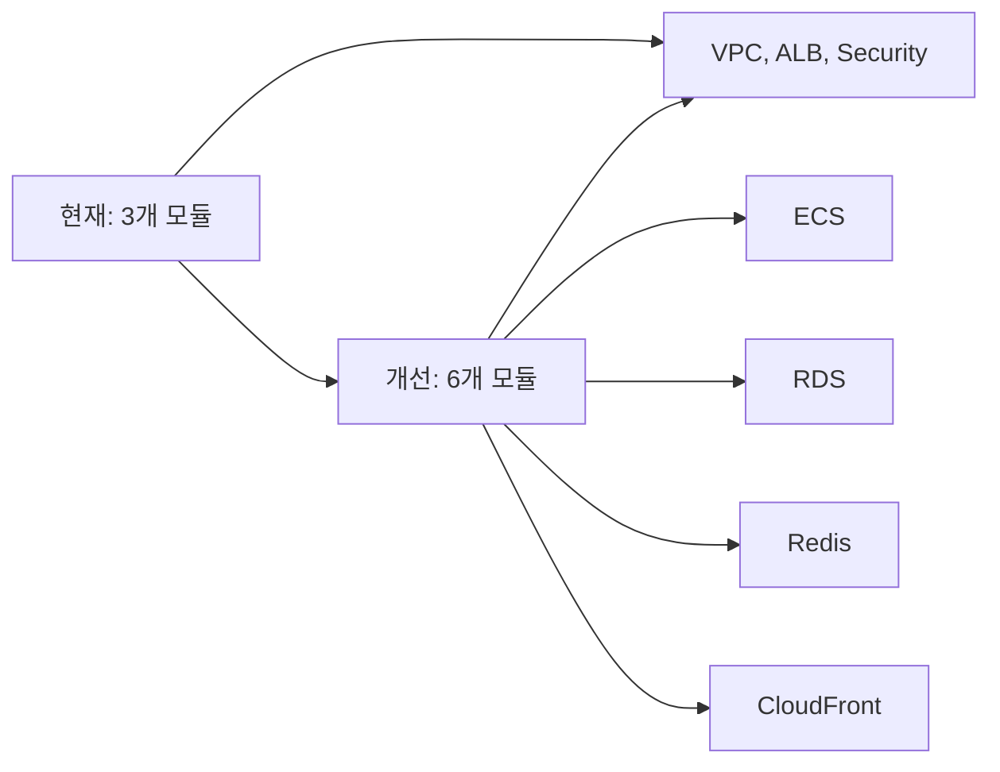

# 🎯 AWS Terraform 모듈화 구조 분석

## 📑 목차
- [[#1. 프로젝트 개요|프로젝트 개요]]
- [[#2. 현재 모듈화 구조|현재 모듈화 구조]]
- [[#3. 각 모듈 상세 분석|각 모듈 상세 분석]]
- [[#4. 모듈화 구성 평가|모듈화 구성 평가]]
- [[#5. 앞으로 중요해질 모듈들|앞으로 중요해질 모듈들]]
- [[#6. 학습 우선순위|학습 우선순위]]

---

## 1. 프로젝트 개요

> [!note] 프로젝트 정보
> - **프로젝트명**: 뿌리래기 이커머스 MSA
> - **아키텍처**: MSA (Microservices Architecture)
> - **컨테이너 오케스트레이션**: AWS ECS Fargate
> - **데이터베이스**: PostgreSQL (RDS)
> - **캐싱**: Redis (ElastiCache)

### 💡 모듈화 목적

**🤔 질문**: "왜 Terraform 코드를 모듈화해야 하는가?"

**📋 구체적인 이유**
1. **재사용성**: 동일한 인프라 구성을 여러 환경에서 재사용
2. **유지보수성**: 변경 사항을 한 곳에서 관리
3. **가독성**: 메인 코드를 간결하게 유지
4. **테스트 가능성**: 개별 모듈을 독립적으로 테스트

---

## 2. 현재 모듈화 구조

```
infrastructure/
├── modules/
│   ├── vpc/
│   │   ├── main.tf
│   │   ├── variables.tf
│   │   └── outputs.tf
│   ├── alb/
│   │   ├── main.tf
│   │   ├── variables.tf
│   │   └── outputs.tf
│   └── security/
│       ├── main.tf
│       ├── variables.tf
│       └── outputs.tf
└── main.tf (메인 구성 파일)
```

### 📊 모듈 구성 표

| 모듈 | 담당 리소스 | 복잡도 | 재사용성 |
|------|------------|--------|----------|
| **vpc** | VPC, Subnets, IGW, NAT, Route Tables | 높음 | 매우 높음 |
| **alb** | ALB, Target Groups, Listeners, Rules | 중간 | 높음 |
| **security** | Security Groups (5개) | 중간 | 매우 높음 |

---

## 3. 각 모듈 상세 분석

### 💡 VPC 모듈

#### 📋 구성 리소스
- VPC
- Internet Gateway
- NAT Gateway + EIP
- Public/Private Subnets
- Route Tables + Associations

#### 💻 주요 설정

```hcl
module "vpc" {
  source = "./modules/vpc"
  
  project_name = "pposiraegi"
  vpc_cidr     = "10.0.0.0/16"
  
  public_subnets = {
    a = { cidr = "10.0.1.0/24", az = "ap-northeast-2a" }
    b = { cidr = "10.0.2.0/24", az = "ap-northeast-2c" }
  }
  
  private_subnets = {
    a = { cidr = "10.0.3.0/24", az = "ap-northeast-2a" }
    b = { cidr = "10.0.4.0/24", az = "ap-northeast-2c" }
  }
}
```

#### 📊 출력값
- `vpc_id`: VPC ID
- `public_subnet_ids`: 퍼블릭 서브넷 ID 목록
- `private_subnet_ids`: 프라이빗 서브넷 ID 목록
- `internet_gateway_id`: IGW ID
- `nat_gateway_id`: NAT Gateway ID

> [!tip] 장점
> - 가장 기본적이고 재사용성이 높은 모듈
> - 다른 모든 리소스의 의존성 기반
> - 환경별로 CIDR 구성만 변경하면 됨

---

### 💡 ALB 모듈

#### 📋 구성 리소스
- Application Load Balancer
- Target Groups
- Listeners
- Listener Rules (Path-based Routing)
- Security Group

#### 💻 주요 설정

```hcl
module "alb" {
  source = "./modules/alb"
  
  project_name = "pposiraegi"
  vpc_id       = module.vpc.vpc_id
  subnet_ids   = module.vpc.public_subnet_ids
  
  target_groups = {
    backend = {
      port     = 8080
      protocol = "HTTP"
      health_check = {
        path                = "/v3/api-docs"
        interval            = 30
        healthy_threshold   = 2
        unhealthy_threshold = 3
        matcher             = "200-499"
      }
    }
  }
  
  default_target_group = "backend"
}
```

#### 📊 출력값
- `alb_dns_name`: ALB DNS 이름
- `alb_arn`: ALB ARN
- `target_group_arns`: 타겟 그룹 ARN 맵

> [!tip] 장점
> - Path-based Routing 지원
> - Health Check 설정 유연
> - 다중 타겟 그룹 지원

---

### 💡 Security 모듈

#### 📋 구성 리소스
- ALB Security Group
- API Gateway Security Group
- Internal MSA Security Group
- Redis Security Group
- RDS Security Group

#### 💻 주요 설정

```hcl
module "security" {
  source = "./modules/security"
  
  project_name = "pposiraegi"
  vpc_id       = module.vpc.vpc_id
  
  # 조건부 생성
  create_alb_sg         = true
  create_api_gateway_sg = true
  create_internal_msa_sg = true
  create_redis_sg        = true
  create_rds_sg          = true
  
  # 유연한 Ingress 규칙 설정
  api_gateway_ingress = [
    {
      from_port       = 8080
      to_port         = 8080
      protocol        = "tcp"
      security_groups = [module.security.alb_security_group_id]
      cidr_blocks     = []
    }
  ]
}
```

#### 📊 출력값
- 각 Security Group ID
- `security_group_ids` 맵

> [!tip] 장점
> - 조건부 생성으로 필요한 SG만 생성
> - Dynamic Ingress/Egress 규칙 지원
> - Self-reference 지원 (internal 통신)

---

## 4. 모듈화 구성 평가

### ✅ 장점

#### 1. 코드 재사용성
- **이전**: 모든 환경에서 VPC/ALB 코드 복사
- **현재**: 모듈을 참조하여 재사용

#### 2. 유지보수성
- **이전**: 변경 시 모든 환경 코드 수정 필요
- **현재**: 모듈만 수정하면 모든 환경에 적용

#### 3. 가독성
- **이전**: 800+ 줄의 단일 main.tf
- **현재**: 간결한 모듈 호출 + 분리된 모듈 코드

#### 4. 의존성 관리
- 명시적인 module 간 의존성 (`module.vpc.vpc_id`)
- 자동으로 리소스 생성 순서 결정

### ⚠️ 개선점

#### 1. 모듈 분리 추가


#### 2. 변수 검증 강화
- `validation` 블록 추가 필요
- 예시:
```hcl
variable "vpc_cidr" {
  type        = string
  default     = "10.0.0.0/16"
  validation {
    condition     = can(cidrhost(var.vpc_cidr, 0))
    error_message = "유효한 CIDR 블록이어야 합니다."
  }
}
```

#### 3. 테스트 코드 작성
- `terraform-validate`
- `terratest`를 통한 통합 테스트

---

## 5. 앞으로 중요해질 모듈들

### 🚨 1순위: ECS 모듈

#### 📋 왜 중요한가?
- **MSA의 핵심**: 모든 마이크로서비스가 ECS에서 실행
- **스케일링**: 오토스케일링, 블루/그린 배포
- **운영 복잡도**: Task Definition, Service, IAM 등 다양한 리소스

#### 💡 구성 예시

```hcl
module "ecs_service" {
  source = "./modules/ecs-service"
  
  service_name = "user-service"
  
  cluster_id = module.ecs_cluster.cluster_id
  
  task_definition = {
    family = "user-service"
    cpu    = 512
    memory = 1024
    
    container_definitions = [{
      name  = "user-service"
      image = "${module.ecr.repository_url}:latest"
      port  = 8080
      
      environment = [
        { name = "DB_HOST", value = module.rds.endpoint }
      ]
      
      secrets = [
        { name = "DB_PASSWORD", valueFrom = module.ssm.db_password }
      ]
    }]
  }
  
  load_balancer_config = {
    target_group_arn = module.alb.target_group_arns["user-service"]
    container_port   = 8080
  }
  
  scaling = {
    min_capacity = 1
    max_capacity = 10
    target_cpu   = 70
  }
  
  depends_on = [
    module.alb,
    module.rds
  ]
}
```

#### 📚 학습 포인트
1. **ECS Fargate**
   - Task Definition 구조
   - Service 설정 (Task scheduling)
   - Network configuration

2. **Auto Scaling**
   - Target Tracking Scaling Policies
   - Scheduled Scaling
   - Application Auto Scaling

3. **배포 전략**
   - Rolling Update
   - Blue/Green Deployment
   - Canary Deployment

#### 🔧 참고 자료
- AWS ECS Documentation
- Terraform AWS Provider: `aws_ecs_service`
- `terraform-aws-modules/ecs/aws` 공식 모듈

---

### 🚨 2순위: RDS 모듈

#### 📋 왜 중요한가?
- **데이터베이스**: 애플리케이션의 핵심 데이터 저장소
- **고가용성**: Multi-AZ, Read Replica
- **백업/복구**: Snapshot, PITR (Point-in-Time Recovery)

#### 💡 구성 예시

```hcl
module "rds" {
  source = "./modules/rds"
  
  identifier = "${var.project_name}-db"
  
  engine            = "postgres"
  engine_version    = "15"
  instance_class    = "db.t3.micro"
  allocated_storage = 20
  
  database_name = "ecommerce"
  username     = var.db_username
  password     = var.db_password
  
  # 고가용성
  multi_az               = true
  db_subnet_group_name   = module.vpc.private_subnet_group_name
  
  # 보안
  vpc_security_group_ids = [module.security.rds_security_group_id]
  publicly_accessible     = false
  
  # 백업
  backup_retention_period = 7
  backup_window          = "03:00-04:00"
  maintenance_window     = "Mon:04:00-Mon:05:00"
  
  # 성능 모니터링
  performance_insights_enabled = true
  monitoring_interval         = 60
  monitoring_role_arn         = aws_iam_role.rds_monitoring.arn
  
  # 파라미터 그룹
  parameter_group_name = aws_db_parameter_group.main.name
  
  tags = {
    Environment = "production"
  }
}
```

#### 📚 학습 포인트
1. **RDS 구성**
   - Instance type 선정
   - Storage type (gp2, gp3, io1)
   - Parameter Group 설정

2. **고가용성**
   - Multi-AZ 배포
   - Read Replica 설정
   - Failover 메커니즘

3. **백업 및 복구**
   - Automated Snapshots
   - Manual Snapshots
   - PITR (Point-in-Time Recovery)

4. **성능 모니터링**
   - Performance Insights
   - Enhanced Monitoring
   - CloudWatch Metrics

#### 🔧 참고 자료
- AWS RDS Documentation
- Terraform AWS Provider: `aws_db_instance`
- `terraform-aws-modules/rds/aws` 공식 모듈

---

### 🚨 3순위: Redis 모듈

#### 📋 왜 중요한가?
- **캐싱**: 성능 향상의 핵심
- **세션 저장**: 분산 세션 관리
- **Pub/Sub**: 메시지 큐로 활용 가능

#### 💡 구성 예시

```hcl
module "redis" {
  source = "./modules/redis"
  
  cluster_id = "${var.project_name}-redis"
  
  engine       = "redis"
  node_type    = "cache.t3.micro"
  engine_version = "7.x"
  
  # 노드 구성
  num_cache_nodes = 1
  port            = 6379
  
  # 네트워크
  subnet_group_name  = module.vpc.private_subnet_group_name
  security_group_ids = [module.security.redis_security_group_id]
  
  # 파라미터
  parameter_group_name = aws_elasticache_parameter_group.main.name
  
  # 고가용성 (선택)
  replication_group_id = var.enable_replication ? "${var.project_name}-redis-repl" : null
  automatic_failover   = var.enable_replication
  
  # 스냅샷
  snapshot_retention_limit = 1
  snapshot_window         = "02:00-03:00"
  
  tags = {
    Environment = "production"
  }
}

resource "aws_elasticache_parameter_group" "main" {
  name        = "${var.project_name}-redis-pg"
  family      = "redis7"
  description = "Redis 7 parameter group"
  
  parameter {
    name  = "maxmemory-policy"
    value = "allkeys-lru"
  }
  
  parameter {
    name  = "timeout"
    value = "300"
  }
}
```

#### 📚 학습 포인트
1. **ElastiCache 구성**
   - Cluster vs Replication Group
   - Node type 선정
   - Parameter Group 튜닝

2. **Redis 설정**
   - Memory 정책
   - Persistence (RDB, AOF)
   - Eviction 정책

3. **고가용성**
   - Replication Group
   - Automatic Failover
   - Multi-AZ

4. **모니터링**
   - CloudWatch Metrics
   - Slow Log
   - Connection pooling

#### 🔧 참고 자료
- AWS ElastiCache Documentation
- Terraform AWS Provider: `aws_elasticache_cluster`
- `terraform-aws-modules/elasticache/aws` 공식 모듈

---

### ⭐ 4순위: CloudFront 모듈

#### 📋 왜 중요한가?
- **CDN**: 전 세계 콘텐츠 배포
- **성능**: 지연 시간 감소
- **보안**: WAF, Shield, ACM 통합

#### 💡 구성 예시

```hcl
module "cloudfront" {
  source = "./modules/cloudfront"
  
  aliases = [var.domain_name, "www.${var.domain_name}"]
  
  # S3 Origin
  s3_origins = {
    frontend = {
      domain_name              = module.s3.bucket_regional_domain_name
      origin_access_control_id = module.cloudfront_oac.id
      origin_id                = "s3-frontend"
    }
  }
  
  # ALB Origin
  custom_origins = {
    backend = {
      domain_name            = module.alb.alb_dns_name
      origin_id             = "alb-backend"
      origin_protocol_policy = "http-only"
      origin_ssl_protocols   = ["TLSv1.2"]
    }
  }
  
  # Cache Behaviors
  default_cache_behavior = {
    target_origin_id       = "s3-frontend"
    viewer_protocol_policy = "redirect-to-https"
    allowed_methods       = ["GET", "HEAD", "OPTIONS"]
    cached_methods        = ["GET", "HEAD"]
    
    min_ttl     = 0
    default_ttl = 3600
    max_ttl     = 86400
  }
  
  ordered_cache_behaviors = {
    api = {
      path_pattern           = "/api/*"
      target_origin_id       = "alb-backend"
      viewer_protocol_policy = "allow-all"
      allowed_methods       = ["DELETE", "GET", "HEAD", "OPTIONS", "PATCH", "POST", "PUT"]
      cached_methods        = ["GET", "HEAD"]
      
      forwarded_values = {
        query_string = true
        headers      = ["Authorization", "Content-Type", "Origin"]
        cookies      = { forward = "none" }
      }
      
      min_ttl     = 0
      default_ttl = 0
      max_ttl     = 0
    }
  }
  
  # SPA 라우팅
  custom_error_responses = [
    {
      error_code         = 403
      response_code      = 200
      response_page_path = "/index.html"
    },
    {
      error_code         = 404
      response_code      = 200
      response_page_path = "/index.html"
    }
  ]
  
  # SSL/TLS
  viewer_certificate = {
    acm_certificate_arn      = module.acm.certificate_arn
    ssl_support_method       = "sni-only"
    minimum_protocol_version = "TLSv1.2_2021"
  }
  
  # WAF 연동 (선택)
  web_acl_id = var.enable_waf ? module.waf.web_acl_id : null
}
```

#### 📚 학습 포인트
1. **CloudFront 구성**
   - Origin 구성 (S3, ALB, Custom)
   - Cache Behavior 설정
   - Forwarded Values

2. **성능 최적화**
   - Cache TTL 설정
   - Compression
   - Lambda@Edge

3. **보안**
   - ACM (SSL/TLS)
   - WAF 연동
   - Signed URLs/Cookies

4. **모니터링**
   - CloudWatch Metrics
   - Real-time Logs
   - Analytics

#### 🔧 참고 자료
- AWS CloudFront Documentation
- Terraform AWS Provider: `aws_cloudfront_distribution`
- `terraform-aws-modules/cloudfront/aws` 공식 모듈

---

## 6. 학습 우선순위

### 📊 우선순위 매트릭스

| 우선순위 | 모듈 | 중요도 | 복잡도 | 학습 시간 추정 |
|---------|------|--------|--------|---------------|
| **1순위** | **ECS** | ⭐⭐⭐⭐⭐ | ⭐⭐⭐⭐⭐ | 40-60시간 |
| **2순위** | **RDS** | ⭐⭐⭐⭐⭐ | ⭐⭐⭐⭐ | 30-50시간 |
| **3순위** | **Redis** | ⭐⭐⭐⭐ | ⭐⭐⭐ | 20-30시간 |
| **4순위** | **CloudFront** | ⭐⭐⭐⭐ | ⭐⭐⭐⭐ | 25-40시간 |
| **5순위** | **VPC** | ⭐⭐⭐⭐⭐ | ⭐⭐⭐ | 15-25시간 |
| **6순위** | **ALB** | ⭐⭐⭐⭐ | ⭐⭐⭐ | 10-15시간 |
| **7순위** | **Security** | ⭐⭐⭐⭐ | ⭐⭐ | 10-15시간 |

### 🎯 단계별 학습 로드맵

#### 단계 1: 기초 (현재) - 완료 ✅
- [x] VPC 모듈
- [x] ALB 모듈
- [x] Security 모듈

#### 단계 2: 핵심 (다음 2-3개월)
- [ ] ECS 모듈 (Fargate, Auto Scaling)
- [ ] RDS 모듈 (PostgreSQL, HA)
- [ ] Redis 모듈 (ElastiCache)

#### 단계 3: 고급 (그 이후)
- [ ] CloudFront 모듈
- [ ] WAF 모듈
- [ ] Monitoring 모듈 (CloudWatch, X-Ray)
- [ ] CI/CD 파이프라인 통합

### 📚 추천 학습 자료

#### 공식 문서
1. [Terraform AWS Provider Documentation](https://registry.terraform.io/providers/hashicorp/aws/latest/docs)
2. [AWS Well-Architected Framework](https://aws.amazon.com/architecture/well-architected/)
3. [Terraform Best Practices](https://www.terraform-best-practices.com/)

#### 인증/과정
1. [AWS Certified Solutions Architect - Professional](https://aws.amazon.com/certification/certified-solutions-architect-professional/)
2. [HashiCorp Certified: Terraform Associate](https://www.hashicorp.com/certification/terraform-associate)

#### 실전 프로젝트
1. Terraform Module Registry 분석
2. 오픈소스 Terraform 코드 리뷰
3. 실제 프로젝트에 적용 후 리팩터링

---

## 🎯 실전 예시

### 💻 ECS 모듈 적용 예시

> [!example] 실제 상황
> 1. **문제**: 현재 main.tf에 ECS 관련 코드가 300+ 줄
> 2. **감지**: 서비스 추가 시 코드 복잡도 급증
> 3. **조치**: ECS 서비스 모듈 생성
> 4. **결과**: 각 서비스가 모듈 호출로 단순화

#### 리팩터링 전
```hcl
resource "aws_ecs_service" "user_service" {
  name            = "user-service"
  cluster         = aws_ecs_cluster.main.id
  task_definition = aws_ecs_task_definition.user.arn
  # ... 50+ 줄의 설정
}

resource "aws_ecs_service" "product_service" {
  name            = "product-service"
  cluster         = aws_ecs_cluster.main.id
  task_definition = aws_ecs_task_definition.product.arn
  # ... 50+ 줄의 설정 (중복!)
}
```

#### 리팩터링 후
```hcl
module "user_service" {
  source = "./modules/ecs-service"
  
  service_name      = "user-service"
  task_definition  = module.user_task_definition.arn
  target_group_arn = module.alb.target_group_arns["user"]
}

module "product_service" {
  source = "./modules/ecs-service"
  
  service_name      = "product-service"
  task_definition  = module.product_task_definition.arn
  target_group_arn = module.alb.target_group_arns["product"]
}
```

### 📊 비교표

| 항목 | 리팩터링 전 | 리팩터링 후 |
|------|------------|------------|
| 코드 라인 | 300+ | 20 |
| 중복 | 많음 | 없음 |
| 유지보수 | 어려움 | 쉬움 |
| 서비스 추가 | 복잡 | 단순 |

---

## 💡 결론

### ✅ 현재 상태 평가
- **기본 모듈**: VPC, ALB, Security 모듈화 완료
- **코드 품질**: 가독성과 유지보수성 개선
- **확장성**: 추가 모듈 통합 준비 완료

### 🚨 우선 순위
1. **ECS 모듈**: MSA의 핵심, 가장 중요
2. **RDS 모듈**: 데이터베이스 고가용성
3. **Redis 모듈**: 캐싱 성능 최적화

### 📚 학습 팁
1. **공식 모듈 참조**: Terraform Module Registry
2. **渐进적 확장**: 한 모듈씩 완성 후 통합
3. **테스트 코드**: Terratest로 자동화
4. **문서화**: README.md와 예시 코드 작성

### 🔧 다음 단계
1. ECS 모듈 설계 및 구현
2. RDS 모듈 설계 및 구현
3. Redis 모듈 설계 및 구현
4. CI/CD 파이프라인과 통합

---

## 📋 추가 리소스

### 링크
- [Terraform Module Registry](https://registry.terraform.io/)
- [AWS Architecture Center](https://aws.amazon.com/architecture/)
- [Terraform Best Practices](https://www.terraform-best-practices.com/)

### 관련 문서
- [[AWS 기본 개념]]
- [[MSA 아키텍처]]
- [[DevOps 파이프라인]]