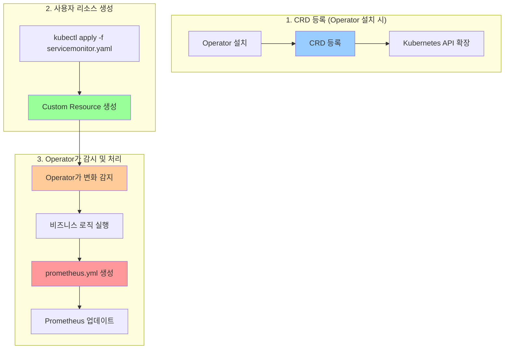
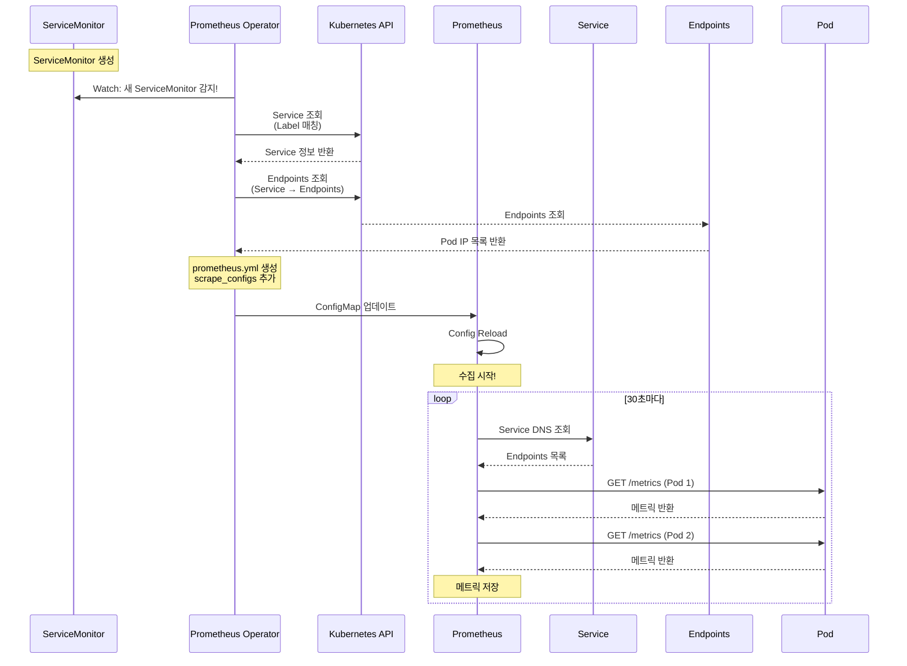
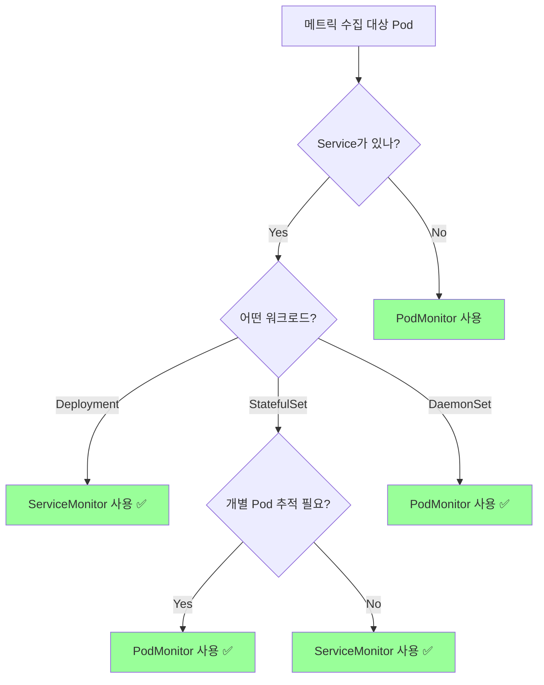

# ServiceMonitor & PodMonitor 완벽 가이드

## 📌 핵심 개념

> **ServiceMonitor와 PodMonitor는 Prometheus Operator가 제공하는 CRD로, 메트릭 수집 대상을 선언적으로 정의합니다.**

```
기본 질문:
"어떻게 메트릭을 수집할 것인가?"

Native 답변:
"prometheus.yml에 복잡한 relabel_configs 작성"

Operator 답변:
"ServiceMonitor 또는 PodMonitor 리소스 생성"
```

## 🎯 CRD (Custom Resource Definition) 이해

### CRD란 무엇인가?

```
Kubernetes 기본 리소스:
┌─────────────────────────────────┐
│ - Pod                           │
│ - Service                       │
│ - Deployment                    │
│ - ConfigMap                     │
│ - Secret                        │
└─────────────────────────────────┘

사용자 정의 리소스 (CRD):
┌─────────────────────────────────┐
│ - ServiceMonitor    ← Prometheus Operator │
│ - PodMonitor        ← Prometheus Operator │
│ - Probe             ← Prometheus Operator │
│ - PrometheusRule    ← Prometheus Operator │
│ - Prometheus        ← Prometheus Operator │
└─────────────────────────────────┘

CRD = "새로운 리소스 타입 정의"
→ kubectl로 관리 가능
→ YAML로 선언 가능
→ GitOps 친화적
```

### CRD 작동 원리



### CRD 확인하기

```bash
# Prometheus Operator가 제공하는 CRD 목록
kubectl get crd | grep monitoring.coreos.com

# 출력:
# alertmanagerconfigs.monitoring.coreos.com
# alertmanagers.monitoring.coreos.com
# podmonitors.monitoring.coreos.com
# probes.monitoring.coreos.com
# prometheuses.monitoring.coreos.com
# prometheusrules.monitoring.coreos.com
# servicemonitors.monitoring.coreos.com
# thanosrulers.monitoring.coreos.com

# ServiceMonitor CRD 상세 정보
kubectl get crd servicemonitors.monitoring.coreos.com -o yaml
```

### CRD 정의 구조

```yaml
# ServiceMonitor CRD 정의 (일부 발췌)
apiVersion: apiextensions.k8s.io/v1
kind: CustomResourceDefinition
metadata:
  name: servicemonitors.monitoring.coreos.com
spec:
  group: monitoring.coreos.com
  names:
    kind: ServiceMonitor          # ← 리소스 타입 이름
    listKind: ServiceMonitorList
    plural: servicemonitors       # ← kubectl get servicemonitors
    singular: servicemonitor
  scope: Namespaced               # ← 네임스페이스별 격리
  versions:
  - name: v1
    schema:
      openAPIV3Schema:
        properties:
          spec:
            properties:
              selector:           # ← 어떤 Service 선택할지
                type: object
              endpoints:          # ← 어떤 포트에서 수집할지
                type: array
```

## 📊 ServiceMonitor 깊은 이해

### ServiceMonitor의 역할

```
┌─────────────────────────────────────────────┐
│ ServiceMonitor = "Service를 통한 메트릭 수집" │
├─────────────────────────────────────────────┤
│                                             │
│ 특징:                                       │
│ ✅ Service 기반 수집                        │
│ ✅ LoadBalancing 자동 적용                  │
│ ✅ Service Discovery 활용                   │
│ ✅ 프로덕션 환경 권장                       │
│                                             │
│ 작동 방식:                                  │
│ ServiceMonitor → Service → Endpoints        │
│                    ↓                        │
│                  Pod들                      │
└─────────────────────────────────────────────┘
```

### ServiceMonitor 전체 구조

```
┌──────────────────────────────────────────────┐
│          ServiceMonitor                      │
│  ┌────────────────────────────────────────┐  │
│  │ selector:                              │  │
│  │   matchLabels:                         │  │
│  │     app: mysql-exporter  ← 1. 매칭     │  │
│  └────────────────────────────────────────┘  │
└──────────────┬───────────────────────────────┘
               │ Label Selector로 찾기
               ↓
┌──────────────────────────────────────────────┐
│             Service                          │
│  ┌────────────────────────────────────────┐  │
│  │ metadata:                              │  │
│  │   labels:                              │  │
│  │     app: mysql-exporter  ← 2. 매칭됨!  │  │
│  │                                        │  │
│  │ spec:                                  │  │
│  │   selector:                            │  │
│  │     app: mysql-exporter  ← 3. Pod 선택 │  │
│  │   ports:                               │  │
│  │   - name: metrics                      │  │
│  │     port: 9104                         │  │
│  └────────────────────────────────────────┘  │
└──────────────┬───────────────────────────────┘
               │ Service Selector로 찾기
               ↓
┌──────────────────────────────────────────────┐
│         Pod 1 (mysql-exporter-abc)           │
│  labels: app=mysql-exporter                  │
│  :9104/metrics                               │
└──────────────────────────────────────────────┘
┌──────────────────────────────────────────────┐
│         Pod 2 (mysql-exporter-def)           │
│  labels: app=mysql-exporter                  │
│  :9104/metrics                               │
└──────────────────────────────────────────────┘

Prometheus는 Service의 모든 Endpoints 수집
→ Pod 2개 모두 자동으로 수집됨!
```

### ServiceMonitor 상세 필드

```yaml
apiVersion: monitoring.coreos.com/v1
kind: ServiceMonitor
metadata:
  name: mysql-exporter-monitor
  namespace: shopping-mall
  labels:
    prometheus: main              # Prometheus 선택자
    team: database                # 팀 식별용
spec:
  # ━━━━━━━━━━━━━━━━━━━━━━━━━━━━━━━━━━━━━━
  # 1. Service 선택 (가장 중요!)
  # ━━━━━━━━━━━━━━━━━━━━━━━━━━━━━━━━━━━━━━
  selector:
    matchLabels:
      app: mysql-exporter
    # 또는 복잡한 조건
    matchExpressions:
    - key: app
      operator: In
      values:
      - mysql-exporter
      - mysql-exporter-v2

  # ━━━━━━━━━━━━━━━━━━━━━━━━━━━━━━━━━━━━━━
  # 2. 네임스페이스 선택 (선택사항)
  # ━━━━━━━━━━━━━━━━━━━━━━━━━━━━━━━━━━━━━━
  namespaceSelector:
    matchNames:
    - shopping-mall
    - shopping-mall-prod
    # 또는 모든 네임스페이스
    # any: true

  # ━━━━━━━━━━━━━━━━━━━━━━━━━━━━━━━━━━━━━━
  # 3. Endpoint 설정 (수집 방식)
  # ━━━━━━━━━━━━━━━━━━━━━━━━━━━━━━━━━━━━━━
  endpoints:
  - port: metrics                 # Service의 포트 이름 (필수!)

    # 메트릭 경로 (기본값: /metrics)
    path: /metrics

    # 수집 주기
    interval: 30s

    # 스크랩 타임아웃
    scrapeTimeout: 10s

    # HTTP 스킴
    scheme: http                  # 또는 https

    # TLS 설정
    tlsConfig:
      insecureSkipVerify: true
      # 또는 CA 인증서
      ca:
        secret:
          name: tls-secret
          key: ca.crt

    # Bearer Token 인증
    bearerTokenFile: /var/run/secrets/kubernetes.io/serviceaccount/token

    # Basic Auth
    basicAuth:
      username:
        name: auth-secret
        key: username
      password:
        name: auth-secret
        key: password

    # 메트릭 재작성 (선택사항)
    metricRelabelings:
    - sourceLabels: [__name__]
      regex: 'mysql_(.+)'
      targetLabel: __name__
      replacement: 'db_${1}'

    # Label 추가/수정
    relabelings:
    - sourceLabels: [__meta_kubernetes_pod_name]
      targetLabel: pod
    - sourceLabels: [__meta_kubernetes_namespace]
      targetLabel: namespace

  # ━━━━━━━━━━━━━━━━━━━━━━━━━━━━━━━━━━━━━━
  # 4. Job Label (Prometheus에서 보이는 이름)
  # ━━━━━━━━━━━━━━━━━━━━━━━━━━━━━━━━━━━━━━
  jobLabel: app                   # Service의 app label을 job으로 사용

  # ━━━━━━━━━━━━━━━━━━━━━━━━━━━━━━━━━━━━━━
  # 5. Target Label (추가 Label)
  # ━━━━━━━━━━━━━━━━━━━━━━━━━━━━━━━━━━━━━━
  targetLabels:
  - environment                   # Service의 environment label 전파
  - version

  # ━━━━━━━━━━━━━━━━━━━━━━━━━━━━━━━━━━━━━━
  # 6. Sample Limit (메트릭 개수 제한)
  # ━━━━━━━━━━━━━━━━━━━━━━━━━━━━━━━━━━━━━━
  sampleLimit: 10000              # 초과 시 수집 중단

  # ━━━━━━━━━━━━━━━━━━━━━━━━━━━━━━━━━━━━━━
  # 7. Attach Metadata (Pod 메타데이터 추가)
  # ━━━━━━━━━━━━━━━━━━━━━━━━━━━━━━━━━━━━━━
  attachMetadata:
    node: true                    # Node 정보 추가
```

### ServiceMonitor 작동 흐름 상세



### ServiceMonitor 실전 예시

#### 예시 1: 기본 MySQL Exporter

```yaml
# ━━━━━━━━━━━━━━━━━━━━━━━━━━━━━━━━━━━━━━━━━
# 1. MySQL Exporter Deployment
# ━━━━━━━━━━━━━━━━━━━━━━━━━━━━━━━━━━━━━━━━━
apiVersion: apps/v1
kind: Deployment
metadata:
  name: mysql-exporter
  namespace: shopping-mall
spec:
  replicas: 1
  selector:
    matchLabels:
      app: mysql-exporter
  template:
    metadata:
      labels:
        app: mysql-exporter
        version: v1
    spec:
      containers:
      - name: mysql-exporter
        image: prom/mysqld-exporter:v0.14.0
        env:
        - name: DATA_SOURCE_NAME
          valueFrom:
            secretKeyRef:
              name: mysql-secret
              key: dsn
        ports:
        - containerPort: 9104
          name: metrics

---
# ━━━━━━━━━━━━━━━━━━━━━━━━━━━━━━━━━━━━━━━━━
# 2. Service
# ━━━━━━━━━━━━━━━━━━━━━━━━━━━━━━━━━━━━━━━━━
apiVersion: v1
kind: Service
metadata:
  name: mysql-exporter
  namespace: shopping-mall
  labels:
    app: mysql-exporter        # ⭐ ServiceMonitor가 찾을 Label
    component: database
spec:
  selector:
    app: mysql-exporter
  ports:
  - name: metrics              # ⭐ ServiceMonitor의 port와 매칭
    port: 9104
    targetPort: 9104

---
# ━━━━━━━━━━━━━━━━━━━━━━━━━━━━━━━━━━━━━━━━━
# 3. ServiceMonitor
# ━━━━━━━━━━━━━━━━━━━━━━━━━━━━━━━━━━━━━━━━━
apiVersion: monitoring.coreos.com/v1
kind: ServiceMonitor
metadata:
  name: mysql-exporter-monitor
  namespace: shopping-mall
  labels:
    prometheus: main
spec:
  selector:
    matchLabels:
      app: mysql-exporter
  endpoints:
  - port: metrics
    interval: 30s
```

#### 예시 2: Spring Boot Actuator (복잡한 설정)

```yaml
# ━━━━━━━━━━━━━━━━━━━━━━━━━━━━━━━━━━━━━━━━━
# Spring Boot 애플리케이션
# ━━━━━━━━━━━━━━━━━━━━━━━━━━━━━━━━━━━━━━━━━
apiVersion: v1
kind: Service
metadata:
  name: order-service
  namespace: shopping-mall
  labels:
    app: order-service
    environment: production
    version: v2.1.0
spec:
  selector:
    app: order-service
  ports:
  - name: http
    port: 8080
    targetPort: 8080

---
apiVersion: monitoring.coreos.com/v1
kind: ServiceMonitor
metadata:
  name: order-service-monitor
  namespace: shopping-mall
spec:
  selector:
    matchLabels:
      app: order-service
      environment: production   # 프로덕션만 모니터링

  endpoints:
  - port: http
    path: /actuator/prometheus  # Actuator 경로
    interval: 15s               # 15초마다 수집

    # 메트릭 필터링 (불필요한 메트릭 제거)
    metricRelabelings:
    - sourceLabels: [__name__]
      regex: 'jvm_classes_.*'   # JVM 클래스 메트릭 제거
      action: drop

    - sourceLabels: [__name__]
      regex: 'process_.*'       # Process 메트릭 제거
      action: drop

    # Label 추가
    relabelings:
    - sourceLabels: [__meta_kubernetes_pod_name]
      targetLabel: pod

    - sourceLabels: [__meta_kubernetes_pod_node_name]
      targetLabel: node

    - targetLabel: cluster
      replacement: 'production-cluster'

  # Service의 version label을 전파
  targetLabels:
  - version
  - environment
```

#### 예시 3: 여러 포트 모니터링

```yaml
# ━━━━━━━━━━━━━━━━━━━━━━━━━━━━━━━━━━━━━━━━━
# 한 Service에서 여러 포트 노출
# ━━━━━━━━━━━━━━━━━━━━━━━━━━━━━━━━━━━━━━━━━
apiVersion: v1
kind: Service
metadata:
  name: multi-port-service
  namespace: shopping-mall
  labels:
    app: payment-service
spec:
  selector:
    app: payment-service
  ports:
  - name: app-metrics         # 애플리케이션 메트릭
    port: 8080
  - name: jvm-metrics         # JVM 메트릭
    port: 8081
  - name: custom-metrics      # 커스텀 메트릭
    port: 8082

---
apiVersion: monitoring.coreos.com/v1
kind: ServiceMonitor
metadata:
  name: payment-service-monitor
  namespace: shopping-mall
spec:
  selector:
    matchLabels:
      app: payment-service

  endpoints:
  # 1. 애플리케이션 메트릭
  - port: app-metrics
    path: /metrics
    interval: 30s

  # 2. JVM 메트릭
  - port: jvm-metrics
    path: /metrics/jvm
    interval: 60s             # 덜 자주 수집

  # 3. 커스텀 메트릭
  - port: custom-metrics
    path: /custom
    interval: 30s
```

## 📦 PodMonitor 깊은 이해

### PodMonitor의 역할

```
┌──────────────────────────────────────────────┐
│ PodMonitor = "Pod를 직접 모니터링"            │
├──────────────────────────────────────────────┤
│                                              │
│ 특징:                                        │
│ ✅ Service 없이 Pod 직접 수집                │
│ ✅ DaemonSet 모니터링에 적합                 │
│ ✅ StatefulSet 개별 Pod 추적                 │
│ ✅ 테스트/개발 환경                          │
│                                              │
│ 작동 방식:                                   │
│ PodMonitor → Pod (직접)                      │
└──────────────────────────────────────────────┘
```

### PodMonitor vs ServiceMonitor 차이

```
ServiceMonitor:
┌────────────────────────────────────┐
│ ServiceMonitor                     │
│         ↓                          │
│     Service                        │
│         ↓                          │
│   Endpoints (자동)                 │
│         ↓                          │
│   Pod 1, Pod 2, Pod 3              │
└────────────────────────────────────┘

장점:
✅ Service LoadBalancing 활용
✅ Service Discovery 자동
✅ 프로덕션 환경 표준

단점:
❌ Service 생성 필수
❌ Endpoints 동기화 대기


PodMonitor:
┌────────────────────────────────────┐
│ PodMonitor                         │
│         ↓                          │
│   Pod 1, Pod 2, Pod 3 (직접)      │
└────────────────────────────────────┘

장점:
✅ Service 불필요
✅ Pod 개별 추적 (StatefulSet)
✅ 빠른 반영 (Endpoints 없음)

단점:
❌ LoadBalancing 없음
❌ Service Discovery 제한적
```

### PodMonitor 구조

```
┌──────────────────────────────────────────────┐
│          PodMonitor                          │
│  ┌────────────────────────────────────────┐  │
│  │ selector:                              │  │
│  │   matchLabels:                         │  │
│  │     app: node-exporter  ← 1. 매칭      │  │
│  └────────────────────────────────────────┘  │
└──────────────┬───────────────────────────────┘
               │ Label Selector로 Pod 직접 찾기
               ↓
┌──────────────────────────────────────────────┐
│         Pod 1 (node-exporter-abc)            │
│  labels: app=node-exporter                   │
│  :9100/metrics                               │
└──────────────────────────────────────────────┘
┌──────────────────────────────────────────────┐
│         Pod 2 (node-exporter-def)            │
│  labels: app=node-exporter                   │
│  :9100/metrics                               │
└──────────────────────────────────────────────┘
┌──────────────────────────────────────────────┐
│         Pod 3 (node-exporter-ghi)            │
│  labels: app=node-exporter                   │
│  :9100/metrics                               │
└──────────────────────────────────────────────┘

Prometheus는 각 Pod에 직접 접근
→ Service 없이도 수집 가능!
```

### PodMonitor 상세 필드

```yaml
apiVersion: monitoring.coreos.com/v1
kind: PodMonitor
metadata:
  name: node-exporter-monitor
  namespace: monitoring
spec:
  # ━━━━━━━━━━━━━━━━━━━━━━━━━━━━━━━━━━━━━━
  # 1. Pod 선택
  # ━━━━━━━━━━━━━━━━━━━━━━━━━━━━━━━━━━━━━━
  selector:
    matchLabels:
      app: node-exporter
    matchExpressions:
    - key: component
      operator: In
      values:
      - monitoring

  # ━━━━━━━━━━━━━━━━━━━━━━━━━━━━━━━━━━━━━━
  # 2. 네임스페이스 선택
  # ━━━━━━━━━━━━━━━━━━━━━━━━━━━━━━━━━━━━━━
  namespaceSelector:
    any: true                     # 모든 네임스페이스
    # 또는
    # matchNames:
    # - monitoring
    # - kube-system

  # ━━━━━━━━━━━━━━━━━━━━━━━━━━━━━━━━━━━━━━
  # 3. Pod Metrics Endpoints
  # ━━━━━━━━━━━━━━━━━━━━━━━━━━━━━━━━━━━━━━
  podMetricsEndpoints:
  - port: metrics                 # Pod의 포트 이름

    # 또는 포트 번호
    # targetPort: 9100

    path: /metrics
    interval: 30s
    scheme: http

    # Label 추가
    relabelings:
    - sourceLabels: [__meta_kubernetes_pod_name]
      targetLabel: pod

    - sourceLabels: [__meta_kubernetes_pod_node_name]
      targetLabel: node

    - sourceLabels: [__meta_kubernetes_pod_host_ip]
      targetLabel: host_ip

    # 메트릭 필터링
    metricRelabelings:
    - sourceLabels: [__name__]
      regex: 'go_.*'
      action: drop

  # ━━━━━━━━━━━━━━━━━━━━━━━━━━━━━━━━━━━━━━
  # 4. Job Label
  # ━━━━━━━━━━━━━━━━━━━━━━━━━━━━━━━━━━━━━━
  jobLabel: app

  # ━━━━━━━━━━━━━━━━━━━━━━━━━━━━━━━━━━━━━━
  # 5. Pod Target Labels
  # ━━━━━━━━━━━━━━━━━━━━━━━━━━━━━━━━━━━━━━
  podTargetLabels:
  - app
  - version
  - environment

  # ━━━━━━━━━━━━━━━━━━━━━━━━━━━━━━━━━━━━━━
  # 6. Sample Limit
  # ━━━━━━━━━━━━━━━━━━━━━━━━━━━━━━━━━━━━━━
  sampleLimit: 50000

  # ━━━━━━━━━━━━━━━━━━━━━━━━━━━━━━━━━━━━━━
  # 7. Attach Metadata
  # ━━━━━━━━━━━━━━━━━━━━━━━━━━━━━━━━━━━━━━
  attachMetadata:
    node: true
```

### PodMonitor 실전 예시

#### 예시 1: Node Exporter (DaemonSet)

```yaml
# ━━━━━━━━━━━━━━━━━━━━━━━━━━━━━━━━━━━━━━━━━
# Node Exporter DaemonSet
# ━━━━━━━━━━━━━━━━━━━━━━━━━━━━━━━━━━━━━━━━━
apiVersion: apps/v1
kind: DaemonSet
metadata:
  name: node-exporter
  namespace: monitoring
spec:
  selector:
    matchLabels:
      app: node-exporter
  template:
    metadata:
      labels:
        app: node-exporter
        component: monitoring
    spec:
      hostNetwork: true         # Host 네트워크 사용
      hostPID: true
      containers:
      - name: node-exporter
        image: prom/node-exporter:latest
        args:
        - '--path.procfs=/host/proc'
        - '--path.sysfs=/host/sys'
        - '--path.rootfs=/host/root'
        ports:
        - containerPort: 9100
          name: metrics
        volumeMounts:
        - name: proc
          mountPath: /host/proc
          readOnly: true
        - name: sys
          mountPath: /host/sys
          readOnly: true
        - name: root
          mountPath: /host/root
          readOnly: true
      volumes:
      - name: proc
        hostPath:
          path: /proc
      - name: sys
        hostPath:
          path: /sys
      - name: root
        hostPath:
          path: /

---
# ━━━━━━━━━━━━━━━━━━━━━━━━━━━━━━━━━━━━━━━━━
# PodMonitor (Service 없이 직접 수집)
# ━━━━━━━━━━━━━━━━━━━━━━━━━━━━━━━━━━━━━━━━━
apiVersion: monitoring.coreos.com/v1
kind: PodMonitor
metadata:
  name: node-exporter-monitor
  namespace: monitoring
spec:
  selector:
    matchLabels:
      app: node-exporter

  podMetricsEndpoints:
  - port: metrics
    interval: 30s

    # Node 이름을 label로 추가
    relabelings:
    - sourceLabels: [__meta_kubernetes_pod_node_name]
      targetLabel: instance

    - sourceLabels: [__meta_kubernetes_namespace]
      targetLabel: namespace
```

**왜 PodMonitor?**
- DaemonSet은 각 노드마다 1개 Pod
- Service로 묶으면 LoadBalancing되어 특정 노드만 수집될 수 있음
- PodMonitor로 각 노드의 Pod를 개별 수집

#### 예시 2: StatefulSet (개별 Pod 추적)

```yaml
# ━━━━━━━━━━━━━━━━━━━━━━━━━━━━━━━━━━━━━━━━━
# Redis StatefulSet
# ━━━━━━━━━━━━━━━━━━━━━━━━━━━━━━━━━━━━━━━━━
apiVersion: apps/v1
kind: StatefulSet
metadata:
  name: redis
  namespace: shopping-mall
spec:
  serviceName: redis
  replicas: 3
  selector:
    matchLabels:
      app: redis
  template:
    metadata:
      labels:
        app: redis
    spec:
      containers:
      - name: redis
        image: redis:7-alpine
        ports:
        - containerPort: 6379
          name: redis
      - name: redis-exporter
        image: oliver006/redis_exporter:latest
        ports:
        - containerPort: 9121
          name: metrics
        env:
        - name: REDIS_ADDR
          value: "localhost:6379"

---
# ━━━━━━━━━━━━━━━━━━━━━━━━━━━━━━━━━━━━━━━━━
# PodMonitor (각 Redis Pod 개별 추적)
# ━━━━━━━━━━━━━━━━━━━━━━━━━━━━━━━━━━━━━━━━━
apiVersion: monitoring.coreos.com/v1
kind: PodMonitor
metadata:
  name: redis-monitor
  namespace: shopping-mall
spec:
  selector:
    matchLabels:
      app: redis

  podMetricsEndpoints:
  - port: metrics
    interval: 30s

    relabelings:
    # StatefulSet Pod 이름 보존 (redis-0, redis-1, redis-2)
    - sourceLabels: [__meta_kubernetes_pod_name]
      targetLabel: pod

    # StatefulSet Index 추출 (0, 1, 2)
    - sourceLabels: [__meta_kubernetes_pod_name]
      regex: '.*-([0-9]+)$'
      targetLabel: statefulset_index
      replacement: '${1}'
```

**왜 PodMonitor?**
- StatefulSet의 각 Pod는 고유 ID (redis-0, redis-1, redis-2)
- 각 Pod를 개별적으로 추적하고 싶음 (Master/Replica 구분)
- Service로 묶으면 개별 Pod 식별 어려움

#### 예시 3: 테스트 환경 (임시 Pod)

```yaml
# ━━━━━━━━━━━━━━━━━━━━━━━━━━━━━━━━━━━━━━━━━
# 개발/테스트용 Pod (Service 없음)
# ━━━━━━━━━━━━━━━━━━━━━━━━━━━━━━━━━━━━━━━━━
apiVersion: v1
kind: Pod
metadata:
  name: test-app
  namespace: dev
  labels:
    app: test-app
    environment: development
spec:
  containers:
  - name: app
    image: my-test-app:latest
    ports:
    - containerPort: 8080
      name: http

---
# ━━━━━━━━━━━━━━━━━━━━━━━━━━━━━━━━━━━━━━━━━
# PodMonitor (빠르게 메트릭 확인)
# ━━━━━━━━━━━━━━━━━━━━━━━━━━━━━━━━━━━━━━━━━
apiVersion: monitoring.coreos.com/v1
kind: PodMonitor
metadata:
  name: dev-pod-monitor
  namespace: dev
spec:
  selector:
    matchLabels:
      environment: development

  podMetricsEndpoints:
  - port: http
    path: /metrics
    interval: 15s         # 개발 환경이라 자주 수집
```

## 🎯 ServiceMonitor vs PodMonitor 선택 가이드

### 선택 기준

```yaml
ServiceMonitor 사용:
  ✅ Deployment로 배포된 일반 애플리케이션
  ✅ Service가 이미 존재
  ✅ LoadBalancing 필요
  ✅ 프로덕션 환경
  ✅ Horizontal Pod Autoscaler 사용

  예시:
  - REST API 서버
  - 웹 애플리케이션
  - 마이크로서비스
  - Exporter (mysql-exporter, redis-exporter)

PodMonitor 사용:
  ✅ DaemonSet (각 노드마다 수집)
  ✅ StatefulSet (개별 Pod 추적)
  ✅ Service 없는 Pod
  ✅ 개발/테스트 환경
  ✅ Pod 개별 ID 중요

  예시:
  - node-exporter (DaemonSet)
  - kube-state-metrics
  - Redis Cluster (StatefulSet)
  - Kafka Broker (StatefulSet)
  - 임시 테스트 Pod
```

### 비교 테이블

| 항목 | ServiceMonitor | PodMonitor |
|------|---------------|-----------|
| **Service 필요** | 필수 | 불필요 |
| **Pod 개별 추적** | 어려움 | 쉬움 |
| **LoadBalancing** | 자동 적용 | 없음 |
| **설정 복잡도** | 낮음 (Service 기반) | 중간 (Pod 직접) |
| **프로덕션 적합** | ⭐⭐⭐⭐⭐ | ⭐⭐⭐ |
| **DaemonSet** | 부적합 | 적합 ⭐⭐⭐⭐⭐ |
| **StatefulSet** | 가능하지만 제한적 | 적합 ⭐⭐⭐⭐⭐ |
| **Deployment** | 적합 ⭐⭐⭐⭐⭐ | 가능 |
| **임시 Pod** | 부적합 | 적합 ⭐⭐⭐⭐⭐ |

### 실전 결정 흐름



## 🔧 트러블슈팅

### 문제 1: ServiceMonitor가 작동하지 않음

```bash
# 증상
kubectl get servicemonitor -n shopping-mall
# NAME                     AGE
# mysql-exporter-monitor   5m

# Prometheus Targets에 안 보임!
```

**체크리스트:**

```yaml
1. ServiceMonitor Label 확인:
   kubectl get servicemonitor mysql-exporter-monitor -n shopping-mall -o yaml

   # Prometheus가 이 ServiceMonitor를 선택하는지 확인
   metadata:
     labels:
       prometheus: main  # ← Prometheus의 serviceMonitorSelector와 매칭되는지

2. Service 존재 확인:
   kubectl get service mysql-exporter -n shopping-mall

   # Service Label이 ServiceMonitor selector와 매칭되는지
   metadata:
     labels:
       app: mysql-exporter  # ← ServiceMonitor의 selector와 일치?

3. Service Port 이름 확인:
   kubectl get service mysql-exporter -n shopping-mall -o yaml

   spec:
     ports:
     - name: metrics  # ← ServiceMonitor의 endpoints.port와 일치?

4. Prometheus Operator 로그 확인:
   kubectl logs -n monitoring deployment/prometheus-operator

   # "ServiceMonitor not selected" 메시지 확인

5. Prometheus ServiceMonitor Selector 확인:
   kubectl get prometheus -n monitoring -o yaml

   spec:
     serviceMonitorSelector:
       matchLabels:
         prometheus: main  # ← ServiceMonitor의 label과 일치?
```

### 문제 2: PodMonitor가 Pod를 못 찾음

```bash
# 증상
kubectl get podmonitor -n monitoring
# NAME                   AGE
# node-exporter-monitor  3m

# Targets에 안 보임!
```

**체크리스트:**

```yaml
1. Pod Label 확인:
   kubectl get pods -n monitoring --show-labels

   # Pod에 PodMonitor selector와 매칭되는 label이 있는지 확인
   app=node-exporter  # ← PodMonitor의 selector와 일치?

2. Pod 포트 이름 확인:
   kubectl get pod node-exporter-xxx -n monitoring -o yaml

   spec:
     containers:
     - name: node-exporter
       ports:
       - name: metrics  # ← PodMonitor의 port와 일치?
         containerPort: 9100

3. 네임스페이스 확인:
   # PodMonitor와 Pod가 같은 네임스페이스에 있는지
   # 또는 PodMonitor의 namespaceSelector 설정 확인

   spec:
     namespaceSelector:
       any: true  # 모든 네임스페이스
       # 또는
       matchNames:
       - monitoring

4. Prometheus PodMonitor Selector 확인:
   kubectl get prometheus -n monitoring -o yaml

   spec:
     podMonitorSelector: {}  # 비어있으면 모든 PodMonitor 선택
     # 또는
     podMonitorSelector:
       matchLabels:
         prometheus: main
```

### 문제 3: 메트릭은 수집되는데 Label이 없음

```bash
# 증상
# Prometheus에서 쿼리 시 pod, namespace label 없음
mysql_up  # pod, namespace label 없음!
```

**해결:**

```yaml
# ServiceMonitor에 relabelings 추가
apiVersion: monitoring.coreos.com/v1
kind: ServiceMonitor
metadata:
  name: mysql-exporter-monitor
spec:
  selector:
    matchLabels:
      app: mysql-exporter
  endpoints:
  - port: metrics
    interval: 30s

    # ⭐ Label 추가
    relabelings:
    - sourceLabels: [__meta_kubernetes_pod_name]
      targetLabel: pod

    - sourceLabels: [__meta_kubernetes_namespace]
      targetLabel: namespace

    - sourceLabels: [__meta_kubernetes_pod_node_name]
      targetLabel: node
```

### 문제 4: 메트릭 너무 많아서 Prometheus 과부하

```bash
# 증상
# Prometheus 메모리 사용량 급증
# Scrape 시간 초과
```

**해결:**

```yaml
# ServiceMonitor에 메트릭 필터링 추가
apiVersion: monitoring.coreos.com/v1
kind: ServiceMonitor
metadata:
  name: spring-boot-monitor
spec:
  selector:
    matchLabels:
      app: order-service
  endpoints:
  - port: http
    path: /actuator/prometheus

    # ⭐ 불필요한 메트릭 제거
    metricRelabelings:
    # JVM 클래스 메트릭 제거
    - sourceLabels: [__name__]
      regex: 'jvm_classes_.*'
      action: drop

    # Process 메트릭 제거
    - sourceLabels: [__name__]
      regex: 'process_.*'
      action: drop

    # Tomcat 상세 메트릭 제거
    - sourceLabels: [__name__]
      regex: 'tomcat_threads_.*'
      action: drop

    # ⭐ Sample 개수 제한
    sampleLimit: 10000  # 10,000개까지만 수집
```

## 📚 실전 패턴

### 패턴 1: 멀티 환경 모니터링

```yaml
# ━━━━━━━━━━━━━━━━━━━━━━━━━━━━━━━━━━━━━━━━━
# 프로덕션 환경
# ━━━━━━━━━━━━━━━━━━━━━━━━━━━━━━━━━━━━━━━━━
apiVersion: monitoring.coreos.com/v1
kind: ServiceMonitor
metadata:
  name: order-service-prod-monitor
  namespace: production
  labels:
    prometheus: production
spec:
  selector:
    matchLabels:
      app: order-service
      environment: production
  endpoints:
  - port: http
    path: /actuator/prometheus
    interval: 30s           # 프로덕션: 30초

---
# ━━━━━━━━━━━━━━━━━━━━━━━━━━━━━━━━━━━━━━━━━
# 개발 환경
# ━━━━━━━━━━━━━━━━━━━━━━━━━━━━━━━━━━━━━━━━━
apiVersion: monitoring.coreos.com/v1
kind: ServiceMonitor
metadata:
  name: order-service-dev-monitor
  namespace: development
  labels:
    prometheus: development
spec:
  selector:
    matchLabels:
      app: order-service
      environment: development
  endpoints:
  - port: http
    path: /actuator/prometheus
    interval: 60s           # 개발: 1분 (덜 중요)
```

### 패턴 2: 팀별 네임스페이스 격리

```yaml
# ━━━━━━━━━━━━━━━━━━━━━━━━━━━━━━━━━━━━━━━━━
# Team A의 ServiceMonitor
# ━━━━━━━━━━━━━━━━━━━━━━━━━━━━━━━━━━━━━━━━━
apiVersion: monitoring.coreos.com/v1
kind: ServiceMonitor
metadata:
  name: team-a-service-monitor
  namespace: team-a
  labels:
    team: a
    prometheus: shared
spec:
  selector:
    matchLabels:
      team: a
  endpoints:
  - port: metrics
    interval: 30s
    relabelings:
    - targetLabel: team
      replacement: 'team-a'

---
# ━━━━━━━━━━━━━━━━━━━━━━━━━━━━━━━━━━━━━━━━━
# Prometheus가 모든 팀의 ServiceMonitor 수집
# ━━━━━━━━━━━━━━━━━━━━━━━━━━━━━━━━━━━━━━━━━
apiVersion: monitoring.coreos.com/v1
kind: Prometheus
metadata:
  name: shared-prometheus
  namespace: monitoring
spec:
  serviceMonitorNamespaceSelector:
    matchLabels:
      monitoring: enabled

  serviceMonitorSelector:
    matchLabels:
      prometheus: shared
```

### 패턴 3: Canary 배포 모니터링

```yaml
# ━━━━━━━━━━━━━━━━━━━━━━━━━━━━━━━━━━━━━━━━━
# Stable 버전
# ━━━━━━━━━━━━━━━━━━━━━━━━━━━━━━━━━━━━━━━━━
apiVersion: v1
kind: Service
metadata:
  name: order-service-stable
  namespace: shopping-mall
  labels:
    app: order-service
    version: stable
spec:
  selector:
    app: order-service
    version: v1
  ports:
  - name: http
    port: 8080

---
# ━━━━━━━━━━━━━━━━━━━━━━━━━━━━━━━━━━━━━━━━━
# Canary 버전
# ━━━━━━━━━━━━━━━━━━━━━━━━━━━━━━━━━━━━━━━━━
apiVersion: v1
kind: Service
metadata:
  name: order-service-canary
  namespace: shopping-mall
  labels:
    app: order-service
    version: canary
spec:
  selector:
    app: order-service
    version: v2
  ports:
  - name: http
    port: 8080

---
# ━━━━━━━━━━━━━━━━━━━━━━━━━━━━━━━━━━━━━━━━━
# ServiceMonitor - 두 버전 모두 수집
# ━━━━━━━━━━━━━━━━━━━━━━━━━━━━━━━━━━━━━━━━━
apiVersion: monitoring.coreos.com/v1
kind: ServiceMonitor
metadata:
  name: order-service-monitor
  namespace: shopping-mall
spec:
  selector:
    matchLabels:
      app: order-service
    # version은 매칭 안 함 → 두 버전 모두 선택

  endpoints:
  - port: http
    path: /actuator/prometheus
    interval: 15s  # Canary 배포 중이라 자주 수집

  # Service의 version label을 전파
  targetLabels:
  - version

# PromQL 쿼리로 비교:
# rate(http_requests_total{version="stable"}[5m])
# rate(http_requests_total{version="canary"}[5m])
```

## 🔗 연관 문서

- [[12_Prometheus_Native_vs_Operator_완벽_비교|Native vs Operator 비교]]
- [[01-Exporter-개념|Exporter 개념]]
- [[09-모니터링-스택-설치-순서|설치 순서]]

## 💡 핵심 정리

```
1. CRD = Kubernetes API 확장
   - ServiceMonitor, PodMonitor는 CRD
   - kubectl로 관리 가능
   - Operator가 감시하고 처리

2. ServiceMonitor
   - Service 기반 수집
   - 프로덕션 환경 표준
   - LoadBalancing 자동
   - Deployment에 적합

3. PodMonitor
   - Pod 직접 수집
   - Service 불필요
   - DaemonSet, StatefulSet에 적합
   - 개별 Pod 추적 가능

4. 선택 기준
   - 일반 애플리케이션: ServiceMonitor
   - DaemonSet/StatefulSet: PodMonitor
   - 개발/테스트: PodMonitor (빠른 반영)

5. 트러블슈팅
   - Label 매칭 확인
   - Port 이름 확인
   - Prometheus Selector 확인
   - Operator 로그 확인
```

## 🚀 다음 단계

```
학습 로드맵:

1. ServiceMonitor 실습
   - MySQL Exporter 배포
   - ServiceMonitor 생성
   - Prometheus Targets 확인

2. PodMonitor 실습
   - Node Exporter DaemonSet
   - PodMonitor 생성
   - 각 노드별 메트릭 확인

3. 고급 기능
   - metricRelabelings로 필터링
   - relabelings로 label 추가
   - 멀티 환경 구성

4. 포트폴리오 적용
   - 쇼핑몰 프로젝트에 적용
   - ServiceMonitor 5-7개 생성
   - 실전 트러블슈팅 경험
```
