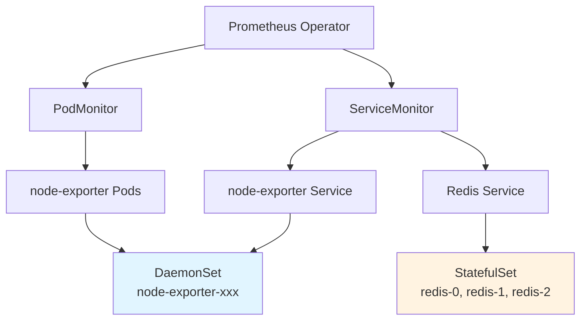

# DaemonSet & StatefulSet 빠른 복습 및 공식문서 연습

## 📌 이 문서의 목적

> **시험 전 10분 복습 + 공식문서 빠르게 찾는 연습**

## 🎯 핵심 개념 1분 정리

### DaemonSet vs StatefulSet 한눈에

```
DaemonSet (데몬셋)
├── 모든 노드에 1개씩
├── 노드 추가되면 자동 배포
├── 이름: random-hash
└── 용도: 노드별 모니터링/로깅

StatefulSet (스테이트풀셋)
├── 지정된 개수만큼
├── 순서대로 생성 (0, 1, 2...)
├── 이름: 고정 (web-0, web-1...)
└── 용도: 데이터베이스, 상태 유지
```

### 시각적 비교

```
[DaemonSet - node-exporter 예시]
Node1: [node-exporter-abc12]
Node2: [node-exporter-def34]  ← 각 노드마다 1개
Node3: [node-exporter-ghi56]

[StatefulSet - Redis 예시]
Node1: [redis-0]  ← Master (고정 이름)
Node2: [redis-1]  ← Slave 1
Node3: [redis-2]  ← Slave 2
```

## 🔗 ServiceMonitor/PodMonitor와의 연결

### 실무 시나리오



### 왜 연결되나?

```yaml
# Case 1: DaemonSet을 ServiceMonitor로 수집
apiVersion: monitoring.coreos.com/v1
kind: ServiceMonitor
metadata:
  name: node-exporter
spec:
  selector:
    matchLabels:
      app: node-exporter  # ← DaemonSet의 Service를 타겟
  endpoints:
  - port: metrics

---
# DaemonSet
apiVersion: apps/v1
kind: DaemonSet
metadata:
  name: node-exporter
spec:
  selector:
    matchLabels:
      app: node-exporter
  template:
    metadata:
      labels:
        app: node-exporter  # ← ServiceMonitor가 찾는 라벨
```

```yaml
# Case 2: StatefulSet을 ServiceMonitor로 수집
apiVersion: monitoring.coreos.com/v1
kind: ServiceMonitor
metadata:
  name: redis-monitor
spec:
  selector:
    matchLabels:
      app: redis  # ← StatefulSet의 Headless Service 타겟
  endpoints:
  - port: metrics

---
# StatefulSet
apiVersion: apps/v1
kind: StatefulSet
metadata:
  name: redis
spec:
  serviceName: redis  # ← Headless Service와 연결
  replicas: 3
  selector:
    matchLabels:
      app: redis
```

## 📚 공식문서 연습 - 단계별

### Level 1: 기본 탐색 (CKA 필수)

#### 연습 1: DaemonSet 기본 YAML 찾기
```
🎯 목표: DaemonSet 예제 YAML 5초 안에 찾기

공식 문서 경로:
https://kubernetes.io/docs/concepts/workloads/controllers/daemonset/

연습 방법:
1. kubernetes.io 접속
2. 검색창에 "DaemonSet" 입력
3. "Concepts > Workloads > Controllers" 섹션 찾기
4. 첫 번째 YAML 예제 복사

⏱️ 목표 시간: 30초
```

**찾아야 할 핵심 필드**:
```yaml
apiVersion: apps/v1
kind: DaemonSet
metadata:
  name: ???
spec:
  selector:
    matchLabels:
      ???
  template:
    ???
```

#### 연습 2: StatefulSet 예제 찾기
```
🎯 목표: StatefulSet serviceName 용도 이해

공식 문서 경로:
https://kubernetes.io/docs/concepts/workloads/controllers/statefulset/

찾아야 할 내용:
- serviceName 필드가 뭔지
- Headless Service와의 관계
- Pod 이름이 어떻게 생성되는지

⏱️ 목표 시간: 1분
```

**찾아야 할 핵심 정보**:
```yaml
apiVersion: apps/v1
kind: StatefulSet
spec:
  serviceName: "nginx"  # ← 이것이 뭐하는 건지 찾기
  replicas: 3
  # Pod 이름: nginx-0, nginx-1, nginx-2 (어디서 설명하는지 찾기)
```

---

### Level 2: 실전 시나리오 (실무/시험)

#### 시나리오 1: node-exporter DaemonSet 배포

**문제**:
```
모든 노드에서 메트릭을 수집하는 node-exporter를 DaemonSet으로 배포하세요.
- 이미지: prom/node-exporter:v1.6.0
- 포트: 9100
- hostNetwork: true 사용
- hostPID: true 사용

공식 문서에서 hostNetwork와 hostPID 설정 방법을 찾으세요.
```

**공식 문서 찾기 힌트**:
```
1. "DaemonSet" 페이지에서 Ctrl+F "hostNetwork"
2. 또는 "Pod" > "Pod Security" 섹션 검색
3. 예제 YAML 찾기

⏱️ 목표 시간: 2분
```

<details>
<summary>정답 YAML (클릭)</summary>

```yaml
apiVersion: apps/v1
kind: DaemonSet
metadata:
  name: node-exporter
  namespace: monitoring
spec:
  selector:
    matchLabels:
      app: node-exporter
  template:
    metadata:
      labels:
        app: node-exporter
    spec:
      hostNetwork: true  # ← 공식 문서에서 찾기
      hostPID: true      # ← 공식 문서에서 찾기
      containers:
      - name: node-exporter
        image: prom/node-exporter:v1.6.0
        ports:
        - containerPort: 9100
          hostPort: 9100
```

**공식 문서 위치**:
https://kubernetes.io/docs/concepts/workloads/controllers/daemonset/#create-a-daemonset
</details>

---

#### 시나리오 2: Redis StatefulSet 배포

**문제**:
```
3개의 Redis 인스턴스를 StatefulSet으로 배포하세요.
- 각 Pod는 10Gi PVC 필요
- Headless Service 필요
- Pod 순서대로 생성/삭제

공식 문서에서 volumeClaimTemplates 설정 방법을 찾으세요.
```

**공식 문서 찾기 힌트**:
```
1. "StatefulSet" 페이지 접속
2. "Stable Storage" 섹션 찾기
3. volumeClaimTemplates 예제 확인

⏱️ 목표 시간: 3분
```

<details>
<summary>정답 YAML (클릭)</summary>

```yaml
# Headless Service
apiVersion: v1
kind: Service
metadata:
  name: redis
spec:
  clusterIP: None  # ← Headless (공식 문서 확인)
  selector:
    app: redis
  ports:
  - port: 6379
    name: redis

---
# StatefulSet
apiVersion: apps/v1
kind: StatefulSet
metadata:
  name: redis
spec:
  serviceName: redis  # ← Headless Service 이름
  replicas: 3
  selector:
    matchLabels:
      app: redis
  template:
    metadata:
      labels:
        app: redis
    spec:
      containers:
      - name: redis
        image: redis:7.0
        ports:
        - containerPort: 6379
        volumeMounts:
        - name: data
          mountPath: /data
  volumeClaimTemplates:  # ← 공식 문서에서 찾기
  - metadata:
      name: data
    spec:
      accessModes: ["ReadWriteOnce"]
      resources:
        requests:
          storage: 10Gi
```

**공식 문서 위치**:
https://kubernetes.io/docs/concepts/workloads/controllers/statefulset/#stable-storage
</details>

---

### Level 3: ServiceMonitor 통합 (고급)

#### 시나리오 3: DaemonSet + ServiceMonitor

**문제**:
```
node-exporter DaemonSet의 메트릭을 Prometheus Operator로 수집하세요.
1. DaemonSet 배포
2. Service 생성 (DaemonSet Pod 선택)
3. ServiceMonitor 생성

공식 문서에서:
- DaemonSet에서 Service로 연결하는 방법
- Service의 selector가 DaemonSet Pod를 어떻게 찾는지
```

**공식 문서 찾기 경로**:
```
1. DaemonSet 페이지 → selector 섹션
2. Service 페이지 → selector 섹션
3. 둘의 연결 원리 이해

⏱️ 목표 시간: 5분
```

<details>
<summary>정답 통합 YAML (클릭)</summary>

```yaml
# 1. DaemonSet
apiVersion: apps/v1
kind: DaemonSet
metadata:
  name: node-exporter
  namespace: monitoring
spec:
  selector:
    matchLabels:
      app: node-exporter
  template:
    metadata:
      labels:
        app: node-exporter  # ← Service가 찾을 라벨
    spec:
      containers:
      - name: node-exporter
        image: prom/node-exporter:v1.6.0
        ports:
        - containerPort: 9100
          name: metrics

---
# 2. Service (DaemonSet Pod 선택)
apiVersion: v1
kind: Service
metadata:
  name: node-exporter
  namespace: monitoring
  labels:
    app: node-exporter  # ← ServiceMonitor가 찾을 라벨
spec:
  selector:
    app: node-exporter  # ← DaemonSet Pod 선택
  ports:
  - port: 9100
    targetPort: 9100
    name: metrics

---
# 3. ServiceMonitor
apiVersion: monitoring.coreos.com/v1
kind: ServiceMonitor
metadata:
  name: node-exporter
  namespace: monitoring
spec:
  selector:
    matchLabels:
      app: node-exporter  # ← Service 선택
  endpoints:
  - port: metrics
    interval: 30s
```

**라벨 연결 흐름**:
```
ServiceMonitor (app: node-exporter)
  ↓ 찾기
Service (labels: app: node-exporter)
  ↓ 선택 (selector: app: node-exporter)
DaemonSet Pods (labels: app: node-exporter)
```

**공식 문서 확인**:
- Service selector: https://kubernetes.io/docs/concepts/services-networking/service/#defining-a-service
- Label selector: https://kubernetes.io/docs/concepts/overview/working-with-objects/labels/
</details>

---

## 🎓 CKA/CKAD 시험 팁

### 빠른 YAML 생성

```bash
# DaemonSet 템플릿 생성 (--dry-run)
kubectl create deployment test --image=nginx --dry-run=client -o yaml > ds.yaml
# → 수동으로 kind를 DaemonSet으로 변경

# StatefulSet은 직접 작성 (템플릿 없음)
# 공식 문서에서 복사 추천
```

### 공식 문서 북마크 (시험장)

```
필수 북마크 5개:

1. DaemonSet 개념
   https://kubernetes.io/docs/concepts/workloads/controllers/daemonset/

2. StatefulSet 개념
   https://kubernetes.io/docs/concepts/workloads/controllers/statefulset/

3. Service 정의
   https://kubernetes.io/docs/concepts/services-networking/service/

4. Label과 Selector
   https://kubernetes.io/docs/concepts/overview/working-with-objects/labels/

5. PersistentVolumeClaim
   https://kubernetes.io/docs/concepts/storage/persistent-volumes/
```

### 시험 시간 분배

```
DaemonSet 문제 (5분):
├── 공식 문서 찾기 (1분)
├── YAML 복사/수정 (2분)
├── kubectl apply (1분)
└── 검증 (1분)

StatefulSet 문제 (8분):
├── 공식 문서 찾기 (2분)  # volumeClaimTemplates 찾기
├── YAML 작성 (4분)
├── kubectl apply (1분)
└── 검증 (1분)
```

## 🔍 검증 명령어 치트시트

### DaemonSet 검증

```bash
# 모든 노드에 배포됐는지 확인
kubectl get ds node-exporter -o wide

# 각 노드의 Pod 확인
kubectl get pods -l app=node-exporter -o wide

# 특정 노드의 Pod 확인
kubectl get pods --field-selector spec.nodeName=node1

# 로그 확인
kubectl logs -l app=node-exporter --tail=20
```

### StatefulSet 검증

```bash
# StatefulSet 상태 확인
kubectl get sts redis

# Pod 순서대로 생성됐는지 확인 (redis-0, redis-1, redis-2)
kubectl get pods -l app=redis

# PVC 자동 생성 확인
kubectl get pvc

# Pod 이름과 PVC 연결 확인
kubectl get pods -l app=redis -o jsonpath='{range .items[*]}{.metadata.name}{"\t"}{.spec.volumes[*].persistentVolumeClaim.claimName}{"\n"}{end}'

# Headless Service DNS 테스트
kubectl run -it --rm debug --image=busybox --restart=Never -- nslookup redis-0.redis
```

## 📊 자주 틀리는 실수

### 실수 1: DaemonSet에서 replicas 지정

```yaml
# ❌ 잘못된 예시
apiVersion: apps/v1
kind: DaemonSet
spec:
  replicas: 3  # ← DaemonSet에는 replicas 없음!
```

**이유**: DaemonSet은 노드 개수만큼 자동 생성

**공식 문서 확인**:
```
DaemonSet 페이지에서 Ctrl+F "replicas"
→ "A DaemonSet ensures that all (or some) Nodes run a copy of a Pod"
```

---

### 실수 2: StatefulSet의 serviceName 누락

```yaml
# ❌ 잘못된 예시
apiVersion: apps/v1
kind: StatefulSet
spec:
  # serviceName 없음!
  replicas: 3
```

**이유**: StatefulSet은 Headless Service 필요 (Pod DNS 생성용)

**공식 문서 확인**:
```
StatefulSet 페이지 → "Stable Network ID" 섹션
serviceName 필드 설명 확인
```

---

### 실수 3: Service selector와 Pod label 불일치

```yaml
# ❌ 잘못된 예시
# Service
spec:
  selector:
    app: node-exporter  # ← 이 라벨을 찾음

---
# DaemonSet
template:
  metadata:
    labels:
      name: node-exporter  # ← 다른 라벨! (app ≠ name)
```

**해결**:
```yaml
# ✅ 올바른 예시
# 둘 다 같은 라벨 사용
labels:
  app: node-exporter
```

## 🚀 5분 복습 체크리스트

```
□ DaemonSet은 모든 노드에 1개씩 (replicas 없음)
□ StatefulSet은 순서대로 생성 (web-0, web-1...)
□ StatefulSet은 serviceName 필수 (Headless Service)
□ volumeClaimTemplates = StatefulSet 전용 (PVC 자동 생성)
□ Service selector = Pod labels (매칭 필수)
□ ServiceMonitor selector = Service labels
□ hostNetwork: true = 호스트 네트워크 사용 (DaemonSet 흔함)
□ 공식 문서 북마크 5개 암기
```

## 🎯 실전 타이머 연습

### 3분 챌린지

```bash
# 타이머 시작!

# 1. node-exporter DaemonSet 배포 (1분)
kubectl create ???

# 2. Service 생성 (30초)
kubectl expose ???

# 3. 검증 (30초)
kubectl get ds,svc,pods

# 4. 공식 문서에서 hostNetwork 예제 찾기 (1분)
```

### 5분 챌린지

```bash
# 타이머 시작!

# 1. StatefulSet YAML 작성 (공식 문서 참조) (3분)
vi redis-sts.yaml

# 2. Headless Service 작성 (1분)
vi redis-svc.yaml

# 3. 배포 및 검증 (1분)
kubectl apply -f redis-svc.yaml,redis-sts.yaml
kubectl get sts,pvc,pods
```

## 🔗 연관 문서

- [[13_ServiceMonitor_PodMonitor_CRD_완벽_가이드]] - ServiceMonitor 상세 개념
- [[12_Prometheus_Native_vs_Operator_완벽_비교]] - Operator 패턴 이해
- [[모니터링/01-Exporter-개념-이해]] - Exporter와 DaemonSet 연결

## 💡 암기 팁

### DaemonSet 기억법
```
"데몬(daemon) = 백그라운드에서 계속 돌아가는 프로세스"
→ 모든 노드에서 계속 돌아감
→ node-exporter, log-collector
```

### StatefulSet 기억법
```
"State(상태) + ful(가득한) = 상태를 가진 애들"
→ 데이터베이스 (MySQL, Redis)
→ 순서 중요 (Master → Slave)
→ 이름 고정 (redis-0이 항상 Master)
```

### serviceName 기억법
```
"StatefulSet + serviceName = 세트"
→ 항상 같이 다님
→ 없으면 에러
```

## 📚 추가 연습 리소스

### 공식 튜토리얼

1. **DaemonSet 튜토리얼**
   https://kubernetes.io/docs/tasks/manage-daemon/update-daemon-set/

2. **StatefulSet 튜토리얼**
   https://kubernetes.io/docs/tutorials/stateful-application/basic-stateful-set/

3. **StatefulSet + MySQL 예제**
   https://kubernetes.io/docs/tasks/run-application/run-replicated-stateful-application/

### 실습 환경

```bash
# Minikube로 3노드 클러스터 (DaemonSet 연습)
minikube start --nodes 3

# DaemonSet 배포 확인
kubectl get ds -A
kubectl get pods -A -o wide | grep node-exporter

# StatefulSet 배포 연습
kubectl apply -f https://k8s.io/examples/application/web/web.yaml
kubectl get sts
kubectl get pvc
```

## 🎓 최종 점검

### 시험 전날 체크
```
□ DaemonSet YAML 5초 안에 작성 가능?
□ StatefulSet volumeClaimTemplates 암기?
□ Service와 Pod 라벨 연결 이해?
□ 공식 문서 북마크 설정 완료?
□ kubectl get/describe 명령어 숙지?
```

### D-Day 아침 복습
```
1. 이 문서 상단 "핵심 개념 1분 정리" 읽기
2. "자주 틀리는 실수" 3가지 복습
3. "검증 명령어 치트시트" 한 번 타이핑
4. 공식 문서 북마크 5개 확인
```

---

**문서 작성일**: 2025-12-10
**예상 복습 시간**: 10분
**공식 문서 연습 시간**: 20분
**총 소요 시간**: 30분

> 💡 **팁**: 이 문서를 PDF로 출력해서 시험장 입장 전 대기실에서 복습하세요!
