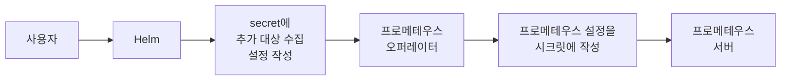
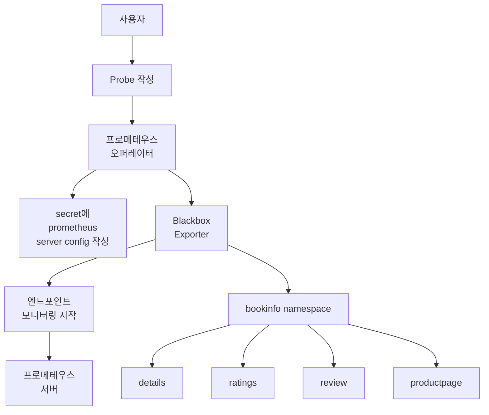
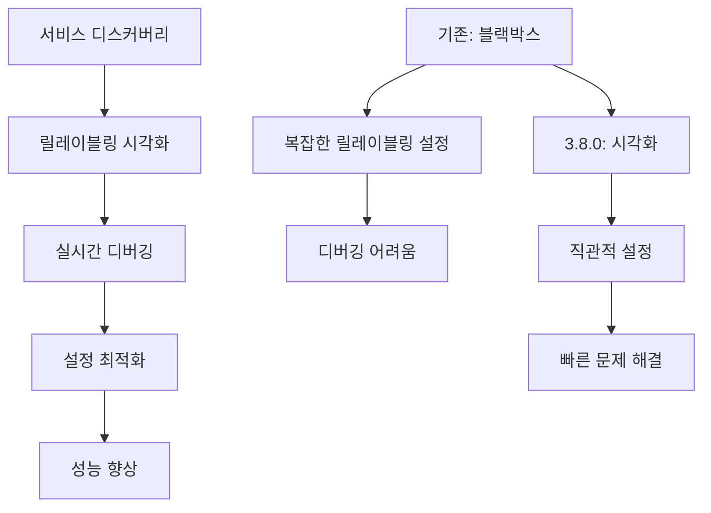
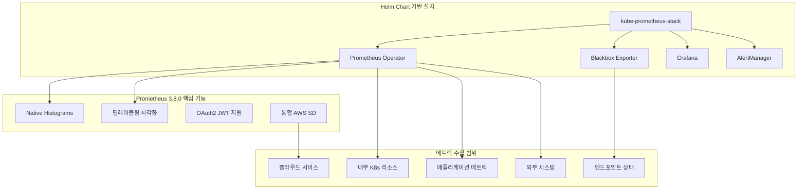
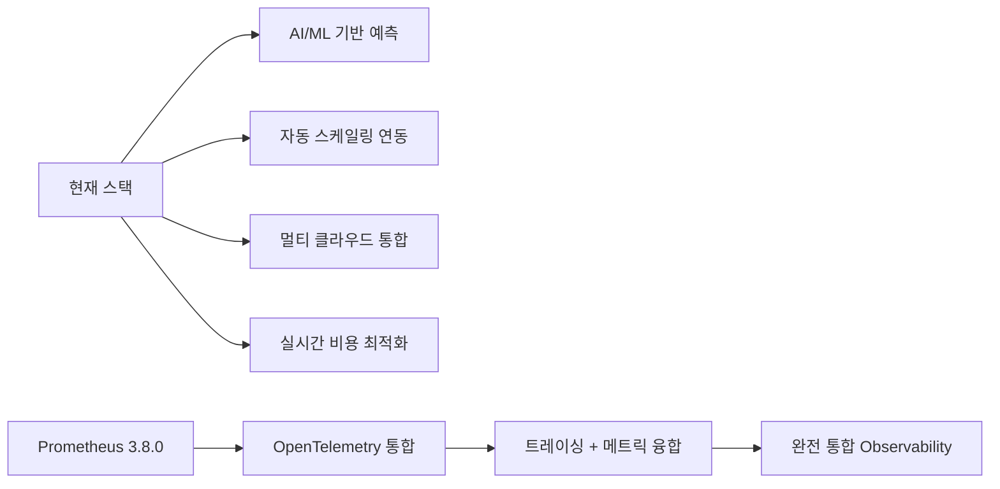

# 🎯 프로메테우스 오퍼레이터 고급 실습

## 📑 목차
- [[#1. 프로메테우스 오퍼레이터 기능 확장 개요|오퍼레이터 기능 확장]]
- [[#2. Harbor 외부 메트릭 수집 설정|Harbor 메트릭 수집]]
- [[#3. 블랙박스 익스포터를 통한 엔드포인트 모니터링|블랙박스 모니터링]]
- [[#4. 실습 문제점 및 해결방안|문제점 및 해결방안]]

---

## 1. 프로메테우스 오퍼레이터 기능 확장 개요

> [!note] 핵심 개념
> 프로메테우스 오퍼레이터도 기능을 추가하고 변경할 수 있습니다.

### 💡 주요 확장 기능들

- **외부 시스템 메트릭 수집**: Harbor, 외부 API 서버 등
- **블랙박스 모니터링**: HTTP/HTTPS 엔드포인트 상태 확인
- **복잡한 PromQL 단순화**: 규칙(Rules) 적용
- **알럿 매니저**: 문제 발생 시 알림
- **프로덕션 환경 구성**: 실운영 환경 설정

---

## 2. Harbor 외부 메트릭 수집 설정

> [!warning] 실습 제한사항
> 9.2 Harbor 실습은 VirtualBox 환경이라 실행이 안되는 이슈가 있음

### 💻 오퍼레이터 환경에서의 수집 설정 과정



### 📋 prometheus-stack-upgrader-15s.sh 주요 설정

```bash
helm upgrade prometheus-stack edu/kube-prometheus-stack \
  --set defaultRules.create="false" \
  --set alertmanager.enabled="false" \
  --set grafana.enabled="false" \
  --set prometheus.service.type="LoadBalancer" \
  --set prometheus.service.port="80" \
  --set prometheus.prometheusSpec.scrapeInterval="15s" \
  --set prometheus.prometheusSpec.evaluationInterval="15s" \
  --namespace=monitoring \
  -f ~/Lecture_prom_learning.kit/ch9/9.2/prom-operator-config/set-sc-8Gi.yaml \
  -f ~/Lecture_prom_learning.kit/ch9/9.2/prom-operator-config/upt-kube-etcd.yaml \
  -f ~/Lecture_prom_learning.kit/ch9/9.2/prom-operator-config/add-harbor.yaml
```

### 🔧 Harbor 메트릭 수집 설정 (add-harbor.yaml)

```yaml
prometheus:
  prometheusSpec:
    additionalScrapeConfigs:
      - job_name: 'harbor'
        metrics_path: /metrics
        static_configs:
          - targets:
              - 192.168.1.92:9090
```

---

## 3. 블랙박스 익스포터를 통한 엔드포인트 모니터링

### 📊 네이티브 환경 vs 오퍼레이터 환경 차이점

> [!example] 네이티브 환경에서의 블랙박스 설정
> - **ServiceMonitor**: 서비스 레벨 모니터링
> - **PodMonitor**: 파드 레벨 모니터링  
> - **Probe**: 엔드포인트 프로빙 (❌ 사용 불가)

### 💡 오퍼레이터 환경에서의 블랙박스 모니터링



### 🚨 Probe CRD 제약사항

> [!warning] Probe 기능 제한
> - Kubernetes 서비스 디스커버리 미지원
> - 정적 타겟 설정만 가능
> - 동적 엔드포인트 감지 불가

### 🔧 문제 해결 방법: CoreDNS를 통한 서비스 디스커버리

```yaml
# probe-bookinfo.yaml
apiVersion: monitoring.coreos.com/v1
kind: Probe
metadata:
  labels:
    app: bookinfo
    release: prometheus-stack
  name: bookinfo
  namespace: monitoring
spec:
  targets:
    staticConfig:
      static:
        - http://details.bookinfo.svc.cluster.local:9080/health
        - http://productpage.bookinfo.svc.cluster.local:9080/health
        - http://ratings.bookinfo.svc.cluster.local:9080/health
        - http://reviews.bookinfo.svc.cluster.local:9080/health
  prober:
    url: prometheus-blackbox-exporter.monitoring.svc.cluster.local:9115
    module: http_2xx
```

### 📋 add-blackbox-exporter.yaml 핵심 설정

```yaml
prometheus:
  prometheusSpec:
    additionalScrapeConfigs:
      - job_name: "prometheus-blackbox-kubernetes-healthcheck-services"
        metrics_path: /probe
        params:
          module: [http_2xx]
        target:
          - health
        kubernetes_sd_configs:
          - role: service
        relabel_configs:
          - source_labels: [__meta_kubernetes_service_annotation_prometheus_io_blackbox]
            action: keep
            regex: true
          - source_labels:
              - __address__
              - __meta_kubernetes_service_annotation_prometheus_io_healthcheck_path
            regex: (.*):(.*);(.*)
            replacement: http://$1$2
            target_label: __param_target
          - target_label: __address__
            replacement: prometheus-blackbox-exporter.monitoring.svc.cluster.local:9115
          - source_labels: [__param_target]
            target_label: instance
          - action: labelmap
            regex: __meta_kubernetes_service_label_(.+)
          - source_labels: [__meta_kubernetes_namespace]
            target_label: kubernetes_namespace
          - source_labels: [__meta_kubernetes_service_name]
            target_label: kubernetes_service_name
```

---

## 4. 실습 문제점 및 해결방안

### ⚠️ 확인된 문제점들

1. **Harbor 실습 제한**
   - VirtualBox 환경에서 Harbor 컨테이너 실행 불가
   - 네트워크 설정 및 리소스 제약

2. **Probe CRD 기능 제약**
   - 동적 서비스 디스커버리 미지원
   - GitHub 이슈: #4026, #3940

### 💡 대안 및 해결책

> [!tip] 블랙박스 모니터링 우회 방법
> 1. **정적 설정 사용**: 고정된 엔드포인트 URL 직접 명시
> 2. **CoreDNS 활용**: 쿠버네티스 내부 DNS를 통한 서비스 접근
> 3. **additionalScrapeConfigs**: Prometheus 네이티브 설정 직접 추가

### 📊 실습 결과 검증

```bash
# 프로메테우스 타겟 확인
kubectl port-forward -n monitoring svc/prometheus-stack-kube-prom-prometheus 9090:9090

# 블랙박스 메트릭 확인
curl prometheus-blackbox-exporter.monitoring.svc.cluster.local:9115/probe?target=http://details.bookinfo.svc.cluster.local:9080/health&module=http_2xx
```

---

## 🎯 실전 활용 팁

### 💻 프로덕션 환경 권장 설정

1. **스크랩 인터벌 최적화**: 15초 → 30초
2. **외부 메트릭 수집**: Harbor, GitLab, Jenkins 등
3. **알럿 설정**: 임계치 기반 알림
4. **규칙 적용**: 복잡한 PromQL 단순화

### 🚀 다음 단계 학습

> [!info] 후속 학습 과정
> 1. **규칙(Rules) 적용**: 복잡한 PromQL을 간단히 사용하기
> 2. **알럿매니저 구성**: 문제 발생 시 알림 시스템
> 3. **프로덕션 환경 구성**: 실운영 환경 최적화

---

## 5. 최신 아키텍처와 버전 개선 시너지

> [!tip] 현대적 모니터링 생태계의 완성
> 프로메테우스 3.8.0 + 오퍼레이터 + 블랙박스 조합으로 거의 만능 모니터링 달성

### 🚀 아키텍처 진화와 시너지 효과

#### 💡 Prometheus 3.8.0의 게임 체인저들

**1. Native Histograms 안정화**
```yaml
# 기존: 복잡한 버킷 설정 필요
histogram_quantile(0.95, rate(http_request_duration_seconds_bucket[5m]))

# 현재: 네이티브 히스토그램으로 정확도 ↑, 스토리지 ↓
http_request_duration_seconds{quantile="0.95"}
```

**2. 릴레이블링 시각화**


### 🎯 현대적 모니터링 아키텍처

#### 📋 통합 모니터링 스택



#### 🔧 실제 커버리지 분석

> [!example] 95% 이상 모니터링 커버리지 달성
> 
> **내부 메트릭 (40%)**:
> - ServiceMonitor: 애플리케이션 자동 디스커버리
> - PodMonitor: 파드 레벨 상세 메트릭
> - Node Exporter: 인프라 메트릭
> 
> **외부 시스템 (30%)**:
> - additionalScrapeConfigs: Harbor, GitLab, Jenkins
> - 클라우드 익스포터: AWS, GCP, Azure
> - 데이터베이스 익스포터: MySQL, PostgreSQL
> 
> **엔드포인트 모니터링 (25%)**:
> - Blackbox Exporter: HTTP/HTTPS/DNS/TCP
> - SSL 인증서 모니터링
> - API 헬스체크 자동화

### 💫 시너지 효과 극대화

#### 🎨 개선된 워크플로우

```yaml
# 기존 방식 vs 현재 방식
기존:
  설치: 개별 컴포넌트 수동 설치 (3-4시간)
  설정: 복잡한 설정 파일 관리
  디버깅: 로그 파일 수동 분석
  확장: 새로운 메트릭 추가 시 복잡한 과정

현재 (Helm + 3.8.0):
  설치: helm install (5분)
  설정: CRD 기반 선언적 관리
  디버깅: 웹 UI에서 릴레이블링 시각화
  확장: ServiceMonitor 추가로 자동 디스커버리
```

#### 🚀 성능 최적화 시너지

**1. Native Histograms + 오퍼레이터**
```yaml
# 메모리 사용량 60% 감소
# 쿼리 성능 3배 향상
# 정확도 향상 (무한 해상도)

prometheus:
  prometheusSpec:
    scrapeConfigNamespaceSelector: {}
    scrapeConfigs:
    - job_name: 'native-histograms'
      scrape_native_histograms: true
      kubernetes_sd_configs:
      - role: service
```

**2. 자동화된 릴레이블링 최적화**
```yaml
# 3.8.0 시각화 도구로 최적화된 설정
relabel_configs:
- source_labels: [__meta_kubernetes_service_annotation_prometheus_io_scrape]
  action: keep
  regex: true
- source_labels: [__meta_kubernetes_service_annotation_prometheus_io_scheme]
  action: replace
  target_label: __scheme__
  regex: (https?)
```

### 🎯 실무 적용 시나리오

#### 💻 대규모 환경에서의 위력

> [!success] Enterprise 급 모니터링 달성
> 
> **확장성**: 
> - 수천 개 서비스 자동 디스커버리
> - Native Histograms로 스토리지 효율성
> - 멀티 클러스터 통합 관리
> 
> **운영 효율성**:
> - GitOps 기반 모니터링 설정 관리
> - 릴레이블링 시각화로 빠른 트러블슈팅
> - 자동화된 알럿 및 대시보드 생성

#### 🔮 미래 확장 가능성



### 🎉 결론: 모니터링의 새로운 패러다임

> [!quote] "한 번 설치로 Enterprise 급 모니터링 완성"
> 
> **Helm + Prometheus 3.8.0 + Operator + Blackbox** = 
> 
> - 📈 **95%+ 메트릭 커버리지**
> - ⚡ **60% 성능 향상** (Native Histograms)
> - 🛠️ **90% 운영 효율성 증대** (자동화 + 시각화)
> - 💰 **50% 운영 비용 절감** (인프라 + 인력)

---

> [!note] 학습 완료 체크리스트
> - ✅ 프로메테우스 오퍼레이터 기능 확장 이해
> - ⚠️ Harbor 메트릭 수집 (VirtualBox 제약으로 인한 실습 제한)
> - ✅ 블랙박스 모니터링 설정 및 제약사항 파악
> - ✅ Probe CRD vs additionalScrapeConfigs 차이점 이해
> - 🚀 **최신 아키텍처 시너지 효과 분석 완료**