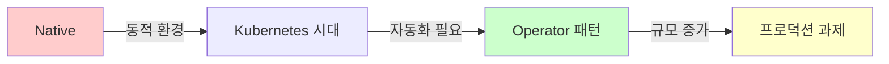

# Prometheus 발전 과정과 프로덕션 여정

> **"지금까지 배운 것을 돌아보며, 실제 프로덕션으로 가는 길을 생각해봅니다."**

---

## 📌 이 문서는

```yaml
목적:
  - 실습이 아닌 개념과 철학 이해
  - 왜 이렇게 발전했는지 되돌아보기
  - 프로덕션 환경의 현실적 고민들
  - 다음 단계(Grafana)로 가는 이유

대상:
  - 기초 실습을 마친 학습자
  - 프로덕션 적용을 고민하는 엔지니어
  - 아키텍처 전체 그림을 보고 싶은 분

참고:
  - 이 문서는 실습 가이드가 아닙니다
  - Thanos 설치 방법보다 "왜" 필요한지에 집중
  - 정답보다는 트레이드오프 이해
```

---

## 🔄 1. 되돌아보기: 왜 Operator로 발전했나?

### 여정을 돌아보며

우리가 지금까지 배운 것:
```
Native Prometheus (9.1~9.3)
  ↓
Prometheus Operator (9.4~9.5)
  ↓
프로덕션 고민 (9.6)
```

**근본적인 질문:**
> "왜 Native에서 Operator로 넘어갔을까?"

---

### Native Prometheus의 철학

```yaml
설계 철학:
  - 단순함 (Simplicity)
  - 한 가지를 잘하기 (Do one thing well)
  - 설정 파일 기반 (Configuration as Code)

강점:
  - 이해하기 쉬움
  - 디버깅이 명확함
  - 외부 의존성 최소

약점:
  - 쿠버네티스의 동적 특성과 충돌
  - 설정 변경 = 재시작
  - 중앙 집중식 관리 (병목)
```

**Native의 현실:**
```
개발자: "새 서비스 모니터링 추가해주세요"
    ↓
운영팀: prometheus.yml 수정
    ↓
ConfigMap 업데이트
    ↓
Prometheus 재시작 (또는 reload)
    ↓
검증
    ↓
완료 (30분~1시간 소요)
```

---

### Kubernetes Native의 의미

```yaml
쿠버네티스 철학:
  - 선언적 (Declarative)
  - 조정 루프 (Reconciliation Loop)
  - API 기반 확장

Operator 패턴의 등장:
  - "애플리케이션 운영 지식을 코드로"
  - CRD로 확장
  - 자동 조정
```

**Operator의 혁신:**
```
개발자: ServiceMonitor YAML 작성
    ↓
kubectl apply (10초)
    ↓
Operator가 자동 반영
    ↓
완료 (30초 이내)
```

---

### 왜 Operator가 승리했나?

```yaml
1. 쿠버네티스와의 일관성:
   - 모든 것이 YAML
   - kubectl로 관리
   - GitOps 친화적

2. 분산 관리:
   - 팀별로 자기 네임스페이스 관리
   - RBAC 활용
   - 셀프서비스 가능

3. 자동화:
   - 변경 즉시 반영
   - 재시작 불필요
   - 휴먼 에러 감소

4. 확장성:
   - ServiceMonitor, PodMonitor, Probe
   - PrometheusRule
   - 표준화된 패턴
```

**하지만 트레이드오프:**
```yaml
Operator의 대가:
  - 학습 곡선 증가 (CRD 개념)
  - 복잡도 증가
  - 디버깅 어려움 (추상화 레이어)
  - Operator 자체의 관리 필요
```

---

### 발전 과정 정리



**핵심 인사이트:**
> Operator는 "더 좋아서"가 아니라, **쿠버네티스 환경에 더 적합해서** 선택되었다.

---

## 🏭 2. 프로덕션의 현실적 과제들

### "실습과 프로덕션은 다르다"

```yaml
실습 환경:
  - Pod: 10~50개
  - 메트릭: 수천 개
  - 데이터 보존: 15일
  - 사용자: 1~2명
  - 트래픽: 낮음

프로덕션 환경:
  - Pod: 1,000~10,000개
  - 메트릭: 수백만 개
  - 데이터 보존: 1년+ (규정)
  - 사용자: 전체 조직
  - 트래픽: 높고 불규칙
```

---

### 과제 1: 규모의 문제 (Scale)

**메트릭 폭발:**
```promql
# Pod 100개 환경
container_cpu_usage_seconds_total
→ 약 400개 시계열 (Pod × 컨테이너 × 레이블)

# Pod 5,000개 환경
container_cpu_usage_seconds_total
→ 약 20,000개 시계열

# 초당 샘플:
20,000 시계열 × 15초 간격 = 초당 1,333 샘플
하루: 115,200,000 샘플
```

**Prometheus의 한계:**
```yaml
메모리:
  - 시계열당 약 1-3KB 메모리 사용
  - 100만 시계열 = 1~3GB 메모리 최소
  - 쿼리 시 추가 메모리 필요

스토리지:
  - 기본: 로컬 디스크
  - 문제: Pod 재시작 시 데이터 손실 위험
  - 대안: PersistentVolume (하지만 비용↑)

쿼리 성능:
  - 시계열 증가 → 쿼리 느려짐
  - 복잡한 PromQL → OOM 위험
```

---

### 과제 2: 데이터 보존 기간

**왜 장기 보존이 필요한가?**
```yaml
비즈니스 요구:
  - 월별 트렌드 분석
  - 연간 비교 (작년 대비)
  - 규정 준수 (금융권 등)

기술적 요구:
  - 용량 계획 (Capacity Planning)
  - 이상 탐지 베이스라인
  - 사후 분석 (Postmortem)
```

**Prometheus의 기본 설정:**
```yaml
retention.time: 15d  # 기본 15일

문제:
  - 15일 이후 데이터 삭제
  - 로컬 스토리지 의존
  - 장기 보존 = 스토리지 비용↑
```

**현실적 계산:**
```
1만 시계열 × 15초 간격 × 365일
= 약 200GB~500GB (압축 기준)

장기 보존 전략 필요!
```

---

### 과제 3: 고가용성 (High Availability)

**Single Point of Failure:**
```
Prometheus Pod 1대
    ↓
장애 발생
    ↓
모니터링 중단
    ↓
알람 안 옴
    ↓
진짜 장애 감지 못함 😱
```

**Replica는 해답이 아니다:**
```yaml
문제:
  - Prometheus Replica 2개 띄우기

결과:
  - 각각 독립적으로 수집
  - 데이터 미묘하게 다름 (수집 시점 차이)
  - 쿼리 시 어느 것을 봐야 하나?
  - 통합 쿼리 인터페이스 필요
```

---

### 과제 4: 멀티 클러스터

**현실:**
```yaml
회사 인프라:
  - Production 클러스터
  - Staging 클러스터
  - Dev 클러스터
  - Multi-Region (서울, 도쿄, 싱가포르)

각 클러스터마다 Prometheus
→ 통합 대시보드는 어떻게?
```

**Federation의 한계:**
```yaml
Prometheus Federation:
  - 중앙 Prometheus가 각 Prometheus에서 수집

문제:
  - 중앙 Prometheus 부하 증가
  - 모든 메트릭 복제 (비효율)
  - 장기 저장 문제 여전
```

---

### 프로덕션 과제 요약

```yaml
규모:
  ❌ 단일 Prometheus로 감당 안됨
  ✅ 샤딩 또는 분산 필요

장기 저장:
  ❌ 로컬 디스크 한계
  ✅ Object Storage (S3, GCS) 필요

고가용성:
  ❌ Replica만으론 부족
  ✅ 통합 쿼리 레이어 필요

멀티 클러스터:
  ❌ Federation 비효율
  ✅ 글로벌 뷰 필요
```

**결론:**
> "Prometheus는 훌륭하지만, **단독으로는** 프로덕션 규모를 감당하기 어렵다."

---

## 🏛️ 3. Thanos: 프로덕션의 해답?

### Thanos의 등장 배경

```yaml
2017년:
  - Prometheus 널리 사용
  - 규모 문제 본격화
  - Improbable사가 Thanos 개발
  - 2018년 오픈소스 공개
  - 2020년 CNCF 프로젝트

철학:
  "Prometheus를 교체하지 않고,
   그 위에 레이어를 추가한다"
```

**핵심 아이디어:**
```
Prometheus: 단기 저장 + 수집
     ↓
Thanos: 장기 저장 + 통합 쿼리
```

---

### Thanos 아키텍처 개념도

```
┌──────────────────────────────────────────────────────┐
│                    Grafana                           │
│               (시각화 레이어)                          │
└────────────────────┬─────────────────────────────────┘
                     │
                     ↓
┌──────────────────────────────────────────────────────┐
│              Thanos Query                            │
│           (통합 쿼리 인터페이스)                       │
└─────┬──────────┬──────────┬──────────────────────────┘
      │          │          │
      ↓          ↓          ↓
┌─────────┐ ┌─────────┐ ┌─────────┐
│Thanos   │ │Thanos   │ │Thanos   │
│Sidecar  │ │Sidecar  │ │Store    │
└────┬────┘ └────┬────┘ └────┬────┘
     │           │           │
     ↓           ↓           ↓
┌─────────┐ ┌─────────┐ ┌─────────┐
│Prom #1  │ │Prom #2  │ │S3/GCS   │
│(서울)   │ │(도쿄)   │ │(장기)   │
└─────────┘ └─────────┘ └─────────┘

                ↓
         ┌─────────────┐
         │Thanos       │
         │Compactor    │
         │(데이터 압축) │
         └─────────────┘
```

---

### 핵심 컴포넌트 이해

#### 1. Thanos Sidecar

```yaml
역할:
  - Prometheus Pod 옆에 붙는 사이드카
  - Prometheus 데이터를 Object Storage로 업로드
  - Thanos Query에게 실시간 데이터 제공

특징:
  - Prometheus 무변경
  - 자동 백업
  - StoreAPI 구현
```

**비유:**
> Prometheus가 "단기 메모리"라면,
> Sidecar는 "장기 기억을 저장하는 비서"

---

#### 2. Thanos Store Gateway

```yaml
역할:
  - Object Storage의 데이터를 쿼리 가능하게 제공
  - 장기 저장 데이터 접근

특징:
  - 캐싱으로 성능 최적화
  - 메타데이터만 메모리에
  - 실제 데이터는 S3/GCS에
```

---

#### 3. Thanos Query

```yaml
역할:
  - 통합 쿼리 인터페이스
  - 여러 Prometheus + Store를 하나처럼

특징:
  - PromQL 호환
  - 중복 제거 (Deduplication)
  - Grafana가 여기에 연결
```

**마법:**
```promql
# Thanos Query에서
up{cluster="seoul"}
  ↓
Thanos Query가 자동으로:
  - 서울 Prometheus Sidecar 조회
  - Store Gateway 조회
  - 결과 병합
  - 중복 제거
```

---

#### 4. Thanos Compactor

```yaml
역할:
  - Object Storage의 데이터 압축
  - 오래된 데이터 다운샘플링

예시:
  - 7일 이전: 5분 해상도
  - 30일 이전: 1시간 해상도
  - 1년 이전: 1일 해상도
```

**스토리지 절약:**
```
압축 전: 1TB
압축 후: 100GB (다운샘플링 포함)
```

---

#### 5. Thanos Ruler (선택)

```yaml
역할:
  - Recording/Alerting Rule을 분산 실행
  - Prometheus에서 Rule 오프로드

언제 필요한가:
  - Rule 평가가 Prometheus 부담될 때
  - 멀티 클러스터 통합 Alert
```

---

### Thanos의 장점

```yaml
1. 장기 저장:
   ✅ S3/GCS 활용 (저렴)
   ✅ 무제한 보존 가능
   ✅ Prometheus는 가볍게 유지

2. 고가용성:
   ✅ Prometheus Replica의 데이터 통합
   ✅ 한 쪽 죽어도 쿼리 가능
   ✅ 중복 제거 자동

3. 글로벌 뷰:
   ✅ 멀티 클러스터 통합
   ✅ 단일 쿼리 인터페이스
   ✅ 리전 간 비교 가능

4. 비용 효율:
   ✅ Object Storage (S3 Standard: $0.023/GB)
   ✅ PersistentVolume보다 저렴
   ✅ 다운샘플링으로 추가 절감

5. Prometheus 호환:
   ✅ PromQL 그대로 사용
   ✅ Grafana 연동 쉬움
   ✅ 기존 설정 유지
```

---

### Thanos의 단점과 트레이드오프

```yaml
복잡도 증가:
  - 컴포넌트 5개 이상
  - 각각 모니터링 필요
  - 디버깅 어려움

운영 부담:
  - Object Storage 관리
  - 네트워크 의존성
  - 백엔드 장애 시 쿼리 실패

쿼리 성능:
  - 네트워크 레이턴시
  - 대용량 쿼리 시 느림
  - S3 API 비용 (GET 요청당 과금)

초기 설정:
  - 학습 곡선
  - 헬름 차트 복잡
  - 트러블슈팅 어려움
```

**현실적 질문:**
```yaml
Q: "무조건 Thanos를 써야 하나?"
A: 아니오.

언제 필요한가:
  ✅ 멀티 클러스터 (3개 이상)
  ✅ 장기 보존 필수 (1년+)
  ✅ 대규모 (메트릭 100만+)
  ✅ 글로벌 서비스

언제 불필요한가:
  ❌ 단일 클러스터 소규모
  ❌ 15일 보존으로 충분
  ❌ 복잡도 감당 어려움
  ❌ 팀 리소스 부족
```

---

### 대안들

#### Cortex
```yaml
특징:
  - 멀티 테넌시 지원
  - 완전 분산 아키텍처
  - 수평 확장 용이

Thanos와 차이:
  - Prometheus 교체형
  - 더 복잡
  - SaaS 친화적
```

#### VictoriaMetrics
```yaml
특징:
  - 단일 바이너리 (간단!)
  - 압축률 우수
  - 빠른 쿼리

Thanos와 차이:
  - Prometheus 호환 (일부 제한)
  - 러시아 회사 (일부 우려)
  - 커뮤니티 작음
```

#### Grafana Mimir
```yaml
특징:
  - Cortex 포크
  - Grafana Labs 지원
  - 클라우드 네이티브

Thanos와 차이:
  - 최신 (2022년)
  - 더 적극적 개발
  - Grafana 생태계
```

---

### 선택 가이드

```yaml
Thanos:
  ✅ 기존 Prometheus 유지
  ✅ 안정성 검증됨 (5년+)
  ✅ CNCF Graduated
  ❌ 복잡도 높음

VictoriaMetrics:
  ✅ 설치 쉬움
  ✅ 성능 우수
  ❌ 생태계 작음

Grafana Mimir:
  ✅ 최신 기술
  ✅ Grafana 통합
  ❌ 아직 덜 검증

결론:
  "정답은 없다. 상황에 맞게."
```

---

## 🌐 4. O11y 전체 그림에서 Prometheus

### Observability 3대 축 (재조명)

```yaml
Metrics (Prometheus):
  - What: 숫자로 표현 가능한 것
  - 언제: 시스템 상태, 추세 파악
  - 예시: CPU 80%, RPS 1000

Logs (Loki, ELK):
  - What: 이벤트 기록
  - 언제: 상세 분석, 디버깅
  - 예시: "User 123 login failed"

Traces (Jaeger, Tempo):
  - What: 요청 흐름 추적
  - 언제: 분산 시스템 병목 찾기
  - 예시: API → DB → Cache (각 200ms)
```

---

### "Metrics만으로는 부족하다"

**시나리오: API 응답 느림**

```yaml
Step 1 - Metrics로 감지:
  - Prometheus Alert: 응답시간 > 1초
  - Grafana 대시보드: P95 = 2.3초

  "느리긴 한데... 왜?"

Step 2 - Logs로 조사:
  - Loki 검색: "ERROR", "timeout"
  - 발견: DB connection pool exhausted

  "DB 연결 문제구나. 근데 어디서?"

Step 3 - Traces로 추적:
  - Jaeger: 요청 플로우 시각화
  - 발견: 특정 쿼리에서 5초 소요

  "이 쿼리 최적화 필요!"
```

**각각의 역할:**
```
Metrics: "무엇이" 문제인지
   ↓
Logs: "왜" 문제인지
   ↓
Traces: "어디서" 문제인지
```

---

### 통합 모니터링 스택

```
┌─────────────────────────────────────────────┐
│              Grafana                        │
│        (통합 시각화 레이어)                  │
└───┬──────────┬──────────┬──────────────────┘
    │          │          │
    ↓          ↓          ↓
┌────────┐ ┌────────┐ ┌────────┐
│Thanos  │ │Loki    │ │Tempo   │
│Query   │ │        │ │        │
└────────┘ └────────┘ └────────┘
    │          │          │
    ↓          ↓          ↓
  Metrics     Logs      Traces
```

---

### 언제 무엇을 봐야 하나?

```yaml
알람 울림 → Metrics (Prometheus):
  - "CPU 90%다!"
  - 대시보드로 빠른 확인
  - 영향 범위 파악

원인 분석 → Logs (Loki):
  - 에러 메시지 검색
  - 시간대별 로그 패턴
  - 상세 컨텍스트

성능 병목 → Traces (Tempo):
  - 요청 흐름 추적
  - 각 구간 소요 시간
  - 의존성 파악
```

---

### Prometheus의 위치

```yaml
Prometheus는:
  ✅ 첫 번째 경보 시스템
  ✅ 전체 시스템 상태 모니터
  ✅ 트렌드 분석 도구

하지만:
  ❌ 모든 것을 해결하지 못함
  ❌ 로그 대체 불가
  ❌ Trace 정보 없음
```

**전체 그림에서:**
> Prometheus는 **"감시탑"**이다.
> 문제를 빠르게 감지하고,
> 다른 도구들이 원인을 찾도록 신호를 보낸다.

---

### 실무 권장 스택

```yaml
스타트업/소규모:
  - Prometheus (Native)
  - Grafana
  - 로그는 kubectl logs

중규모:
  - Prometheus Operator
  - Grafana
  - Loki (로그 통합)

대규모/엔터프라이즈:
  - Thanos/Mimir
  - Grafana
  - Loki
  - Tempo
  - OpenTelemetry
```

---

## 🎯 5. 다음 여정: 시각화와 통합

### "메트릭은 모았는데, 어떻게 보지?"

**현재 상태:**
```yaml
완료:
  ✅ Prometheus 설치
  ✅ Exporter 연결
  ✅ ServiceMonitor 작성
  ✅ 메트릭 수집 중

하지만:
  ❓ Prometheus UI는 개발자용
  ❓ 경영진/팀원에게 어떻게 보여주지?
  ❓ 대시보드는?
  ❓ 알람은?
```

---

### Grafana의 역할

```yaml
Grafana란:
  - 오픈소스 시각화 플랫폼
  - 다양한 데이터소스 지원
  - 강력한 대시보드 기능

왜 필요한가:
  - Prometheus UI 한계
  - 아름다운 시각화
  - 팀 협업 (공유, 권한)
  - 알람 통합
```

**Prometheus vs Grafana:**
```yaml
Prometheus:
  - 수집 & 저장
  - PromQL 쿼리
  - 간단한 그래프

Grafana:
  - 시각화 특화
  - 대시보드 구성
  - 다중 데이터소스
  - 알람 통합
  - 팀 협업
```

---

### Dashboarding의 중요성

```yaml
같은 메트릭, 다른 대시보드:

경영진 대시보드:
  - 전체 시스템 상태 (Red/Green)
  - 비즈니스 메트릭 (매출, 사용자)
  - 가용성 %
  - 단순, 큰 숫자

SRE 대시보드:
  - 4 Golden Signals
  - 리소스 사용률
  - P95, P99 latency
  - 상세, 많은 그래프

개발 대시보드:
  - 특정 서비스 메트릭
  - API 엔드포인트별
  - 에러율
  - 매우 상세, 디버그 정보
```

---

### 알람의 두 얼굴

```yaml
Prometheus Alerting:
  - 규칙 기반
  - PromQL 활용
  - Alertmanager로 전송

Grafana Alerting:
  - 대시보드 기반
  - 시각적 설정
  - 다중 채널 (Slack, Email, PagerDuty)
  - Unified Alerting (최신)

실무에서는:
  - Prometheus: 인프라 레벨 Alert
  - Grafana: 비즈니스 레벨 Alert
  - 두 개 모두 사용
```

### 왜 Grafana로 가야 하나?

**질문:**
> "Prometheus UI로도 볼 수 있는데?"

**답변:**
```yaml
개인 학습:
  → Prometheus UI 충분

팀 협업:
  → Grafana 필수
  → 권한 관리
  → 대시보드 공유
  → 표준화

프로덕션:
  → Grafana 필수
  → 24/7 모니터링
  → 경영진 리포팅
  → On-call 알람
```

---


## 🎓 마무리: 끊임없는 고민

### 기술 선택의 철학

```yaml
완벽한 해답은 없다:
  - Native vs Operator
  - Thanos vs Mimir vs VictoriaMetrics
  - 단기 vs 장기 저장
  - 복잡도 vs 기능

중요한 것은:
  1. 현재 요구사항 이해
  2. 미래 확장 가능성
  3. 팀 역량
  4. 비용 vs 효과
  5. 유지보수 부담
```

---

### O11y의 본질

**되돌아가서 생각해보기:**

```yaml
왜 모니터링하는가?
  - 장애 빠른 감지
  - 근본 원인 파악
  - 예방적 조치
  - 비즈니스 인사이트

어떻게 달성하는가?
  - Metrics: 감시
  - Logs: 분석
  - Traces: 추적
  - 시각화: 소통
  - 알람: 행동

궁극적 목표:
  "더 나은 서비스"
```

---

