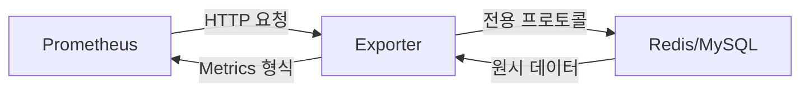

# Exporter 개념

## 📌 핵심 요약
Exporter는 Prometheus와 기존 애플리케이션 사이의 **통역사** 역할을 하는 컴포넌트입니다.

## 🔍 왜 Exporter가 필요한가?

### Prometheus의 언어 장벽
```
Prometheus 형식:
redis_up 1
mysql_global_status_queries 250

기존 애플리케이션 형식:
Redis: INFO 명령어 → 텍스트 덩어리
MySQL: SHOW GLOBAL STATUS → 테이블 형태
```

→ **서로 말이 안 통함!**

## 🔄 Exporter의 동작 방식



### 3단계 프로세스
1. **데이터 수집 (Scrape)**: Redis/MySQL 명령어로 정보 가져오기
2. **번역 (Translate)**: Prometheus Metric 형식으로 변환
3. **제공 (Expose)**: `/metrics` HTTP 엔드포인트로 노출

## 📦 배포 구조

### 일반적인 패턴
```yaml
# Redis 본체
redis:6379 (캐싱 작업)

# Redis Exporter (통역사)
redis-exporter:9121 (모니터링 데이터 제공)
```

### 느슨한 결합 (Loose Coupling)
- Redis 재시작 → Exporter 영향 없음
- Exporter 업그레이드 → Redis 영향 없음
- 모니터링 중단 → Exporter만 삭제

---

## 🔗 연관 문서

### 📚 이어서 읽기
```yaml
다음 단계:
  - [[02-Exporter-사용-시나리오]] - 언제 Exporter가 필요한가?
  - [[03-관측성-3대-축]] - Metrics의 역할
  - [[04-Prometheus-Blackbox-Exporter]] - 특수한 형태의 Exporter

기반 지식:
  - [[../01_프로메테우스_기초_개념_완벽_정리]] - 프로메테우스 기초
  - [[../02_모니터링_파이프라인_완벽_이해]] - 파이프라인 구조
```

## 💡 실무 팁
> Exporter는 "필요악"입니다. 최신 클라우드 네이티브 앱은 Prometheus를 기본 지원하지만, 레거시 시스템(MySQL, Redis 등)은 Exporter가 필수입니다.
