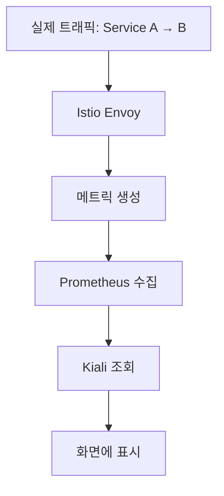

# 모니터링 스택 설치 순서

## 📌 핵심 원칙
> **외우지 말고 "레이어"로 이해하라**

## 🏗️ 레이어 구조

```
Layer 4: 관측 도구 (제일 위)
├── Kiali (시각화)
├── Grafana (대시보드)
└── Jaeger (추적)
         ↑ 데이터 가져옴

Layer 3: 메트릭 수집
└── Prometheus
    ├── Istio 메트릭 스크랩
    ├── Blackbox Exporter (외부 체크)
    └── 기타 Exporters
         ↑ 데이터 생성

Layer 2: 서비스 메시 (인프라)
└── Istio
    ├── Envoy Proxy (사이드카)
    ├── 트래픽 메트릭 자동 생성
    └── mTLS, 라우팅 등
         ↑ 통신 가로챔

Layer 1: 쿠버네티스 (기반)
└── Pods, Services, Deployments
```

**설치 원칙**: **아래에서 위로!** (기반 → 인프라 → 수집 → 시각화)

## 🔄 데이터 흐름



## 📦 Phase별 설치 가이드

### Phase 1: 기반 설치 (Istio)

#### 왜 먼저?
```
Istio가 없으면:
Service A → Service B (일반 HTTP, 메트릭 없음)

Istio 설치 후:
Service A → [Envoy Proxy] → [Envoy Proxy] → Service B
               ↓                  ↓
           메트릭 생성         메트릭 생성
```

Istio = **메트릭을 만들어내는 발전소**

#### 설치
```bash
# Istio 설치
istioctl install --set profile=demo -y
```

#### 확인
```bash
# Istio가 메트릭 생성하는지 확인
kubectl exec -it deploy/productpage-v1 -c istio-proxy -- \
  curl localhost:15090/stats/prometheus | grep istio_requests

# 출력 예시:
# istio_requests_total{...} 42
```

---
title: 모니터링 스택 설치 순서
aliases:
  - 09-모니터링-스택-설치-순서
category: K8s_Deep_Dive/프로메테우스/모니터링
status: 완성
priority: 높음

### Phase 2: 수집 설치 (Prometheus)

#### 왜 이제?
```
Istio가 만든 메트릭을 수집할 준비
수집할 데이터가 있으니까 이제 수집가 투입
```

#### 설치
```bash
# Monitoring 네임스페이스 생성
kubectl create namespace monitoring
kubectl label namespace monitoring istio-injection=disabled

# Prometheus 설치
helm install prometheus prometheus-community/prometheus \
  -n monitoring \
  -f prometheus-values.yaml
```

#### 설정 예시
```yaml
# prometheus-values.yaml
scrape_configs:
  # Istio 메트릭 수집
  - job_name: 'istio-mesh'
    kubernetes_sd_configs:
    - role: endpoints
    relabel_configs:
    - source_labels: [__meta_kubernetes_service_name]
      regex: istio-telemetry
      action: keep
```

#### 확인
```bash
# Port-forward
kubectl port-forward -n monitoring svc/prometheus 9090:9090

# 브라우저: http://localhost:9090
# Query: istio_requests_total
# → 데이터 나오면 성공
```

---
title: 모니터링 스택 설치 순서
aliases:
  - 09-모니터링-스택-설치-순서
category: K8s_Deep_Dive/프로메테우스/모니터링
status: 완성
priority: 높음

### Phase 3: 시각화 설치 (Kiali)

#### 왜 마지막?
```
Prometheus 데이터를 읽어서 그래프 그림
데이터 수집이 먼저 되고 있어야 함
```

#### 설치
```bash
# Kiali 설치
kubectl apply -f https://raw.githubusercontent.com/istio/istio/release-1.20/samples/addons/kiali.yaml
```

#### Kiali 설정
```yaml
spec:
  external_services:
    prometheus:
      url: "http://prometheus.monitoring:9090"
      # ↑ Prometheus에서 데이터 가져옴
```

#### 확인
```bash
# Kiali 접속
kubectl port-forward -n istio-system svc/kiali 20001:20001

# 브라우저: http://localhost:20001
# Graph 메뉴 → 서비스 간 화살표 보임
```

---
title: 모니터링 스택 설치 순서
aliases:
  - 09-모니터링-스택-설치-순서
category: K8s_Deep_Dive/프로메테우스/모니터링
status: 완성
priority: 높음

### Phase 4: 추가 모니터링 (Blackbox - 선택)

#### 왜 나중?
```
- Istio/Prometheus 없어도 동작은 함
- 하지만 Prometheus에 데이터 보내려면 Prometheus 필요
- 통합 모니터링 위해 나중에 추가
```

#### 언제 필요?
```
필수 아님:
- Istio 메트릭만으로도 서비스 간 통신 다 보임
- Kiali도 정상 동작

필요할 때:
- 외부 결제 API 체크
- 고객 접근 관점 체크
- SSL 인증서 만료 체크
```

#### 설치
```bash
kubectl apply -f blackbox-exporter.yaml -n monitoring
```

## 🎯 의존성 다이어그램

```
┌─────────────────────────────────────────┐
│         Kiali (시각화)                   │
│  "그래프 어떻게 그리지?"                  │
└──────────────┬──────────────────────────┘
               ↓ Prometheus API 호출
┌─────────────────────────────────────────┐
│       Prometheus (수집)                  │
│  "어디서 메트릭 가져올까?"                │
└──────┬──────────────────┬───────────────┘
       ↓                  ↓
┌──────────────┐   ┌──────────────┐
│ Istio Envoy  │   │  Blackbox    │
│ "메트릭 생성"│   │  "외부 체크" │
└──────────────┘   └──────────────┘
       ↓
┌──────────────────────────────────────────┐
│      Service A ↔ Service B               │
│         (실제 트래픽)                     │
└──────────────────────────────────────────┘
```

## 🔧 ConfigMap 수정이 필요한 이유

### 왜 자동으로 안 잡히나?

```
Kubernetes는 알 수 있음:
- Pod 뜨면 자동 감지
- Service 생기면 자동 감지

하지만 Prometheus는 몰라:
- "이 Pod가 메트릭 제공하는지?"
- "어떤 엔드포인트로 접근해야 하는지?"
- "어떤 방식으로 수집해야 하는지?"

→ 명시적으로 알려줘야 함 (ConfigMap)
```

### ConfigMap 수정 예시
```yaml
# Prometheus ConfigMap
scrape_configs:
- job_name: 'kubernetes-pods'  # 기본
  # ...

- job_name: 'blackbox'  # ← 새로 추가
  metrics_path: /probe
  params:
    module: [http_2xx]
  static_configs:
  - targets:
    - https://example.com
```

## 🎨 실무 패턴 인식

### 패턴 1: 새 모니터링 대상 추가
```
Q: MySQL을 모니터링하고 싶어

체크리스트:
□ MySQL Exporter 설치 (메트릭 생성)
□ Prometheus ConfigMap 수정 (수집 설정)
□ Grafana 대시보드 추가 (시각화)

순서:
1. Exporter 먼저 (데이터 만드는 애)
2. Prometheus 설정 (수집하는 애)
3. 대시보드 (보는 애)
```

### 패턴 2: 외부 서비스 체크
```
Q: 결제 API 모니터링하고 싶어

체크리스트:
□ Istio ServiceEntry (외부 접근 허용)
□ Blackbox ConfigMap (체크 방식 정의)
□ Prometheus ConfigMap (타겟 추가)

순서:
1. ServiceEntry (나갈 수 있게)
2. Blackbox ConfigMap (어떻게 체크할지)
3. Prometheus ConfigMap (어디를 체크할지)
```

### 패턴 3: 새 네임스페이스 추가
```
Q: production 네임스페이스 만들었어

체크리스트:
□ 네임스페이스에 Istio 주입 설정
□ Prometheus가 해당 네임스페이스 스크랩하는지 확인

순서:
1. 네임스페이스 생성
2. Istio label 추가 (istio-injection=enabled)
3. Pod 재시작 (사이드카 주입)
4. Prometheus 자동 감지 (보통 자동)
```

## 🚀 빠른 시작 템플릿

### 전체 스택 설치 스크립트
```bash
#!/bin/bash
# install-monitoring-stack.sh

# 1. Istio
echo "Installing Istio..."
istioctl install --set profile=demo -y

# 2. Monitoring 네임스페이스
echo "Creating monitoring namespace..."
kubectl create namespace monitoring
kubectl label namespace monitoring istio-injection=disabled

# 3. Prometheus
echo "Installing Prometheus..."
helm install prometheus prometheus-community/prometheus \
  -n monitoring \
  -f prometheus-values.yaml

# 4. Kiali
echo "Installing Kiali..."
kubectl apply -f https://raw.githubusercontent.com/istio/istio/release-1.20/samples/addons/kiali.yaml

# 5. Grafana
echo "Installing Grafana..."
kubectl apply -f https://raw.githubusercontent.com/istio/istio/release-1.20/samples/addons/grafana.yaml

echo "Done! Access Kiali at http://localhost:20001"
echo "kubectl port-forward -n istio-system svc/kiali 20001:20001"
```

## 🏠 멘탈 모델: 집 짓기 비유

```
[집 짓기]
1. 기초 공사 (Kubernetes)
2. 골조 (Istio - 모든 방에 CCTV 설치)
3. 전기 배선 (Prometheus - CCTV 영상 수집)
4. 모니터 설치 (Kiali - 영상 보기)
5. 추가 CCTV (Blackbox - 현관문 체크)

[모니터링 스택]
1. Kubernetes (기반)
2. Istio (메트릭 생성)
3. Prometheus (메트릭 수집)
4. Kiali (시각화)
5. Blackbox (외부 체크)
```

## ✅ 설치 체크리스트

```
□ 1. Kubernetes 클러스터 있나?
     → 없으면 먼저 만들기

□ 2. Istio 설치했나?
     → istioctl install

□ 3. 앱 Pod에 사이드카 주입됐나?
     → kubectl get pod -o jsonpath='{.spec.containers[*].name}'
     → istio-proxy 있어야 함

□ 4. Prometheus 설치했나?
     → kubectl get svc -n monitoring

□ 5. Prometheus가 메트릭 수집하나?
     → Prometheus UI에서 istio_requests_total 쿼리

□ 6. Kiali 설치했나?
     → kubectl get svc -n istio-system kiali

□ 7. Kiali에서 그래프 보이나?
     → Graph 메뉴에서 확인

□ 8. 외부 체크 필요하나?
     → Yes: Blackbox 추가
     → No: 스킵
```

## 💡 점진적 이해 로드맵

```
처음 (1주):
"그냥 순서대로 따라 해" (템플릿 복붙)
→ 일단 동작하게 만들기

3개월 후:
"아, Istio가 메트릭 만들어주는구나"
→ 레이어 이해

6개월 후:
"Prometheus 설정 이렇게 바꾸면 되겠네"
→ 커스터마이징 가능

1년 후:
"이 구조가 왜 이렇게 설계됐는지 알겠어"
→ 아키텍처 이해
```

## 🔗 연관 개념
- [[08-Istio-모니터링-통합]] - Istio 관련 문제 해결
- [[03-관측성-3대-축]] - 전체 모니터링 그림
- [[04-Prometheus-Blackbox-Exporter]] - Blackbox 상세

## 📚 핵심 원칙
```
외워야 할 것 (거의 없음):
✅ 아래에서 위로 설치 (레이어 순서)

이해해야 할 것:
✅ 각 컴포넌트의 역할
   - Istio: 메트릭 생성
   - Prometheus: 메트릭 수집
   - Kiali: 메트릭 시각화
   - Blackbox: 외부 체크

✅ 데이터 흐름
   생성 → 수집 → 저장 → 시각화

✅ 의존성
   A가 B의 데이터를 쓰면, B를 먼저 설치
```

## 💼 실무 접근법
```
1. 템플릿 만들어서 재사용
2. 한 번에 하나씩 추가
3. 동작 확인하면서 진행
4. 문제 생기면 레이어별로 디버깅
```
