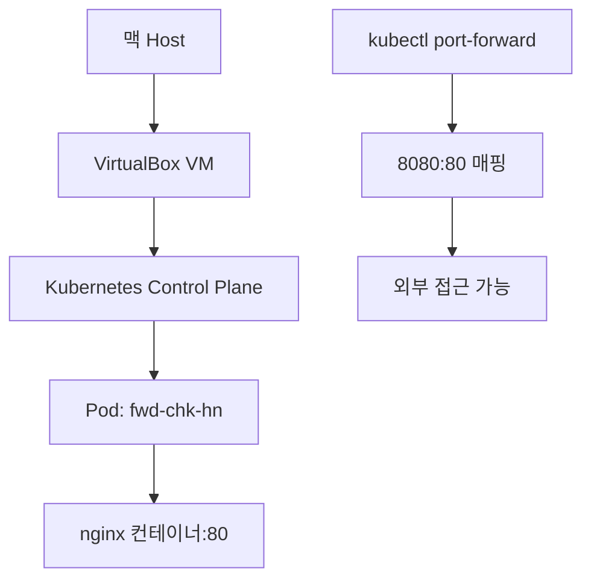

# Kubernetes Port Forward 실습 완전 가이드

## 📋 실습 개요

**목표**: Kubernetes Pod 생성 후 Port Forward를 통한 외부 접근  
**환경**: Vagrant + VirtualBox + Kubernetes (M2 Mac 8GB 최적화)  
**사용 이미지**: nginx:latest  
**날짜**: 2025-11-12

---

## 🏗️ 전체 아키텍처



### 물리적 구조
```
📱 맥북 (8GB 메모리)
├── 🖥️ macOS Host
├── 📦 VirtualBox Hypervisor
└── 🐧 Ubuntu VM (cp-k8s-1.30.1)
    ├── 🎯 Kubernetes Control Plane
    │   ├── API Server (포트 6443)
    │   ├── etcd (클러스터 상태 저장)
    │   ├── Controller Manager
    │   └── Scheduler
    ├── 🏃 kubelet (노드 에이전트)
    ├── 🐳 containerd (컨테이너 런타임)
    └── 📦 Pods
        └── fwd-chk-hn (nginx 컨테이너)
```

---

## 🔧 실습 단계별 과정

### 1단계: YAML 파일 생성

```yaml
# port-forward.yaml
apiVersion: v1
kind: Pod
metadata:
  name: fwd-chk-hn
  labels:
    app: nginx-test
spec:
  containers:
  - name: chk-hn
    image: nginx:latest
    ports:
    - containerPort: 80
      name: http
    resources:
      requests:
        memory: "64Mi"
        cpu: "250m"
      limits:
        memory: "128Mi"
        cpu: "500m"
---
apiVersion: v1
kind: Service
metadata:
  name: fwd-chk-hn-svc
spec:
  selector:
    app: nginx-test
  ports:
  - port: 80
    targetPort: 80
    protocol: TCP
  type: ClusterIP
```

### 2단계: Pod 배포

```bash
# VM 내부에서 실행
kubectl apply -f port-forward.yaml

# Pod 상태 확인
kubectl get po
```

**예상 결과:**
```
NAME         READY   STATUS    RESTARTS   AGE
fwd-chk-hn   1/1     Running   0          30s
```

### 3단계: Port Forward 설정

```bash
# 외부 접근 가능하게 Port Forward 실행
kubectl port-forward pod/fwd-chk-hn 8080:80 --address 0.0.0.0 &
```

**실행 결과:**
```
Forwarding from 0.0.0.0:8080 -> 80
```

### 4단계: 접속 테스트

**VM 내부에서:**
```bash
curl http://localhost:8080
```

**맥 Host에서:**
```bash
curl http://192.168.56.10:8080
```

---

## 🌐 네트워크 구성 및 데이터 흐름

### 네트워크 계층 구조

| 계층 | 구성 요소 | IP/포트 | 역할 |
|-----|----------|--------|-----|
| **Host** | 맥 OS | - | 최종 사용자 |
| **VM** | VirtualBox | 192.168.56.10:8080 | kubectl 실행 환경 |
| **Kubernetes** | API Server | 6443 | 클러스터 관리 |
| **Pod Network** | CNI | 10.244.x.x:80 | 컨테이너 간 통신 |
| **Container** | nginx | localhost:80 | 웹 서버 |

### 데이터 흐름 경로

**외부(맥)에서 접근 시:**
```
[맥 Host] curl 192.168.56.10:8080
    ↓ (VirtualBox Host-only Network)
[VM Network Interface] eth1: 192.168.56.10
    ↓ (VM 내부 라우팅)
[kubectl 프로세스] 0.0.0.0:8080 바인딩
    ↓ (Kubernetes API 터널링)
[Kubernetes API Server] 인증/인가 처리
    ↓ (kubelet 통신)
[kubelet] Pod 네트워크 접근
    ↓ (Container Network Interface)
[Pod Network] 10.244.x.x 네트워크
    ↓ (iptables/bridge)
[nginx 컨테이너] 포트 80에서 응답
    ↓ (역방향으로 응답 전달)
[맥 Host] HTML 응답 수신
```

---

## 🧠 핵심 원리 이해

### 1. Pod 생성 과정

1. **YAML 파싱**: kubectl이 YAML을 JSON으로 변환
2. **API 요청**: Kubernetes API Server에 Pod 생성 요청
3. **스케줄링**: Scheduler가 적절한 노드 선택
4. **컨테이너 생성**: kubelet이 containerd를 통해 nginx 컨테이너 실행
5. **네트워크 할당**: CNI가 Pod에 IP 주소 할당 (10.244.x.x)

### 2. Port Forward 동작 메커니즘

```bash
kubectl port-forward pod/fwd-chk-hn 8080:80 --address 0.0.0.0
```

| 구성 요소 | 역할 |
|----------|-----|
| `kubectl` | Kubernetes CLI 도구, API 서버와 통신 |
| `port-forward` | 로컬 포트와 Pod 포트 간 터널링 생성 |
| `pod/fwd-chk-hn` | 대상 Pod 지정 |
| `8080:80` | 로컬 8080 포트를 Pod의 80 포트로 매핑 |
| `--address 0.0.0.0` | 모든 네트워크 인터페이스에서 접근 허용 |

### 3. Kubernetes 네트워크 추상화

**Service vs Port Forward 비교:**

| 방법 | 용도 | 접근 범위 | 지속성 |
|-----|-----|----------|--------|
| **Port Forward** | 개발/디버깅 | kubectl 실행 중만 | 임시적 |
| **NodePort Service** | 외부 노출 | 클러스터 외부 | 영구적 |
| **ClusterIP Service** | 내부 통신 | 클러스터 내부만 | 영구적 |
| **LoadBalancer** | 프로덕션 | 인터넷 전체 | 영구적 |

---

## 🛠️ 트러블슈팅 가이드

### 자주 발생하는 문제들

1. **YAML 문법 오류**
   ```yaml
   # ❌ 잘못된 예시
   selector:
   app: nginx-test  # 들여쓰기 오류
   
   # ✅ 올바른 예시
   selector:
     app: nginx-test
   ```

2. **이미지 이름 오타**
   ```yaml
   # ❌ 오타
   image: nginx:latst
   
   # ✅ 정확
   image: nginx:latest
   ```

3. **Port Forward 외부 접근 불가**
   ```bash
   # ❌ 로컬만 접근
   kubectl port-forward pod/fwd-chk-hn 8080:80
   
   # ✅ 외부 접근 허용
   kubectl port-forward pod/fwd-chk-hn 8080:80 --address 0.0.0.0
   ```

### 유용한 디버깅 명령어

```bash
# Pod 상태 자세히 보기
kubectl describe pod fwd-chk-hn

# Pod 로그 확인
kubectl logs fwd-chk-hn

# 클러스터 이벤트 확인
kubectl get events --sort-by=.metadata.creationTimestamp

# 네트워크 상태 확인
ss -tlnp | grep 8080

# Port Forward 프로세스 확인
ps aux | grep port-forward

# Port Forward 종료
pkill -f port-forward
```

---

## 🎯 학습 포인트

### 1. 가상화와 컨테이너화의 계층 구조
- **VirtualBox**: 하드웨어 가상화 (메모리 1792MB 할당)
- **Kubernetes**: 컨테이너 오케스트레이션 (Pod 생명주기 관리)
- **containerd**: 컨테이너 런타임 (실제 컨테이너 실행)

### 2. 네트워킹의 추상화
- **물리적**: 맥의 실제 네트워크 인터페이스
- **가상화**: VirtualBox Host-only 네트워크 (192.168.56.x)
- **컨테이너**: Kubernetes Pod 네트워크 (10.244.x.x)

### 3. 개발자 도구의 편의성
- 복잡한 클러스터 환경을 간단한 `kubectl port-forward` 명령어로 접근
- YAML 선언형 구성으로 인프라를 코드로 관리
- 로컬 개발 환경에서도 프로덕션과 동일한 Kubernetes 환경 체험

---

## 📚 다음 학습 방향

1. **Service 타입별 실습**
   - NodePort Service 생성
   - LoadBalancer 구성
   - Ingress 컨트롤러 설정

2. **고급 네트워킹**
   - CNI 플러그인 이해
   - NetworkPolicy 설정
   - 멀티 클러스터 네트워킹

3. **모니터링 및 로깅**
   - Prometheus + Grafana
   - ELK Stack 구성
   - 분산 트레이싱

---

## 🔗 참고 자료

- [Kubernetes 공식 문서 - Port Forwarding](https://kubernetes.io/docs/tasks/access-application-cluster/port-forward-access-application-cluster/)
- [kubectl port-forward 상세 옵션](https://kubernetes.io/docs/reference/generated/kubectl/kubectl-commands#port-forward)
- [Kubernetes 네트워킹 개념](https://kubernetes.io/docs/concepts/services-networking/)
- [VirtualBox 네트워킹 가이드](https://www.virtualbox.org/manual/ch06.html)

---

**작성일**: 2025-11-12  
**환경**: Vagrant + VirtualBox + Kubernetes v1.30.1  
**태그**: #kubernetes #port-forward #vagrant #virtualbox #networking #실습