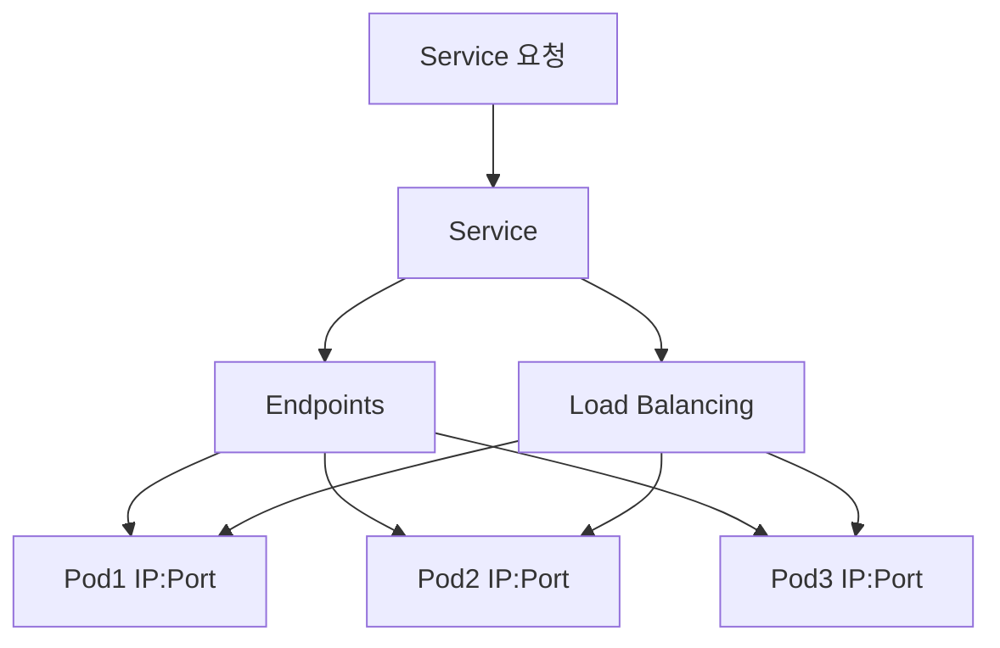
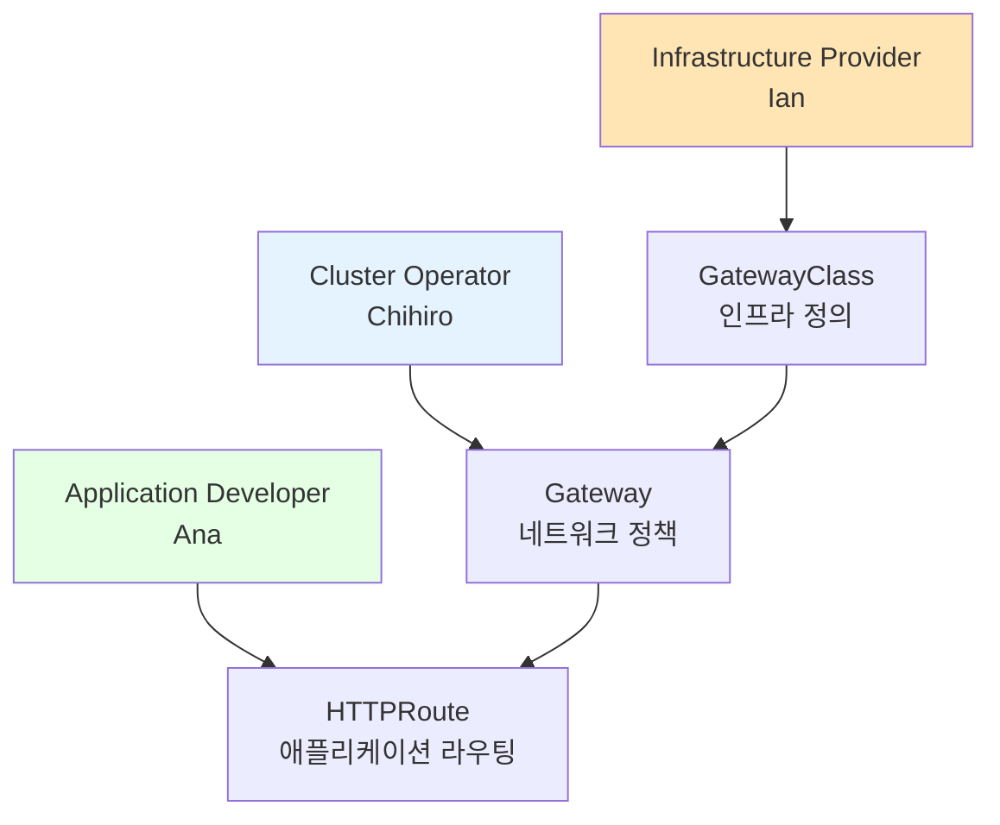
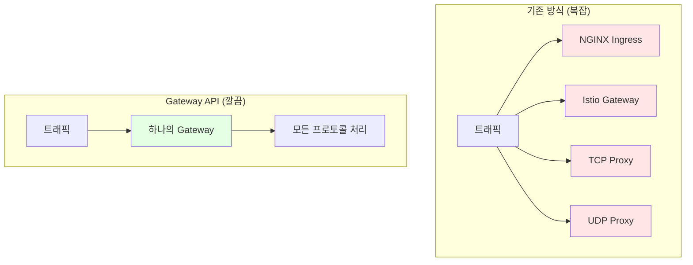

# Endpoints, Ingress, Gateway API

## 📋 목차
1. [Kubernetes 네트워킹 기초](#kubernetes-네트워킹-기초)
2. [Endpoints 심화 분석](#endpoints-심화-분석)  
3. [Ingress의 한계와 문제점](#ingress의-한계와-문제점)
4. [Gateway API: 차세대 네트워킹](#gateway-api-차세대-네트워킹)
5. [마이그레이션 전략](#마이그레이션-전략)
6. [실습 예제](#실습-예제)

---

## Kubernetes 네트워킹 기초

### Service와 Endpoints의 관계



**Service 생성 시 자동 동작:**
1. Service 생성
2. Endpoints Controller가 자동으로 Endpoints 생성
3. Pod 상태 변화 시 Endpoints 자동 업데이트
4. Service 호출 시 Endpoints 목록에서 로드밸런싱

---

## Endpoints 심화 분석

### Endpoints 구조와 동작

```yaml
apiVersion: v1
kind: Endpoints
metadata:
  name: my-service
subsets:
- addresses:
  - ip: 172.16.103.153
    targetRef:
      kind: Pod
      name: app-pod-1
  - ip: 172.16.103.154
    targetRef:
      kind: Pod
      name: app-pod-2
  notReadyAddresses:  # 준비되지 않은 Pod들
  - ip: 172.16.103.155
  ports:
  - name: http
    port: 80
    protocol: TCP
```

### Endpoints 상태 확인 명령어

```bash
# 전체 endpoints 조회
kubectl get endpoints

# 특정 endpoints 상세 정보
kubectl describe endpoints service-name

# endpoints 변화 실시간 모니터링
kubectl get endpoints -w
```

**주요 특징:**
- **동적 관리**: Pod 추가/삭제 시 자동 업데이트
- **헬스체크 연동**: Ready 상태 Pod만 포함
- **멀티포트 지원**: 여러 포트 동시 관리

---

## Ingress의 한계와 문제점

### 1. 표현력 부족

**문제점:**
```yaml
# Ingress - 복잡한 라우팅 표현 어려움
apiVersion: networking.k8s.io/v1
kind: Ingress
metadata:
  annotations:
    nginx.ingress.kubernetes.io/rewrite-target: /$2
    nginx.ingress.kubernetes.io/use-regex: "true"
spec:
  rules:
  - http:
      paths:
      - path: /api/v([0-9]+)/users/([a-zA-Z0-9]+)(/.*)?
        pathType: ImplementationSpecific  # 벤더 의존적
        backend:
          service:
            name: user-service
            port:
              number: 80
```

### 2. 벤더 종속성

**어노테이션 파편화:**
```yaml
# NGINX Ingress
nginx.ingress.kubernetes.io/rate-limit: "100"
nginx.ingress.kubernetes.io/ssl-redirect: "true"

# Traefik Ingress  
traefik.ingress.kubernetes.io/rule-type: PathPrefixStrip
traefik.ingress.kubernetes.io/frontend-entry-points: "http,https"

# Istio Ingress
kubernetes.io/ingress.class: "istio"
```

### 3. 프로토콜 제한

**지원 불가능한 시나리오:**
- TCP/UDP 로드밸런싱
- gRPC 전용 라우팅  
- WebSocket 연결 관리
- 멀티 프로토콜 게이트웨이

### 4. 역할 혼재 문제

```yaml
# 인프라 설정과 애플리케이션 라우팅이 섞임
kind: Ingress
metadata:
  annotations:
    # 인프라 관련
    kubernetes.io/ingress.class: "nginx"
    cert-manager.io/cluster-issuer: "letsencrypt"
    
    # 정책 관련
    nginx.ingress.kubernetes.io/rate-limit: "100"
    nginx.ingress.kubernetes.io/whitelist-source-range: "192.168.1.0/24"
    
    # 애플리케이션 관련
    nginx.ingress.kubernetes.io/rewrite-target: /api/v2/$2
spec:
  # 라우팅 규칙
  rules: [...]
```

---

## Gateway API: 차세대 네트워킹

### 핵심 설계 원칙

#### 1. 역할 기반 설계 (Role-Oriented Design)



#### 2. 표준화된 확장성

```yaml
# GatewayClass - Infrastructure Provider
apiVersion: gateway.networking.k8s.io/v1
kind: GatewayClass
metadata:
  name: nginx-gateway-class
spec:
  controllerName: nginx.org/gateway-controller
  parametersRef:  # 벤더별 확장 포인트
    group: nginx.org
    kind: NginxGatewayConfig
    name: nginx-config
  description: "Production-ready NGINX Gateway"
---
# Gateway - Cluster Operator  
apiVersion: gateway.networking.k8s.io/v1
kind: Gateway
metadata:
  name: production-gateway
  namespace: gateway-system
spec:
  gatewayClassName: nginx-gateway-class
  listeners:
  - name: http
    port: 80
    protocol: HTTP
    allowedRoutes:
      namespaces:
        from: All  # 네임스페이스 정책
  - name: https
    port: 443
    protocol: HTTPS
    tls:
      mode: Terminate
      certificateRefs:
      - name: wildcard-tls
    allowedRoutes:
      namespaces:
        from: Selector
        selector:
          matchLabels:
            gateway-access: allowed
---
# HTTPRoute - Application Developer
apiVersion: gateway.networking.k8s.io/v1
kind: HTTPRoute  
metadata:
  name: api-routes
  namespace: api-team
spec:
  parentRefs:
  - name: production-gateway
    namespace: gateway-system
  hostnames:
  - api.example.com
  rules:
  - matches:
    - path:
        type: PathPrefix
        value: /v1/
    - queryParams:
      - name: version
        value: stable
    filters:
    - type: RequestHeaderModifier
      requestHeaderModifier:
        set:
        - name: X-API-Version
          value: v1-stable
    backendRefs:
    - name: api-v1-service
      port: 80
      weight: 90
    - name: api-v1-canary-service  
      port: 80
      weight: 10  # 카나리 배포
```

#### 3. 다중 프로토콜 지원

```yaml
apiVersion: gateway.networking.k8s.io/v1
kind: Gateway
metadata:
  name: multi-protocol-gateway
spec:
  gatewayClassName: istio-gateway-class
  listeners:
  # HTTP/HTTPS
  - name: web
    port: 80
    protocol: HTTP
  - name: web-tls
    port: 443  
    protocol: HTTPS
  # TCP (데이터베이스)
  - name: postgres
    port: 5432
    protocol: TCP
    allowedRoutes:
      kinds:
      - kind: TCPRoute
  # UDP (DNS)
  - name: dns
    port: 53
    protocol: UDP
    allowedRoutes:
      kinds:
      - kind: UDPRoute
  # gRPC
  - name: grpc-api
    port: 9090
    protocol: HTTP
    allowedRoutes:
      kinds: 
      - kind: GRPCRoute
```

### Gateway API vs Ingress 비교

| 특성 | Ingress | Gateway API |
|------|---------|-------------|
| **역할 분리** | ❌ 모든 설정이 혼재 | ✅ 명확한 역할 분리 |
| **프로토콜** | HTTP/HTTPS만 | HTTP/HTTPS/TCP/UDP/gRPC |
| **표현력** | 제한적 | 풍부한 매칭/필터링 |
| **확장성** | 어노테이션 의존 | 표준화된 확장 포인트 |
| **벤더 중립** | 어노테이션 파편화 | 표준 API |
| **트래픽 분할** | 제한적 지원 | 네이티브 지원 |
| **정책 관리** | 어노테이션으로 | 전용 Policy 리소스 |

---

## Gateway API: 이제 선택이 아니라 필수가 되었습니다


> 🚨 **중요 뉴스 (2025년 11월)**: Kubernetes SIG Network에서 **Ingress NGINX Controller 은퇴를 발표**했습니다!
> 
> **타임라인:**
> - **2026년 3월까지**: 최소한의 유지보수만 제공
> - **2026년 3월 이후**: 더 이상 릴리스, 버그픽스, 보안 업데이트 없음
> 
> 즉, Gateway API 학습이 이제 **선택**이 아니라 **필수**가 되었습니다. 하지만 걱정하지 마세요. 언제 어떻게 전환해야 하는지 차근차근 알려드릴게요.

### 1. 여러 팀이 각자 다른 방식을 원할 때

**상황**: 회사에서 플랫폼팀을 하는데, 개발팀들이 각자 다른 Ingress Controller를 요구함

```yaml
# A팀: "우리는 NGINX만 써봐서..."
nginx.ingress.kubernetes.io/rate-limit: "1000"
nginx.ingress.kubernetes.io/ssl-redirect: "true"

# B팀: "Istio 서비스메시 써야 해요!"  
kubernetes.io/ingress.class: "istio"
# (설정 방식이 완전히 다름)

# C팀: "Traefik이 더 편한데..."
traefik.ingress.kubernetes.io/rule-type: PathPrefix
# (또 다른 방식...)

# 플랫폼팀: "어떻게 다 관리하라고..." 😭
```

**Gateway API 접근법:**
```yaml
# 플랫폼팀: "선택지는 드릴게요, 표준 방식으로"
apiVersion: gateway.networking.k8s.io/v1
kind: GatewayClass
metadata:
  name: nginx-option
spec:
  controllerName: nginx.org/gateway-controller
---
apiVersion: gateway.networking.k8s.io/v1  
kind: GatewayClass
metadata:
  name: istio-option
spec:
  controllerName: istio.io/gateway-controller
---
# 개발팀: "아, 선택만 하면 되는구나"
apiVersion: gateway.networking.k8s.io/v1
kind: Gateway
metadata:
  name: our-gateway
spec:
  gatewayClassName: nginx-option  # 표준화된 방식으로 선택
```

### 2. HTTP 말고 다른 프로토콜도 써야 할 때

**문제**: "웹사이트는 HTTPS, 모바일 앱은 gRPC, 내부 DB는 TCP로 연결하고 싶은데... Ingress로는 안 되네?"

```yaml
# Ingress의 한계: HTTP/HTTPS만 가능
# 결과적으로 여러 개의 LoadBalancer 필요
# LoadBalancer 1: 웹사이트용
# LoadBalancer 2: gRPC용  
# LoadBalancer 3: TCP용
# → 관리 복잡, 비용 증가
```

**Gateway API로 한 방에:**
```yaml
apiVersion: gateway.networking.k8s.io/v1
kind: Gateway
metadata:
  name: all-in-one-gateway
spec:
  gatewayClassName: multi-protocol-class
  listeners:
  - name: website
    port: 443
    protocol: HTTPS
    hostname: "myapp.com"
  - name: mobile-api
    port: 9090
    protocol: HTTP  # gRPC도 HTTP 기반
    allowedRoutes:
      kinds: [GRPCRoute]
  - name: database
    port: 5432
    protocol: TCP
```

### 3. 트래픽을 똑똑하게 나누고 싶을 때
![[Pasted image 20251114145846.png]]

**상황**: "VIP 고객은 빠른 서버로, 일반 고객은 보통 서버로 보내고 싶어요"

```yaml
# Ingress로는... 음... 복잡하고 어려움
```

**Gateway API로는 직관적:**
```yaml
apiVersion: gateway.networking.k8s.io/v1
kind: HTTPRoute
metadata:
  name: smart-routing
spec:
  rules:
  - matches:
    - headers:
      - name: X-Customer-Type
        value: VIP
    backendRefs:
    - name: premium-service  # 좋은 서버
      port: 80
      
  - matches:  # 나머지는
    - path:
        type: PathPrefix
        value: /
    backendRefs:
    - name: standard-service  # 보통 서버
      port: 80
      weight: 90
    - name: new-version-service  # 새 버전 테스트
      port: 80
      weight: 10
```

### 4. 회사가 커져서 관리가 복잡해질 때



### 5. 보안 정책을 일관되게 적용하고 싶을 때

**기존 방식**: 각 Controller마다 다른 설정
```yaml
# NGINX용 설정
nginx.ingress.kubernetes.io/rate-limit: "100"

# Traefik용 설정  
traefik.ingress.kubernetes.io/rate-limit: "100"

# Istio용은... 또 다른 방식...
```

**Gateway API**: 정책을 별도로 관리
```yaml
# 한 번 정의하면 여러 곳에 적용 가능
apiVersion: gateway.networking.k8s.io/v1alpha2
kind: RateLimitPolicy
metadata:
  name: standard-rate-limit
spec:
  targetRef:
    kind: Gateway
    name: production-gateway
  rateLimits:
  - limits: {requestsPerUnit: 100, unit: Minute}
```

---

> 💡 **Claude's 현실 조언**: 
> 
> **Ingress NGINX 은퇴 발표로 상황 완전 바뀜:**
> - ✅ **학습용**: 당분간은 Ingress로 공부해도 OK (개념 이해용)
> - ⚠️ **실제 운영**: 2026년 이후를 생각하면 Gateway API 필수
> - 🎯 **권장 전략**: 지금 Gateway API 기초 익히고, 천천히 전환 준비
> 
> 하지만 급하게 다 바꿀 필요는 없어요. 다른 Ingress Controller들(Traefik, Istio 등)도 있고, Gateway API 전환 도구(`ingress2gateway`)도 제공됩니다. 😊

---

## 실습 예제

### 1. 기본 Gateway 설정

```bash
# Gateway API 리소스 생성
cat <<EOF | kubectl apply -f -
apiVersion: gateway.networking.k8s.io/v1
kind: GatewayClass
metadata:
  name: example-gateway-class
spec:
  controllerName: example.com/gateway-controller
---
apiVersion: gateway.networking.k8s.io/v1
kind: Gateway
metadata:
  name: example-gateway
spec:
  gatewayClassName: example-gateway-class
  listeners:
  - name: http
    port: 80
    protocol: HTTP
---
apiVersion: gateway.networking.k8s.io/v1
kind: HTTPRoute
metadata:
  name: example-route
spec:
  parentRefs:
  - name: example-gateway
  rules:
  - matches:
    - path:
        type: PathPrefix
        value: /app
    backendRefs:
    - name: app-service
      port: 80
EOF
```

### 2. 상태 확인 명령어

```bash
# Gateway API 리소스 조회
kubectl get gatewayclasses
kubectl get gateways -A
kubectl get httproutes -A

# 상세 상태 확인
kubectl describe gateway example-gateway
kubectl describe httproute example-route

# 이벤트 모니터링
kubectl get events --sort-by=.metadata.creationTimestamp
```

### 3. 트러블슈팅 가이드

```bash
# Gateway 상태 확인
kubectl get gateway example-gateway -o yaml

# HTTPRoute 연결 상태 확인  
kubectl get httproute example-route -o yaml

# Controller 로그 확인
kubectl logs -n gateway-system deployment/gateway-controller

# 네트워크 정책 확인
kubectl get networkpolicies -A
```

---

## 🔑 핵심 요점

### Gateway API 전환 로드맵 (현실 버전)

> 🗓️ **2026년까지의 실전 계획**: 
>
> **지금~2025년 말 (학습 단계):**
> - Ingress 개념 익히기 (여전히 중요한 기초)
> - Gateway API 기본 개념 학습 시작
> - 토이 프로젝트는 Ingress 써도 OK
>
> **2026년 1-3월 (전환 준비):**
> - Gateway API 본격 학습
> - `ingress2gateway` 도구로 기존 설정 변환 테스트
> - 새 프로젝트는 Gateway API로 시작
>
> **2026년 3월 이후 (New World):**
> - Ingress NGINX 지원 종료
> - Gateway API가 사실상 표준

### 실전에서 봤던 전환 시점들

**Case 1: 스타트업 → 성장기**
```
처음: Ingress 하나로 웹사이트 서빙
6개월 후: 모바일 앱 추가 (gRPC 필요)  
1년 후: 팀 3개, 각자 다른 Controller 원함
→ Gateway API 검토 시작
```

**Case 2: 대기업 플랫폼팀**  
```
현재: 20개 팀, 각자 Ingress 관리
문제: 보안팀에서 "통일된 정책" 요구
해결: Gateway API로 정책 표준화
```

**Case 3: 금융/헬스케어**
```
요구사항: 웹 + 모바일 API + 내부 TCP
기존 방식: 3개 LoadBalancer 
문제: 비용, 관리 복잡성
해결: Gateway API 통합
```

### 현실적인 전환 시나리오

**🤔 실제로 일어날 일들:**

**Type A: 빠른 적응형 (20%)**
```
"Gateway API 배워보자!" 
→ 2025년부터 신규 프로젝트는 Gateway API 
→ 2026년 중반까지 완전 전환
```

**Type B: 안전 우선형 (60%)**  
```
"Ingress NGINX 대신 Traefik Ingress로 갈아타자"
→ 여전히 Ingress API 사용
→ Gateway API 학습은 하되 실제 적용은 천천히
→ 2027-2028년쯤 본격 전환
```

**Type C: 최대한 버티기형 (20%)**
```  
"우리는 Ingress가 직관적이야..."
→ Traefik, HAProxy, Kong Ingress로 계속 버티기
→ Ingress API 자체는 deprecated 안 됐으니까
→ 정말 어쩔 수 없을 때까지 미루기
```

### Ingress의 "직관성" vs Gateway API의 "복잡성"

**Ingress의 단순함:**
```yaml
# 한 눈에 들어오는 구조
apiVersion: networking.k8s.io/v1
kind: Ingress
spec:
  rules:
  - host: api.example.com
    http:
      paths:
      - path: /users
        pathType: Prefix
        backend:
          service: {name: user-service, port: {number: 80}}
```

**Gateway API의 단계별 구조:**
```yaml
# 1단계: GatewayClass (누가 처리할지)
# 2단계: Gateway (어떤 포트에서 들을지)  
# 3단계: HTTPRoute (어떻게 라우팅할지)
# → "이게 정말 더 나은 건가?" 싶을 수 있음
```


```
예시: Gateway API가 GatewayClass, Gateway, HTTPRoute 3계층인 이유

Q1: 왜 Ingress처럼 단일 리소스가 아닌가?
A1: 역할을 분리하기 위해

Q2: 왜 역할을 분리해야 하나?
A2: 인프라 팀과 개발 팀의 책임이 다르므로

Q3: 왜 책임을 나눠야 하나?
A3: 대규모 조직에서 권한 분리가 필요하므로

Q4: 왜 권한 분리가 중요한가?
A4: 보안(최소 권한 원칙), 효율성(병렬 작업)

Q5: 왜 단순한 Annotation 방식으로는 안 되나?
A5: Annotation은 표준화 불가능, RBAC 적용 어려움

→ 결론: 3계층 설계는 "대규모 조직의 운영 모델"을 반영
```

**현실 체크:**
- **Ingress API 자체**: 아직 deprecated 일정 없음
- **다른 Ingress Controller들**: 계속 지원 예정 (비즈니스니까)
- **대부분의 회사**: "돌아가는데 굳이...?"라는 보수적 관점

### 마이그레이션 도구와 대안들

```bash
# 1. 공식 변환 도구 (자동 변환)
ingress2gateway print --input-file=my-ingress.yaml

# 2. 다른 Ingress Controller로 갈아타기 (기존 방식 유지)
# Traefik Ingress
helm repo add traefik https://helm.traefik.io/traefik
helm install traefik traefik/traefik

# HAProxy Ingress  
helm repo add haproxy-ingress https://haproxy-ingress.github.io/charts
helm install haproxy-ingress haproxy-ingress/haproxy-ingress
```

### 당분간은 이런 선택지들

**📈 혁신파 (20%)**
```
"최신 기술 따라가자!"
→ Gateway API 학습 시작
→ 신규 프로젝트에 적용
→ 블로그에 후기 작성 ㅋㅋ
```

**🛡️ 안정파 (60%)**  
```
"일단 Traefik으로 갈아타고 보자"
→ 기존 Ingress 문법 그대로 유지
→ Gateway API는 "언젠가 해야지..." 
→ 2027-2028년경 여유롭게 전환
```

**😅 현실파 (20%)**
```
"Ingress NGINX 계속 쓰다가 문제 생기면 그때 생각하자"
→ 보안 취약점 나와도 "우리는 방화벽이 있어"
→ 정말 어쩔 수 없을 때까지 버티기
→ "레거시는 이래서..." 라며 후회
```

> 💭 **현실적 조언**: Gateway API가 "미래"인 건 맞지만, 당장 급하게 바꿀 필요는 없습니다. 특히 Ingress의 직관성을 포기하기 어렵다면, Traefik이나 다른 Controller로 갈아타는 것도 현명한 선택이에요. 다만 Gateway API 기초 정도는 알아두는 게 좋겠죠! 🤷‍♂️

---