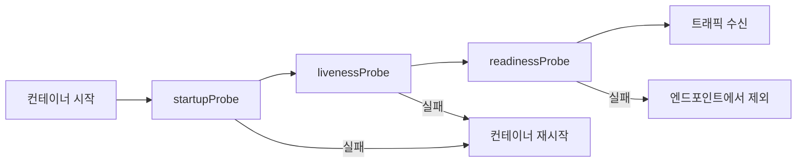

# 🚀 쿠버네티스 파드 고급 관리 기법

## 1. 파드 레이블 (Label)

### 핵심 개념
- **레이블**: 파드를 식별하고 분류하기 위한 **key-value 쌍**의 메타데이터
- **목적**: 파드 선택, 그룹화, 라우팅 등에 활용
- **노드 레이블과 동일한 개념**을 파드에 적용

### 기본 레이블 생성 패턴

#### kubectl run 명령어
```bash
kubectl run nginx-pod --image=nginx
```
**자동 생성 레이블**: `run=nginx-pod`

#### kubectl create 명령어
```bash
kubectl create deployment nginx-deploy --image=nginx
```
**자동 생성 레이블**: `app=nginx-deploy`

### 워커 노드별 레이블 전략 예시

```yaml
# GPU 전용 노드
워커 노드#1:
  gpupool: nvidia
  accelerator: tesla-a100
  
# GPU 변형 노드  
워커 노드#2:
  gpupool: nvidia
  accelerator: tesla-v100
  
# 고성능 디스크 노드
워커 노드#3:
  diskint: nvme
  inmemory: redis
```

### 레이블 관리 명령어

```bash
# 레이블 추가
kubectl label pod <pod-name> environment=production

# 레이블 조회
kubectl get pods --show-labels

# 레이블 선택자로 조회
kubectl get pods -l environment=production

# 레이블 삭제
kubectl label pod <pod-name> environment-
```

---

## 2. 정적(Static) 파드

### 정적 파드란?
- **Kubelet이 직접 관리**하는 파드
- **API 서버를 거치지 않고** 노드에서 직접 실행
- **시스템 핵심 컴포넌트** 구성에 사용

### 정적 파드 위치
```bash
/etc/kubernetes/manifests/
├── etcd.yaml                    # etcd 데이터베이스
├── kube-apiserver.yaml         # API 서버
├── kube-controller-manager.yaml # 컨트롤러 매니저
└── kube-scheduler.yaml         # 스케줄러
```

### 쿠버네티스 아키텍처별 배포 방식

#### 정적 파드로 구성 (마스터 노드)
- **API 서버** (kube-apiserver)
- **etcd** (분산 키-값 저장소)
- **컨트롤러 매니저** (kube-controller-manager)
- **스케줄러** (kube-scheduler)

#### DaemonSet으로 구성 (모든 노드)
- **CoreDNS** (클러스터 DNS)
- **kube-proxy** (네트워크 프록시)
- **CNI** (Container Network Interface - Calico 등)

#### 일반 서비스로 구성
- **kubelet** (systemd로 관리)

### 정적 파드 vs 일반 파드 비교

| 구분 | 정적 파드 | 일반 파드 |
|------|----------|----------|
| **관리 주체** | Kubelet | API 서버 + 스케줄러 |
| **배치 위치** | `/etc/kubernetes/manifests/` | API 서버를 통한 스케줄링 |
| **사용 목적** | 시스템 핵심 컴포넌트 | 일반 애플리케이션 워크로드 |
| **의존성** | 노드 로컬 | 클러스터 전체 |
| **가용성** | 노드와 함께 시작 | 스케줄러 결정 |

### 정적 파드 생성 예시

```yaml
# /etc/kubernetes/manifests/static-web.yaml
apiVersion: v1
kind: Pod
metadata:
  name: static-web
  labels:
    role: myrole
spec:
  containers:
  - name: web
    image: nginx
    ports:
    - name: web
      containerPort: 80
      protocol: TCP
```

---

## 3. 컨테이너 상태에 따른 동작 (restartPolicy)

### restartPolicy 정책 유형

| 정책 | 설명 | 사용 시나리오 |
|------|------|---------------|
| **Always** | 항상 재시작 (기본값) | 웹 서버, API 서버 등 **지속적 서비스** |
| **Never** | 절대 재시작하지 않음 | **배치 작업**, 일회성 작업 |
| **OnFailure** | 실패 시에만 재시작 | **작업 완료 후 종료**, 실패 시 재시도 |

### 동작 방식 세부사항

#### Always (기본값)
```yaml
spec:
  restartPolicy: Always
```
- **성공 종료 (exit code 0)**: 재시작
- **실패 종료 (exit code ≠ 0)**: 재시작
- **사용 예**: 웹 서버, 데이터베이스, API 서비스

#### Never
```yaml
spec:
  restartPolicy: Never
```
- **성공/실패 관계없이**: 재시작하지 않음
- **사용 예**: 데이터 마이그레이션, 일회성 스크립트

#### OnFailure
```yaml
spec:
  restartPolicy: OnFailure
```
- **성공 종료**: 재시작하지 않음
- **실패 종료**: 재시작
- **사용 예**: 배치 처리, ETL 작업

### 실무 예시 YAML

#### Always 정책 예시
```yaml
apiVersion: v1
kind: Pod
metadata:
  labels:
    run: pod-always
  name: pod-always
spec:
  containers:
  - image: nginx
    name: web-server
  restartPolicy: Always
```

#### OnFailure 정책 예시
```yaml
apiVersion: v1
kind: Pod
metadata:
  labels:
    run: pod-onfailure
  name: pod-onfailure
spec:
  containers:
  - image: sysnet4admin/net-tools
    name: net-tools
    command: ["/bin/sh", "-c"]
    args:
      - "nslookup kubernetes && echo 'DNS lookup successful'"
  restartPolicy: OnFailure
```

---

## 4. 애플리케이션 상태 탐사 (Probes)

### 3가지 Probe 유형 개요



### 1. startupProbe (스타트업 프로브)

#### 목적 및 특징
- **컨테이너 최초 시작 확인**
- **우선순위**: 가장 먼저 실행
- **실패 시**: 컨테이너 재시작 (restartPolicy 적용)
- **용도**: 느린 시작 애플리케이션 보호

#### YAML 예시
```yaml
startupProbe:
  exec:
    command:
      - cat
      - /tmp/healthy-on
  initialDelaySeconds: 10  # 10초 후 시작
  periodSeconds: 60        # 60초마다 체크
  failureThreshold: 3      # 3번 실패하면 재시작
```

### 2. livenessProbe (활성 프로브)

#### 목적 및 특징
- **컨테이너가 정상 동작 중인지 지속 확인**
- **실패 시**: 컨테이너 재시작
- **용도**: 데드락, 무한 루프 등 감지
- **빈도**: 지속적이고 빈번한 체크

#### 체크 방식별 예시

**exec 방식**
```yaml
livenessProbe:
  exec:
    command:
      - cat
      - /tmp/healthy-on
  initialDelaySeconds: 10
  periodSeconds: 30
```

**httpGet 방식**
```yaml
livenessProbe:
  httpGet:
    path: /healthz
    port: 80
    httpHeaders:
    - name: purpose
      value: health-check
  initialDelaySeconds: 3
  periodSeconds: 3
```

**tcpSocket 방식**
```yaml
livenessProbe:
  tcpSocket:
    port: 80
  initialDelaySeconds: 3
  periodSeconds: 3
```

### 3. readinessProbe (준비성 프로브)

#### 목적 및 특징
- **트래픽 수신 준비 상태 확인**
- **실패 시**: 엔드포인트에서 제외 (컨테이너는 살아있음)
- **용도**: 초기화 완료, 의존성 서비스 연결 확인
- **트래픽 라우팅**: 준비된 파드만 트래픽 수신

#### 실무 예시
```yaml
readinessProbe:
  httpGet:
    path: /api/ready
    port: 8080
  initialDelaySeconds: 5
  periodSeconds: 5
  successThreshold: 1    # 1번 성공하면 준비 완료
  failureThreshold: 3    # 3번 실패하면 미준비 상태
```

### 통합 Probe 설정 예시

```yaml
apiVersion: v1
kind: Pod
metadata:
  name: probe-comprehensive
spec:
  containers:
  - name: app-container
    image: sysnet4admin/tardy-nginx
    
    # 1단계: 시작 확인
    startupProbe:
      exec:
        command:
          - cat
          - /tmp/healthy-on
      initialDelaySeconds: 10
      periodSeconds: 60
      failureThreshold: 5
    
    # 2단계: 지속적 동작 확인  
    livenessProbe:
      exec:
        command:
          - cat
          - /tmp/healthy-on
      initialDelaySeconds: 10
      periodSeconds: 10
      failureThreshold: 3
    
    # 3단계: 트래픽 수신 준비 확인
    readinessProbe:
      exec:
        command:
          - cat
          - /tmp/healthy-on
      initialDelaySeconds: 5
      periodSeconds: 5
      failureThreshold: 2
```

### Probe 설정 매개변수

| 매개변수 | 설명 | 기본값 |
|----------|------|--------|
| **initialDelaySeconds** | 최초 프로브 실행 전 대기 시간 | 0초 |
| **periodSeconds** | 프로브 실행 간격 | 10초 |
| **timeoutSeconds** | 프로브 타임아웃 | 1초 |
| **successThreshold** | 성공으로 판단하는 연속 성공 횟수 | 1회 |
| **failureThreshold** | 실패로 판단하는 연속 실패 횟수 | 3회 |

---

## 🎯 실무 활용 가이드

### 파드 레이블 전략

#### 환경별 레이블링
```yaml
metadata:
  labels:
    app: web-server
    version: v1.2.3
    environment: production
    team: backend
    cost-center: engineering
```

#### 레이블 셀렉터 활용
```bash
# 프로덕션 환경의 백엔드 팀 파드 조회
kubectl get pods -l environment=production,team=backend

# 특정 버전 파드 삭제
kubectl delete pods -l version=v1.2.2
```

### restartPolicy 결정 가이드

#### Always 사용 케이스
- **웹 서버**: nginx, apache
- **API 서버**: REST API, GraphQL
- **데이터베이스**: MySQL, PostgreSQL
- **메시지 큐**: RabbitMQ, Kafka

#### OnFailure 사용 케이스
- **배치 처리**: 데이터 ETL
- **백업 작업**: 데이터베이스 덤프
- **리포트 생성**: 주간/월간 보고서
- **데이터 마이그레이션**: 스키마 변경

#### Never 사용 케이스
- **일회성 스크립트**: 설정 초기화
- **디버깅 파드**: 문제 진단
- **데이터 추출**: 일회성 분석

### Probe 설정 모범 사례

#### 시작 시간이 긴 애플리케이션
```yaml
# Java 애플리케이션 예시
startupProbe:
  httpGet:
    path: /actuator/health
    port: 8080
  initialDelaySeconds: 30   # JVM 워밍업 시간
  periodSeconds: 10
  failureThreshold: 12      # 최대 2분까지 대기
```

#### 마이크로서비스 readiness 체크
```yaml
readinessProbe:
  httpGet:
    path: /api/health/ready
    port: 8080
  initialDelaySeconds: 5
  periodSeconds: 5
  successThreshold: 1
  failureThreshold: 3
```

### 실제 운영 환경 고려사항

#### 1. 리소스 사용량
- **Probe 빈도**: 너무 자주 체크하면 리소스 소모
- **타임아웃 설정**: 적절한 타임아웃으로 응답성 확보

#### 2. 서비스 의존성
- **의존 서비스 체크**: 데이터베이스, 외부 API 연결 확인
- **순환 의존성 방지**: 서비스 간 상호 체크 주의

#### 3. 로그 및 모니터링
```bash
# Probe 실패 이벤트 확인
kubectl describe pod <pod-name>

# 파드 재시작 횟수 확인
kubectl get pods -o wide
```

### 트러블슈팅 체크리스트

#### Probe 실패 시 확인사항
1. **컨테이너 로그 확인**
   ```bash
   kubectl logs <pod-name> -c <container-name>
   ```

2. **Probe 설정 검증**
   ```bash
   kubectl describe pod <pod-name>
   ```

3. **네트워크 연결 테스트**
   ```bash
   kubectl exec -it <pod-name> -- curl http://localhost:8080/health
   ```

4. **리소스 사용량 확인**
   ```bash
   kubectl top pod <pod-name>
   ```

---

## 📋 핵심 요약

### 주요 개념 정리
1. **레이블**: 파드 식별 및 선택을 위한 key-value 메타데이터
2. **정적 파드**: Kubelet이 직접 관리, 시스템 컴포넌트용
3. **restartPolicy**: 컨테이너 종료 시 재시작 전략 (Always/Never/OnFailure)
4. **Probes**: 애플리케이션 상태 모니터링
   - **startupProbe**: 초기 시작 확인
   - **livenessProbe**: 지속적 동작 확인  
   - **readinessProbe**: 트래픽 수신 준비 확인

### 실무 적용 포인트
- **레이블**: 체계적인 명명 규칙으로 관리 효율성 확보
- **정적 파드**: 시스템 컴포넌트의 안정성 보장
- **restartPolicy**: 워크로드 특성에 맞는 정책 선택
- **Probes**: 애플리케이션별 적절한 헬스체크 구성

이러한 고급 관리 기법들은 **안정적이고 확장 가능한 쿠버네티스 운영**의 핵심 요소입니다.

#kubernetes #k8s #pod #label #static-pod #restart-policy #probes #health-check #container-management