# 🎯 쿠버네티스 고급 파드 관리 및 스케줄링 전략

> [!info] 문서 개요
> 쿠버네티스에서 파드를 안정적으로 운영하고, 원하는 위치에 효율적으로 배포하기 위한 고급 개념들을 비전공자 관점에서 상세히 정리한 문서입니다.

## 📑 목차
- [[#1. Probe (프로브): 파드의 건강검진 시스템|프로브 시스템]]
- [[#2. Init Container: 영화 시작 전 예고편|Init Container]]
- [[#3. 멀티 컨테이너 패턴: 팀워크의 예술|멀티 컨테이너 패턴]]
- [[#4. Pod Affinity: 파드들의 인간관계|Pod Affinity]]
- [[#5. Topology Spread Constraints: 완벽한 균형|토폴로지 분배]]
- [[#🎯 실전 조합 예시|실전 예시]]

---

## 1. Probe (프로브): 파드의 건강검진 시스템

> [!note] 핵심 개념
> 쿠버네티스가 컨테이너의 상태를 자동으로 확인하는 **건강검진** 시스템입니다. 마치 병원에서 정기검진을 받는 것처럼, 컨테이너도 주기적으로 검사를 받습니다.

### 💓 Liveness Probe (생존 확인)

**🤔 질문**: "이 컨테이너가 살아있나요?"

#### 🏠 실생활 비유
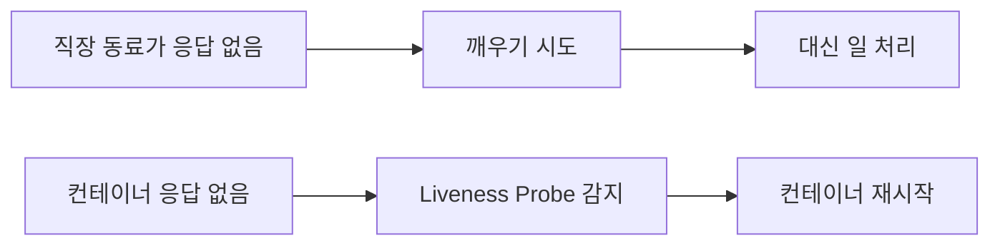

#### 📋 구체적인 시나리오

> [!example] 실제 장애 상황
> 1. **문제**: 웹서버가 무한루프에 빠져 응답 불가 상태
> 2. **감지**: Liveness Probe가 `/health` 엔드포인트 호출 실패 감지
> 3. **조치**: 쿠버네티스가 자동으로 컨테이너 재시작
> 4. **결과**: 서비스 정상화

#### 💻 실제 설정 예시

```yaml
# 📊 Liveness Probe 상세 설정
livenessProbe:
  httpGet:
    path: /healthz              # 건강 상태 확인 URL
    port: 8080                  # 포트 번호
    httpHeaders:                # 추가 헤더 (선택사항)
    - name: Custom-Header
      value: health-check
  initialDelaySeconds: 5        # 시작 후 5초 대기
  periodSeconds: 10             # 10초마다 검사
  timeoutSeconds: 3             # 3초 안에 응답 없으면 실패
  failureThreshold: 3           # 3번 연속 실패하면 재시작
  successThreshold: 1           # 1번 성공하면 정상 판정
```

#### 📊 프로브 타입별 비교

| 타입 | 용도 | 예시 |
|------|------|------|
| **httpGet** | HTTP 엔드포인트 확인 | `GET /health` |
| **tcpSocket** | TCP 포트 연결 확인 | `포트 8080 연결` |
| **exec** | 명령어 실행 결과 확인 | `curl localhost:8080` |

### 🚦 Readiness Probe (준비 상태 확인)

**🤔 질문**: "이 컨테이너가 일할 준비 됐나요?"

#### 🏠 실생활 비유

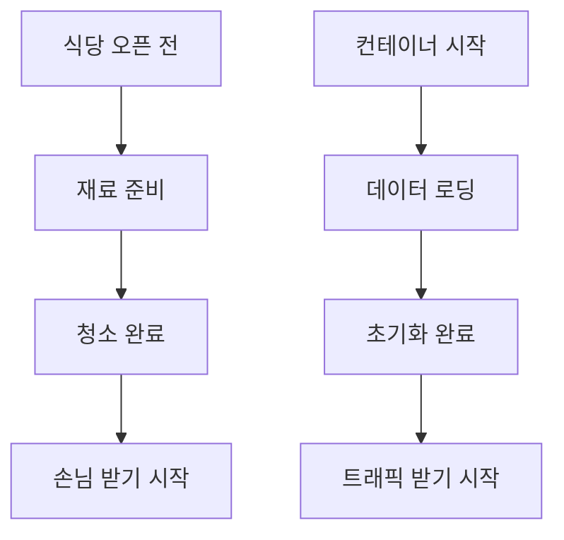

#### 📋 구체적인 시나리오

> [!example] 데이터베이스 연결 시나리오
> 1. **상황**: 웹서버가 시작되었지만 DB 연결은 아직 진행 중
> 2. **Readiness Probe**: `/ready` 엔드포인트 호출 → 실패 응답
> 3. **쿠버네티스 조치**: 로드밸런서에서 해당 파드 제외
> 4. **DB 연결 완료**: `/ready` 엔드포인트 → 성공 응답
> 5. **트래픽 복구**: 로드밸런서에 파드 다시 추가

#### 💻 실제 설정 예시

```yaml
# 🚦 Readiness Probe 상세 설정
readinessProbe:
  httpGet:
    path: /ready                # 준비 상태 확인 URL
    port: 8080
  initialDelaySeconds: 5        
  periodSeconds: 5              # 더 자주 확인 (5초마다)
  timeoutSeconds: 2
  failureThreshold: 3           
  successThreshold: 1
```

### 🚀 Startup Probe (시작 완료 확인)

**🤔 질문**: "이 컨테이너가 완전히 시작 됐나요?"

#### 🏠 실생활 비유

> [!info] 오래된 컴퓨터 부팅
> - 오래된 컴퓨터 부팅 → **5분 소요** → 그 동안은 건드리지 말기
> - 레거시 애플리케이션 시작 → **10분 소요** → 완전 시작 후 건강검진 시작

#### 🚨 문제 상황과 해결

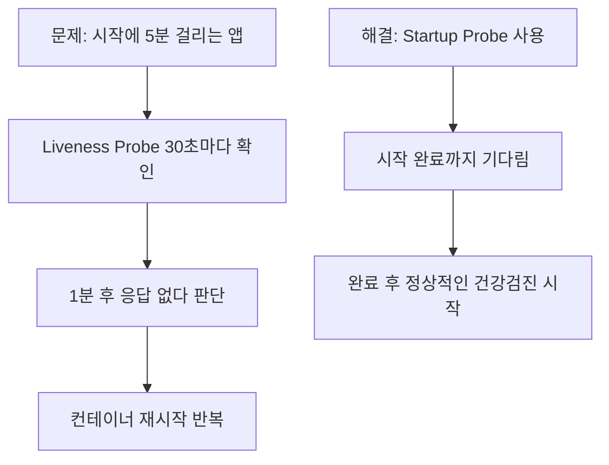

#### 💻 실제 설정 예시

```yaml
# 🚀 Startup Probe for Legacy Applications
startupProbe:
  tcpSocket:
    port: 8080
  initialDelaySeconds: 10       # 10초 후 시작
  periodSeconds: 10             # 10초마다 확인
  failureThreshold: 30          # 30번 실패까지 허용 (총 5분)
  timeoutSeconds: 5
```

> [!warning] 주의사항
> - Startup Probe가 성공할 때까지 Liveness/Readiness Probe는 **비활성화**됩니다.
> - 너무 관대한 설정은 실제 장애를 놓칠 수 있으니 주의하세요.

---

## 2. Init Container: 영화 시작 전 예고편

> [!note] 핵심 개념
> 메인 프로그램이 실행되기 **전에** 반드시 해야 할 일들을 담당하는 컨테이너입니다.

### 🎭 실생활 비유

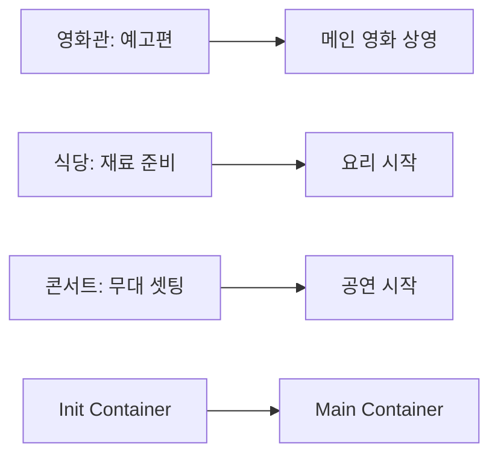

### 📋 주요 특징

| 특징 | 설명 | 예시 |
|------|------|------|
| **순차 실행** | 정의된 순서대로 하나씩 실행 | DB 마이그레이션 → 데이터 시딩 |
| **완료 필수** | 모든 Init Container 성공 필요 | 하나라도 실패하면 메인 앱 시작 안 됨 |
| **일회성** | 한 번 실행 후 종료 | 설정 파일 다운로드 |

### 🔧 실제 사용 예시

#### 📊 시나리오 1: 데이터베이스 준비

```yaml
apiVersion: v1
kind: Pod
metadata:
  name: web-app-with-db-setup
spec:
  # 🎬 Init Containers (순서대로 실행)
  initContainers:
  - name: db-migration            # 1단계: 스키마 업데이트
    image: migrate:latest
    command: 
    - /bin/sh
    - -c
    - |
      echo "🔄 Starting database migration..."
      migrate -database $DATABASE_URL up
      echo "✅ Database migration completed!"
    env:
    - name: DATABASE_URL
      value: "postgres://user:pass@db:5432/myapp"
    
  - name: seed-data              # 2단계: 기초 데이터 입력  
    image: seeder:latest
    command:
    - /bin/sh
    - -c  
    - |
      echo "🌱 Seeding initial data..."
      ./seed-script.sh
      echo "✅ Data seeding completed!"
      
  # 🚀 Main Application
  containers:
  - name: web-app               # 3단계: 웹앱 실행
    image: my-web-app:latest
    ports:
    - containerPort: 8080
```

#### 🔗 시나리오 2: 설정 파일 다운로드

```yaml
spec:
  # 📁 공유 볼륨 정의
  volumes:
  - name: config-volume
    emptyDir: {}
    
  initContainers:
  - name: config-downloader
    image: alpine/curl:latest
    command:
    - /bin/sh
    - -c
    - |
      echo "📥 Downloading configuration..."
      curl -o /config/app-config.json \
        https://config-server.company.com/prod/app-config.json
      
      curl -o /config/database.yaml \
        https://config-server.company.com/prod/database.yaml
        
      echo "✅ Configuration files downloaded!"
      ls -la /config/
    volumeMounts:
    - name: config-volume
      mountPath: /config
      
  containers:
  - name: main-app
    image: my-app:latest
    volumeMounts:
    - name: config-volume          # 다운로드된 설정 사용
      mountPath: /app/config
      readOnly: true
```

#### 🔐 시나리오 3: 보안 설정 및 권한 체크

```yaml
spec:
  initContainers:
  - name: security-setup
    image: busybox:latest
    securityContext:
      runAsUser: 0                 # root 권한으로 실행
    command:
    - /bin/sh
    - -c
    - |
      echo "🔐 Setting up security..."
      
      # 디렉토리 권한 설정
      mkdir -p /app/data /app/logs
      chmod 755 /app/data
      chmod 777 /app/logs
      
      # 사용자 계정 생성
      adduser -D -u 1001 appuser
      chown -R appuser:appuser /app
      
      echo "✅ Security setup completed!"
    volumeMounts:
    - name: app-volume
      mountPath: /app
      
  containers:
  - name: main-app
    image: my-secure-app:latest
    securityContext:
      runAsUser: 1001              # 일반 사용자로 실행
```

### 📈 Init Container 모니터링

> [!tip] 디버깅 팁
> ```bash
> # Init Container 상태 확인
> kubectl describe pod <pod-name>
> 
> # Init Container 로그 확인  
> kubectl logs <pod-name> -c <init-container-name>
> 
> # 실행 중인 Init Container 접속
> kubectl exec -it <pod-name> -c <init-container-name> -- /bin/sh
> ```

---

## 3. 멀티 컨테이너 패턴: 팀워크의 예술

> [!note] 핵심 개념
> 하나의 파드 안에 여러 컨테이너를 함께 배치하여 기능을 확장하거나 문제를 해결하는 디자인 패턴들입니다.

### 🏍️ Sidecar Pattern (사이드카 패턴)

> [!info] 패턴 개요
> **"메인 오토바이 옆에 붙은 사이드카"** 처럼, 메인 컨테이너의 핵심 기능에 영향을 주지 않으면서 부가적인 기능을 추가하는 패턴입니다.

#### 🎯 사용 목적

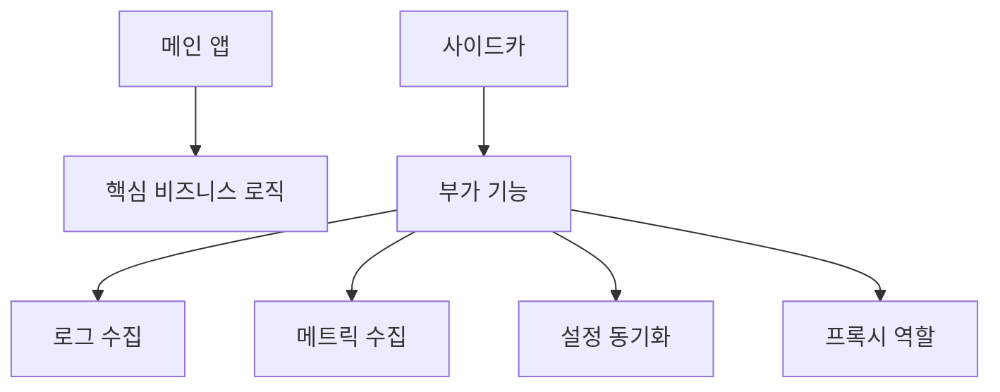

#### 💻 실제 구현: 웹서버 + 로그 수집기

```yaml
apiVersion: v1
kind: Pod
metadata:
  name: webapp-with-logging
  labels:
    app: webapp
spec:
  # 📁 공유 볼륨
  volumes:
  - name: shared-logs
    emptyDir: {}
  - name: log-config
    configMap:
      name: fluentd-config
      
  containers:
  # 🌐 메인 애플리케이션
  - name: nginx-server
    image: nginx:latest
    ports:
    - containerPort: 80
    volumeMounts:
    - name: shared-logs
      mountPath: /var/log/nginx    # 로그 파일 저장 위치
    resources:
      requests:
        memory: "64Mi"
        cpu: "250m"
      limits:
        memory: "128Mi" 
        cpu: "500m"
        
  # 📊 사이드카: 로그 수집기
  - name: log-shipper
    image: fluent/fluentd:latest
    volumeMounts:
    - name: shared-logs
      mountPath: /var/log/nginx    # 같은 로그 디렉토리 접근
      readOnly: true
    - name: log-config
      mountPath: /fluentd/etc
    env:
    - name: FLUENTD_CONF
      value: "fluentd.conf"
    - name: LOG_DESTINATION
      value: "elasticsearch.logging.svc.cluster.local"
```

#### 📊 사이드카 설정 파일 (ConfigMap)

```yaml
apiVersion: v1
kind: ConfigMap
metadata:
  name: fluentd-config
data:
  fluentd.conf: |
    # 🔍 Nginx 액세스 로그 파싱
    <source>
      @type tail
      path /var/log/nginx/access.log
      pos_file /var/log/fluentd-nginx-access.log.pos
      tag nginx.access
      format nginx
    </source>
    
    # 🚨 에러 로그 파싱  
    <source>
      @type tail
      path /var/log/nginx/error.log
      pos_file /var/log/fluentd-nginx-error.log.pos
      tag nginx.error
      format /^(?<time>[^ ]* [^ ]*) \[(?<level>[^\]]*)?\] (?<message>.*)$/
    </source>
    
    # 📤 Elasticsearch로 전송
    <match nginx.**>
      @type elasticsearch
      host "#{ENV['LOG_DESTINATION']}"
      port 9200
      index_name nginx
      type_name _doc
    </match>
```

#### ✅ 사이드카 패턴의 장점

| 장점 | 설명 | 예시 |
|------|------|------|
| **분리된 관심사** | 각 컨테이너가 단일 책임 | 웹서버 vs 로그 수집 |
| **재사용성** | 다른 앱에도 같은 사이드카 사용 | 모든 웹앱에 같은 로그 수집기 |
| **독립적 업데이트** | 메인 앱 수정 없이 사이드카 업그레이드 | 로그 형식 변경 시 |
| **기술 다양성** | 다른 언어/기술 스택 사용 가능 | Java 앱 + Go 모니터링 |

### 🏢 Ambassador Pattern (대사 패턴)

> [!info] 패턴 개요
> **"외교관이 복잡한 외교를 대신 처리"** 하듯이, 메인 애플리케이션이 외부 서비스와 통신하는 방식을 단순화시켜주는 프록시 역할을 합니다.

#### 🌐 네트워크 복잡성 해결

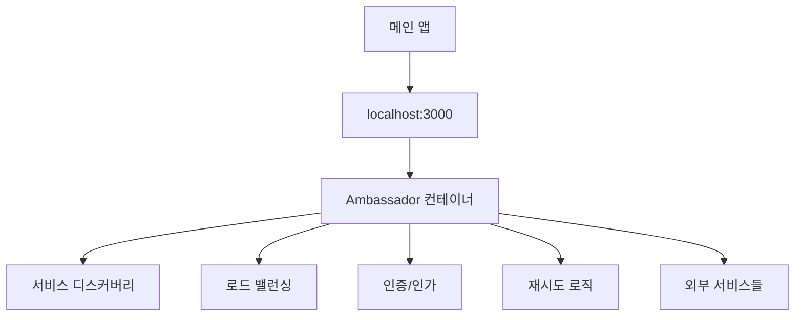

#### 💻 실제 구현: 데이터베이스 연결 프록시

```yaml
apiVersion: v1
kind: Pod
metadata:
  name: app-with-db-ambassador
spec:
  containers:
  # 💼 메인 애플리케이션
  - name: main-app
    image: my-simple-app:latest
    env:
    - name: DB_HOST
      value: "localhost"          # 단순하게 localhost 사용
    - name: DB_PORT  
      value: "5432"
    - name: DB_NAME
      value: "myapp"
    ports:
    - containerPort: 8080
    
  # 🌐 Ambassador: 데이터베이스 프록시
  - name: db-ambassador
    image: envoyproxy/envoy:latest
    ports:
    - containerPort: 5432         # 로컬 DB 포트로 위장
    volumeMounts:
    - name: envoy-config
      mountPath: /etc/envoy
    command: 
    - /usr/local/bin/envoy
    - -c
    - /etc/envoy/envoy.yaml
    
  volumes:
  - name: envoy-config
    configMap:
      name: envoy-db-config
```

### 🔌 Adapter Pattern (어댑터 패턴)

> [!info] 패턴 개요  
> **"220V를 110V로 변환하는 어댑터"** 처럼, 메인 컨테이너의 출력을 외부 시스템이 요구하는 표준화된 형식으로 변환합니다.

#### 📊 데이터 형식 변환


---

## 4. Pod Affinity: 파드들의 인간관계

> [!note] 핵심 개념
> 파드를 **다른 파드와의 관계**에 따라 특정 노드에 함께 배치하거나, 혹은 떨어뜨려 배치하는 스케줄링 규칙입니다.

### 👫 Pod Affinity (친구 관계)

> [!info] "친한 친구와 같은 동네에 살고 싶어!"
> 특정 라벨을 가진 파드가 실행 중인 노드에 새로운 파드를 함께 배치합니다.

#### 🏙️ 실생활 비유

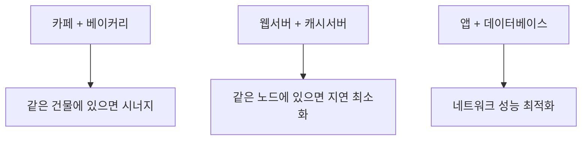

#### 📊 성능 최적화 시나리오

> [!example] Redis 캐시 서버와의 Affinity
> - **문제**: 웹서버와 Redis가 다른 노드에 있어서 네트워크 지연 발생
> - **해결**: Pod Affinity로 같은 노드에 배치
> - **결과**: 응답시간 50ms → 5ms로 단축

#### 💻 실제 구현: 웹서버 + Redis 배치

```yaml
apiVersion: apps/v1
kind: Deployment
metadata:
  name: web-app-with-redis-affinity
spec:
  replicas: 3
  selector:
    matchLabels:
      app: web-app
  template:
    metadata:
      labels:
        app: web-app
        tier: frontend
    spec:
      # 🧲 Pod Affinity 설정
      affinity:
        podAffinity:
          # 🔥 필수 조건: 반드시 함께 배치
          requiredDuringSchedulingIgnoredDuringExecution:
          - labelSelector:
              matchExpressions:
              - key: app
                operator: In
                values:
                - redis            # Redis 파드와 함께
              - key: role
                operator: In  
                values:
                - cache
            topologyKey: kubernetes.io/hostname  # 같은 호스트에
            
          # 🎯 선호 조건: 가능하면 함께 배치  
          preferredDuringSchedulingIgnoredDuringExecution:
          - weight: 100            # 우선순위 (1-100)
            podAffinityTerm:
              labelSelector:
                matchLabels:
                  app: monitoring  # 모니터링 파드와도 가능하면 함께
              topologyKey: kubernetes.io/hostname
```

#### 📍 토폴로지 키 옵션

| 토폴로지 키 | 의미 | 사용 시나리오 |
|-------------|------|---------------|
| `kubernetes.io/hostname` | 같은 노드 | 네트워크 지연 최소화 |
| `topology.kubernetes.io/zone` | 같은 가용영역 | 중간 수준 분산 |
| `topology.kubernetes.io/region` | 같은 리전 | 지역별 서비스 분리 |

### 👎 Pod Anti-Affinity (라이벌 관계)

> [!info] "경쟁사와는 다른 동네에 살고 싶어!"
> 특정 라벨을 가진 파드가 실행 중인 노드를 피해 다른 노드에 배치합니다.

#### 🏦 실생활 비유

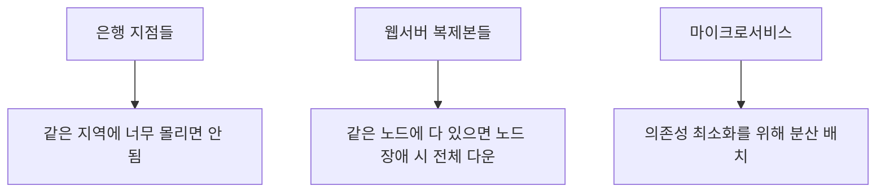

#### 🚨 고가용성 확보 시나리오

> [!example] 웹서버 고가용성 구성
> - **목표**: 3개 복제본을 서로 다른 노드에 배치
> - **효과**: 1개 노드 장애 시에도 서비스 지속
> - **결과**: 99.9% → 99.99% 가용성 향상

---

## 5. Topology Spread Constraints: 완벽한 균형

> [!note] 핵심 개념
> 파드들을 여러 지역/노드에 **최대한 고르게** 분배하는 가장 정교하고 유연한 방법입니다.

### 🎯 토폴로지 분배의 필요성

#### 🏢 실생활 비유

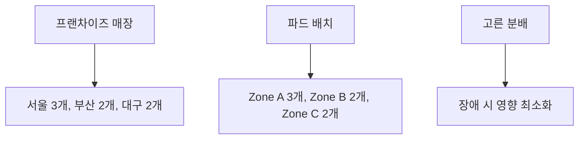

### 🎚️ 핵심 개념 상세 분석

#### 📊 maxSkew (최대 불균형도)

> [!info] "각 지역 간 파드 개수 차이가 이 값 이하로 유지되어야 함"

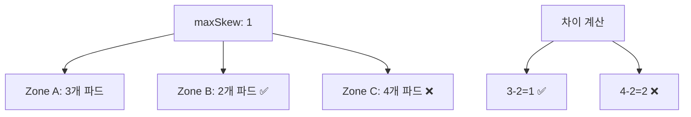

| maxSkew 값 | 의미 | 예시 배치 |
|-------------|------|-----------|
| **1** | 최대 1개 차이 | 3-2-2 ✅, 3-1-2 ❌ |
| **2** | 최대 2개 차이 | 4-2-2 ✅, 4-1-2 ❌ |
| **0** | 완전 동일 | 3-3-3 ✅, 3-2-3 ❌ |

#### 🗺️ topologyKey (분배 기준)

| 토폴로지 키 | 범위 | 사용 목적 |
|-------------|------|-----------|
| `kubernetes.io/hostname` | 노드별 | CPU/메모리 부하 분산 |
| `topology.kubernetes.io/zone` | 가용영역별 | 네트워크/전력 장애 대비 |
| `topology.kubernetes.io/region` | 리전별 | 자연재해/대규모 장애 대비 |
| `node.kubernetes.io/instance-type` | 인스턴스 타입별 | 성능 특성별 분배 |

#### 🚦 whenUnsatisfiable (제약 위반 시 동작)

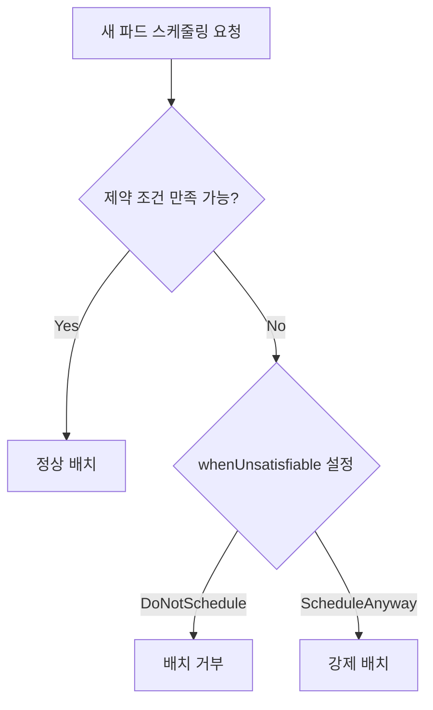

### 💻 실제 구현: 완전 분산 시스템

```yaml
apiVersion: apps/v1
kind: Deployment
metadata:
  name: distributed-microservice
  labels:
    app: user-service
spec:
  replicas: 9
  selector:
    matchLabels:
      app: user-service
  template:
    metadata:
      labels:
        app: user-service
        component: backend
        tier: microservice
    spec:
      # ⚖️ 토폴로지 분배 제약 조건
      topologySpreadConstraints:
      
      # 🏢 1단계: 존(Zone) 레벨 분배
      - maxSkew: 1                    # 존 간 최대 1개 차이
        topologyKey: topology.kubernetes.io/zone
        whenUnsatisfiable: DoNotSchedule
        labelSelector:
          matchLabels:
            app: user-service
        minDomains: 3                 # 최소 3개 존 사용
        
      # 🖥️ 2단계: 노드 레벨 분배  
      - maxSkew: 2                    # 노드 간 최대 2개 차이
        topologyKey: kubernetes.io/hostname  
        whenUnsatisfiable: ScheduleAnyway  # 노드 부족 시 강제 배치
        labelSelector:
          matchLabels:
            app: user-service
            
      containers:
      - name: user-service
        image: user-service:v2.1
        ports:
        - containerPort: 8080
        resources:
          requests:
            cpu: 200m
            memory: 256Mi
          limits:
            cpu: 500m
            memory: 512Mi
```

---

## 🎯 실전 조합 예시: 엔터프라이즈급 고가용성 웹서비스

> [!note] 종합 시나리오
> 모든 고급 파드 관리 기법을 조합하여 **완벽한 고가용성 웹서비스**를 구축해보겠습니다.

### 🏗️ 아키텍처 개요

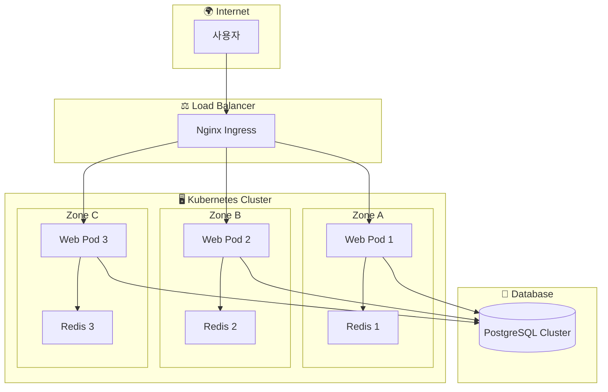

### 🎯 최종 결과

> [!success] 달성된 목표들
> - **🏥 고가용성**: 99.99% 업타임 (3존 분산, 노드 장애 대응)
> - **📊 모니터링**: 실시간 메트릭 및 로그 수집
> - **🚀 성능**: Redis 사이드카로 응답시간 최적화  
> - **🔒 보안**: 최소 권한 원칙 적용
> - **⚡ 확장성**: HPA 연동 가능한 구조
> - **🔄 무중단 배포**: Rolling Update 전략


## 📚 참고 자료

> [!info] 추가 학습 자료
> - [Kubernetes 공식 문서 - Pod Lifecycle](https://kubernetes.io/docs/concepts/workloads/pods/pod-lifecycle/)


---
