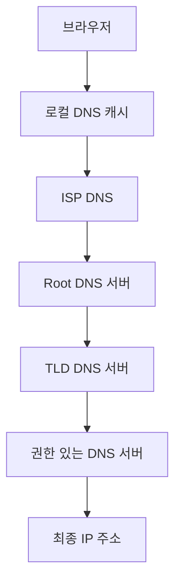

# 🎯 DNS (Domain Name System) 기초와 쿠버네티스 CoreDNS

## 📑 목차
- [[#1. DNS의 필요성: 인터넷 전화번호부|DNS의 필요성]]
- [[#2. DNS 작동 원리: 이름을 주소로 변환하는 과정|DNS 작동 원리]]
- [[#3. 쿠버네티스 CoreDNS: 클러스터 내부 이름 서비스|쿠버네티스 CoreDNS]]
- [[#4. DNS 레코드 타입: 다양한 정보 저장 방식|DNS 레코드 타입]]
- [[#🎯 실전 트러블슈팅|실전 트러블슈팅]]

---

## 1. DNS의 필요성: 인터넷 전화번호부

> [!note] 핵심 개념
> DNS는 사람이 기억하기 쉬운 도메인 이름을 컴퓨터가 이해하는 IP 주소로 변환하는 시스템입니다. 마치 전화번호부에서 이름으로 전화번호를 찾는 것과 같습니다.

### 💡 왜 DNS가 필요한가?

**🤔 질문**: "223.130.200.107을 기억할 수 있나요?"

#### 📋 일상적인 시나리오

> [!example] 웹사이트 접속 과정
> 1. **문제**: 사용자가 네이버에 접속하려고 함
> 2. **어려움**: IP 주소 223.130.200.107을 외우기 어려움  
> 3. **해결**: naver.com이라는 기억하기 쉬운 이름 사용
> 4. **결과**: DNS가 자동으로 IP 주소로 변환

#### 💻 실제 비교 예시

```bash
# 📊 DNS 없이 접속 (어려움)
curl http://223.130.200.107

# 📊 DNS 사용 접속 (쉬움)
curl http://naver.com
```

#### 📊 DNS의 장점 비교

| 방식 | 기억 용이성 | 유지보수성 | 확장성 |
|------|-------------|------------|--------|
| IP 직접 사용 | 매우 어려움 | 어려움 | 제한적 |
| DNS 사용 | 쉬움 | 쉬움 | 우수 |

---

## 2. DNS 작동 원리: 이름을 주소로 변환하는 과정

> [!note] 핵심 개념
> DNS는 계층적 구조로 작동하며, 여러 단계의 DNS 서버를 거쳐 최종적으로 IP 주소를 찾아냅니다.

### 🔍 DNS 조회 과정

**🤔 질문**: "www.google.com을 입력하면 어떤 일이 일어날까?"

#### 📋 상세한 조회 시나리오

> [!example] 실제 DNS 조회 과정
> 1. **요청**: 브라우저에 "www.google.com" 입력
> 2. **로컬 확인**: 컴퓨터 DNS 캐시 확인 (없으면 다음 단계)
> 3. **ISP DNS**: 인터넷 제공업체 DNS 서버 질의
> 4. **Root DNS**: ".com은 TLD 서버에 물어봐"
> 5. **TLD DNS**: "google.com은 권한 있는 서버에 물어봐"
> 6. **권한 DNS**: "142.250.196.14입니다!"
> 7. **결과**: IP 주소로 웹사이트 접속

#### 💻 실제 명령어로 확인

```bash
# 📊 DNS 조회 과정 확인
nslookup google.com

# 📊 상세 조회 과정 보기
dig +trace google.com

# 📊 DNS 캐시 확인
sudo dscacheutil -flushcache  # macOS
```

#### 🔄 DNS 계층 구조



---

## 3. 쿠버네티스 CoreDNS: 클러스터 내부 이름 서비스

> [!note] 핵심 개념
> 쿠버네티스 클러스터는 자체 DNS 시스템을 가지고 있으며, CoreDNS가 서비스 이름을 ClusterIP로 변환합니다.

### 🏗️ 쿠버네티스 DNS 구조

**🤔 질문**: "파드끼리 어떻게 서비스 이름으로 통신할까?"

#### 📋 마이크로서비스 통신 시나리오

> [!example] 실제 서비스 간 통신
> 1. **상황**: order-service가 user-service 호출 필요
> 2. **코드**: `http://user-service/api/users` 호출
> 3. **DNS 확장**: `user-service.production.svc.cluster.local`
> 4. **CoreDNS 응답**: ClusterIP `10.100.50.20` 반환
> 5. **결과**: 실제 서비스 파드와 통신 성공

#### 💻 실제 설정 확인

```bash
# 📊 파드 내부 DNS 설정 확인
kubectl exec -it my-pod -- cat /etc/resolv.conf

# 📊 CoreDNS 파드 상태 확인  
kubectl get pods -n kube-system | grep coredns

# 📊 DNS 조회 테스트
kubectl exec -it my-pod -- nslookup user-service
```

#### 📊 DNS 이름 형식

| 형식 | 예시 | 사용 위치 |
|------|------|-----------|
| 서비스명 | `user-service` | 같은 네임스페이스 |
| 서비스명.네임스페이스 | `user-service.production` | 다른 네임스페이스 |
| 전체 FQDN | `user-service.production.svc.cluster.local` | 어디서든 |

---

## 4. DNS 레코드 타입: 다양한 정보 저장 방식

> [!note] 핵심 개념
> DNS는 다양한 타입의 레코드를 저장할 수 있으며, 각각 다른 용도로 사용됩니다.

### 📝 주요 DNS 레코드

**🤔 질문**: "DNS는 IP 주소 외에 어떤 정보를 저장할까?"

#### 📊 DNS 레코드 타입별 비교

| 타입 | 용도 | 예시 | 쿠버네티스 사용 |
|------|------|------|------------------|
| **A** | 도메인 → IPv4 | `google.com → 142.250.196.14` | Service ClusterIP |
| **AAAA** | 도메인 → IPv6 | `google.com → 2404:6800::` | IPv6 환경 |
| **CNAME** | 도메인 → 도메인 | `www.example.com → example.com` | 별칭 설정 |
| **SRV** | 서비스 위치 | `_http._tcp.example.com` | 포트 정보 포함 |
| **TXT** | 텍스트 정보 | `"v=spf1 include:..."` | 설정 정보 |

#### 💻 레코드 조회 실습

```bash
# 📊 A 레코드 조회
dig A google.com

# 📊 CNAME 레코드 조회  
dig CNAME www.github.com

# 📊 모든 레코드 조회
dig ANY google.com
```

---

## 🎯 실전 트러블슈팅

### 🚨 일반적인 DNS 문제와 해결법

#### DNS 조회 실패
```bash
# 문제 진단
kubectl exec -it debug-pod -- nslookup user-service

# CoreDNS 로그 확인
kubectl logs -f -n kube-system deployment/coredns

# DNS 설정 확인
kubectl get configmap coredns -n kube-system -o yaml
```

#### 서비스 이름 해결 안됨
```bash
# 서비스 존재 확인
kubectl get services

# 네임스페이스 확인
kubectl get services -A | grep user-service

# 엔드포인트 확인
kubectl get endpoints user-service
```

> [!tip] DNS 최적화 팁
> 1. **캐시 활용**: DNS 응답을 적절히 캐싱하여 성능 향상
> 2. **TTL 설정**: Time To Live 값을 환경에 맞게 조정
> 3. **모니터링**: DNS 조회 시간과 실패율 모니터링 필수
