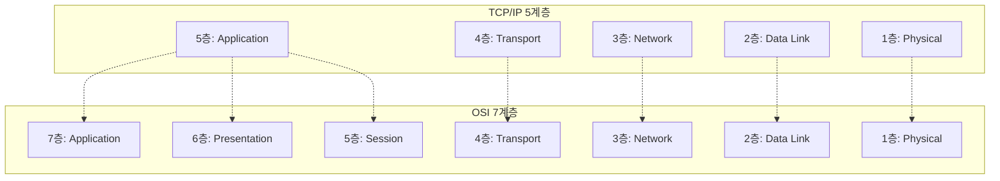

# 🎯 TCP/IP 5계층과 OSI 7계층 모델 - 네트워크 통신의 기초

## 📑 목차
- [[#1. TCP/IP와 OSI 모델의 탄생 배경|탄생 배경]]
- [[#2. 계층 구조 비교: 5계층 vs 7계층|계층 구조 비교]]
- [[#3. 각 계층의 역할과 기능|계층별 역할]]
- [[#4. 실제 네트워크 통신 과정|통신 과정]]
- [[#🎯 실전 적용 예시|실전 적용]]

---

## 1. TCP/IP와 OSI 모델의 탄생 배경

> [!note] 핵심 개념
> TCP/IP는 복잡한 네트워크를 계층으로 나누어 블랙박스화한 실용적인 프로토콜이고, OSI는 이후에 만들어진 이론적 표준 모델입니다.

### 💡 왜 계층 모델이 필요한가?

**🤔 질문**: "복잡한 네트워크를 어떻게 단순하게 만들까?"

#### 📋 네트워크 복잡성 해결 시나리오

> [!example] 계층화의 필요성
> 1. **문제**: 네트워크 통신이 너무 복잡하여 개발과 유지보수가 어려움
> 2. **해결**: 기능별로 계층을 나누어 각각 독립적으로 관리
> 3. **장점**: 한 계층의 변경이 다른 계층에 영향을 주지 않음
> 4. **결과**: 개발 효율성과 표준화 달성

#### 💻 역사적 배경

```bash
# 📊 네트워크 프로토콜 발전사
1970년대: ARPAnet 개발 → TCP/IP 프로토콜 탄생
1980년대: TCP/IP 급속 확산 → 인터넷 주류 프로토콜
1984년:   OSI 7계층 모델 표준 발표 → 이론적 참고용
현재:     TCP/IP 실제 사용, OSI 교육/분석용
```

#### 📊 TCP/IP vs OSI 비교

| 구분 | TCP/IP | OSI |
|------|--------|-----|
| 계층 수 | 5계층 | 7계층 |
| 개발 시기 | 1970년대 | 1980년대 |
| 사용 현황 | 실제 인터넷 표준 | 교육/참고용 |
| 특징 | 실용적, 단순함 | 이론적, 상세함 |

---

## 2. 계층 구조 비교: 5계층 vs 7계층

> [!note] 핵심 개념
> TCP/IP 5계층과 OSI 7계층은 기본적으로 동일하며, OSI의 상위 3계층(Session, Presentation, Application)이 TCP/IP에서는 Application 계층 하나로 통합됩니다.

### 🏗️ 계층 매핑 구조

**🤔 질문**: "5계층과 7계층은 어떻게 대응될까?"

#### 📋 계층별 매핑 관계

> [!example] 계층 대응 관계
> **TCP/IP 5계층 → OSI 7계층**
> 1. **Application (5층)** → Application (7층) + Presentation (6층) + Session (5층)
> 2. **Transport (4층)** → Transport (4층)
> 3. **Network (3층)** → Network (3층) 
> 4. **Data Link (2층)** → Data Link (2층)
> 5. **Physical (1층)** → Physical (1층)

#### 💻 시각적 계층 구조



#### 📊 계층별 프로토콜 예시

| 계층 | TCP/IP | OSI | 주요 프로토콜 |
|------|--------|-----|---------------|
| **상위** | Application | Application/Presentation/Session | HTTP, HTTPS, FTP, SMTP |
| **4층** | Transport | Transport | TCP, UDP |
| **3층** | Network | Network | IP, ICMP, ARP |
| **2층** | Data Link | Data Link | Ethernet, Wi-Fi |
| **1층** | Physical | Physical | 케이블, 광섬유 |

---

## 3. 각 계층의 역할과 기능

> [!note] 핵심 개념
> 각 계층은 특정한 역할을 담당하며, 상위 계층일수록 사용자와 가깝고, 하위 계층일수록 하드웨어와 가깝습니다.

### 🔍 계층별 상세 기능

**🤔 질문**: "각 계층은 정확히 무엇을 담당할까?"

#### 📋 1층: Physical (물리 계층)

> [!example] 물리 계층의 역할
> 1. **기능**: 데이터를 물리적 신호로 변환하여 전송
> 2. **담당**: 전기 신호, 광신호, 무선 신호 처리
> 3. **장비**: 케이블, 리피터, 허브
> 4. **예시**: 이더넷 케이블로 비트 스트림 전송

#### 📋 2층: Data Link (데이터링크 계층)

> [!example] 데이터링크 계층의 역할
> 1. **기능**: MAC 주소를 이용한 기기 식별
> 2. **담당**: 프레임 단위 데이터 전송, 오류 검출
> 3. **장비**: 스위치, 브리지
> 4. **예시**: Ethernet 프레임으로 직접 연결된 기기간 통신

#### 📋 3층: Network (네트워크 계층)

> [!example] 네트워크 계층의 역할
> 1. **기능**: IP 주소를 이용한 경로 설정 (라우팅)
> 2. **담당**: 복잡한 네트워크에서 최적 경로 찾기
> 3. **장비**: 라우터, L3 스위치
> 4. **예시**: 인터넷에서 목적지까지 패킷 전달

#### 📋 4층: Transport (전송 계층)

> [!example] 전송 계층의 역할
> 1. **기능**: 포트 번호로 애플리케이션 구분
> 2. **담당**: 신뢰성 있는 데이터 전송 보장
> 3. **프로토콜**: TCP (신뢰성), UDP (속도)
> 4. **예시**: HTTP(80), HTTPS(443), SSH(22) 포트 구분

#### 📋 5층: Application (애플리케이션 계층)

> [!example] 애플리케이션 계층의 역할
> 1. **기능**: 사용자와 가장 가까운 네트워크 서비스 제공
> 2. **담당**: 웹, 메일, 파일 전송 등 애플리케이션 프로토콜
> 3. **프로토콜**: HTTP, SMTP, FTP, DNS
> 4. **예시**: 브라우저로 웹사이트 접속

#### 💻 계층별 데이터 단위

```bash
# 📊 각 계층에서 처리하는 데이터 단위
5층 (Application): 데이터 (Data)
4층 (Transport):   세그먼트 (Segment) 
3층 (Network):     패킷 (Packet)
2층 (Data Link):   프레임 (Frame)
1층 (Physical):    비트 (Bit)
```

---

## 4. 실제 네트워크 통신 과정

> [!note] 핵심 개념
> 데이터 송신 시에는 상위 계층에서 하위 계층으로 캡슐화되고, 수신 시에는 하위 계층에서 상위 계층으로 역캡슐화됩니다.

### 📨 데이터 송수신 과정

**🤔 질문**: "웹사이트에 접속할 때 각 계층에서 무슨 일이 일어날까?"

#### 📋 송신 과정 (캡슐화)

> [!example] 웹 페이지 요청 과정
> 1. **Application**: "GET /index.html HTTP/1.1" 메시지 생성
> 2. **Transport**: TCP 헤더 추가 (포트 80), 세그먼트 생성
> 3. **Network**: IP 헤더 추가 (목적지 IP), 패킷 생성
> 4. **Data Link**: Ethernet 헤더 추가 (MAC 주소), 프레임 생성
> 5. **Physical**: 전기 신호로 변환하여 케이블로 전송

#### 📋 수신 과정 (역캡슐화)

> [!example] 웹 서버 응답 처리
> 1. **Physical**: 전기 신호를 비트로 변환
> 2. **Data Link**: Ethernet 헤더 제거, 자신의 MAC인지 확인
> 3. **Network**: IP 헤더 제거, 자신의 IP인지 확인
> 4. **Transport**: TCP 헤더 제거, 포트 80 확인
> 5. **Application**: HTTP 응답 데이터 처리

#### 💻 실제 패킷 구조 예시

```bash
# 📊 HTTP 요청 패킷의 계층별 헤더
[Ethernet Header][IP Header][TCP Header][HTTP Data]
     L2              L3         L4          L5
  MAC 주소         IP 주소    포트 번호    웹 요청
```

---

## 🎯 실전 적용 예시

### 🚀 쿠버네티스에서의 계층 모델 활용

#### 파드 간 통신 분석
```bash
# 각 계층에서 쿠버네티스 통신 분석
5층: kubectl exec → HTTP API → JSON 데이터
4층: TCP 연결 → kube-apiserver:6443 포트
3층: ClusterIP → 파드 IP 라우팅
2층: CNI → 가상 인터페이스 브리징
1층: 호스트 네트워크 → 물리적 전송
```

#### 네트워크 정책 설정
```yaml
# 📊 계층별 네트워크 제어
apiVersion: networking.k8s.io/v1
kind: NetworkPolicy
metadata:
  name: layer-control
spec:
  podSelector:
    matchLabels:
      app: web
  ingress:
  - from:
    - podSelector:
        matchLabels:
          app: frontend
    ports:
    - protocol: TCP    # L4: Transport 계층
      port: 80         # L4: 포트 번호
```

#### 트러블슈팅 도구
```bash
# 📊 계층별 네트워크 진단
# L3: IP 연결성 확인
ping 10.96.0.1

# L4: 포트 연결성 확인  
telnet service-ip 80

# L7: HTTP 응답 확인
curl http://service-name/health
```

> [!tip] 실무 적용 팁
> 1. **네트워크 문제 해결**: 하위 계층부터 순차적으로 확인
> 2. **성능 최적화**: 각 계층별 병목점 분석
> 3. **보안 설계**: 계층별 보안 정책 적용
> 4. **모니터링**: 계층별 메트릭 수집 및 분석

### 📚 참고 자료

- [Oracle TCP/IP 문서](https://docs.oracle.com/cd/E19683-01/806-4075/ipov-10/index.html)
- RFC 문서: TCP (RFC 793), IP (RFC 791)
- 쿠버네티스 네트워킹 공식 문서