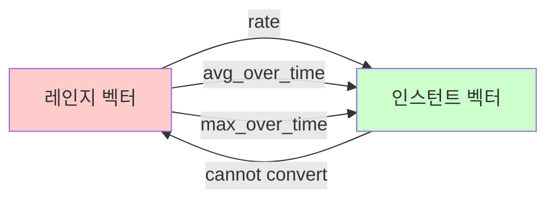

# 🔧 PromQL 핵심 개념 정리

> [!note] 학습 목표
> PromQL의 이진 연산자, 집계 연산자, 벡터 타입, 시간 변경자를 명확하게 이해합니다.

> [!tip] 이 문서는
> [[07_PromQL_메트릭_타입_완벽_가이드]]와 [[08_PromQL_레이블_매처_완벽_가이드]]를 학습한 후 읽으면 더 효과적입니다.

---

## 📚 목차

- [[#1. 인스턴트 벡터와 레인지 벡터]]
- [[#2. 이진 연산자 (Binary Operators)]]
- [[#3. 집계 연산자 (Aggregation Operators)]]
- [[#4. 시간 변경자 (Time Modifiers)]]
- [[#5. 실전 활용 예시]]

---

## 1. 인스턴트 벡터와 레인지 벡터

> [!important] PromQL의 가장 기초적인 개념
> 모든 PromQL 쿼리는 벡터를 다룹니다. 벡터 타입을 이해하는 것이 PromQL 마스터의 첫걸음입니다.

### 인스턴트 벡터 (Instant Vector)

**정의**: **현재 시점**의 시계열 집합

```promql
# 현재 시점의 CPU 사용률
node_cpu_usage_percent

# 결과 (예시)
node_cpu_usage_percent{cpu="0", instance="node1"} 45.2 @1701648000
node_cpu_usage_percent{cpu="1", instance="node1"} 62.8 @1701648000
node_cpu_usage_percent{cpu="0", instance="node2"} 33.1 @1701648000
```

**특징**:
- ✅ **단일 시점**: 각 시계열당 하나의 값
- ✅ **즉시 평가 가능**: 그래프나 테이블로 바로 표시
- ✅ **대부분의 연산 가능**: 산술, 비교, 집계 등

**사용 예시**:
```promql
# 현재 메모리 사용량
node_memory_usage_bytes

# 현재 HTTP 요청 수 (레이블 필터 포함)
http_requests_total{method="GET", status="200"}

# 현재 활성 연결 수
active_connections
```

---

### 레인지 벡터 (Range Vector)

**정의**: **시간 범위** 동안의 시계열 집합

```promql
# 최근 5분간의 HTTP 요청 수
http_requests_total[5m]

# 결과 (예시)
http_requests_total{method="GET"}
  @1701647700 → 1200
  @1701647730 → 1234
  @1701647760 → 1267
  @1701647790 → 1301
  @1701647820 → 1335
  @1701647850 → 1370
  @1701647880 → 1404
```

**특징**:
- ✅ **시간 범위**: 각 시계열당 여러 개의 값
- ✅ **함수 필요**: `rate()`, `avg_over_time()` 등으로 변환 필요
- ❌ **직접 표시 불가**: 그래프로 바로 그릴 수 없음

**시간 단위**:
```promql
[30s]  # 30초
[5m]   # 5분
[1h]   # 1시간
[1d]   # 1일
[1w]   # 1주일
```

**사용 예시**:
```promql
# 최근 5분간 데이터로 초당 요청 수 계산
rate(http_requests_total[5m])

# 최근 1시간 평균 CPU 사용률
avg_over_time(node_cpu_usage_percent[1h])

# 최근 5분간 최대 메모리 사용량
max_over_time(node_memory_usage_bytes[5m])
```

---

### 벡터 타입 변환



**핵심 규칙**:
```yaml
변환 가능:
  - 레인지 벡터 → 인스턴트 벡터 (함수 사용)
  - rate(metric[5m]) ✅
  - avg_over_time(metric[1h]) ✅

변환 불가:
  - 인스턴트 벡터 → 레인지 벡터 ❌
  - 직접적인 방법 없음
```

---

### 실전 비교

| 측면 | 인스턴트 벡터 | 레인지 벡터 |
|------|-------------|------------|
| **시간** | 현재 시점 | 시간 범위 |
| **값 개수** | 시계열당 1개 | 시계열당 N개 |
| **표기법** | `metric_name` | `metric_name[5m]` |
| **직접 사용** | ✅ 가능 | ❌ 불가능 |
| **함수 필요** | 선택적 | 필수 |
| **주요 용도** | 현재 상태 확인 | 추세/평균 계산 |

**예시로 이해하기**:
```promql
# ❌ 잘못된 사용
http_requests_total[5m]
# → 오류: 레인지 벡터는 직접 그래프로 그릴 수 없음

# ✅ 올바른 사용
rate(http_requests_total[5m])
# → 인스턴트 벡터로 변환되어 그래프 표시 가능

# ✅ 인스턴트 벡터 직접 사용
http_requests_total
# → 현재 시점의 누적 요청 수
```

---

## 2. 이진 연산자 (Binary Operators)

> [!info] 정의
> 두 개의 인스턴트 벡터 또는 벡터와 스칼라 간에 수행되는 연산

### 산술 연산자 (Arithmetic Operators)

#### 기본 산술

```promql
# 덧셈 (+)
node_memory_total_bytes + node_memory_cached_bytes

# 뺄셈 (-)
node_memory_total_bytes - node_memory_free_bytes

# 곱셈 (*)
cpu_usage_ratio * 100  # 백분율로 변환

# 나눗셈 (/)
rate(http_requests_total[5m]) / rate(http_requests_total[5m] offset 1h)

# 나머지 (%)
node_cpu_seconds_total % 60  # 초를 60으로 나눈 나머지

# 거듭제곱 (^)
rate(http_requests_total[5m]) ^ 2
```

#### 실전 예시

```promql
# 메모리 사용률 계산
(node_memory_total_bytes - node_memory_available_bytes) /
node_memory_total_bytes * 100

# 디스크 여유 공간
node_filesystem_size_bytes - node_filesystem_usage_bytes

# QPS 증가율 (현재 vs 1시간 전)
(rate(http_requests_total[5m]) - rate(http_requests_total[5m] offset 1h)) /
rate(http_requests_total[5m] offset 1h) * 100
```

---

### 비교 연산자 (Comparison Operators)

#### 기본 비교

```promql
# 같음 (==)
node_cpu_usage_percent == 100

# 같지 않음 (!=)
http_response_status != 200

# 크다 (>)
node_memory_usage_bytes > 8589934592  # 8GB

# 크거나 같다 (>=)
cpu_usage_percent >= 80

# 작다 (<)
disk_free_bytes < 1073741824  # 1GB

# 작거나 같다 (<=)
response_time_seconds <= 0.5
```

#### bool 수정자

**일반 비교** (필터링):
```promql
# CPU 사용률이 80% 초과인 시계열만 반환
node_cpu_usage_percent > 80

# 결과: 조건을 만족하는 시계열만 (값 그대로)
{instance="node1"} 85.2
{instance="node3"} 92.7
```

**bool 비교** (1 또는 0 반환):
```promql
# CPU 사용률이 80% 초과면 1, 아니면 0
node_cpu_usage_percent > 80 bool

# 결과: 모든 시계열 (1 또는 0으로 변환)
{instance="node1"} 1
{instance="node2"} 0
{instance="node3"} 1
```

**활용 예시**:
```promql
# 알림 조건: 80% 초과인 노드 개수
sum(node_cpu_usage_percent > 80 bool)

# SLO 달성률: 500ms 이내 응답 비율
sum(response_time_seconds <= 0.5 bool) /
count(response_time_seconds) * 100
```

---

### 논리 연산자 (Logical Operators)

#### AND 연산

```promql
# CPU 80% 초과 AND 메모리 90% 초과
(node_cpu_usage_percent > 80) and (node_memory_usage_percent > 90)

# 5xx 에러가 있는 엔드포인트만
http_requests_total and http_requests_total{status=~"5.."}
```

**매칭 규칙**:
- 양쪽 모두 존재하는 레이블 조합만 반환
- 왼쪽 값을 유지

#### OR 연산

```promql
# CPU 90% 초과 OR 메모리 95% 초과
(node_cpu_usage_percent > 90) or (node_memory_usage_percent > 95)

# 에러 또는 느린 응답
http_requests_total{status=~"5.."} or
http_request_duration_seconds > 5
```

#### UNLESS 연산 (차집합)

```promql
# 전체 요청에서 health check 제외
http_requests_total unless http_requests_total{path="/health"}

# 모든 노드에서 마스터 노드 제외
node_cpu_usage_percent unless node_cpu_usage_percent{role="master"}
```

---

### 벡터 매칭 (Vector Matching)

#### One-to-One 매칭 (기본)

```promql
# 레이블이 완전히 일치하는 것끼리만 연산
method_code:http_errors:rate5m / method:http_requests:rate5m
```

#### Many-to-One 매칭

```promql
# 왼쪽 많음, 오른쪽 하나
method_code:http_errors:rate5m / ignoring(code) group_left method:http_requests:rate5m

# 설명:
# - ignoring(code): code 레이블 무시
# - group_left: 왼쪽(많은 쪽)의 레이블 유지
```

#### One-to-Many 매칭

```promql
# 왼쪽 하나, 오른쪽 많음
method:http_requests:rate5m / ignoring(code) group_right method_code:http_errors:rate5m

# 설명:
# - group_right: 오른쪽(많은 쪽)의 레이블 유지
```

**실전 예시**:
```promql
# 인스턴스별 요청 비율 계산
sum without (instance) (rate(http_requests_total[5m])) /
ignoring (instance) group_left
sum(rate(http_requests_total[5m]))
```

---

### 연산자 우선순위

```yaml
우선순위 (높음 → 낮음):
  1. ^          # 거듭제곱
  2. *, /, %    # 곱셈, 나눗셈, 나머지
  3. +, -       # 덧셈, 뺄셈
  4. ==, !=, <=, <, >=, >  # 비교
  5. and, unless  # 논리 AND, 차집합
  6. or         # 논리 OR

괄호 사용:
  - 우선순위 명시적 지정
  - 가독성 향상
```

**예시**:
```promql
# 괄호 없음 (우선순위에 따름)
a + b * c  # b*c 먼저, 그 다음 a+결과

# 괄호 사용 (명시적)
(a + b) * c  # a+b 먼저, 그 다음 결과*c

# 복잡한 조건은 괄호 필수
(cpu > 80 and memory > 90) or disk < 10
```

---

## 3. 집계 연산자 (Aggregation Operators)

> [!important] 핵심 개념
> 여러 시계열을 **하나로 모으는** 연산자입니다.

### 기본 집계 함수

#### sum() - 합계

```promql
# 모든 인스턴스의 총 요청 수
sum(rate(http_requests_total[5m]))

# 결과 (단일 값)
{} 125.5

# 메서드별로 그룹화
sum by (method) (rate(http_requests_total[5m]))

# 결과 (메서드별 값)
{method="GET"} 87.3
{method="POST"} 32.1
{method="PUT"} 6.1
```

---

#### avg() - 평균

```promql
# 평균 CPU 사용률
avg(node_cpu_usage_percent)

# 노드별 평균 (여러 CPU 코어의 평균)
avg by (instance) (node_cpu_usage_percent)

# 결과
{instance="node1"} 54.2
{instance="node2"} 38.7
```

---

#### min() / max() - 최소/최대

```promql
# 가장 높은 메모리 사용량
max(node_memory_usage_bytes)

# 가장 낮은 디스크 여유 공간
min(node_disk_free_bytes)

# 인스턴스별 최대 CPU
max by (instance) (node_cpu_usage_percent)
```

---

#### count() - 개수

```promql
# 활성 인스턴스 개수
count(up == 1)

# HTTP 5xx 에러가 발생한 엔드포인트 개수
count(rate(http_requests_total{status=~"5.."}[5m]) > 0)

# 레이블 값의 종류 개수
count(count by (method) (http_requests_total))
```

---

### 고급 집계 함수

#### topk() / bottomk() - 상위/하위 K개

```promql
# CPU 사용률 상위 5개 인스턴스
topk(5, node_cpu_usage_percent)

# 요청이 가장 적은 3개 엔드포인트
bottomk(3, sum by (path) (rate(http_requests_total[5m])))

# 결과 (정렬된 K개)
{path="/api/users"} 0.2
{path="/api/health"} 0.5
{path="/api/metrics"} 1.1
```

---

#### quantile() - 백분위수

```promql
# 모든 인스턴스의 CPU 사용률 중 90번째 백분위수
quantile(0.90, node_cpu_usage_percent)

# 결과: 90%의 인스턴스가 이 값 이하
{} 75.5

# 95번째 백분위수 (P95)
quantile(0.95, node_cpu_usage_percent)
```

---

#### stddev() / stdvar() - 표준편차/분산

```promql
# CPU 사용률의 표준편차 (변동성 측정)
stddev(node_cpu_usage_percent)

# 작은 값: 안정적
# 큰 값: 변동이 심함

# 분산
stdvar(node_cpu_usage_percent)
```

---

### 집계 수정자 (Aggregation Modifiers)

#### by - 특정 레이블로 그룹화

```promql
# 인스턴스별로 그룹화
sum by (instance) (rate(http_requests_total[5m]))

# 여러 레이블로 그룹화
sum by (instance, job) (rate(http_requests_total[5m]))

# 결과: 각 조합별로 집계
{instance="node1", job="api"} 45.2
{instance="node2", job="api"} 38.7
{instance="node1", job="web"} 92.3
```

---

#### without - 특정 레이블 제외하고 그룹화

```promql
# method를 제외한 모든 레이블로 그룹화
sum without (method) (rate(http_requests_total[5m]))

# 여러 레이블 제외
sum without (method, status) (rate(http_requests_total[5m]))

# 결과: instance, path 등으로만 그룹화
{instance="node1", path="/api"} 125.5
```

---

### by vs without 비교

```promql
# 원본 데이터
http_requests_total{instance="node1", method="GET", path="/api", status="200"}
http_requests_total{instance="node1", method="POST", path="/api", status="201"}

# by 사용: 명시한 레이블만 유지
sum by (method) (rate(http_requests_total[5m]))
# 결과:
{method="GET"} 87.3
{method="POST"} 32.1

# without 사용: 명시한 레이블만 제거
sum without (status) (rate(http_requests_total[5m]))
# 결과:
{instance="node1", method="GET", path="/api"} 45.2
{instance="node1", method="POST", path="/api"} 32.1
```

**선택 기준**:
```yaml
by 사용:
  - 원하는 레이블이 적을 때
  - 명확히 지정하고 싶을 때
  - 예: sum by (instance, job)

without 사용:
  - 제거할 레이블이 적을 때
  - 나머지를 모두 유지하고 싶을 때
  - 예: sum without (pod, container)
```

---

## 4. 시간 변경자 (Time Modifiers)

> [!info] 시간 조작
> 쿼리의 평가 시점이나 범위를 조정하는 방법

### offset - 과거 시점으로 이동

#### 기본 사용법

```promql
# 1시간 전 값
http_requests_total offset 1h

# 1일 전 값
node_memory_usage_bytes offset 1d

# 1주일 전 값
cpu_usage_percent offset 1w
```

#### 범위 쿼리에 적용

```promql
# 1시간 전의 5분 평균
rate(http_requests_total[5m] offset 1h)

# 1일 전의 최대값
max_over_time(node_cpu_usage_percent[5m] offset 1d)
```

---

### 실전 활용: 시간 비교

#### 현재 vs 과거

```promql
# 현재 vs 1시간 전 비교
rate(http_requests_total[5m]) - rate(http_requests_total[5m] offset 1h)

# 증가율 계산 (%)
(rate(http_requests_total[5m]) - rate(http_requests_total[5m] offset 1h)) /
rate(http_requests_total[5m] offset 1h) * 100

# 결과: 15 (15% 증가)
```

#### 주간 패턴 분석

```promql
# 오늘 vs 1주일 전 같은 시간
rate(http_requests_total[5m]) / rate(http_requests_total[5m] offset 1w)

# 결과 > 1: 증가
# 결과 < 1: 감소
# 결과 = 1: 동일
```

#### 일간 패턴

```promql
# 지금 vs 어제 같은 시간
node_cpu_usage_percent - (node_cpu_usage_percent offset 1d)

# 양수: 오늘이 더 높음
# 음수: 어제가 더 높음
```

---

### @ - 절대 시점 지정

#### Unix 타임스탬프 사용

```promql
# 특정 시점 (2024-01-01 00:00:00 UTC)
http_requests_total @ 1704067200

# 5분 전 특정 시점
http_requests_total @ 1704067200 offset 5m
```

#### 상대 시간 계산

```promql
# 현재 시점
http_requests_total @ start()

# 쿼리 범위의 끝
http_requests_total @ end()
```

---

### 시간 단위 정리

```yaml
단위:
  ms: 밀리초
  s:  초 (기본값)
  m:  분
  h:  시간
  d:  일
  w:  주
  y:  년

예시:
  [30s]:   30초
  [5m]:    5분
  [1h]:    1시간
  [1d]:    1일
  [1w]:    1주
  offset 1h: 1시간 전
  offset 1d: 1일 전
```

---

## 5. 실전 활용 예시

### 예시 1: 복합 연산

```promql
# CPU + 메모리 부하 점수
(
  avg(node_cpu_usage_percent) * 0.6 +
  avg(node_memory_usage_percent) * 0.4
)

# 설명:
# - CPU 60% 가중치
# - 메모리 40% 가중치
# - 100점 만점
```

---

### 예시 2: 다차원 분석

```promql
# 메서드별, 상태별 요청 분포
sum by (method, status) (
  rate(http_requests_total[5m])
) > 0

# 결과:
{method="GET", status="200"} 87.3
{method="GET", status="404"} 2.1
{method="POST", status="201"} 32.1
{method="POST", status="500"} 0.3
```

---

### 예시 3: 시계열 비교 대시보드

```promql
# 패널 1: 현재 QPS
sum(rate(http_requests_total[5m]))

# 패널 2: 1시간 전 QPS
sum(rate(http_requests_total[5m] offset 1h))

# 패널 3: 변화율
(
  sum(rate(http_requests_total[5m])) -
  sum(rate(http_requests_total[5m] offset 1h))
) /
sum(rate(http_requests_total[5m] offset 1h)) * 100

# 패널 4: 주간 비교
sum(rate(http_requests_total[5m])) /
sum(rate(http_requests_total[5m] offset 1w))
```

---

### 예시 4: SLO 달성률

```promql
# 99%가 500ms 이내 응답
histogram_quantile(0.99,
  sum by (le) (rate(http_request_duration_seconds_bucket[5m]))
) < 0.5 bool

# 결과: 1 (달성) 또는 0 (미달성)

# 최근 7일 SLO 달성률
avg_over_time(
  (histogram_quantile(0.99,
    sum by (le) (rate(http_request_duration_seconds_bucket[5m]))
  ) < 0.5 bool)[7d:5m]
) * 100

# 결과: 99.2 (99.2% 시간 동안 달성)
```

---

### 예시 5: 이상 탐지

```promql
# 현재 에러율이 평소보다 3배 이상 높음
rate(http_requests_total{status=~"5.."}[5m]) >
(
  avg_over_time(rate(http_requests_total{status=~"5.."}[5m])[1d:5m]) * 3
)

# 설명:
# - [1d:5m]: 1일 동안 5분 간격으로 계산
# - avg_over_time: 평균 에러율
# - * 3: 3배 임계값
```

---

## 📝 핵심 정리

### 벡터 타입

```yaml
인스턴트 벡터:
  - 현재 시점의 값
  - 바로 사용 가능
  - metric_name

레인지 벡터:
  - 시간 범위의 값들
  - 함수 필요
  - metric_name[5m]
```

### 연산자

```yaml
산술: +, -, *, /, %, ^
비교: ==, !=, >, <, >=, <=
논리: and, or, unless
```

### 집계

```yaml
기본: sum, avg, min, max, count
고급: topk, bottomk, quantile
수정자: by, without
```

### 시간

```yaml
offset: 과거 시점으로 이동
@: 절대 시점 지정
단위: s, m, h, d, w
```

---

## 🎓 학습 체크리스트

```yaml
벡터:
  [ ] 인스턴트 벡터와 레인지 벡터 차이 설명 가능
  [ ] 언제 어떤 벡터를 사용해야 하는지 판단 가능
  [ ] 레인지 벡터를 인스턴트 벡터로 변환 가능

이진 연산자:
  [ ] 산술 연산자로 계산식 작성 가능
  [ ] bool 수정자의 차이점 이해
  [ ] 벡터 매칭 (group_left/right) 이해

집계 연산자:
  [ ] 상황에 맞는 집계 함수 선택 가능
  [ ] by와 without 차이 이해
  [ ] topk, quantile 활용 가능

시간 변경자:
  [ ] offset으로 과거 데이터 조회 가능
  [ ] 시간 비교 쿼리 작성 가능
  [ ] 적절한 시간 단위 선택 가능
```

---

## 🔗 연관 문서

> [!info] 학습 순서
> 1. [[07_PromQL_메트릭_타입_완벽_가이드|메트릭 타입]] - 기초
> 2. [[08_PromQL_레이블_매처_완벽_가이드|레이블 매처]] - 필터링
> 3. [[09_PromQL_핵심_개념_정리|핵심 개념]] (현재 문서) - 연산
> 4. [[06_MetalLB_메트릭_완벽_가이드|실전 적용]] - 응용

---

## 📚 참고 자료

- [Prometheus 공식 문서 - Operators](https://prometheus.io/docs/prometheus/latest/querying/operators/)
- [Prometheus 공식 문서 - Functions](https://prometheus.io/docs/prometheus/latest/querying/functions/)
- [[00_프로메테우스_시리즈_목차|프로메테우스 시리즈 목차]]

---

**📅 최종 업데이트**: 2025-12-04
**✍️ 작성**: Claude Code 학습 세션
**🎯 난이도**: 중급
