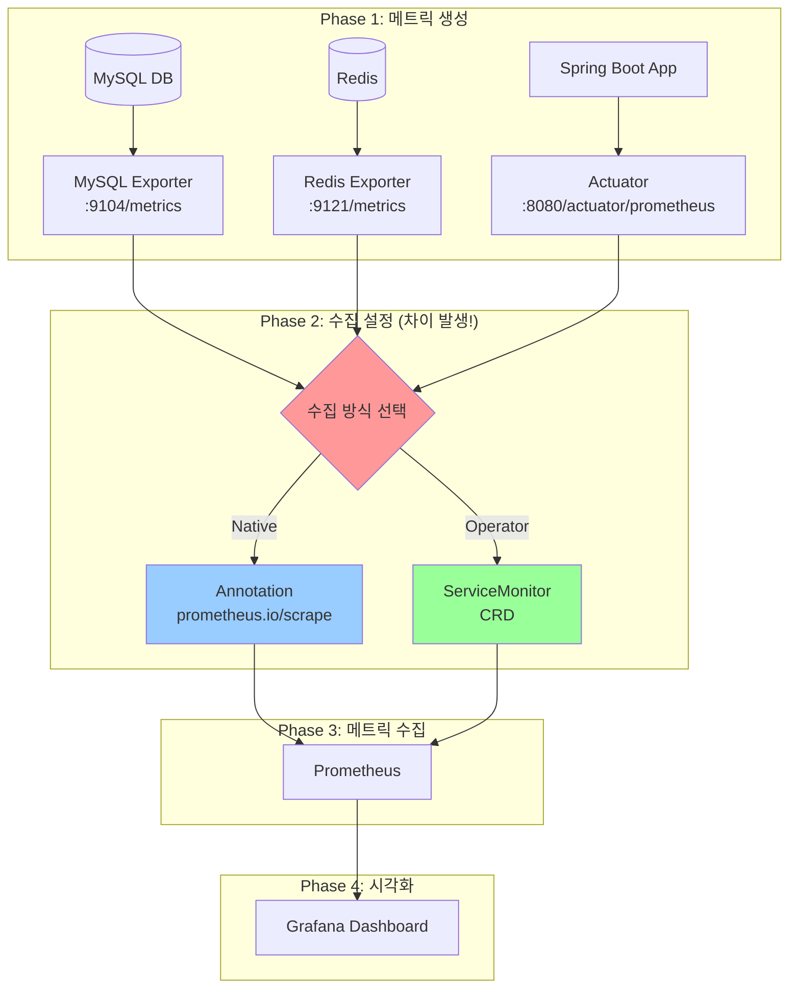
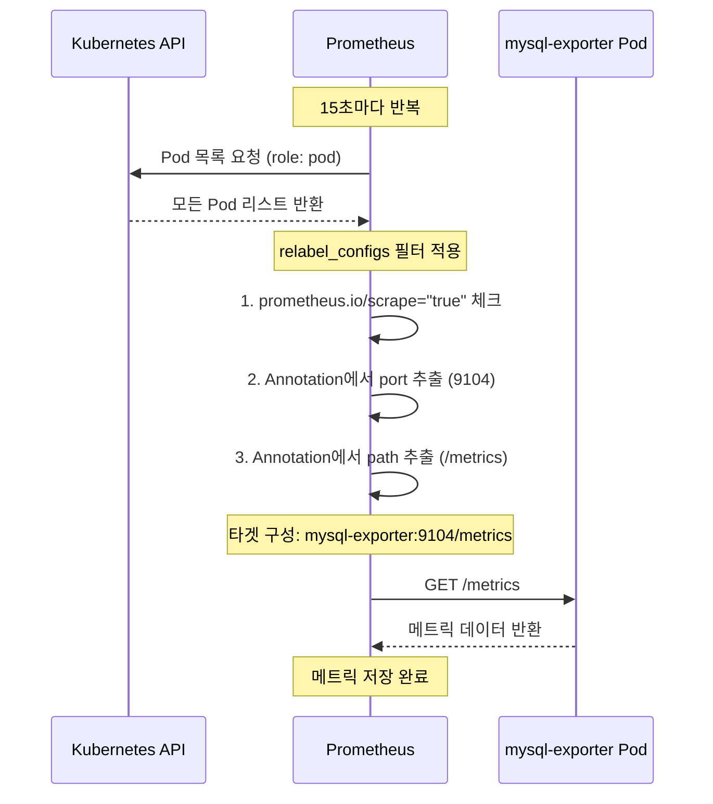
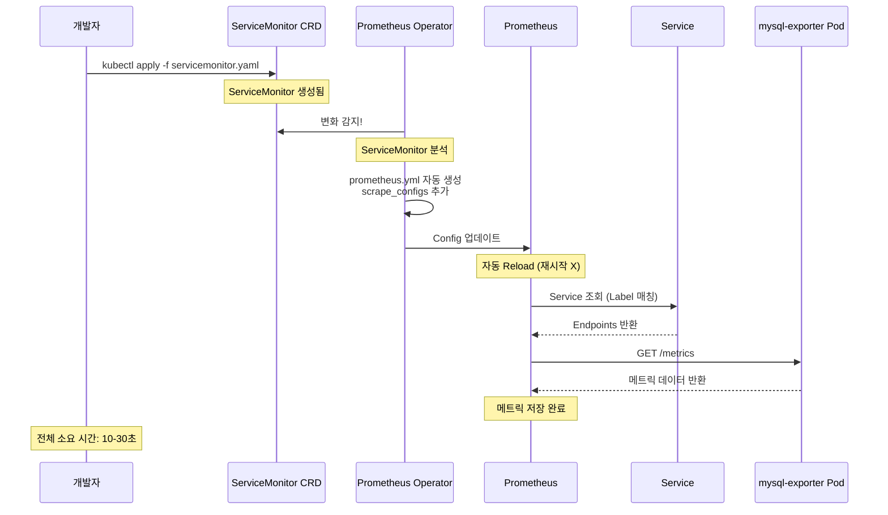
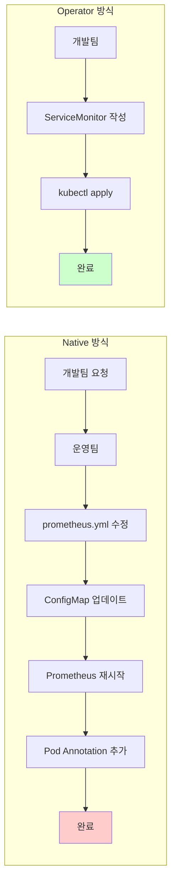

# Prometheus Native vs Operator - 수집 방식 완벽 비교

## 📌 핵심 개념

> **두 방식 모두 같은 메트릭을 수집합니다. 차이는 "어떻게 수집 대상을 설정하느냐"입니다.**

```
Prometheus Native (전통적):
└─ prometheus.yml 파일에 직접 작성
   └─ 재시작/reload 필요 (설정 변경 시)

Prometheus Operator (현대적):
└─ Kubernetes CRD로 선언적 관리
   └─ 자동 반영 (재시작 불필요)
```

## 🎯 전체 데이터 흐름



## 🏗️ 아키텍처 비교

### Native 아키텍처

```
┌────────────────────────────────────────────────────┐
│           Prometheus Pod                           │
│  ┌──────────────────────────────────────────────┐  │
│  │ ConfigMap: prometheus.yml                    │  │
│  │                                              │  │
│  │ scrape_configs:                              │  │
│  │   - job_name: 'kubernetes-pods'              │  │
│  │     kubernetes_sd_configs:                   │  │
│  │     - role: pod                              │  │
│  │                                              │  │
│  │     relabel_configs:  ← 복잡한 정규표현식!   │  │
│  │       - source_labels: [...]                 │  │
│  │         regex: prometheus.io/scrape          │  │
│  │         action: keep                         │  │
│  └──────────────────────────────────────────────┘  │
└────────────────┬───────────────────────────────────┘
                 │ 15s마다 Scrape
                 ↓
┌────────────────────────────────────────────────────┐
│      모니터링 대상 Pods (Annotation 필수)          │
├────────────────────────────────────────────────────┤
│  ┌──────────────────────────────────────────────┐  │
│  │ mysql-exporter                               │  │
│  │   metadata:                                  │  │
│  │     annotations:                             │  │
│  │       prometheus.io/scrape: "true"    ← 필수 │  │
│  │       prometheus.io/port: "9104"      ← 필수 │  │
│  │       prometheus.io/path: "/metrics"  ← 필수 │  │
│  └──────────────────────────────────────────────┘  │
│                                                    │
│  ┌──────────────────────────────────────────────┐  │
│  │ redis-exporter                               │  │
│  │   annotations:                               │  │
│  │       prometheus.io/scrape: "true"           │  │
│  │       prometheus.io/port: "9121"             │  │
│  └──────────────────────────────────────────────┘  │
└────────────────────────────────────────────────────┘

⚠️  설정 변경 시:
1. prometheus.yml 수정
2. ConfigMap 업데이트
3. Prometheus Pod 재시작 또는 reload API 호출
```

### Operator 아키텍처

```
┌────────────────────────────────────────────────────┐
│        Prometheus Operator (감시자)                │
│  ┌──────────────────────────────────────────────┐  │
│  │ ServiceMonitor 변화 감지                     │  │
│  │ PodMonitor 변화 감지                         │  │
│  │ Probe 변화 감지                              │  │
│  │                                              │  │
│  │ → prometheus.yml 자동 생성 ✨                │  │
│  │ → Prometheus에 자동 반영 ✨                  │  │
│  └──────────────────────────────────────────────┘  │
└────────────────┬───────────────────────────────────┘
                 │ Config 주입
                 ↓
┌────────────────────────────────────────────────────┐
│        Prometheus Pod (자동 관리됨)                │
│  └─ prometheus.yml (Operator가 자동 생성)          │
└────────────────┬───────────────────────────────────┘
                 │ 15s마다 Scrape
                 ↓
┌────────────────────────────────────────────────────┐
│         ServiceMonitor CRD (선언적 설정)           │
├────────────────────────────────────────────────────┤
│  ┌──────────────────────────────────────────────┐  │
│  │ mysql-exporter-monitor                       │  │
│  │   selector:                                  │  │
│  │     matchLabels:                             │  │
│  │       app: mysql-exporter    ← Label 매칭    │  │
│  │   endpoints:                                 │  │
│  │   - port: metrics                            │  │
│  │     interval: 30s                            │  │
│  └──────────────────────────────────────────────┘  │
│                      ↓ Label로 자동 매칭            │
│  ┌──────────────────────────────────────────────┐  │
│  │ Service: mysql-exporter                      │  │
│  │   labels:                                    │  │
│  │     app: mysql-exporter      ← 매칭됨!       │  │
│  │   ports:                                     │  │
│  │   - name: metrics                            │  │
│  │     port: 9104                               │  │
│  └──────────────────────────────────────────────┘  │
└────────────────────────────────────────────────────┘

✅ 설정 변경 시:
1. ServiceMonitor YAML 수정
2. kubectl apply
3. 자동 반영 (재시작 불필요!)
```

## 📊 Native 방식 상세

### 설정 파일 구조

```yaml
# prometheus.yml (ConfigMap에 저장)

global:
  scrape_interval: 15s
  evaluation_interval: 15s

scrape_configs:
  # ━━━━━━━━━━━━━━━━━━━━━━━━━━━━━━━━━━━━━━━━━
  # Job 1: Kubernetes Pods (Annotation 기반)
  # ━━━━━━━━━━━━━━━━━━━━━━━━━━━━━━━━━━━━━━━━━
  - job_name: 'kubernetes-pods'

    # Kubernetes API로 Pod 목록 자동 발견
    kubernetes_sd_configs:
    - role: pod

    # ⚠️ 복잡한 relabel_configs (정규표현식)
    relabel_configs:
    # 1. prometheus.io/scrape: "true" 있는 Pod만 수집
    - source_labels: [__meta_kubernetes_pod_annotation_prometheus_io_scrape]
      action: keep
      regex: true

    # 2. prometheus.io/path 경로 사용
    - source_labels: [__meta_kubernetes_pod_annotation_prometheus_io_path]
      action: replace
      target_label: __metrics_path__
      regex: (.+)

    # 3. prometheus.io/port 포트 사용
    - source_labels: [__address__, __meta_kubernetes_pod_annotation_prometheus_io_port]
      action: replace
      regex: ([^:]+)(?::\d+)?;(\d+)
      replacement: $1:$2
      target_label: __address__

    # 4. Pod 이름을 label로 추가
    - source_labels: [__meta_kubernetes_pod_name]
      target_label: pod

    # 5. Namespace를 label로 추가
    - source_labels: [__meta_kubernetes_namespace]
      target_label: namespace
```

### Pod에 Annotation 추가

```yaml
# MySQL Exporter 배포
apiVersion: apps/v1
kind: Deployment
metadata:
  name: mysql-exporter
  namespace: shopping-mall
spec:
  replicas: 1
  selector:
    matchLabels:
      app: mysql-exporter
  template:
    metadata:
      labels:
        app: mysql-exporter
      annotations:
        # ⭐ Prometheus Native에서 필수!
        prometheus.io/scrape: "true"
        prometheus.io/port: "9104"
        prometheus.io/path: "/metrics"
    spec:
      containers:
      - name: mysql-exporter
        image: prom/mysqld-exporter:latest
        env:
        - name: DATA_SOURCE_NAME
          value: "user:password@(mysql:3306)/"
        ports:
        - containerPort: 9104
          name: metrics
```

### 작동 흐름



### Native 방식의 문제점

```
┌────────────────────────────────────────────────┐
│ 1. 복잡한 설정                                 │
├────────────────────────────────────────────────┤
│ - relabel_configs 정규표현식 난이도 높음       │
│ - 실수하기 쉬움 (regex 오타)                   │
│ - 디버깅 어려움                                │
└────────────────────────────────────────────────┘

┌────────────────────────────────────────────────┐
│ 2. 설정 변경 = 재배포                          │
├────────────────────────────────────────────────┤
│ prometheus.yml 수정                            │
│       ↓                                        │
│ ConfigMap 업데이트                             │
│       ↓                                        │
│ Prometheus Pod 재시작 or reload API 호출       │
│       ↓                                        │
│ 서비스 중단 위험 (짧지만)                      │
└────────────────────────────────────────────────┘

┌────────────────────────────────────────────────┐
│ 3. 중앙 집중식 관리                            │
├────────────────────────────────────────────────┤
│ - 모든 설정이 한 파일 (prometheus.yml)        │
│ - 네임스페이스별 분리 어려움                   │
│ - 운영팀이 모든 변경 처리 (병목)               │
└────────────────────────────────────────────────┘

┌────────────────────────────────────────────────┐
│ 4. 협업 어려움                                 │
├────────────────────────────────────────────────┤
│ 개발팀: "새 서비스 모니터링 추가해주세요"      │
│    ↓                                           │
│ 운영팀: prometheus.yml 수정 필요               │
│    ↓                                           │
│ 승인 프로세스 + 배포 대기                      │
│    ↓                                           │
│ 느린 반영 (수 시간 ~ 수 일)                    │
└────────────────────────────────────────────────┘
```

## 🚀 Operator 방식 상세

### Operator 패턴이란?

```
┌─────────────────────────────────────────────────┐
│ Kubernetes Operator 패턴                        │
├─────────────────────────────────────────────────┤
│                                                 │
│ 개념: "사람의 운영 지식을 코드로 자동화"         │
│                                                 │
│ 구성:                                           │
│ ┌─────────────────────────────────────────┐     │
│ │ 1. Custom Resource Definition (CRD)     │     │
│ │    - 새로운 Kubernetes 리소스 타입       │     │
│ │    - 예: ServiceMonitor, PodMonitor     │     │
│ └─────────────────────────────────────────┘     │
│                  ↓                              │
│ ┌─────────────────────────────────────────┐     │
│ │ 2. Controller (감시자)                  │     │
│ │    - CRD 변화 감시                      │     │
│ │    - 자동 조치 실행                     │     │
│ └─────────────────────────────────────────┘     │
│                                                 │
│ 예시:                                           │
│ ServiceMonitor 생성                             │
│    ↓                                            │
│ Operator 감지                                   │
│    ↓                                            │
│ prometheus.yml 자동 생성                        │
│    ↓                                            │
│ Prometheus에 자동 반영                          │
└─────────────────────────────────────────────────┘
```

### 3가지 핵심 CRD

```yaml
# ━━━━━━━━━━━━━━━━━━━━━━━━━━━━━━━━━━━━━━━━━
# 1. ServiceMonitor - Service를 통해 수집
# ━━━━━━━━━━━━━━━━━━━━━━━━━━━━━━━━━━━━━━━━━
apiVersion: monitoring.coreos.com/v1
kind: ServiceMonitor
metadata:
  name: mysql-exporter-monitor
  namespace: shopping-mall
spec:
  # 어떤 Service를 모니터링할지
  selector:
    matchLabels:
      app: mysql-exporter

  # Service의 어느 포트에서 수집할지
  endpoints:
  - port: metrics              # Service의 포트 이름
    path: /metrics
    interval: 30s
    scheme: http

---
# ━━━━━━━━━━━━━━━━━━━━━━━━━━━━━━━━━━━━━━━━━
# 2. PodMonitor - Pod를 직접 수집 (Service 없이)
# ━━━━━━━━━━━━━━━━━━━━━━━━━━━━━━━━━━━━━━━━━
apiVersion: monitoring.coreos.com/v1
kind: PodMonitor
metadata:
  name: order-service-monitor
  namespace: shopping-mall
spec:
  # 어떤 Pod를 모니터링할지
  selector:
    matchLabels:
      app: order-service

  # Pod의 어느 포트에서 수집할지
  podMetricsEndpoints:
  - port: http
    path: /actuator/prometheus
    interval: 30s

---
# ━━━━━━━━━━━━━━━━━━━━━━━━━━━━━━━━━━━━━━━━━
# 3. Probe - Blackbox 외부 모니터링
# ━━━━━━━━━━━━━━━━━━━━━━━━━━━━━━━━━━━━━━━━━
apiVersion: monitoring.coreos.com/v1
kind: Probe
metadata:
  name: external-websites
  namespace: monitoring
spec:
  # Blackbox Exporter 지정
  prober:
    url: blackbox-exporter:9115
    path: /probe

  # 체크할 대상
  targets:
    staticConfig:
      static:
      - https://google.com
      - https://example.com

  # 체크 방식
  module: http_2xx
  interval: 60s
```

### ServiceMonitor 작동 흐름



### Operator가 자동 생성하는 설정

```yaml
# 사용자가 작성한 것 (간단!)
apiVersion: monitoring.coreos.com/v1
kind: ServiceMonitor
metadata:
  name: mysql-exporter-monitor
spec:
  selector:
    matchLabels:
      app: mysql-exporter
  endpoints:
  - port: metrics
    interval: 30s
```

```yaml
# Operator가 자동으로 생성한 prometheus.yml (복잡!)
scrape_configs:
  - job_name: 'serviceMonitor/shopping-mall/mysql-exporter-monitor/0'

    kubernetes_sd_configs:
    - role: endpoints
      namespaces:
        names:
        - shopping-mall

    relabel_configs:
    - source_labels:
      - __meta_kubernetes_service_label_app
      regex: mysql-exporter
      action: keep

    - source_labels:
      - __meta_kubernetes_endpoint_port_name
      regex: metrics
      action: keep

    - source_labels:
      - __meta_kubernetes_namespace
      target_label: namespace

    - source_labels:
      - __meta_kubernetes_pod_name
      target_label: pod

    - source_labels:
      - __meta_kubernetes_service_name
      target_label: service

    metric_relabel_configs: []
```

**핵심:** 복잡한 relabel_configs를 Operator가 자동 생성!

## 🔗 Exporter 연결

> **관련 문서:** [[01-Exporter-개념|Exporter 개념]], [[02-Exporter-사용-시나리오|Exporter 사용 시나리오]]

### Exporter와 수집 방식의 관계

```
┌─────────────────────────────────────────────────┐
│ Layer 4: 시각화 (Grafana)                       │
│          ↑                                      │
│          │ Query                                │
├─────────────────────────────────────────────────┤
│ Layer 3: 수집 (Prometheus)                      │
│          ↑                                      │
│          │ ← Native vs Operator 차이!           │
│          │   (수집 대상 설정 방식)              │
├─────────────────────────────────────────────────┤
│ Layer 2: 번역 (Exporter)                        │
│          ↑                                      │
│          │ MySQL/Redis 형식 → Prometheus 형식   │
├─────────────────────────────────────────────────┤
│ Layer 1: 데이터 원천 (MySQL, Redis, App)        │
└─────────────────────────────────────────────────┘

Exporter 역할은 동일:
- Native든 Operator든 Exporter는 똑같이 배포
- /metrics 엔드포인트 노출

차이는 수집 설정:
- Native: Annotation + relabel_configs
- Operator: ServiceMonitor CRD
```

### MySQL Exporter 전체 구성 예시

#### Exporter 배포 (공통)

```yaml
# mysql-exporter.yaml
apiVersion: apps/v1
kind: Deployment
metadata:
  name: mysql-exporter
  namespace: shopping-mall
spec:
  replicas: 1
  selector:
    matchLabels:
      app: mysql-exporter
  template:
    metadata:
      labels:
        app: mysql-exporter
    spec:
      containers:
      - name: mysql-exporter
        image: prom/mysqld-exporter:v0.14.0
        env:
        - name: DATA_SOURCE_NAME
          valueFrom:
            secretKeyRef:
              name: mysql-secret
              key: dsn
        ports:
        - containerPort: 9104
          name: metrics
        resources:
          requests:
            memory: "64Mi"
            cpu: "50m"
          limits:
            memory: "128Mi"
            cpu: "100m"

---
apiVersion: v1
kind: Service
metadata:
  name: mysql-exporter
  namespace: shopping-mall
  labels:
    app: mysql-exporter
spec:
  selector:
    app: mysql-exporter
  ports:
  - port: 9104
    targetPort: 9104
    name: metrics
```

#### Native 방식 수집 설정

```yaml
# Deployment에 Annotation 추가
metadata:
  annotations:
    prometheus.io/scrape: "true"
    prometheus.io/port: "9104"
    prometheus.io/path: "/metrics"
```

#### Operator 방식 수집 설정

```yaml
# ServiceMonitor 생성
apiVersion: monitoring.coreos.com/v1
kind: ServiceMonitor
metadata:
  name: mysql-exporter-monitor
  namespace: shopping-mall
spec:
  selector:
    matchLabels:
      app: mysql-exporter
  endpoints:
  - port: metrics
    interval: 30s
```

### 여러 Exporter 동시 관리

```
쇼핑몰 프로젝트 모니터링 구성:
┌────────────────────────────────────────┐
│ 1. MySQL Exporter      :9104/metrics   │
│ 2. Redis Exporter      :9121/metrics   │
│ 3. PostgreSQL Exporter :9187/metrics   │
│ 4. Product Service     :8080/actuator  │
│ 5. Order Service       :8080/actuator  │
│ 6. Cart Service        :8080/actuator  │
│ 7. Blackbox Exporter   :9115/probe     │
└────────────────────────────────────────┘

Native 방식:
└─ prometheus.yml 한 파일에 모든 설정
   └─ relabel_configs 하나로 전부 처리
   └─ 각 Pod에 Annotation 추가

Operator 방식:
└─ ServiceMonitor 7개 생성
   └─ 각각 독립적으로 관리
   └─ 네임스페이스별 분리 가능
```

## 📋 비교표

| 항목 | Native | Operator |
|------|--------|----------|
| **설정 파일** | prometheus.yml | ServiceMonitor CRD |
| **설정 위치** | ConfigMap (중앙 집중) | 각 네임스페이스 (분산) |
| **설정 복잡도** | 높음 (relabel_configs) | 낮음 (선언적) |
| **변경 반영** | 재시작/reload 필요 | 자동 반영 (10-30초) |
| **Pod 설정** | Annotation 필수 | Label만 필요 |
| **디버깅** | 어려움 (regex 오류) | 쉬움 (Label 매칭) |
| **네임스페이스 격리** | 어려움 | 쉬움 (RBAC) |
| **개발팀 셀프서비스** | 불가능 | 가능 |
| **학습 곡선** | 중간 | 높음 (CRD 개념) |
| **GitOps 친화성** | 낮음 | 높음 |
| **프로덕션 사용** | 50% | 50% (증가 중) |
| **신규 프로젝트** | 20% | 80% |

## 🔄 실전 시나리오 비교

### 시나리오 1: 새 서비스 추가



**소요 시간:**
- Native: 30분-1시간 (2팀 협업)
- Operator: 5분 (개발팀 혼자)

### 시나리오 2: 네임스페이스별 권한 분리

#### Native 방식

```
문제:
┌────────────────────────────────────────┐
│ prometheus.yml은 하나                  │
│ monitoring 네임스페이스에 있음         │
│ 개발팀이 직접 수정 불가 (권한 없음)    │
└────────────────────────────────────────┘
        ↓
해결책:
운영팀이 모든 변경 처리 → 병목 발생
```

#### Operator 방식

```yaml
# Team A 네임스페이스
apiVersion: v1
kind: Namespace
metadata:
  name: team-a
  labels:
    monitoring: enabled

---
# Team A의 ServiceMonitor
apiVersion: monitoring.coreos.com/v1
kind: ServiceMonitor
metadata:
  name: team-a-service-monitor
  namespace: team-a    # Team A 네임스페이스
spec:
  selector:
    matchLabels:
      team: a

---
# RBAC: Team A가 자기 네임스페이스 관리
apiVersion: rbac.authorization.k8s.io/v1
kind: Role
metadata:
  name: servicemonitor-admin
  namespace: team-a
rules:
- apiGroups: ["monitoring.coreos.com"]
  resources: ["servicemonitors"]
  verbs: ["*"]

---
apiVersion: rbac.authorization.k8s.io/v1
kind: RoleBinding
metadata:
  name: team-a-servicemonitor-admin
  namespace: team-a
subjects:
- kind: User
  name: team-a-user
roleRef:
  kind: Role
  name: servicemonitor-admin
  apiGroup: rbac.authorization.k8s.io
```

**결과:**
- Team A: team-a 네임스페이스에서 ServiceMonitor 자유롭게 관리
- Team B: team-b 네임스페이스에서 ServiceMonitor 자유롭게 관리
- 서로 간섭 없음

### 시나리오 3: 설정 변경 및 롤백

#### Native 방식

```bash
# 1. 설정 변경
vi prometheus-configmap.yaml
kubectl apply -f prometheus-configmap.yaml

# 2. Prometheus 재시작
kubectl rollout restart statefulset/prometheus -n monitoring

# 3. 문제 발생!

# 4. 롤백
git revert HEAD
kubectl apply -f prometheus-configmap.yaml
kubectl rollout restart statefulset/prometheus -n monitoring

# 총 소요 시간: 5-10분 (서비스 영향 있음)
```

#### Operator 방식

```bash
# 1. 설정 변경
kubectl apply -f servicemonitor.yaml

# 2. 자동 반영 (10-30초)

# 3. 문제 발생!

# 4. 롤백
kubectl delete -f servicemonitor.yaml
# 또는
git revert HEAD
kubectl apply -f servicemonitor.yaml

# 총 소요 시간: 1분 이내 (서비스 영향 최소)
```

## 🎯 마이그레이션 가이드 (Native → Operator)

### Step 1: Operator 설치

```bash
# Helm으로 kube-prometheus-stack 설치
helm repo add prometheus-community https://prometheus-community.github.io/helm-charts
helm repo update

helm install kube-prometheus-stack prometheus-community/kube-prometheus-stack \
  -n monitoring \
  --create-namespace \
  --set prometheus.prometheusSpec.serviceMonitorSelectorNilUsesHelmValues=false
  # ↑ 모든 네임스페이스의 ServiceMonitor 감지
```

### Step 2: 기존 Native 설정 분석

```yaml
# 기존 prometheus.yml에서 발췌
scrape_configs:
  - job_name: 'kubernetes-pods'
    kubernetes_sd_configs:
    - role: pod

    relabel_configs:
    - source_labels: [__meta_kubernetes_pod_annotation_prometheus_io_scrape]
      action: keep
      regex: true
    # ...
```

**수집 중인 대상 확인:**

```bash
# Prometheus UI → Status → Targets
# 또는
kubectl get pods -A -o json | \
  jq -r '.items[] | select(.metadata.annotations."prometheus.io/scrape" == "true") | "\(.metadata.namespace)/\(.metadata.name)"'

# 출력 예시:
# shopping-mall/mysql-exporter-xxx
# shopping-mall/redis-exporter-xxx
# shopping-mall/product-service-xxx
```

### Step 3: ServiceMonitor 생성

```yaml
# mysql-exporter를 ServiceMonitor로 전환

# Before (Native - Annotation)
apiVersion: apps/v1
kind: Deployment
metadata:
  name: mysql-exporter
spec:
  template:
    metadata:
      annotations:
        prometheus.io/scrape: "true"
        prometheus.io/port: "9104"
        prometheus.io/path: "/metrics"

# After (Operator - ServiceMonitor)
---
# 1. Service 확인 (있어야 함)
apiVersion: v1
kind: Service
metadata:
  name: mysql-exporter
  namespace: shopping-mall
  labels:
    app: mysql-exporter
spec:
  selector:
    app: mysql-exporter
  ports:
  - name: metrics
    port: 9104
    targetPort: 9104

---
# 2. ServiceMonitor 생성
apiVersion: monitoring.coreos.com/v1
kind: ServiceMonitor
metadata:
  name: mysql-exporter-monitor
  namespace: shopping-mall
spec:
  selector:
    matchLabels:
      app: mysql-exporter
  endpoints:
  - port: metrics
    path: /metrics
    interval: 30s
```

### Step 4: 검증

```bash
# 1. ServiceMonitor가 정상 생성되었는지
kubectl get servicemonitor -n shopping-mall

# 2. Prometheus UI에서 Targets 확인
# Status → Targets → serviceMonitor/shopping-mall/mysql-exporter-monitor/0

# 3. 메트릭 조회 테스트
# Graph → mysql_up 쿼리
```

### Step 5: Annotation 제거

```yaml
# Annotation 제거 (ServiceMonitor로 전환 완료 후)
apiVersion: apps/v1
kind: Deployment
metadata:
  name: mysql-exporter
spec:
  template:
    metadata:
      labels:
        app: mysql-exporter
      # annotations 섹션 삭제!
```

### Step 6: Native 설정 제거

```bash
# 모든 서비스가 ServiceMonitor로 전환되면
# prometheus.yml의 kubernetes-pods job 제거

# kube-prometheus-stack을 사용하면
# prometheus.yml을 직접 수정할 일이 거의 없음
```

## 🎨 선택 가이드

### 언제 Native를 사용해야 하나?

```
✅ Native 추천:
┌────────────────────────────────────────┐
│ - 간단한 환경 (단일 팀, 서비스 5개 이하)│
│ - Kubernetes 외부 환경 (VM, Bare Metal)│
│ - 기존 Native 설정 유지 (레거시)       │
│ - 빠른 시작 (학습 곡선 최소)           │
│ - Operator 도입 비용 부담              │
└────────────────────────────────────────┘
```

### 언제 Operator를 사용해야 하나?

```
✅ Operator 추천:
┌────────────────────────────────────────┐
│ - 멀티 팀 환경 (네임스페이스별 분리)   │
│ - 서비스 수가 많음 (10개 이상)         │
│ - 개발팀 셀프서비스 필요               │
│ - GitOps 적용 중                       │
│ - 현대적 아키텍처 추구                 │
│ - 포트폴리오 프로젝트 (더 어필됨!)     │
└────────────────────────────────────────┘
```

### 포트폴리오 관점

```
Native:
"Prometheus를 사용할 줄 압니다"

Operator:
"Kubernetes Operator 패턴을 이해하고
 현대적인 모니터링 아키텍처를
 구축할 줄 압니다"

→ Operator가 더 어필됨! ✅
```

## 💡 Operator 추가 기능

### PrometheusRule - Alert 관리

```yaml
# Alert 규칙을 CRD로 관리
apiVersion: monitoring.coreos.com/v1
kind: PrometheusRule
metadata:
  name: mysql-alerts
  namespace: shopping-mall
spec:
  groups:
  - name: mysql
    interval: 30s
    rules:
    - alert: MySQLDown
      expr: mysql_up == 0
      for: 5m
      labels:
        severity: critical
      annotations:
        summary: "MySQL is down"
        description: "MySQL instance {{ $labels.instance }} is down"

    - alert: MySQLTooManyConnections
      expr: |
        mysql_global_status_threads_connected /
        mysql_global_variables_max_connections > 0.8
      for: 5m
      labels:
        severity: warning
      annotations:
        summary: "MySQL connections high"
        description: "MySQL connections at {{ $value | humanizePercentage }}"
```

**Native에서는:** prometheus.yml에 직접 작성
**Operator에서는:** PrometheusRule CRD로 분리 관리

### 네임스페이스 선택적 모니터링

```yaml
# Prometheus 리소스 정의
apiVersion: monitoring.coreos.com/v1
kind: Prometheus
metadata:
  name: prometheus
  namespace: monitoring
spec:
  # ⭐ 특정 네임스페이스만 모니터링
  serviceMonitorNamespaceSelector:
    matchLabels:
      monitoring: enabled

  # ⭐ 특정 Label 있는 ServiceMonitor만
  serviceMonitorSelector:
    matchLabels:
      prometheus: main

  # Alert 설정
  ruleNamespaceSelector:
    matchLabels:
      monitoring: enabled

  ruleSelector:
    matchLabels:
      prometheus: main
```

```yaml
# 네임스페이스에 Label 추가
apiVersion: v1
kind: Namespace
metadata:
  name: shopping-mall
  labels:
    monitoring: enabled    # ⭐ 이 네임스페이스 모니터링됨
```

```yaml
# ServiceMonitor에 Label 추가
apiVersion: monitoring.coreos.com/v1
kind: ServiceMonitor
metadata:
  name: mysql-exporter-monitor
  namespace: shopping-mall
  labels:
    prometheus: main       # ⭐ 이 Prometheus가 수집함
spec:
  selector:
    matchLabels:
      app: mysql-exporter
  endpoints:
  - port: metrics
```

### 다중 Prometheus 운영

```yaml
# Prometheus 1: 프로덕션 전용
apiVersion: monitoring.coreos.com/v1
kind: Prometheus
metadata:
  name: prometheus-prod
  namespace: monitoring
spec:
  serviceMonitorSelector:
    matchLabels:
      environment: production
  retention: 30d
  resources:
    requests:
      memory: 4Gi

---
# Prometheus 2: 개발 환경 전용
apiVersion: monitoring.coreos.com/v1
kind: Prometheus
metadata:
  name: prometheus-dev
  namespace: monitoring
spec:
  serviceMonitorSelector:
    matchLabels:
      environment: development
  retention: 7d
  resources:
    requests:
      memory: 2Gi
```

## 🔗 연관 문서

- [[01-Exporter-개념|Exporter 개념]] - Exporter가 뭔지 이해
- [[02-Exporter-사용-시나리오|Exporter 사용 시나리오]] - 언제 Exporter 필요한지
- [[04-Prometheus-Blackbox-Exporter|Blackbox Exporter]] - 외부 모니터링
- [[09-모니터링-스택-설치-순서|모니터링 스택 설치 순서]] - 전체 구축 순서

## 📚 핵심 정리

```
1. 수집 대상은 동일
   - Native든 Operator든 같은 메트릭 수집
   - Exporter 배포 방식도 동일

2. 차이는 "설정 방식"
   - Native: prometheus.yml + Annotation
   - Operator: ServiceMonitor CRD

3. Operator 장점
   - 선언적 관리 (Kubernetes Native)
   - 자동 반영 (재시작 불필요)
   - 네임스페이스별 분리
   - 개발팀 셀프서비스

4. 신기술 아님
   - Operator: 2018년부터 (6년 이상)
   - 업계 표준으로 자리잡음
   - 신규 프로젝트 80% 이상 사용

5. 포트폴리오 권장
   - Operator 사용 (더 현대적)
   - Native도 이해 (면접 대비)
   - 마이그레이션 경험 어필
```

