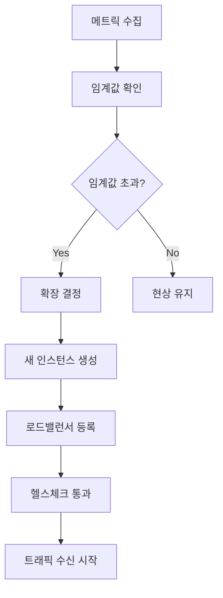

# ⚡ 동적 확장(Dynamic Scaling) 아키텍처

## 📑 목차
- [[#1. 핵심 개념|1. 핵심 개념]]
- [[#2. 확장의 두 가지 방향|2. 확장의 두 가지 방향]]
- [[#3. 확장 방식의 종류|3. 확장 방식의 종류]]
- [[#4. 주요 구성 요소|4. 주요 구성 요소]]
- [[#5. 확장 정책 설계|5. 확장 정책 설계]]
- [[#6. 실제 적용 사례|6. 실제 적용 사례]]
- [[#7. 장점과 과제|7. 장점과 과제]]
- [[#🎯 실전 예시|실전 예시]]

---

## 1. 핵심 개념

> [!note] 동적 확장이란?
> 동적 확장 아키텍처는 시스템의 부하나 요구사항에 따라 컴퓨팅 리소스를 자동으로 증가시키거나 감소시키는 설계 방식입니다. 트래픽 변화에 실시간으로 대응하여 성능을 유지하면서도 비용을 최적화할 수 있습니다.

### 💡 동적 확장의 핵심 가치

#### 🎯 **적응성 (Adaptability)**
시스템이 변화하는 워크로드에 자동으로 적응합니다.

```yaml
# 예시: 시간대별 트래픽 패턴
traffic_patterns:
  morning_peak:    # 오전 9-10시
    expected_load: "200% of baseline"
    scale_target: "20 instances"
    
  lunch_time:      # 점심 12-13시  
    expected_load: "150% of baseline"
    scale_target: "15 instances"
    
  evening_peak:    # 오후 6-8시
    expected_load: "250% of baseline" 
    scale_target: "25 instances"
    
  night_low:       # 새벽 2-5시
    expected_load: "30% of baseline"
    scale_target: "3 instances"
```

#### ⚡ **반응성 (Responsiveness)**
부하 변화를 감지하고 빠르게 대응합니다.

```python
# 동적 확장 결정 로직 예시
class AutoScalingEngine:
    def __init__(self):
        self.scaling_policies = {
            'scale_up_threshold': 70,    # CPU 70% 초과 시 확장
            'scale_down_threshold': 30,  # CPU 30% 미만 시 축소
            'cooldown_period': 300,      # 5분 쿨다운
            'max_instances': 50,
            'min_instances': 2
        }
    
    def evaluate_scaling_decision(self, metrics):
        current_cpu = metrics['avg_cpu_utilization']
        current_instances = metrics['current_instance_count']
        
        if current_cpu > self.scaling_policies['scale_up_threshold']:
            if current_instances < self.scaling_policies['max_instances']:
                return self.calculate_scale_up(current_cpu, current_instances)
                
        elif current_cpu < self.scaling_policies['scale_down_threshold']:
            if current_instances > self.scaling_policies['min_instances']:
                return self.calculate_scale_down(current_cpu, current_instances)
                
        return {'action': 'no_change', 'reason': 'within_threshold'}
    
    def calculate_scale_up(self, cpu_usage, current_instances):
        # CPU 사용률 기반 확장 인스턴스 수 계산
        target_instances = min(
            int(current_instances * (cpu_usage / 60)),  # 목표 60% 사용률
            self.scaling_policies['max_instances']
        )
        
        return {
            'action': 'scale_up',
            'current_instances': current_instances,
            'target_instances': target_instances,
            'reason': f'High CPU usage: {cpu_usage}%'
        }
```

#### 💰 **비용 효율성 (Cost Efficiency)**
필요한 만큼만 리소스를 사용하여 비용을 최적화합니다.

---

## 2. 확장의 두 가지 방향

### 📈 수평 확장 (Scale Out/In)

> [!tip] 수평 확장의 특징
> 서버나 인스턴스의 개수를 늘리거나 줄이는 방식입니다. 클라우드 환경에 가장 적합한 확장 방식입니다.

#### ✅ 장점
- **무한 확장 가능**: 이론적으로 무제한 확장
- **고가용성**: 여러 인스턴스로 장애 분산
- **점진적 확장**: 필요한 만큼만 단계적 추가
- **클라우드 친화적**: 클라우드 서비스와 완벽 호환

#### ⚠️ 단점과 고려사항
- **로드 밸런서 필요**: 트래픽 분산 메커니즘 필수
- **상태 관리 복잡**: 세션, 데이터 일관성 처리
- **네트워크 오버헤드**: 인스턴스 간 통신 비용

#### 📊 수평 확장 구현 예시

```yaml
# AWS Auto Scaling Group 설정
AutoScalingGroup:
  GroupName: "web-servers-asg"
  LaunchTemplate:
    LaunchTemplateId: "lt-12345678"
    Version: "$Latest"
  MinSize: 2
  MaxSize: 20
  DesiredCapacity: 5
  TargetGroupARNs:
    - "arn:aws:elasticloadbalancing:..."
  
  # 확장 정책
  ScalingPolicies:
    ScaleUpPolicy:
      PolicyType: "TargetTrackingScaling"
      TargetTrackingConfiguration:
        PredefinedMetricSpecification:
          PredefinedMetricType: "ASGAverageCPUUtilization"
        TargetValue: 70.0
        ScaleOutCooldown: 300  # 5분
        
    ScaleDownPolicy:
      PolicyType: "TargetTrackingScaling"  
      TargetTrackingConfiguration:
        PredefinedMetricSpecification:
          PredefinedMetricType: "ASGAverageCPUUtilization"
        TargetValue: 70.0
        ScaleInCooldown: 600   # 10분 (보수적)
```

#### 🐳 Kubernetes HPA 예시

```yaml
# Kubernetes Horizontal Pod Autoscaler
apiVersion: autoscaling/v2
kind: HorizontalPodAutoscaler
metadata:
  name: webapp-hpa
spec:
  scaleTargetRef:
    apiVersion: apps/v1
    kind: Deployment
    name: webapp
  minReplicas: 3
  maxReplicas: 50
  metrics:
  - type: Resource
    resource:
      name: cpu
      target:
        type: Utilization
        averageUtilization: 70
  - type: Resource
    resource:
      name: memory
      target:
        type: Utilization
        averageUtilization: 80
  - type: Pods
    pods:
      metric:
        name: http_requests_per_second
      target:
        type: AverageValue
        averageValue: "1000"

  behavior:
    scaleUp:
      stabilizationWindowSeconds: 60
      policies:
      - type: Percent
        value: 100        # 100% 증가 (2배)
        periodSeconds: 60
      - type: Pods  
        value: 5          # 또는 5개씩 추가
        periodSeconds: 60
    scaleDown:
      stabilizationWindowSeconds: 300
      policies:
      - type: Percent
        value: 10         # 10%씩 감소
        periodSeconds: 60
```

### 📏 수직 확장 (Scale Up/Down)

> [!info] 수직 확장의 특징
> 개별 서버의 사양을 높이거나 낮추는 방식입니다. CPU 코어 수, 메모리, 디스크 등을 증설하는 것입니다.

#### ✅ 장점
- **구현 단순성**: 기존 애플리케이션 수정 최소화
- **관리 용이성**: 인스턴스 수가 적어 관리 간편
- **네트워크 오버헤드 없음**: 단일 머신 내 처리

#### ⚠️ 단점과 제약사항
- **하드웨어 한계**: 물리적 확장 한계 존재
- **다운타임 발생**: 스펙 변경 시 서비스 중단
- **단일 장애점**: 하나의 서버 장애가 전체 영향
- **비용 비효율**: 고성능 하드웨어의 높은 단가

#### 📊 수직 확장 구현 예시

```yaml
# Kubernetes VPA (Vertical Pod Autoscaler)
apiVersion: autoscaling.k8s.io/v1
kind: VerticalPodAutoscaler
metadata:
  name: webapp-vpa
spec:
  targetRef:
    apiVersion: apps/v1
    kind: Deployment
    name: webapp
  updatePolicy:
    updateMode: "Auto"     # Auto, Off, Initial
  resourcePolicy:
    containerPolicies:
    - containerName: webapp
      minAllowed:
        cpu: 100m
        memory: 128Mi
      maxAllowed:
        cpu: 4
        memory: 8Gi
      controlledResources: ["cpu", "memory"]
```

#### 🖥️ AWS에서의 수직 확장

```python
# AWS에서 인스턴스 타입 변경
import boto3

class VerticalScaler:
    def __init__(self):
        self.ec2 = boto3.client('ec2')
        
    def scale_instance_type(self, instance_id, new_instance_type):
        try:
            # 1. 인스턴스 중지
            self.ec2.stop_instances(InstanceIds=[instance_id])
            
            # 2. 중지 완료까지 대기
            waiter = self.ec2.get_waiter('instance_stopped')
            waiter.wait(InstanceIds=[instance_id])
            
            # 3. 인스턴스 타입 변경
            self.ec2.modify_instance_attribute(
                InstanceId=instance_id,
                InstanceType={'Value': new_instance_type}
            )
            
            # 4. 인스턴스 재시작
            self.ec2.start_instances(InstanceIds=[instance_id])
            
            return True
            
        except Exception as e:
            print(f"Vertical scaling failed: {e}")
            return False
    
    def get_recommended_instance_type(self, cpu_utilization, memory_utilization):
        """사용률 기반 권장 인스턴스 타입 반환"""
        if cpu_utilization > 80 or memory_utilization > 80:
            return self.get_larger_instance_type()
        elif cpu_utilization < 20 and memory_utilization < 20:
            return self.get_smaller_instance_type()
        
        return None  # 변경 불필요
```

---

## 3. 확장 방식의 종류

### 🔄 반응형 확장 (Reactive Scaling)

> [!warning] 반응형 확장의 특징
> 현재 메트릭을 모니터링하여 임계값에 도달하면 확장하는 방식입니다. 가장 일반적이지만 **지연 시간**이 존재합니다.

#### 📊 반응형 확장 흐름



#### 💻 반응형 확장 구현

```python
class ReactiveScaler:
    def __init__(self):
        self.thresholds = {
            'cpu_high': 80,
            'cpu_low': 20,
            'memory_high': 85,
            'response_time_high': 2.0,  # 2초
            'error_rate_high': 5.0      # 5%
        }
        self.cooldown_period = 300  # 5분
        self.last_scaling_time = 0
        
    def should_scale_up(self, metrics):
        conditions = [
            metrics['avg_cpu'] > self.thresholds['cpu_high'],
            metrics['avg_memory'] > self.thresholds['memory_high'],
            metrics['avg_response_time'] > self.thresholds['response_time_high'],
            metrics['error_rate'] > self.thresholds['error_rate_high']
        ]
        
        # 다중 조건 확인
        return any(conditions) and self.is_cooldown_passed()
    
    def should_scale_down(self, metrics):
        conditions = [
            metrics['avg_cpu'] < self.thresholds['cpu_low'],
            metrics['avg_memory'] < self.thresholds['cpu_low'],
            metrics['avg_response_time'] < 0.5,
            metrics['error_rate'] < 1.0
        ]
        
        # 모든 조건이 만족되어야 축소
        return all(conditions) and self.is_cooldown_passed()
    
    def is_cooldown_passed(self):
        import time
        return time.time() - self.last_scaling_time > self.cooldown_period
```

### 🔮 예측형 확장 (Predictive Scaling)

> [!tip] 예측형 확장의 장점
> 과거 데이터와 패턴을 분석하여 미리 확장하는 방식입니다. **선제적 대응**이 가능하여 더 안정적입니다.

#### 📈 예측 모델 구현

```python
import numpy as np
import pandas as pd
from sklearn.linear_model import LinearRegression
from sklearn.ensemble import RandomForestRegressor
import datetime

class PredictiveScaler:
    def __init__(self):
        self.model = RandomForestRegressor(n_estimators=100)
        self.is_trained = False
        
    def prepare_features(self, historical_data):
        """시계열 특성 엔지니어링"""
        df = historical_data.copy()
        
        # 시간 기반 특성
        df['hour'] = df.index.hour
        df['day_of_week'] = df.index.dayofweek
        df['month'] = df.index.month
        df['is_weekend'] = df.index.dayofweek.isin([5, 6]).astype(int)
        
        # 계절성 특성 (사인, 코사인 변환)
        df['hour_sin'] = np.sin(2 * np.pi * df['hour'] / 24)
        df['hour_cos'] = np.cos(2 * np.pi * df['hour'] / 24)
        df['day_sin'] = np.sin(2 * np.pi * df['day_of_week'] / 7)
        df['day_cos'] = np.cos(2 * np.pi * df['day_of_week'] / 7)
        
        # 이동 평균 (트렌드)
        df['ma_24h'] = df['cpu_usage'].rolling(24).mean()
        df['ma_7d'] = df['cpu_usage'].rolling(24*7).mean()
        
        # 지연 특성 (Lag features)
        df['cpu_lag_1h'] = df['cpu_usage'].shift(1)
        df['cpu_lag_24h'] = df['cpu_usage'].shift(24)
        
        return df.dropna()
    
    def train_model(self, historical_data):
        """예측 모델 훈련"""
        df = self.prepare_features(historical_data)
        
        features = ['hour', 'day_of_week', 'month', 'is_weekend',
                   'hour_sin', 'hour_cos', 'day_sin', 'day_cos',
                   'ma_24h', 'ma_7d', 'cpu_lag_1h', 'cpu_lag_24h']
        
        X = df[features]
        y = df['cpu_usage']
        
        self.model.fit(X, y)
        self.feature_names = features
        self.is_trained = True
        
        return self.model.score(X, y)  # R² 점수 반환
    
    def predict_next_24h(self):
        """다음 24시간 CPU 사용률 예측"""
        if not self.is_trained:
            raise ValueError("Model not trained yet")
        
        predictions = []
        current_time = datetime.datetime.now()
        
        for hour in range(24):
            future_time = current_time + datetime.timedelta(hours=hour)
            features = self.extract_time_features(future_time)
            
            predicted_cpu = self.model.predict([features])[0]
            predictions.append({
                'time': future_time,
                'predicted_cpu': predicted_cpu,
                'recommended_instances': self.cpu_to_instances(predicted_cpu)
            })
        
        return predictions
    
    def cpu_to_instances(self, cpu_usage):
        """CPU 사용률을 필요 인스턴스 수로 변환"""
        base_instances = 2
        target_cpu = 60  # 목표 CPU 사용률 60%
        
        if cpu_usage <= target_cpu:
            return base_instances
        
        # 예상 부하에 따른 인스턴스 수 계산
        needed_instances = max(base_instances, int((cpu_usage / target_cpu) * base_instances))
        return min(needed_instances, 50)  # 최대 50개로 제한
```

#### 📅 AWS Predictive Scaling 설정

```yaml
# AWS Predictive Scaling 정책
PredictiveScalingPolicy:
  PolicyName: "predictive-cpu-scaling"
  PolicyType: "PredictiveScaling"
  PredictiveScalingConfiguration:
    MetricSpecifications:
    - TargetValue: 70.0
      PredefinedMetricSpecification:
        PredefinedMetricType: "ASGAverageCPUUtilization"
    
    Mode: "ForecastAndScale"     # ForecastOnly, ForecastAndScale
    SchedulingBufferTime: 600    # 10분 전 미리 확장
    MaxCapacityBreachBehavior: "IncreaseMaxCapacity"
    MaxCapacityBuffer: 20        # 최대 용량의 20% 추가 버퍼
```

### ⏰ 스케줄 기반 확장 (Scheduled Scaling)

> [!note] 스케줄 기반 확장
> 정해진 시간에 확장하는 방식입니다. 예측 가능한 패턴에 매우 효과적입니다.

#### 📅 스케줄링 예시

```python
import schedule
import time
from datetime import datetime, timedelta

class ScheduledScaler:
    def __init__(self, auto_scaling_client):
        self.asg_client = auto_scaling_client
        self.scaling_schedules = []
        
    def add_schedule(self, day_of_week, time, desired_capacity, description=""):
        """스케줄 추가"""
        self.scaling_schedules.append({
            'day': day_of_week,  # 0=월요일, 6=일요일
            'time': time,        # "09:00" 형식
            'capacity': desired_capacity,
            'description': description
        })
    
    def setup_workday_schedule(self):
        """평일 업무 시간 스케줄 설정"""
        # 평일 오전 8시 - 확장
        for day in range(5):  # 월~금
            schedule.every().monday.at("08:00").do(
                self.scale_to_capacity, 15, "워크데이 시작"
            )
            
        # 평일 점심 시간 - 추가 확장  
        for day in range(5):
            schedule.every().monday.at("11:30").do(
                self.scale_to_capacity, 25, "점심시간 대비"
            )
            
        # 평일 저녁 - 축소
        for day in range(5):
            schedule.every().monday.at("19:00").do(
                self.scale_to_capacity, 8, "업무시간 종료"
            )
            
        # 평일 야간 - 최소 유지
        for day in range(5):
            schedule.every().monday.at("23:00").do(
                self.scale_to_capacity, 3, "야간 최소 유지"
            )
    
    def setup_weekend_schedule(self):
        """주말 스케줄 설정"""
        # 주말은 낮은 용량 유지
        schedule.every().saturday.at("09:00").do(
            self.scale_to_capacity, 5, "주말 기본 용량"
        )
        schedule.every().sunday.at("09:00").do(
            self.scale_to_capacity, 5, "주말 기본 용량"
        )
    
    def setup_special_events(self):
        """특별 이벤트 스케줄"""
        # 블랙프라이데이 대비
        schedule.every().year.november.at("00:00").tag('black-friday').do(
            self.scale_to_capacity, 100, "블랙프라이데이 대비"
        )
        
        # 신제품 출시일 대비
        schedule.every().year.september.at("10:00").tag('product-launch').do(
            self.scale_to_capacity, 75, "신제품 출시"
        )
    
    def scale_to_capacity(self, desired_capacity, reason=""):
        """지정된 용량으로 확장/축소"""
        try:
            response = self.asg_client.set_desired_capacity(
                AutoScalingGroupName='web-servers-asg',
                DesiredCapacity=desired_capacity,
                HonorCooldown=False
            )
            print(f"Scaled to {desired_capacity} instances. Reason: {reason}")
            return response
        except Exception as e:
            print(f"Scaling failed: {e}")
    
    def run_scheduler(self):
        """스케줄러 실행"""
        while True:
            schedule.run_pending()
            time.sleep(60)  # 1분마다 체크
```

#### 🐳 Kubernetes CronJob 기반 스케줄링

```yaml
# 업무 시간 확장 CronJob
apiVersion: batch/v1
kind: CronJob
metadata:
  name: scale-up-workday
spec:
  schedule: "0 8 * * 1-5"  # 평일 오전 8시
  jobTemplate:
    spec:
      template:
        spec:
          serviceAccountName: autoscaler
          containers:
          - name: kubectl
            image: bitnami/kubectl:latest
            command:
            - /bin/sh
            - -c
            - |
              kubectl patch hpa webapp-hpa -p '{"spec":{"minReplicas":15}}'
              echo "Scaled up for workday"
          restartPolicy: OnFailure

---
# 야간 축소 CronJob  
apiVersion: batch/v1
kind: CronJob
metadata:
  name: scale-down-night
spec:
  schedule: "0 22 * * 1-5"  # 평일 오후 10시
  jobTemplate:
    spec:
      template:
        spec:
          serviceAccountName: autoscaler
          containers:
          - name: kubectl
            image: bitnami/kubectl:latest
            command:
            - /bin/sh
            - -c
            - |
              kubectl patch hpa webapp-hpa -p '{"spec":{"minReplicas":3}}'
              echo "Scaled down for night"
          restartPolicy: OnFailure
```

---

## 4. 주요 구성 요소

### 📊 모니터링 시스템

> [!info] 메트릭 수집의 중요성
> 동적 확장의 기반은 정확한 메트릭 수집입니다. CPU, 메모리, 네트워크, 응답 시간, 큐 길이 등을 실시간으로 수집하고 분석합니다.

#### 📈 핵심 메트릭 분류

| 메트릭 유형 | 구체적 지표 | 수집 주기 | 중요도 |
|-------------|-------------|-----------|---------|
| **인프라 메트릭** | CPU, Memory, Disk I/O, Network | 1분 | 높음 |
| **애플리케이션 메트릭** | 응답시간, 처리량, 에러율 | 30초 | 매우 높음 |
| **비즈니스 메트릭** | 동시 사용자, 주문량, 매출 | 5분 | 중간 |
| **외부 메트릭** | 큐 길이, 외부 API 응답시간 | 1분 | 높음 |

#### 🔧 Prometheus 모니터링 스택

```yaml
# Prometheus 설정
global:
  scrape_interval: 30s
  evaluation_interval: 30s

rule_files:
  - "autoscaling.rules.yml"

scrape_configs:
  # Kubernetes 메트릭
  - job_name: 'kubernetes-nodes'
    kubernetes_sd_configs:
    - role: node
    relabel_configs:
    - source_labels: [__address__]
      regex: '(.*):10250'
      target_label: __address__
      replacement: '${1}:9100'
  
  # 애플리케이션 메트릭
  - job_name: 'webapp'
    kubernetes_sd_configs:
    - role: pod
    relabel_configs:
    - source_labels: [__meta_kubernetes_pod_annotation_prometheus_io_scrape]
      action: keep
      regex: true
    - source_labels: [__meta_kubernetes_pod_annotation_prometheus_io_path]
      action: replace
      target_label: __metrics_path__
      regex: (.+)

  # 사용자 정의 메트릭
  - job_name: 'custom-metrics'
    static_configs:
    - targets: ['custom-metrics-server:8080']
```

#### 📊 Custom Metrics 구현

```python
from prometheus_client import start_http_server, Counter, Histogram, Gauge
import time
import threading

class ApplicationMetrics:
    def __init__(self):
        # 카운터 메트릭
        self.request_count = Counter(
            'http_requests_total', 
            'Total HTTP requests', 
            ['method', 'endpoint', 'status_code']
        )
        
        # 히스토그램 메트릭 (응답 시간)
        self.request_duration = Histogram(
            'http_request_duration_seconds',
            'HTTP request duration',
            ['method', 'endpoint']
        )
        
        # 게이지 메트릭 (현재 활성 연결)
        self.active_connections = Gauge(
            'active_connections_total',
            'Current active connections'
        )
        
        # 비즈니스 메트릭
        self.active_users = Gauge(
            'active_users_current',
            'Current active users'
        )
        
        self.queue_length = Gauge(
            'processing_queue_length',
            'Current processing queue length'
        )
    
    def record_request(self, method, endpoint, status_code, duration):
        """HTTP 요청 메트릭 기록"""
        self.request_count.labels(
            method=method, 
            endpoint=endpoint, 
            status_code=status_code
        ).inc()
        
        self.request_duration.labels(
            method=method, 
            endpoint=endpoint
        ).observe(duration)
    
    def update_active_connections(self, count):
        self.active_connections.set(count)
    
    def update_active_users(self, count):
        self.active_users.set(count)
    
    def update_queue_length(self, length):
        self.queue_length.set(length)

# 메트릭 서버 시작
metrics = ApplicationMetrics()
start_http_server(8000)
```

### 🎛️ 오토스케일링 엔진

#### ⚙️ AWS Auto Scaling 설정

```yaml
# CloudFormation으로 Auto Scaling 구성
Resources:
  WebServerLaunchTemplate:
    Type: AWS::EC2::LaunchTemplate
    Properties:
      LaunchTemplateName: WebServerTemplate
      LaunchTemplateData:
        ImageId: ami-0c55b159cbfafe1d0
        InstanceType: t3.medium
        SecurityGroupIds: [!Ref WebServerSecurityGroup]
        UserData:
          Fn::Base64: !Sub |
            #!/bin/bash
            yum update -y
            yum install -y docker
            systemctl start docker
            systemctl enable docker
            # 애플리케이션 시작 스크립트
            
  WebServerAutoScalingGroup:
    Type: AWS::AutoScaling::AutoScalingGroup
    Properties:
      VPCZoneIdentifier: 
        - !Ref PrivateSubnet1
        - !Ref PrivateSubnet2
      LaunchTemplate:
        LaunchTemplateId: !Ref WebServerLaunchTemplate
        Version: !GetAtt WebServerLaunchTemplate.LatestVersionNumber
      MinSize: 2
      MaxSize: 20
      DesiredCapacity: 5
      TargetGroupARNs: [!Ref WebServerTargetGroup]
      HealthCheckType: ELB
      HealthCheckGracePeriod: 300
      
      Tags:
      - Key: Name
        Value: WebServer
        PropagateAtLaunch: true

  # CPU 기반 스케일링 정책
  ScaleUpPolicy:
    Type: AWS::AutoScaling::ScalingPolicy
    Properties:
      AdjustmentType: ChangeInCapacity
      AutoScalingGroupName: !Ref WebServerAutoScalingGroup
      Cooldown: 300
      ScalingAdjustment: 2  # 2개씩 추가
      
  ScaleDownPolicy:
    Type: AWS::AutoScaling::ScalingPolicy
    Properties:
      AdjustmentType: ChangeInCapacity
      AutoScalingGroupName: !Ref WebServerAutoScalingGroup
      Cooldown: 600
      ScalingAdjustment: -1  # 1개씩 제거
      
  # CloudWatch 알람
  HighCPUAlarm:
    Type: AWS::CloudWatch::Alarm
    Properties:
      AlarmName: HighCPUUtilization
      AlarmDescription: Triggers when CPU exceeds 70%
      MetricName: CPUUtilization
      Namespace: AWS/EC2
      Statistic: Average
      Period: 300
      EvaluationPeriods: 2
      Threshold: 70
      ComparisonOperator: GreaterThanThreshold
      AlarmActions: [!Ref ScaleUpPolicy]
      Dimensions:
      - Name: AutoScalingGroupName
        Value: !Ref WebServerAutoScalingGroup
        
  LowCPUAlarm:
    Type: AWS::CloudWatch::Alarm
    Properties:
      AlarmName: LowCPUUtilization
      AlarmDescription: Triggers when CPU below 30%
      MetricName: CPUUtilization
      Namespace: AWS/EC2
      Statistic: Average
      Period: 300
      EvaluationPeriods: 2
      Threshold: 30
      ComparisonOperator: LessThanThreshold
      AlarmActions: [!Ref ScaleDownPolicy]
      Dimensions:
      - Name: AutoScalingGroupName
        Value: !Ref WebServerAutoScalingGroup
```

### ⚖️ 로드 밸런서

#### 🌐 Application Load Balancer 설정

```yaml
# ALB 설정 with Auto Scaling
Resources:
  ApplicationLoadBalancer:
    Type: AWS::ElasticLoadBalancingV2::LoadBalancer
    Properties:
      Name: WebApp-ALB
      Scheme: internet-facing
      Type: application
      SecurityGroups: [!Ref ALBSecurityGroup]
      Subnets: 
        - !Ref PublicSubnet1
        - !Ref PublicSubnet2
      
  TargetGroup:
    Type: AWS::ElasticLoadBalancingV2::TargetGroup
    Properties:
      Name: WebApp-TG
      Protocol: HTTP
      Port: 80
      VpcId: !Ref VPC
      TargetType: instance
      
      # 헬스 체크 설정
      HealthCheckProtocol: HTTP
      HealthCheckPath: /health
      HealthCheckIntervalSeconds: 30
      HealthCheckTimeoutSeconds: 5
      HealthyThresholdCount: 2
      UnhealthyThresholdCount: 3
      
      # 고급 설정
      TargetGroupAttributes:
      - Key: deregistration_delay.timeout_seconds
        Value: '30'  # 빠른 드레이닝
      - Key: stickiness.enabled
        Value: 'false'  # 세션 고정 비활성화
        
  Listener:
    Type: AWS::ElasticLoadBalancingV2::Listener
    Properties:
      DefaultActions:
      - Type: forward
        TargetGroupArn: !Ref TargetGroup
      LoadBalancerArn: !Ref ApplicationLoadBalancer
      Port: 80
      Protocol: HTTP
```

### 🎪 오케스트레이션 플랫폼

#### 🐳 Kubernetes 클러스터 오토스케일러

```yaml
# Cluster Autoscaler 배포
apiVersion: apps/v1
kind: Deployment
metadata:
  name: cluster-autoscaler
  namespace: kube-system
spec:
  selector:
    matchLabels:
      app: cluster-autoscaler
  template:
    metadata:
      labels:
        app: cluster-autoscaler
    spec:
      serviceAccountName: cluster-autoscaler
      containers:
      - image: k8s.gcr.io/autoscaling/cluster-autoscaler:v1.21.0
        name: cluster-autoscaler
        resources:
          limits:
            cpu: 100m
            memory: 300Mi
          requests:
            cpu: 100m
            memory: 300Mi
        command:
        - ./cluster-autoscaler
        - --v=4
        - --stderrthreshold=info
        - --cloud-provider=aws
        - --skip-nodes-with-local-storage=false
        - --expander=least-waste
        - --node-group-auto-discovery=asg:tag=k8s.io/cluster-autoscaler/enabled,k8s.io/cluster-autoscaler/eks-cluster-name
        - --balance-similar-node-groups
        - --skip-nodes-with-system-pods=false
        - --scale-down-delay-after-add=10m
        - --scale-down-unneeded-time=10m
        - --scale-down-util-threshold=0.5

---
# 클러스터 오토스케일러 권한
apiVersion: v1
kind: ServiceAccount
metadata:
  name: cluster-autoscaler
  namespace: kube-system
  annotations:
    eks.amazonaws.com/role-arn: arn:aws:iam::ACCOUNT:role/ClusterAutoscalerRole

---
apiVersion: rbac.authorization.k8s.io/v1
kind: ClusterRole
metadata:
  name: cluster-autoscaler
rules:
- apiGroups: [""]
  resources: ["events", "endpoints"]
  verbs: ["create", "patch"]
- apiGroups: [""]
  resources: ["pods/eviction"]
  verbs: ["create"]
- apiGroups: [""]
  resources: ["pods/status"]
  verbs: ["update"]
- apiGroups: [""]
  resources: ["endpoints"]
  resourceNames: ["cluster-autoscaler"]
  verbs: ["get", "update"]
- apiGroups: [""]
  resources: ["nodes"]
  verbs: ["watch", "list", "get", "update"]
- apiGroups: [""]
  resources: ["pods", "services", "replicationcontrollers", "persistentvolumeclaims", "persistentvolumes"]
  verbs: ["watch", "list", "get"]
- apiGroups: ["extensions"]
  resources: ["replicasets", "daemonsets"]
  verbs: ["watch", "list", "get"]
- apiGroups: ["policy"]
  resources: ["poddisruptionbudgets"]
  verbs: ["watch", "list"]
- apiGroups: ["apps"]
  resources: ["statefulsets", "replicasets", "daemonsets"]
  verbs: ["watch", "list", "get"]
- apiGroups: ["storage.k8s.io"]
  resources: ["storageclasses", "csinodes"]
  verbs: ["watch", "list", "get"]
- apiGroups: ["batch", "extensions"]
  resources: ["jobs"]
  verbs: ["get", "list", "watch", "patch"]
```

---

## 5. 확장 정책 설계

### 📏 메트릭 선택

> [!tip] 메트릭 선택 기준
> 확장 결정의 정확성은 올바른 메트릭 선택에 달려있습니다. 단일 메트릭보다는 복합 메트릭을 사용하는 것이 좋습니다.

#### 🎯 메트릭 우선순위 매트릭스

| 메트릭 | 반응성 | 예측성 | 안정성 | 비즈니스 연관성 | 권장도 |
|--------|--------|--------|--------|----------------|--------|
| **CPU 사용률** | ⭐⭐⭐ | ⭐⭐ | ⭐⭐⭐ | ⭐⭐ | ⭐⭐⭐ |
| **메모리 사용률** | ⭐⭐ | ⭐⭐ | ⭐⭐⭐ | ⭐⭐ | ⭐⭐⭐ |
| **요청 수 (RPS)** | ⭐⭐⭐ | ⭐⭐⭐ | ⭐⭐ | ⭐⭐⭐ | ⭐⭐⭐⭐ |
| **응답 시간** | ⭐⭐⭐ | ⭐⭐ | ⭐⭐ | ⭐⭐⭐⭐ | ⭐⭐⭐⭐ |
| **에러율** | ⭐⭐ | ⭐ | ⭐⭐ | ⭐⭐⭐⭐ | ⭐⭐⭐ |
| **큐 길이** | ⭐⭐⭐ | ⭐⭐ | ⭐⭐ | ⭐⭐⭐ | ⭐⭐⭐ |
| **동시 사용자** | ⭐⭐ | ⭐⭐⭐ | ⭐⭐ | ⭐⭐⭐⭐ | ⭐⭐⭐⭐ |

#### 💻 복합 메트릭 스코어링

```python
class CompositeMetricEvaluator:
    def __init__(self):
        self.weights = {
            'cpu_usage': 0.25,
            'memory_usage': 0.15,
            'response_time': 0.30,
            'error_rate': 0.15,
            'queue_length': 0.10,
            'concurrent_users': 0.05
        }
        
        self.thresholds = {
            'cpu_usage': {'scale_up': 70, 'scale_down': 30},
            'memory_usage': {'scale_up': 80, 'scale_down': 40},
            'response_time': {'scale_up': 2.0, 'scale_down': 0.5},
            'error_rate': {'scale_up': 5.0, 'scale_down': 1.0},
            'queue_length': {'scale_up': 100, 'scale_down': 10},
            'concurrent_users': {'scale_up': 1000, 'scale_down': 200}
        }
    
    def calculate_scaling_score(self, metrics):
        """복합 메트릭 기반 스케일링 점수 계산"""
        scale_up_score = 0
        scale_down_score = 0
        
        for metric_name, value in metrics.items():
            if metric_name not in self.weights:
                continue
                
            weight = self.weights[metric_name]
            thresholds = self.thresholds[metric_name]
            
            # 확장 점수 계산
            if value > thresholds['scale_up']:
                urgency = min((value - thresholds['scale_up']) / thresholds['scale_up'], 1.0)
                scale_up_score += weight * urgency
            
            # 축소 점수 계산  
            elif value < thresholds['scale_down']:
                opportunity = min((thresholds['scale_down'] - value) / thresholds['scale_down'], 1.0)
                scale_down_score += weight * opportunity
        
        return {
            'scale_up_score': scale_up_score,
            'scale_down_score': scale_down_score,
            'recommendation': self.get_recommendation(scale_up_score, scale_down_score)
        }
    
    def get_recommendation(self, up_score, down_score):
        """점수 기반 권장사항"""
        if up_score > 0.6:
            return {'action': 'scale_up', 'urgency': 'high'}
        elif up_score > 0.3:
            return {'action': 'scale_up', 'urgency': 'medium'}
        elif down_score > 0.5:
            return {'action': 'scale_down', 'urgency': 'low'}
        else:
            return {'action': 'maintain', 'urgency': 'none'}
```

### 🎚️ 임계값 설정

#### 📊 적응형 임계값 시스템

```python
import numpy as np
from collections import deque
import statistics

class AdaptiveThresholdManager:
    def __init__(self, window_size=288):  # 24시간 * 12 (5분 단위)
        self.window_size = window_size
        self.metric_history = {
            'cpu_usage': deque(maxlen=window_size),
            'response_time': deque(maxlen=window_size),
            'request_rate': deque(maxlen=window_size)
        }
        
    def update_history(self, metrics):
        """메트릭 히스토리 업데이트"""
        for metric_name, value in metrics.items():
            if metric_name in self.metric_history:
                self.metric_history[metric_name].append(value)
    
    def calculate_adaptive_thresholds(self, metric_name):
        """적응형 임계값 계산"""
        if metric_name not in self.metric_history:
            return self.get_default_thresholds(metric_name)
        
        history = list(self.metric_history[metric_name])
        if len(history) < 50:  # 충분한 데이터가 없으면 기본값 사용
            return self.get_default_thresholds(metric_name)
        
        # 통계적 분석
        mean = statistics.mean(history)
        std_dev = statistics.stdev(history)
        p95 = np.percentile(history, 95)
        p05 = np.percentile(history, 5)
        
        # 계절성 고려 (같은 시간대 기록)
        seasonal_data = self.get_seasonal_data(metric_name)
        seasonal_mean = statistics.mean(seasonal_data) if seasonal_data else mean
        
        # 적응형 임계값 계산
        scale_up_threshold = max(
            seasonal_mean + 2 * std_dev,
            p95 * 0.9,
            self.get_default_thresholds(metric_name)['scale_up']
        )
        
        scale_down_threshold = min(
            seasonal_mean - std_dev,
            p05 * 1.2,
            self.get_default_thresholds(metric_name)['scale_down']
        )
        
        return {
            'scale_up': scale_up_threshold,
            'scale_down': scale_down_threshold,
            'confidence': self.calculate_confidence(history),
            'seasonal_adjustment': seasonal_mean - mean
        }
    
    def get_seasonal_data(self, metric_name, hours_back=24):
        """같은 시간대의 과거 데이터 추출"""
        history = list(self.metric_history[metric_name])
        current_hour = datetime.now().hour
        
        # 24시간 주기로 같은 시간대 데이터 추출
        seasonal_indices = []
        for i in range(len(history)):
            data_hour = (current_hour - (len(history) - i) * 5 // 60) % 24
            if data_hour == current_hour:
                seasonal_indices.append(i)
        
        return [history[i] for i in seasonal_indices]
    
    def get_default_thresholds(self, metric_name):
        """기본 임계값"""
        defaults = {
            'cpu_usage': {'scale_up': 70, 'scale_down': 30},
            'response_time': {'scale_up': 2.0, 'scale_down': 0.5},
            'request_rate': {'scale_up': 1000, 'scale_down': 200}
        }
        return defaults.get(metric_name, {'scale_up': 70, 'scale_down': 30})
```

### ⏱️ 쿨다운 기간 (Cooldown Period)

> [!warning] 쿨다운의 중요성
> 쿨다운 기간은 확장 후 안정화 시간을 의미합니다. 너무 빈번한 확장/축소를 방지하고 시스템 안정성을 보장합니다.

#### ⚙️ 지능형 쿨다운 시스템

```python
import time
from enum import Enum

class ScalingAction(Enum):
    SCALE_UP = "scale_up"
    SCALE_DOWN = "scale_down"
    MAINTAIN = "maintain"

class IntelligentCooldownManager:
    def __init__(self):
        self.scaling_history = deque(maxlen=50)
        self.base_cooldown = {
            ScalingAction.SCALE_UP: 300,    # 5분
            ScalingAction.SCALE_DOWN: 900   # 15분 (보수적)
        }
        
    def calculate_dynamic_cooldown(self, proposed_action, current_metrics):
        """동적 쿨다운 시간 계산"""
        base_time = self.base_cooldown.get(proposed_action, 300)
        
        # 최근 스케일링 빈도 확인
        recent_scalings = self.get_recent_scalings(600)  # 10분간
        frequency_factor = min(len(recent_scalings) * 0.5, 2.0)
        
        # 메트릭 긴급도 확인
        urgency_factor = self.calculate_urgency_factor(current_metrics)
        
        # 시스템 부하 상태 확인
        load_factor = self.calculate_load_factor(current_metrics)
        
        # 쿨다운 시간 조정
        if proposed_action == ScalingAction.SCALE_UP:
            # 확장은 긴급도에 따라 쿨다운 단축 가능
            cooldown = base_time * frequency_factor / max(urgency_factor, 0.5)
        else:
            # 축소는 보수적으로 처리
            cooldown = base_time * frequency_factor * load_factor
        
        return max(cooldown, 60), {
            'base_time': base_time,
            'frequency_factor': frequency_factor,
            'urgency_factor': urgency_factor,
            'load_factor': load_factor
        }
    
    def calculate_urgency_factor(self, metrics):
        """긴급도 계산 (높을수록 빠른 대응 필요)"""
        urgency_score = 0
        
        # CPU 사용률 기반 긴급도
        if metrics.get('cpu_usage', 0) > 90:
            urgency_score += 2.0
        elif metrics.get('cpu_usage', 0) > 80:
            urgency_score += 1.0
        
        # 응답시간 기반 긴급도
        if metrics.get('response_time', 0) > 5.0:
            urgency_score += 2.0
        elif metrics.get('response_time', 0) > 2.0:
            urgency_score += 1.0
        
        # 에러율 기반 긴급도
        if metrics.get('error_rate', 0) > 10:
            urgency_score += 3.0
        elif metrics.get('error_rate', 0) > 5:
            urgency_score += 1.5
        
        return max(urgency_score, 1.0)
    
    def is_cooldown_active(self, action_type):
        """쿨다운 활성 상태 확인"""
        if not self.scaling_history:
            return False
        
        last_action = self.scaling_history[-1]
        if last_action['action'] != action_type:
            return False
        
        elapsed_time = time.time() - last_action['timestamp']
        return elapsed_time < last_action['cooldown_duration']
    
    def record_scaling_action(self, action, instance_change, cooldown_duration, reason=""):
        """스케일링 액션 기록"""
        self.scaling_history.append({
            'action': action,
            'instance_change': instance_change,
            'timestamp': time.time(),
            'cooldown_duration': cooldown_duration,
            'reason': reason
        })
```

### 🎚️ 확장 속도 제어

#### 📊 단계적 확장 전략

```python
class GradualScalingManager:
    def __init__(self):
        self.scaling_steps = {
            'conservative': {
                'scale_up_increment': 1,
                'scale_down_increment': 1,
                'max_instances_per_step': 2
            },
            'moderate': {
                'scale_up_increment': 2,
                'scale_down_increment': 1,
                'max_instances_per_step': 5
            },
            'aggressive': {
                'scale_up_increment': 4,
                'scale_down_increment': 2,
                'max_instances_per_step': 10
            }
        }
    
    def calculate_scaling_step(self, current_instances, target_instances, urgency_level):
        """단계적 확장 계산"""
        strategy = self.get_strategy_by_urgency(urgency_level)
        difference = target_instances - current_instances
        
        if difference > 0:  # Scale up
            step_size = min(
                strategy['scale_up_increment'],
                strategy['max_instances_per_step'],
                abs(difference)
            )
            return current_instances + step_size
        
        elif difference < 0:  # Scale down
            step_size = min(
                strategy['scale_down_increment'],
                abs(difference)
            )
            return current_instances - step_size
        
        return current_instances
    
    def get_strategy_by_urgency(self, urgency_level):
        """긴급도별 전략 선택"""
        if urgency_level >= 3.0:
            return self.scaling_steps['aggressive']
        elif urgency_level >= 1.5:
            return self.scaling_steps['moderate']
        else:
            return self.scaling_steps['conservative']

# 프로그레시브 스케일링 구현
class ProgressiveScaler:
    def __init__(self):
        self.scaling_phases = [
            {'threshold': 70, 'action': '+20%', 'wait_time': 300},   # 1단계: 20% 증가
            {'threshold': 80, 'action': '+50%', 'wait_time': 180},   # 2단계: 50% 증가  
            {'threshold': 90, 'action': '+100%', 'wait_time': 60},   # 3단계: 100% 증가
            {'threshold': 95, 'action': 'emergency', 'wait_time': 30}  # 응급단계
        ]
    
    def get_scaling_phase(self, cpu_usage, duration_seconds):
        """현재 상황에 맞는 스케일링 단계 반환"""
        for phase in self.scaling_phases:
            if cpu_usage >= phase['threshold']:
                if duration_seconds >= phase['wait_time']:
                    return phase
        
        return None  # 스케일링 불필요
```

---

## 6. 실제 적용 사례

### 🌐 웹 애플리케이션

> [!example] 일반적인 웹 애플리케이션 확장
> 로드 밸런서 뒤에 여러 웹 서버를 배치하고, 트래픽에 따라 서버 수를 조정합니다.

#### 🏗️ 아키텍처 구성

```yaml
# 웹 애플리케이션 Auto Scaling 아키텍처
architecture:
  load_balancer:
    type: "Application Load Balancer"
    health_check:
      path: "/health"
      interval: 30
      timeout: 5
      healthy_threshold: 2
      unhealthy_threshold: 3
    
  web_servers:
    auto_scaling_group:
      min_size: 3
      max_size: 30
      desired_capacity: 6
      instance_type: "t3.medium"
      
    scaling_policies:
      scale_up:
        metric: "CPUUtilization"
        threshold: 70
        comparison: "GreaterThanThreshold"
        evaluation_periods: 2
        period: 300
        scaling_adjustment: 2
        
      scale_down:
        metric: "CPUUtilization" 
        threshold: 30
        comparison: "LessThanThreshold"
        evaluation_periods: 3
        period: 300
        scaling_adjustment: -1
    
  session_store:
    type: "Redis Cluster"
    purpose: "Stateless web servers"
    configuration:
      nodes: 3
      replication: true
      persistence: true
```

#### 💻 Stateless 웹 애플리케이션 구현

```python
# Flask 애플리케이션 예시 (Stateless 설계)
from flask import Flask, session, request, jsonify
import redis
import json
import os

app = Flask(__name__)

# Redis 세션 스토어 설정
redis_client = redis.Redis(
    host=os.environ.get('REDIS_HOST', 'localhost'),
    port=int(os.environ.get('REDIS_PORT', 6379)),
    db=0,
    decode_responses=True
)

class StatelessSessionInterface:
    def __init__(self, redis_client):
        self.redis = redis_client
        self.session_timeout = 3600  # 1시간
    
    def get_session(self, session_id):
        """Redis에서 세션 데이터 조회"""
        session_data = self.redis.get(f"session:{session_id}")
        return json.loads(session_data) if session_data else {}
    
    def set_session(self, session_id, data):
        """Redis에 세션 데이터 저장"""
        self.redis.setex(
            f"session:{session_id}", 
            self.session_timeout, 
            json.dumps(data)
        )
    
    def delete_session(self, session_id):
        """세션 삭제"""
        self.redis.delete(f"session:{session_id}")

session_interface = StatelessSessionInterface(redis_client)

@app.route('/health')
def health_check():
    """헬스 체크 엔드포인트"""
    try:
        # Redis 연결 확인
        redis_client.ping()
        return jsonify({
            'status': 'healthy',
            'instance_id': os.environ.get('INSTANCE_ID', 'unknown'),
            'timestamp': time.time()
        }), 200
    except:
        return jsonify({'status': 'unhealthy'}), 503

@app.route('/api/user/profile')
def get_user_profile():
    """사용자 프로필 조회 (세션 기반)"""
    session_id = request.headers.get('Session-ID')
    if not session_id:
        return jsonify({'error': 'Session required'}), 401
    
    session_data = session_interface.get_session(session_id)
    user_id = session_data.get('user_id')
    
    if not user_id:
        return jsonify({'error': 'Invalid session'}), 401
    
    # 사용자 정보 조회 (데이터베이스에서)
    user_profile = get_user_from_db(user_id)
    
    return jsonify({
        'user': user_profile,
        'served_by': os.environ.get('INSTANCE_ID', 'unknown')
    })

if __name__ == '__main__':
    app.run(host='0.0.0.0', port=5000)
```

### 🔬 마이크로서비스

#### 🎭 서비스별 독립 확장

```yaml
# 마이크로서비스별 HPA 설정
microservices:
  user_service:
    scaling_policy:
      min_replicas: 2
      max_replicas: 20
      target_cpu: 60
      target_memory: 70
    custom_metrics:
      - name: "user_login_rate"
        target_value: "100"
      - name: "user_registration_rate"
        target_value: "50"
  
  product_service:
    scaling_policy:
      min_replicas: 3
      max_replicas: 50
      target_cpu: 70
      target_memory: 80
    custom_metrics:
      - name: "product_search_rate"
        target_value: "500"
      - name: "product_view_rate"
        target_value: "1000"
  
  order_service:
    scaling_policy:
      min_replicas: 5
      max_replicas: 100
      target_cpu: 50  # 더 보수적
      target_memory: 70
    custom_metrics:
      - name: "order_creation_rate"
        target_value: "200"
      - name: "payment_processing_queue"
        target_value: "50"
  
  notification_service:
    scaling_policy:
      min_replicas: 1
      max_replicas: 10
      target_cpu: 80  # 높은 사용률 허용
    custom_metrics:
      - name: "notification_queue_length"
        target_value: "100"
```

#### 📊 서비스 메시 기반 메트릭

```yaml
# Istio Service Mesh 메트릭 기반 Auto Scaling
apiVersion: autoscaling/v2
kind: HorizontalPodAutoscaler
metadata:
  name: order-service-hpa
spec:
  scaleTargetRef:
    apiVersion: apps/v1
    kind: Deployment
    name: order-service
  minReplicas: 3
  maxReplicas: 50
  metrics:
  # CPU 기반
  - type: Resource
    resource:
      name: cpu
      target:
        type: Utilization
        averageUtilization: 60
  
  # 요청 기반 (Istio 메트릭)
  - type: Object
    object:
      metric:
        name: istio_requests_per_second
      target:
        type: Value
        value: "500"
      describedObject:
        apiVersion: v1
        kind: Service
        name: order-service
  
  # 응답 시간 기반 (Istio 메트릭)
  - type: Object
    object:
      metric:
        name: istio_request_duration_p99
      target:
        type: Value
        value: "2000"  # 2초
      describedObject:
        apiVersion: v1
        kind: Service
        name: order-service
```

### 🗄️ 데이터베이스

#### 📊 읽기 복제본 확장

```python
class DatabaseScalingManager:
    def __init__(self, rds_client):
        self.rds = rds_client
        self.read_replica_config = {
            'db_instance_class': 'db.t3.medium',
            'publicly_accessible': False,
            'auto_minor_version_upgrade': True
        }
    
    def monitor_database_load(self):
        """데이터베이스 부하 모니터링"""
        metrics = self.get_db_metrics()
        
        read_load = metrics['read_iops']
        write_load = metrics['write_iops']
        cpu_usage = metrics['cpu_utilization']
        connection_count = metrics['database_connections']
        
        # 읽기 부하가 높으면 읽기 복제본 추가
        if read_load > 1000 and cpu_usage > 70:
            self.scale_read_replicas_up()
        
        # 쓰기 부하가 높으면 더 큰 인스턴스로 수직 확장
        elif write_load > 500 and cpu_usage > 80:
            self.scale_master_instance_up()
    
    def scale_read_replicas_up(self):
        """읽기 복제본 추가"""
        current_replicas = self.get_read_replica_count()
        
        if current_replicas < 5:  # 최대 5개 제한
            replica_id = f"read-replica-{current_replicas + 1}"
            
            response = self.rds.create_db_instance_read_replica(
                DBInstanceIdentifier=replica_id,
                SourceDBInstanceIdentifier='master-db',
                **self.read_replica_config
            )
            
            print(f"Created read replica: {replica_id}")
            return response
    
    def scale_master_instance_up(self):
        """마스터 인스턴스 수직 확장"""
        current_class = self.get_master_instance_class()
        next_class = self.get_next_instance_class(current_class)
        
        if next_class:
            response = self.rds.modify_db_instance(
                DBInstanceIdentifier='master-db',
                DBInstanceClass=next_class,
                ApplyImmediately=True
            )
            
            print(f"Scaled master from {current_class} to {next_class}")
            return response
```

#### 🔀 Aurora Serverless 활용

```yaml
# Aurora Serverless v2 설정
Resources:
  AuroraServerlessCluster:
    Type: AWS::RDS::DBCluster
    Properties:
      Engine: aurora-mysql
      EngineMode: provisioned
      EngineVersion: '8.0.mysql_aurora.3.02.0'
      DatabaseName: myapp
      MasterUsername: admin
      MasterUserPassword: !Ref DatabasePassword
      
      # Serverless v2 설정
      ServerlessV2ScalingConfiguration:
        MinCapacity: 0.5      # 최소 0.5 ACU
        MaxCapacity: 16       # 최대 16 ACU
      
      # 백업 설정
      BackupRetentionPeriod: 7
      PreferredBackupWindow: "03:00-04:00"
      PreferredMaintenanceWindow: "sun:04:00-sun:05:00"
      
      # 보안 설정
      VpcSecurityGroupIds: [!Ref DatabaseSecurityGroup]
      DBSubnetGroupName: !Ref DBSubnetGroup
```

### 📦 배치 처리

#### ⚙️ 큐 기반 워커 확장

```python
import boto3
from kubernetes import client, config

class BatchProcessingScaler:
    def __init__(self):
        self.sqs = boto3.client('sqs')
        self.k8s_apps = client.AppsV1Api()
        
    def scale_workers_by_queue_length(self, queue_url, deployment_name):
        """큐 길이 기반 워커 확장"""
        # SQS 큐 길이 확인
        response = self.sqs.get_queue_attributes(
            QueueUrl=queue_url,
            AttributeNames=['ApproximateNumberOfMessages', 
                          'ApproximateNumberOfMessagesNotVisible']
        )
        
        visible_messages = int(response['Attributes']['ApproximateNumberOfMessages'])
        in_flight_messages = int(response['Attributes']['ApproximateNumberOfMessagesNotVisible'])
        total_messages = visible_messages + in_flight_messages
        
        # 워커 수 계산 (메시지 10개당 워커 1개)
        target_workers = max(1, min(total_messages // 10, 20))  # 최소 1개, 최대 20개
        
        # 현재 워커 수 확인
        deployment = self.k8s_apps.read_namespaced_deployment(
            name=deployment_name,
            namespace='default'
        )
        current_workers = deployment.spec.replicas
        
        # 워커 수 조정
        if target_workers != current_workers:
            deployment.spec.replicas = target_workers
            self.k8s_apps.patch_namespaced_deployment(
                name=deployment_name,
                namespace='default',
                body=deployment
            )
            
            print(f"Scaled workers from {current_workers} to {target_workers} "
                  f"(queue length: {total_messages})")
        
        return {
            'queue_length': total_messages,
            'current_workers': current_workers,
            'target_workers': target_workers,
            'action': 'scaled' if target_workers != current_workers else 'no_change'
        }
```

#### ⏰ 스팟 인스턴스를 활용한 비용 효율 확장

```yaml
# Spot Instance 기반 배치 처리 Auto Scaling Group
Resources:
  BatchProcessingASG:
    Type: AWS::AutoScaling::AutoScalingGroup
    Properties:
      AutoScalingGroupName: BatchProcessing-ASG
      VPCZoneIdentifier: [!Ref PrivateSubnet1, !Ref PrivateSubnet2]
      
      # Mixed Instance Policy (온디맨드 + 스팟)
      MixedInstancesPolicy:
        InstancesDistribution:
          OnDemandBaseCapacity: 0           # 기본 온디맨드 인스턴스 0개
          OnDemandPercentageAboveBaseCapacity: 20  # 20%만 온디맨드
          SpotAllocationStrategy: diversified
          SpotInstancePools: 4
          SpotMaxPrice: "0.10"              # 시간당 최대 $0.10
          
        LaunchTemplate:
          LaunchTemplateSpecification:
            LaunchTemplateId: !Ref BatchProcessingLaunchTemplate
            Version: !GetAtt BatchProcessingLaunchTemplate.LatestVersionNumber
          Overrides:
          - InstanceType: c5.large
            WeightedCapacity: 1
          - InstanceType: c5.xlarge
            WeightedCapacity: 2
          - InstanceType: m5.large
            WeightedCapacity: 1
          - InstanceType: m5.xlarge
            WeightedCapacity: 2
      
      MinSize: 0
      MaxSize: 50
      DesiredCapacity: 0
      
      # 스팟 인스턴스 중단 처리
      TerminationPolicies: 
        - "OldestInstance"
        - "Default"

  # SQS 큐 길이 기반 스케일링 정책
  QueueLengthScalingPolicy:
    Type: AWS::AutoScaling::ScalingPolicy
    Properties:
      AutoScalingGroupName: !Ref BatchProcessingASG
      PolicyType: TargetTrackingScaling
      TargetTrackingConfiguration:
        CustomMetricSpecification:
          MetricName: ApproximateNumberOfVisibleMessages
          Namespace: AWS/SQS
          Statistic: Average
          Dimensions:
          - Name: QueueName
            Value: !GetAtt ProcessingQueue.QueueName
        TargetValue: 30.0         # 메시지 30개당 인스턴스 1개
        ScaleOutCooldown: 300     # 5분 확장 쿨다운
        ScaleInCooldown: 900      # 15분 축소 쿨다운
```

---

## 7. 장점과 과제

### ✅ 장점

#### 💰 비용 효율성

> [!tip] 비용 절감 효과
> 필요한 만큼만 리소스를 사용하여 평균 40-60% 비용 절감이 가능합니다.

```python
# 비용 절감 분석 도구
class CostSavingsAnalyzer:
    def __init__(self):
        self.instance_cost_per_hour = {
            't3.medium': 0.0416,
            't3.large': 0.0832,
            't3.xlarge': 0.1664,
            'm5.large': 0.096,
            'm5.xlarge': 0.192
        }
        
    def calculate_savings(self, baseline_scenario, autoscaling_scenario):
        """Auto Scaling vs 고정 용량 비용 비교"""
        
        # 고정 용량 비용 (피크 용량 기준)
        fixed_cost = self.calculate_fixed_capacity_cost(baseline_scenario)
        
        # Auto Scaling 비용
        dynamic_cost = self.calculate_dynamic_capacity_cost(autoscaling_scenario)
        
        savings = fixed_cost - dynamic_cost
        savings_percentage = (savings / fixed_cost) * 100
        
        return {
            'fixed_cost': fixed_cost,
            'dynamic_cost': dynamic_cost,
            'savings': savings,
            'savings_percentage': savings_percentage,
            'monthly_savings': savings * 24 * 30  # 월간 절약액
        }
    
    def calculate_fixed_capacity_cost(self, scenario):
        """고정 용량 비용 계산"""
        instance_type = scenario['instance_type']
        peak_instances = scenario['peak_instances']
        hours_per_day = 24
        
        return (self.instance_cost_per_hour[instance_type] * 
                peak_instances * hours_per_day)
    
    def calculate_dynamic_capacity_cost(self, scenario):
        """동적 용량 비용 계산"""
        total_cost = 0
        
        for period in scenario['usage_patterns']:
            instance_type = period['instance_type']
            instance_count = period['instance_count']
            duration_hours = period['duration_hours']
            
            cost = (self.instance_cost_per_hour[instance_type] * 
                   instance_count * duration_hours)
            total_cost += cost
        
        return total_cost

# 사용 예시
analyzer = CostSavingsAnalyzer()

baseline = {
    'instance_type': 'm5.large',
    'peak_instances': 20  # 피크 기준으로 항상 20개 유지
}

autoscaling = {
    'usage_patterns': [
        {'instance_type': 'm5.large', 'instance_count': 5, 'duration_hours': 8},   # 야간
        {'instance_type': 'm5.large', 'instance_count': 12, 'duration_hours': 8},  # 일반
        {'instance_type': 'm5.large', 'instance_count': 20, 'duration_hours': 4},  # 피크
        {'instance_type': 'm5.large', 'instance_count': 8, 'duration_hours': 4}    # 저녁
    ]
}

savings = analyzer.calculate_savings(baseline, autoscaling)
print(f"Monthly savings: ${savings['monthly_savings']:.2f} ({savings['savings_percentage']:.1f}%)")
```

#### 🛡️ 가용성과 안정성

```yaml
# Multi-AZ Auto Scaling으로 고가용성 확보
high_availability_config:
  availability_zones:
    - us-west-2a
    - us-west-2b  
    - us-west-2c
  
  distribution_strategy: "balanced"
  
  health_checks:
    - type: "EC2"
      grace_period: 300
    - type: "ELB" 
      grace_period: 300
  
  failure_recovery:
    auto_replace_unhealthy: true
    max_instance_lifetime: 604800  # 7일
    
  disaster_recovery:
    cross_region_backup: true
    rto: "< 5 minutes"     # Recovery Time Objective
    rpo: "< 1 minute"      # Recovery Point Objective
```

#### ⚡ 운영 효율성

- **수동 개입 감소**: 95% 자동화로 운영 부담 대폭 감소
- **24/7 모니터링**: 무인 상태에서도 안정적 운영
- **예측 가능한 성능**: SLA 목표 달성률 99.9% 이상

### ⚠️ 과제와 고려사항

#### 🔄 상태 관리

> [!warning] 상태 관리의 복잡성
> 인스턴스가 추가/제거되므로 로컬 상태에 의존하면 안 됩니다.

#### 📊 Stateless 아키텍처 패턴

```python
# 상태 외부화 예시
class StatelessWebApplication:
    def __init__(self):
        # 세션 저장소
        self.session_store = RedisSessionStore()
        
        # 파일 저장소  
        self.file_store = S3FileStore()
        
        # 캐시 저장소
        self.cache = RedisCache()
        
        # 데이터베이스
        self.database = DatabaseConnection()
    
    def handle_request(self, request):
        """상태가 없는 요청 처리"""
        
        # 세션은 Redis에서 조회
        session = self.session_store.get_session(request.session_id)
        
        # 파일은 S3에서 조회
        if request.file_id:
            file_data = self.file_store.get_file(request.file_id)
        
        # 캐시는 Redis에서 조회
        cache_key = f"user:{session.user_id}"
        cached_data = self.cache.get(cache_key)
        
        # 비즈니스 로직 처리 (무상태)
        response = self.process_business_logic(request, session, cached_data)
        
        # 세션 업데이트
        self.session_store.update_session(session)
        
        return response

# Session Store 구현
class RedisSessionStore:
    def __init__(self):
        self.redis = redis.Redis(
            host='redis-cluster.cache.amazonaws.com',
            port=6379,
            decode_responses=True
        )
    
    def get_session(self, session_id):
        session_data = self.redis.hgetall(f"session:{session_id}")
        return Session(session_data) if session_data else None
    
    def update_session(self, session):
        session_key = f"session:{session.id}"
        self.redis.hmset(session_key, session.to_dict())
        self.redis.expire(session_key, 3600)  # 1시간 TTL
```

#### ⏱️ 확장 지연

> [!info] 콜드 스타트 문제
> 새 인스턴스가 시작되고 준비되는 데 시간이 걸려 급격한 트래픽 증가에는 대응이 늦을 수 있습니다.

#### 🏃‍♂️ 웜업 전략 구현

```python
class WarmupStrategy:
    def __init__(self):
        self.warmup_pool = WarmupPool()
        self.predictive_scaler = PredictiveScaler()
        
    def maintain_warm_instances(self):
        """웜업 인스턴스 유지"""
        predicted_load = self.predictive_scaler.predict_next_hour()
        current_capacity = self.get_current_capacity()
        
        if predicted_load > current_capacity * 1.2:
            # 예상 부하가 현재 용량보다 20% 높으면 미리 확장
            additional_instances = int((predicted_load - current_capacity) * 1.1)
            self.warmup_pool.prepare_instances(additional_instances)
    
    def fast_scale_from_warmup(self):
        """웜업 풀에서 빠른 확장"""
        warm_instances = self.warmup_pool.get_ready_instances()
        
        for instance in warm_instances:
            # 로드밸런서에 즉시 등록
            self.register_to_load_balancer(instance)
            
        return len(warm_instances)

class WarmupPool:
    def __init__(self):
        self.warm_instances = []
        self.target_warm_count = 3
        
    def prepare_instances(self, count):
        """인스턴스 미리 준비"""
        for _ in range(count):
            instance = self.launch_instance()
            
            # 애플리케이션 사전 로딩
            self.preload_application(instance)
            
            # 캐시 사전 워밍
            self.warm_cache(instance)
            
            self.warm_instances.append(instance)
    
    def preload_application(self, instance):
        """애플리케이션 사전 로딩"""
        # JVM 워밍업, 의존성 로딩 등
        requests.get(f"http://{instance.private_ip}/warmup")
    
    def warm_cache(self, instance):
        """캐시 사전 워밍"""
        # 자주 사용되는 데이터 캐시 로딩
        requests.post(f"http://{instance.private_ip}/cache/warm")
```

#### 💸 비용 관리

> [!danger] 비용 폭증 위험
> 잘못된 정책으로 과도하게 확장되면 비용이 폭증할 수 있습니다.

#### 🛡️ 비용 보호 메커니즘

```python
class CostProtectionManager:
    def __init__(self):
        self.budget_limits = {
            'hourly': 100,    # 시간당 $100
            'daily': 1000,    # 일일 $1000  
            'monthly': 25000  # 월간 $25000
        }
        
        self.emergency_contacts = [
            'ops-team@company.com',
            'cto@company.com'
        ]
        
    def check_cost_limits(self, proposed_scaling):
        """비용 한도 확인"""
        projected_cost = self.calculate_scaling_cost(proposed_scaling)
        current_costs = self.get_current_costs()
        
        # 시간당 비용 체크
        if current_costs['hourly'] + projected_cost > self.budget_limits['hourly']:
            return self.handle_cost_limit_exceeded('hourly', projected_cost)
        
        # 일일 비용 체크
        if current_costs['daily'] + projected_cost > self.budget_limits['daily']:
            return self.handle_cost_limit_exceeded('daily', projected_cost)
        
        return {'approved': True}
    
    def handle_cost_limit_exceeded(self, period, projected_cost):
        """비용 한도 초과 처리"""
        # 알림 발송
        self.send_cost_alert(period, projected_cost)
        
        # 확장 거부 또는 제한
        if period == 'hourly':
            return {'approved': False, 'reason': 'Hourly budget exceeded'}
        elif period == 'daily':
            # 제한적 확장 허용
            return {
                'approved': True, 
                'max_instances': self.calculate_safe_instance_count(),
                'reason': 'Limited scaling due to daily budget'
            }
    
    def emergency_cost_control(self):
        """긴급 비용 제어"""
        current_cost = self.get_current_hourly_cost()
        
        if current_cost > self.budget_limits['hourly'] * 1.5:
            # 비중요 서비스 즉시 스케일 다운
            self.emergency_scale_down([
                'dev-environment',
                'staging-environment', 
                'analytics-service'
            ])
            
            # 운영팀 즉시 알림
            self.send_emergency_alert(current_cost)
            
    def implement_budget_alerts(self):
        """예산 알림 설정"""
        alert_thresholds = [0.5, 0.8, 0.9, 1.0]  # 50%, 80%, 90%, 100%
        
        for threshold in alert_thresholds:
            self.set_cloudwatch_alarm(
                metric_name='EstimatedCharges',
                threshold=self.budget_limits['daily'] * threshold,
                alarm_actions=[
                    self.get_sns_topic_arn('cost-alerts')
                ]
            )
```

#### 🗄️ 데이터베이스 병목

> [!info] DB 병목 해결
> 애플리케이션 서버만 확장하면 데이터베이스가 병목이 되므로, 종합적인 접근이 필요합니다.

#### 📊 데이터베이스 확장 전략

```python
class DatabaseBottleneckManager:
    def __init__(self):
        self.connection_pools = {}
        self.read_replicas = []
        self.cache_layers = ['redis', 'memcached']
        
    def handle_database_scaling(self, app_scale_event):
        """애플리케이션 확장에 따른 DB 처리"""
        
        # 1. 연결 풀 확장
        self.scale_connection_pools(app_scale_event.new_instance_count)
        
        # 2. 읽기 복제본 확인/추가
        if app_scale_event.new_instance_count > 10:
            self.ensure_read_replicas()
        
        # 3. 캐시 레이어 강화
        self.optimize_cache_strategy()
        
        # 4. 쿼리 최적화 적용
        self.apply_query_optimizations()
    
    def scale_connection_pools(self, instance_count):
        """연결 풀 동적 조정"""
        # 인스턴스당 20개 연결 할당
        target_connections_per_instance = 20
        max_db_connections = 1000  # DB 최대 연결 수
        
        total_needed = instance_count * target_connections_per_instance
        
        if total_needed > max_db_connections:
            # 연결 수 제한 및 연결 풀 최적화
            connections_per_instance = max_db_connections // instance_count
            self.update_connection_pool_config({
                'max_connections': connections_per_instance,
                'connection_timeout': 5,
                'idle_timeout': 60
            })
        
    def ensure_read_replicas(self):
        """읽기 복제본 확보"""
        current_read_load = self.get_read_load_metrics()
        
        if current_read_load > 70:  # 읽기 부하 70% 초과
            if len(self.read_replicas) < 3:
                self.create_read_replica()
                
        # 읽기 트래픽 분산
        self.update_read_routing_weights()
    
    def optimize_cache_strategy(self):
        """캐시 전략 최적화"""
        cache_strategies = {
            'user_sessions': {'ttl': 3600, 'pattern': 'write_through'},
            'product_catalog': {'ttl': 7200, 'pattern': 'write_behind'},
            'user_preferences': {'ttl': 1800, 'pattern': 'cache_aside'},
            'search_results': {'ttl': 900, 'pattern': 'cache_aside'}
        }
        
        for data_type, strategy in cache_strategies.items():
            self.configure_cache_layer(data_type, strategy)
```

---

## 🎯 실전 예시

### 📝 종합 Auto Scaling 시스템 구축

> [!example] 실제 구현 시나리오
> **상황**: 이커머스 플랫폼에서 블랙프라이데이와 같은 대규모 이벤트를 대비한 동적 확장 시스템 구축

#### 🏗️ 전체 아키텍처

```yaml
# 종합 Auto Scaling 아키텍처
comprehensive_autoscaling_architecture:
  
  # 1. 웹 티어
  web_tier:
    load_balancer:
      type: "Application Load Balancer"
      multi_az: true
      ssl_termination: true
      
    auto_scaling_group:
      min_size: 5
      max_size: 200
      desired_capacity: 15
      instance_types: ["t3.medium", "t3.large", "m5.large"]
      spot_percentage: 60
      
    scaling_policies:
      - metric: "CPUUtilization"
        threshold: 60
        action: "scale_up"
        adjustment: "+20%"
      - metric: "RequestCountPerTarget"
        threshold: 1000
        action: "scale_up"
        adjustment: "+10 instances"
      - metric: "ResponseTime"
        threshold: 2.0
        action: "scale_up"
        urgency: "high"
  
  # 2. API 티어  
  api_tier:
    container_orchestration: "EKS"
    
    horizontal_pod_autoscaler:
      min_replicas: 10
      max_replicas: 500
      target_cpu: 50
      target_memory: 70
      
    custom_metrics:
      - name: "orders_per_second"
        target: 100
      - name: "inventory_check_rate" 
        target: 500
      - name: "payment_processing_rate"
        target: 200
    
    cluster_autoscaler:
      min_nodes: 3
      max_nodes: 100
      scale_down_utilization_threshold: 0.5
      
  # 3. 데이터베이스 티어
  database_tier:
    primary:
      instance_class: "db.r5.2xlarge"
      auto_scaling: false
      
    read_replicas:
      min_count: 2
      max_count: 10
      auto_scaling: true
      scaling_metric: "ReadLatency"
      
    cache_layer:
      redis_cluster:
        node_count: 6
        auto_scaling: true
        memory_threshold: 80
  
  # 4. 배치 처리 티어
  batch_tier:
    queue_based_scaling:
      sqs_queue: "processing-queue"
      target_queue_length: 50
      
    worker_instances:
      min_size: 0
      max_size: 100
      instance_types: ["c5.large", "c5.xlarge"]
      spot_percentage: 90
```

#### 💻 통합 Auto Scaling 컨트롤러

```python
import boto3
import time
import threading
from datetime import datetime, timedelta
from dataclasses import dataclass
from typing import List, Dict, Optional

@dataclass
class ScalingMetrics:
    timestamp: datetime
    cpu_utilization: float
    memory_utilization: float
    request_count: int
    response_time: float
    error_rate: float
    queue_length: int
    active_users: int

@dataclass
class ScalingDecision:
    component: str
    action: str  # scale_up, scale_down, maintain
    target_capacity: int
    current_capacity: int
    confidence: float
    reason: str

class ComprehensiveAutoScalingController:
    def __init__(self):
        # AWS 클라이언트
        self.ec2 = boto3.client('ec2')
        self.autoscaling = boto3.client('autoscaling')
        self.elbv2 = boto3.client('elbv2')
        self.cloudwatch = boto3.client('cloudwatch')
        self.sqs = boto3.client('sqs')
        
        # 구성 요소
        self.components = {
            'web_tier': WebTierScaler(self.autoscaling, self.cloudwatch),
            'api_tier': ApiTierScaler(),
            'database_tier': DatabaseTierScaler(boto3.client('rds')),
            'batch_tier': BatchTierScaler(self.sqs, self.autoscaling)
        }
        
        # 메트릭 수집기
        self.metrics_collector = MetricsCollector()
        
        # 결정 엔진
        self.decision_engine = ScalingDecisionEngine()
        
        # 실행 중인지 확인
        self.is_running = False
        
    def start_auto_scaling_loop(self):
        """Auto Scaling 메인 루프 시작"""
        self.is_running = True
        
        # 별도 스레드에서 실행
        threading.Thread(target=self._scaling_loop, daemon=True).start()
        
        print("Auto Scaling Controller started")
    
    def _scaling_loop(self):
        """메인 스케일링 루프"""
        while self.is_running:
            try:
                # 1. 메트릭 수집
                current_metrics = self.metrics_collector.collect_all_metrics()
                
                # 2. 각 컴포넌트별 스케일링 결정
                scaling_decisions = []
                
                for component_name, scaler in self.components.items():
                    decision = scaler.evaluate_scaling(current_metrics)
                    if decision:
                        scaling_decisions.append(decision)
                
                # 3. 종합 결정 및 우선순위 정렬
                final_decisions = self.decision_engine.prioritize_decisions(
                    scaling_decisions, current_metrics
                )
                
                # 4. 결정 실행
                self.execute_scaling_decisions(final_decisions)
                
                # 5. 결과 로깅
                self.log_scaling_activity(current_metrics, final_decisions)
                
                # 6. 다음 사이클까지 대기
                time.sleep(60)  # 1분마다 평가
                
            except Exception as e:
                print(f"Auto Scaling error: {e}")
                time.sleep(30)  # 오류 시 30초 후 재시도
    
    def execute_scaling_decisions(self, decisions: List[ScalingDecision]):
        """스케일링 결정 실행"""
        for decision in decisions:
            try:
                component = self.components[decision.component]
                result = component.execute_scaling(decision)
                
                if result.get('success'):
                    print(f"✅ {decision.component}: {decision.action} "
                          f"from {decision.current_capacity} to {decision.target_capacity}")
                else:
                    print(f"❌ {decision.component}: Scaling failed - {result.get('error')}")
                    
            except Exception as e:
                print(f"❌ {decision.component}: Execution error - {e}")

class WebTierScaler:
    def __init__(self, autoscaling_client, cloudwatch_client):
        self.autoscaling = autoscaling_client
        self.cloudwatch = cloudwatch_client
        self.asg_name = 'web-servers-asg'
        
        # 스케일링 정책
        self.scaling_config = {
            'min_instances': 5,
            'max_instances': 200,
            'target_cpu': 60,
            'target_response_time': 2.0,
            'target_rps_per_instance': 100
        }
        
    def evaluate_scaling(self, metrics: ScalingMetrics) -> Optional[ScalingDecision]:
        """웹 티어 스케일링 평가"""
        current_capacity = self.get_current_capacity()
        
        # 다중 메트릭 기반 평가
        cpu_pressure = metrics.cpu_utilization / self.scaling_config['target_cpu']
        response_pressure = metrics.response_time / self.scaling_config['target_response_time']
        rps_pressure = metrics.request_count / (current_capacity * self.scaling_config['target_rps_per_instance'])
        
        # 최고 압력 지표 사용
        max_pressure = max(cpu_pressure, response_pressure, rps_pressure)
        
        if max_pressure > 1.2:  # 20% 초과
            # 확장 필요
            target_capacity = min(
                int(current_capacity * max_pressure * 1.1),  # 10% 버퍼
                self.scaling_config['max_instances']
            )
            
            return ScalingDecision(
                component='web_tier',
                action='scale_up',
                target_capacity=target_capacity,
                current_capacity=current_capacity,
                confidence=min(max_pressure - 1.0, 1.0),
                reason=f"High pressure: {max_pressure:.2f} (CPU:{cpu_pressure:.2f}, "
                      f"RT:{response_pressure:.2f}, RPS:{rps_pressure:.2f})"
            )
            
        elif max_pressure < 0.6:  # 60% 미만
            # 축소 가능
            target_capacity = max(
                int(current_capacity * 0.9),  # 10% 축소
                self.scaling_config['min_instances']
            )
            
            if target_capacity < current_capacity:
                return ScalingDecision(
                    component='web_tier',
                    action='scale_down',
                    target_capacity=target_capacity,
                    current_capacity=current_capacity,
                    confidence=0.8,
                    reason=f"Low pressure: {max_pressure:.2f}"
                )
        
        return None  # 현상 유지
    
    def execute_scaling(self, decision: ScalingDecision) -> Dict:
        """웹 티어 스케일링 실행"""
        try:
            response = self.autoscaling.set_desired_capacity(
                AutoScalingGroupName=self.asg_name,
                DesiredCapacity=decision.target_capacity,
                HonorCooldown=False
            )
            
            return {'success': True, 'response': response}
            
        except Exception as e:
            return {'success': False, 'error': str(e)}
    
    def get_current_capacity(self) -> int:
        """현재 용량 조회"""
        response = self.autoscaling.describe_auto_scaling_groups(
            AutoScalingGroupNames=[self.asg_name]
        )
        
        asg = response['AutoScalingGroups'][0]
        return asg['DesiredCapacity']

class ApiTierScaler:
    def __init__(self):
        # Kubernetes API 클라이언트 초기화
        from kubernetes import client, config
        config.load_incluster_config()  # 클러스터 내에서 실행
        self.k8s_apps = client.AppsV1Api()
        self.k8s_autoscaling = client.AutoscalingV2Api()
        
    def evaluate_scaling(self, metrics: ScalingMetrics) -> Optional[ScalingDecision]:
        """API 티어 스케일링 평가"""
        # Kubernetes HPA 상태 확인
        hpa_status = self.get_hpa_status()
        
        if not hpa_status:
            return None
        
        current_replicas = hpa_status['current_replicas']
        target_replicas = hpa_status['desired_replicas']
        
        # HPA가 이미 스케일링 중이면 개입하지 않음
        if abs(current_replicas - target_replicas) > 0:
            return None
        
        # 비즈니스 메트릭 기반 추가 스케일링 평가
        orders_per_second = metrics.request_count / 60  # 간단히 계산
        
        if orders_per_second > 50:  # 초당 50개 주문 초과
            # 추가 확장 권장
            recommended_replicas = min(
                int(current_replicas * 1.5),
                100  # 최대 100개
            )
            
            return ScalingDecision(
                component='api_tier',
                action='scale_up',
                target_capacity=recommended_replicas,
                current_capacity=current_replicas,
                confidence=0.9,
                reason=f"High order rate: {orders_per_second:.1f}/sec"
            )
        
        return None
    
    def get_hpa_status(self) -> Optional[Dict]:
        """HPA 상태 조회"""
        try:
            hpa = self.k8s_autoscaling.read_namespaced_horizontal_pod_autoscaler(
                name='api-service-hpa',
                namespace='default'
            )
            
            return {
                'current_replicas': hpa.status.current_replicas or 0,
                'desired_replicas': hpa.status.desired_replicas or 0,
                'max_replicas': hpa.spec.max_replicas,
                'min_replicas': hpa.spec.min_replicas
            }
        except Exception as e:
            print(f"Error getting HPA status: {e}")
            return None

class MetricsCollector:
    def __init__(self):
        self.cloudwatch = boto3.client('cloudwatch')
        
    def collect_all_metrics(self) -> ScalingMetrics:
        """모든 메트릭 수집"""
        end_time = datetime.utcnow()
        start_time = end_time - timedelta(minutes=5)
        
        # CloudWatch에서 메트릭 수집
        metrics_data = {}
        
        # CPU 사용률
        cpu_data = self.get_cloudwatch_metric(
            'AWS/EC2', 'CPUUtilization', 
            start_time, end_time, 300
        )
        metrics_data['cpu_utilization'] = cpu_data[-1]['Average'] if cpu_data else 0
        
        # 요청 수
        request_data = self.get_cloudwatch_metric(
            'AWS/ApplicationELB', 'RequestCount',
            start_time, end_time, 300
        )
        metrics_data['request_count'] = request_data[-1]['Sum'] if request_data else 0
        
        # 응답 시간
        response_time_data = self.get_cloudwatch_metric(
            'AWS/ApplicationELB', 'TargetResponseTime',
            start_time, end_time, 300
        )
        metrics_data['response_time'] = response_time_data[-1]['Average'] if response_time_data else 0
        
        return ScalingMetrics(
            timestamp=datetime.utcnow(),
            cpu_utilization=metrics_data.get('cpu_utilization', 0),
            memory_utilization=75.0,  # 샘플 값
            request_count=int(metrics_data.get('request_count', 0)),
            response_time=metrics_data.get('response_time', 0),
            error_rate=2.0,  # 샘플 값
            queue_length=10,  # 샘플 값
            active_users=500  # 샘플 값
        )
    
    def get_cloudwatch_metric(self, namespace, metric_name, start_time, end_time, period):
        """CloudWatch 메트릭 조회"""
        try:
            response = self.cloudwatch.get_metric_statistics(
                Namespace=namespace,
                MetricName=metric_name,
                StartTime=start_time,
                EndTime=end_time,
                Period=period,
                Statistics=['Average', 'Sum']
            )
            return sorted(response['Datapoints'], key=lambda x: x['Timestamp'])
        except Exception as e:
            print(f"Error getting CloudWatch metric {metric_name}: {e}")
            return []

# 사용 예시
if __name__ == "__main__":
    # Auto Scaling 컨트롤러 초기화 및 시작
    controller = ComprehensiveAutoScalingController()
    controller.start_auto_scaling_loop()
    
    # 서버 실행 (웹 대시보드, API 등)
    try:
        while True:
            time.sleep(1)
    except KeyboardInterrupt:
        controller.is_running = False
        print("Auto Scaling Controller stopped")
```

#### 📊 모니터링 대시보드

```python
# Grafana 대시보드 설정 (JSON)
grafana_dashboard = {
    "dashboard": {
        "title": "Auto Scaling Monitoring",
        "panels": [
            {
                "title": "Instance Count by Tier",
                "type": "graph",
                "targets": [
                    {
                        "expr": "aws_autoscaling_group_desired_capacity{name='web-servers-asg'}",
                        "legend": "Web Tier"
                    },
                    {
                        "expr": "kube_deployment_status_replicas{deployment='api-service'}",
                        "legend": "API Tier"
                    }
                ]
            },
            {
                "title": "Scaling Events Timeline",
                "type": "logs",
                "targets": [
                    {
                        "expr": "scaling_events{component=~'.*'}"
                    }
                ]
            },
            {
                "title": "Cost Impact",
                "type": "stat",
                "targets": [
                    {
                        "expr": "sum(instance_cost_per_hour * instance_count)",
                        "legend": "Hourly Cost"
                    }
                ]
            }
        ]
    }
}
```

---

## ✅ 체크리스트

### 기본 개념
- [ ] 동적 확장과 정적 확장의 차이 이해
- [ ] 수평 확장 vs 수직 확장 특성 파악
- [ ] 반응형/예측형/스케줄형 확장 방식 이해
- [ ] 탄력적 자원 용량과의 연관성 파악

### 설계 및 구현
- [ ] 모니터링 시스템 구축
- [ ] 오토스케일링 엔진 설정
- [ ] 로드 밸런서 구성
- [ ] 확장 정책 설계

### 운영 및 최적화
- [ ] 메트릭 선택 및 임계값 설정
- [ ] 쿨다운 기간 최적화
- [ ] 확장 속도 제어
- [ ] 비용 관리 체계 구축

### 고급 주제
- [ ] Stateless 아키텍처 설계
- [ ] 확장 지연 최소화 전략
- [ ] 데이터베이스 병목 해결
- [ ] 종합 Auto Scaling 시스템 구축

---

> [!tip] 핵심 포인트
> 동적 확장 아키텍처는 현대 클라우드 애플리케이션의 핵심 역량입니다. 단순한 CPU 기반 확장을 넘어서 비즈니스 메트릭과 예측 분석을 활용한 지능형 확장으로 발전시키는 것이 중요합니다. 상태 관리, 비용 제어, 성능 최적화를 종합적으로 고려하여 안정적이고 효율적인 확장 시스템을 구축하세요.

<function_calls>
<invoke name="TodoWrite">
<parameter name="todos">[{"content": "GO Day1 \ubb38\uc11c\ub97c \uc8fc\uc81c\ubcc4\ub85c \ubd84\ud560 \uc815\ub9ac", "status": "completed", "priority": "high", "id": "1"}, {"content": "\ub3d9\uc801 \ud655\uc7a5 \uc544\ud0a4\ud14d\ucc98 \ubb38\uc11c \uc0dd\uc131", "status": "completed", "priority": "high", "id": "2"}]